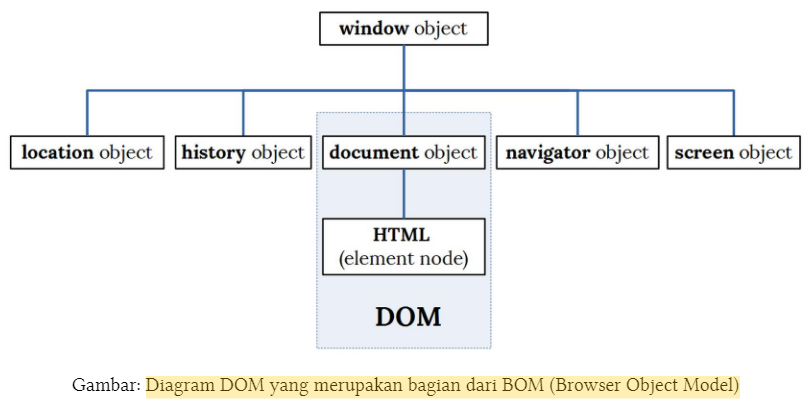
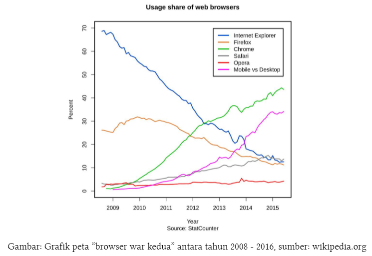

# 📘 JavaScript Uncover by Andre Pratama (Duniailkom.com)

<div id="daftarisi"></div>

# Daftar Isi:

<p align="left">
	<a href="#bab01">1. Berkenalan Dengan JavaScript</a>&nbsp;<br>
	<a href="#bab02">2. Sejarah dan Perkembangan JavaScript</a>&nbsp;<br>
	<a href="#bab03">3. Menjalankan Kode Program JavaScript</a>&nbsp;<br>
	<a href="#bab04">4. Aturan Dasar, Variabel dan Konstanta</a>&nbsp;<br>
	<a href="#bab05">5. Variabel dan Konstanta</a>&nbsp;<br>
	<a href="#bab06">6. Tipe Data JavaScript</a>&nbsp;<br>
	<a href="#bab07">7. Operator JavaScript</a>&nbsp;<br>
	<a href="#bab08">8. Struktur Logika dan Perulangan</a>&nbsp;<br>
	<a href="#bab09">9. Function</a>&nbsp;<br>
	<a href="#bab10">10. JavaScript Object</a>&nbsp;<br>
	<a href="#bab11">11. Object Oriented Programming (OOP)</a>&nbsp;<br>
	<a href="#bab12">12. JavaScript Native Object</a>&nbsp;<br>
	<a href="#babxx">XX. Materi Tambahan: Advanced JavaScript</a>&nbsp;<br>
</p>

<div id="bab01"></div>

# 1. Berkenalan Dengan JavaScript <a href="#daftarisi">🡹</a>

1. JavaScript merupakan bagian dari 5 materi dasar web programming, yakni: HTML, CSS, PHP, MySQL dan JavaScript. Bersama-sama dengan HTML dan CSS, ketiganya berbagi peran masing-masing. HTML digunakan untuk membuat struktur dan isi dari halaman web (content). CSS untuk mempercantik tampilan website (design). Sedangkan JavaScript berfungsi menangani interaksi (behavior).**“HTML for content, CSS for presentation and JavaScript for behavior”**.
2. HTML, CSS dan JavaScript sama-sama termasuk ke dalam kelompok “client side programming language”, yakni bahasa pemrograman yang dijalankan di sisi client (web browser). PHP juga merupakan bahasa pemrograman web, tapi berada di dalam server, sehingga disebut sebagai “server side programming language”.
3. **Client Side Programming**: Ini artinya, untuk menjalankan JavaScript kita hanya butuh 2 aplikasi, yakni text editor dan web browser. Text editor digunakan membuat kode JavaScript, dan kode JavaScript tersebut bisa langsung diakses dari web browser. Kita pun bisa melihat kode JavaScript yang digunakan dari sebuah website (sama seperti HTML dan CSS). Silahkan buka website apa saja, klik kanan lalu pilih View Page Source.
4. **Server Side Programming**: Untuk menjalankan kode program PHP kita harus menggunakan aplikasi seperti Apache web server (yang merupakan bagian dari XAMPP). Kita tidak bisa melihat kode PHP yang digunakan sebuah website secara langsung layaknya HTML, CSS dan JavaScript.
5. Perkembangan JavaScript yang sangat pesat akhir-akhir ini melahirkan banyak penerapan lain dari JavaScript. Sebagai contoh, **Node.js** adalah penggunaan JavaScript di sisi server. Dalam buku ini kita hanya fokus membahas penggunaan JavaScript di sisi client (di dalam web browser).
6. Apa yang akan kita pelajari dalam buku ini terdiri dari 2 kelompok besar: JavaScript dan **DOM (Document Object Model)**. JavaScript adalah bahasa pemrograman, sedangkan DOM merupakan objek HTML yang akan kita manipulasi, seperti teks, gambar, form, tombol, title bar web browser, event, dll. Bahasa pemrograman JavaScript di kembangkan oleh ECMA, sedangkan DOM dikembangkan oleh W3C (organisasi yang juga membuat standar HTML dan CSS). Bisa dibilang, JavaScript sepenuhnya terpisah dari HTML.
7. Setelah mempelajari JavaScript, barulah kita masuk ke DOM. Disinilah JavaScript digunakan untuk mengubah total tampilan halaman web. Jadi, jika anda merasa jenuh dengan pembahasan dari bab 2 hingga 18, tahan dulu! Paksakan untuk terus mempelajarinya. Dengan pemahaman JavaScript yang cukup, kita memiliki pondasi yang kuat untuk memanipulasi objek HTML yang nantinya diakses lewat DOM mulai dari bab 19 hingga akhir buku.


<br>
<div id="bab02"></div>

# 2. Sejarah dan Perkembangan JavaScript <a href="#daftarisi">🡹</a>

1. Brendan Eich membuat prototype bahasa baru dalam 10 hari. Pada Mei 1995, bahasa pemrograman “Mocha” lahir. Bahasa pemrograman inilah yang diputuskan untuk digunakan Netscape. Bahasa pemograman Mocha dirilis pertama kali ke dalam versi beta Netscape Navigator 2.0 di bulan September 1995, tetapi dengan menggunakan nama baru: LiveScript. Umur dari LiveScript ternyata tidak lama. 3 bulan kemudian, tepatnya Desember 1995, hadir Netscape Navigator 2.0 beta 3 dengan sebuah bahasa baru: JavaScript. Sebenarnya ini bukanlah bahasa pemrograman baru, tapi perubahan nama dari LiveScript. Nama JavaScript dipilih agar Netscape bisa ‘nompang tenar’ dari bahasa pemrograman JAVA milik Sun Microsystems, yang pada masa itu sangat populer di kalangan programmer.


2. “The first browser war”, perang web browser pertama antara Internet Explorer buatan Microsoft vs Netscape Navigator buatan Netscape Communications.
3. **ECMAScript** adalah sebuah standar bahasa pemrograman komputer, dimana JavaScript merupakan salah satu implementasi dari ECMAScript. JavaScript tidak bisa dijadikan standar karena masalah merk “JAVA” yang merupakan trademark SUN Micosystem (sekarang sudah diakuisisi Oracle). Intinya: Standarisasi **JavaScript = ECMAScript**. EMCAScript digunakan hanya saat merujuk ke versi dari JavaScript.
4. Pengembangan ECMAScript 4 berhenti di tengah jalan, ini disebabkan perbedaan pendapat antar anggota komite TC39, terutama mengenai fitur apa yang harus ada di ECMAScript 4. Proses “perseteruan” berlangsung cukup lama, memakan waktu hingga 10 tahun (sampai dengan 2009). Selama jangka waktu tersebut, tidak ada versi baru dari ECMAScript.
5. Di pasar web browser, Internet Explorer menjadi sangat dominan, menguasai lebih dari 80% -90% market share dari tahun 2001 hingga 2009. Netscape Navigator bisa dibilang sudah punah pada tahun 2004. Web browser Opera hadir sebagai alternatif, tapi tidak bisa berbuat banyak.
6. **AJAX**, singkatan dari **(Asynchronous JavaScript and XML)**. AJAX memungkinkan sebuah halaman web berkomunikasi langsung dengan server tanpa harus di-reload. Komunikasi antara web browser dengan web server berlangsung di latar belakang (background) secara asynchronous, hasilnya website menjadi lebih dinamis. Sebagai contoh, halaman registrasi bisa langsung mengecek apakah username yang diinput sudah ada di database atau belum. Ini dapat dilakukan sesaat setelah user berpindah dari kolom input username ke kolom dibawahnya. Tanpa menggunakan AJAX, proses pengecekan baru berlangsung saat user selesai mengisi form dan men-klik tombol submit (karena pengecekan harus dilakukan ke database yang ada di server).
7. Selain AJAX, berkembang juga berbagai komunitas dan library JavaScript seperti Prototype, jQuery, Dojo Toolkit, dan MooTools. Masa-masa ini bisa dibilang awal kebangkitan JavaScript. Dengan menggunakan library seperti jQuery, perbedaan implementasi ECMAScript dari berbagai web browser bisa diatasi dengan mudah. jQuery menyediakan ‘abstraction layer’ agar web programmer bisa berfokus kepada fitur yang ingin dicapai. Programmer yang sebelumnya “anti” dengan JavaScript (karena susahnya mengatasi perbedaan fitur web browser), mulai melirik library seperti jQuery.
8. Setelah perang web browser pertama berakhir dengan kekalahan telak Netscape, perang kedua segera mulai dengan dirilisnya Mozilla Firefox (sebagai "Reingkarnasi Netscape"). Dengan cepat Firefox menjadi web browser favorit yang sepertinya akan segera menggusur IE. Puncaknya di tahun 2010 Firefox menguasai sekitar 30% pasar web browser, walaupun IE masih tetap dominan tapi setiap tahun mengalami tren penurunan. Tidak lama lagi sepertinya Firefox bisa menjadi web browser paling populer menggantikan IE. Namun harapan ini pupus karena muncul web browser baru dari raja mesin pencari: Google Chrome yang dirilis pada Desember 2008. Didukung dengan promosi gencar, nama besar Google, fitur menawan, dan eksekusi yang cepat, membuat Google Chrome segera menjadi web browser paling banyak digunakan hingga saat ini, mengalahkan IE, Firefox, dan Opera.


9. ECMAScript 6 atau ES6 atau ECMAScript 2015 dirilis pada bulan Juni 2015. Cukup banyak penambahan baru pada versi ini, sebagian besar merupakan fitur lanjutan untuk membuat aplikasi yang memiliki kompleksitas tinggi, seperti penggunaan **JavaScript di server menggunakan Node.js**. Mulai dari ECMAScript 6 dan selanjutnya, penamaan ECMAScript akan menggunakan nama tahun saat standar tersebut dirilis, seperti ECMAScript 2015, ECMAScript 2016, dst. Banyak perdebatan mengenai pilihan nama ini, sehingga masih sering disebut sebagai ECMAScript 6 (ES6). Dalam buku ini kita lebih banyak membahas ECMAScript 5. Walaupun menggunakan ECMAScript 5, dasar JavaScript yang ada di buku ini tetap valid untuk versi 6 dan versi 7. Fitur tambahan yang ada di ECMAScript 6 dan ECMAScript 7 juga lebih banyak ke materi lanjutan yang terlalu kompleks jika dimasukkan ke buku JavaScript untuk pemula. ES6 dan ES7 lebih cocok jika anda berniat mempelajari JavaScript sebagai bahasa pemrograman server menggunakan Node.js.
10. JavaScript Engine adalah mekanisme internal yang dimiliki oleh web browser untuk menjalankan kode JavaScript. JavaScript Engine dapat disamakan dengan compiler dalam bahasa pemograman lain, yakni algoritma yang digunakan untuk menjalankan JavaScript. Semakin cepat sebuah web browser menjalankan JavaScript akan semakin baik. **V8** adalah nama JavaScript Engine untuk Google Chrome, **SpiderMonkey** untuk Mozilla Firefox, dan **Chakra** untuk Internet Explorer.
11. Perkembangan JavaScript Saat Ini: Website yang tidak berbentuk “website”, tetapi menyerupai aplikasi desktop yang dikenal sebagai **Single-page Application (SPA)**. Contoh dari Single-page Application ini seperti aplikasi Google: Gmail, GDrive, Google Doc, dll. Di website tersebut, halamannya akan tetap sama, tidak di reload seperti layaknya sebuah website.
12. Namun perlu juga dipahami bahwa walaupun materi di eBook JavaScript Uncover sudah lumayan rumit, ini barulah dasar dari JavaScript. Jika anda serius ingin mempelajari JavaScript lebih jauh lagi, bisa lanjut ke library seperti **jQuery**, framework seperti **AngularJS** maupun **ReactJS**, atau ke server menggunakan **Node.js**.
13. Timeline sejarah JavaScript dari awal lahir hingga saat ini secara ringkas dapat diakses <a href="https://www.jetbrains.com/lp/javascript-25/">disini</a>. Daftar feature baru dari mulai **ES6 hingga ES.Next** dapat diakses di <a href="https://en.wikipedia.org/wiki/ECMAScript">Wikipedia</a>, <a href="https://www.javascripttutorial.net/es-next/">JavaScriptTutorial</a>, <a href="https://jsfeatures.in/">JSFeatures</a>, <a href="https://www.freecodecamp.org/news/es5-to-esnext-heres-every-feature-added-to-javascript-since-2015-d0c255e13c6e/">FreeCodeCamp</a>, <a href="https://github.com/daumann/ECMAScript-new-features-list">GitHub</a>, <a href="https://javascript.info/">JavaScriptInfo</a>.
  
<br>
<div id="bab03"></div>

# 3. Menjalankan Kode Program JavaScript <a href="#daftarisi">🡹</a>

1. Dalam bab ini kita akan mempelajari cara menjalankan kode program JavaScript. Dimulai dari mempersiapkan aplikasi teks editor dan web browser, membahas 3 metode input JavaScript, mengenal tab console dari web developer tools, hingga menampilkan pesan untuk web browser yang tidak mendukung JavaScript.
```HTML
====================
A. Inline JavaScript
====================

<html>
  <head>
    ...
  </head>
  <body>
    ...
    <button onclick="alert('Sedang Belajar JavaScript');"></button>
    ...
  </body> 
</html>
```

```HTML
======================
B. Internal JavaScript
======================

<html>
  <head>
    ...
    <script>
      // Kode JavaScript Disini
    </script>
  </head>
  <body>
    ...
  </body> 
</html>
```

```HTML
======================
C. External JavaScript
======================

<html>
  <head>
    ...
  </head>
  <body>
    ...
    <script src="script.js"></script>
  </body> 
</html>
```
2. Menempatkan kode JavaScript di bagian atas banyak ditemukan. Namun berkaitan dengan masalah performa, beberapa developer web menyarankan meletakkan JavaScript dibagian bawah tag ```<body>```, yakni sebelum tag penutup ```</body>```, sebagaimana yang dijelaskan dari sebuah artikel di Yahoo Developer Network: Best Practices for Speeding Up Your Web Site. 
3. Cara web browser dalam menampilkan sebuah halaman web, yakni secara berurutan dari atas ke bawah, mulai dari baris pertama hingga baris terakhir.
4. Fitur cache dari web browser bisa mempercepat pengaksesan website dengan cara menyimpan file JavaScript di dalam cache.
5. Dengan memanggil file external JavaScript dari bagian bawah tag ```<body>```, memberi kesempatan web browser untuk memproses kode HTML terlebih dahulu, baru kemudian mendownload file JavaScript. Efeknya, pengujung web bisa langsung melihat tampilan web selama proses ini, tidak hanya halaman kosong. 
6. Atribut **async** dan **defer**: kita bisa mengatur kapan dan bagaimana file external JavaScript diproses. Kedua atribut ini memungkinkan penulisan tag ```<script>``` tidak harus di bawah tag ```<body>```. Jika atribut **async** ditambahkan ke dalam tag ```<script>```, file JavaScript akan diproses pada saat yang bersamaan dengan kode HTML (secara simultan). Dengan kata lain, web browser tidak “terkunci” untuk menjalankan kode JavaScript. Metode ini juga dikenal dengan istilah **Asynchronous JavaScript** (Di proses secara bersamaan = Asynchronous). 
7. Dengan tambahan atribut **async**, kode HTML tetap diproses sembari mendownload file JavaScript. Dengan kata lain, web browser tidak masuk ke dalam Render-Blocking JavaScript. Atribut **defer** digunakan untuk mengatur kapan file JavaScript dijalankan. Dengan atribut ini, file JavaScript baru di download dan dieksekusi setelah seluruh kode HTML selesai diproses. Efek dari atribut **async** dan **defer** mungkin terdengar sama. Perbedaaan mendasar adalah, **async** digunakan untuk mengatur cara eksekusi kode JavaScript, sedangkan **defer** untuk mengatur kapan file JavaScript tersebut di download dan diproses.
8. Tambahan atribut **async** dan **defer** dari HTML5 membawa perubahan terkait posisi terbaik peletakan kode JavaScript. Standar saat ini adalah menempatkan kode JavaScript di bagian ```<head>``` dengan tambahan atribut **async**. Alasannya, web browser bisa langsung mengeksekusi file JavaScript pada saat yang bersamaan dengan proses kode HTML, sehingga website dapat ditampilkan dengan lebih cepat (tidak mengalami Render-Blocking JavaScript). Untuk kode JavaScript yang tidak terlalu penting (dan bisa menunggu), tambahkan atribut **defer**. Sebagai tambahan, atribut **async** dan **defer** hanya berlaku untuk external JavaScript. Untuk internal JavaScript, atribut ini akan diabaikan dan posisi terbaik tetap di bagian bawah tag ```<body>```.
```HTML
=============================================
Posisi Terbaik Internal & External JavaScript
=============================================

<html>
  <head>
    ...
    <script src="script-penting.js" async></script>
    <script src="script.js" defer></script>
  </head>
  <body>
    ...
    <script>
      // Internal JavaScript
    </script>
  </body> 
</html>
```
9. Berbeda dengan mayoritas bahasa pemrograman lain, secara default kita tidak bisa melihat pesan error dari JavaScript. Padahal ini sangat penting selama pembuatan kode program. Tidak ada yang lebih membuat pusing dari program yang tidak berjalan, namun tidak tahu salahnya dimana. Untuk menampilkan pesan error JavaScript, kita bisa menggunakan menu **Web developer tools** bawaan web browser. Setiap web browser modern memiliki tools seperti ini.


10. Tab Inspector (1) bisa digunakan untuk menelusuri seluruh kode HTML yang terdapat di dalam halaman web (2), di sisi kanan kita bisa melihat kode CSS yang digunakan oleh tag HTML tersebut (3). Jika anda sering mengedit kode CSS, tab Inspector ini sangat bermanfaat untuk melihat dan menjalankan (mengedit) kode CSS tanpa perlu mengubah file asli.
11. Tab yang sering kita akses selama membuat kode program JavaScript adalah **Tab Console**, yang berada di sebelah kanan tab Inspector. Apabila kode yang anda buat tidak berjalan sebagaimana mestinya, hal pertama yang harus dilakukan adalah memeriksa tab Console ini. Selain menampilkan pesan error, di dalam tab Console kita juga bisa menjalankan kode program JavaScript secara langsung, tanpa harus menulisnya di dalam file HTML. Fungsi **console.log()** berguna untuk menampilkan hasil kode program ke tab Console.
12. Salah satu kelemahan (sekaligus keunggulan) dari JavaScript adalah, pengunjung web bisa mematikan JavaScript yang ada di web browser mereka. Tag ```<noscript>``` bisa digunakan untuk menampilkan teks keterangan yang hanya bisa terlihat pada web browser yang tidak memiliki JavaScript (atau JavaScriptnya dimatikan).
```HTML
============================
Contoh Penggunaan <noscript>
============================

<html>
  <head>
    ...
  </head>
  <body>
    ...
    <script>
      alert("JavaScript aktif");
    </script>
    <noscript>
      JavaScript anda tidak aktif, mohon diaktifkan untuk bisa mengakses web ini.
    </noscript>
  </body> 
</html>
```

<br>
<div id="bab04"></div>

# 4. Aturan Dasar, Variabel dan Konstanta <a href="#daftarisi">🡹</a>

1. **Statement** adalah sebutan untuk sebuah baris perintah JavaScript. Walaupun saya menggunakan kata “baris”, bisa saja sebuah statement butuh beberapa baris (seperti function). Atau dalam 1 baris bisa terdiri dari beberapa statement. Setiap statement diakhiri dengan tanda titik koma (semi colon): ‘ ; ‘. Sebenarnya, tanda titik koma untuk mengakhiri statement JavaScript ini adalah opsional. Artinya, boleh tidak ditulis sepanjang statement tersebut harus berada dalam baris baru (1 statement, 1 baris). Sebaiknya kita tetap menambahkan tanda titik koma untuk mengakhiri setiap statement di dalam JavaScript.
2. **Case Sensitivity**: JavaScript termasuk bahasa pemrograman yang bersifat case sensitif, artinya huruf besar dan huruf kecil dianggap berbeda. Salah menulis huruf sangat sering terjadi.
3. **Whitespace** berarti karakter “kosong” seperti spasi, tab, atau baris baru (new line). Secara umum di dalam JavaScript whitespace akan diabaikan.
4. **Indenting** adalah istilah yang digunakan untuk menambahkan spasi atau tab diawal baris kode program. Tujuannya agar kode program lebih mudah dibaca terutama jika kode program tersebut sudah mencapai puluhan atau ratusan baris kode program. 
5. **Comment** atau baris komentar adalah sebutan untuk kode program yang tidak akan di eksekusi oleh JavaScript. Selain sebagai dokumentasi, komentar juga sering digunakan untuk menghentikan sementara baris kode program. Di JavaScript, Comment ditulis menggunakan karakter ```// komentar``` (untuk single line) & ```/* komentar */``` (untuk multiple line). Di sepanjang contoh kode yang disertakan di BAB-BAB selanjutnya, penggunaan Comment akan banyak sekali ditemukan (sebagai dokumentasi/keterangan dari baris sebuah kode).

<br>
<div id="bab05"></div>

# 5. Variabel dan Konstanta <a href="#daftarisi">🡹</a>

1. Secara sederhana, variabel adalah “penampung” dari sebuah data. Disebut variabel karena data yang kita simpan bisa berubah-ubah sepanjang kode program (isinya tidak tetap). ```var angka = 192;``` **Operasi Asignment** atau memberikan nilai ke sebuah variabel dibaca dari kanan ke kiri (right-to-left, baca selengkapnya <a href="https://developer.mozilla.org/en-US/docs/Web/JavaScript/Reference/Operators/Operator_Precedence">disini</a>). Artinya, 192 “dimasukkan” sebagai nilai ke variabel ```angka```.
2. JavaScript termasuk ke dalam bahasa pemrograman **Typeless Programming Language**, yakni kelompok bahasa pemrograman yang variabelnya bisa diisi dengan tipe data apa saja tanpa harus dideklarasikan terlebih dahulu.
3. Apabila anda sering mengikuti tutorial programming dari situs berbahasa inggris, nama variabel **foo**, **bar**, dan **baz** sering digunakan. Ketiganya dikenal sebagai **dummy variabel**, yakni variabel yang fungsinya hanya sebagai contoh. Mirip seperti teks “Lorem Ipsum dolor sit amet” dalam bidang design.
4. Kita bisa memberi nama apa saja untuk variabel, apakah itu ```angka```, ```foo```, ```bar```, ```andi```, atau ```username```. Selain variabel, kita juga bebas untuk membuat nama konstanta, function, maupun object. Semua inilah yang termasuk ke dalam kelompok **Identifier**. Identifier di dalam JavaScript memiliki aturan sebagai berikut:
   - Bisa terdiri dari huruf, angka, garis bawah “ _ ” (underscore), dan tanda dollar “ $ “ (dollar sign). Selain itu, dianggap sebagai karakter ilegal (tidak boleh digunakan). 
   - Karakter pertama dari identifier tidak boleh berupa angka. Angka hanya bisa digunakan sebagai karakter kedua dan seterusnya.
   - Bersifat case sensitive, dimana huruf besar dan kecil dianggap berbeda.
   - Harus selain dari **reserved keyword**, yakni kata khusus yang berfungsi sebagai perintah di dalam pemrograman JavaScript, seperti ```var```, ```while```, ```function```, dll.
5. Di CSS kita menggunakan cara penulisan selector yang dipisah dengan tanda “ - ”, seperti ```main-box```, ```left-sidebar```, dan ```single-post```. Di PHP kita mengenal **Snake Case**, yakni menggunakan huruf kecil dan tanda underscore sebagai pemisah variabel, seperti ```jumlah_barang```, ```nama_dosen```, dan ```alamat_siswa```. Di JavaScript menggunakan **CamelCase**. CamelCase adalah cara penulisan variabel dimana jika sebuah variabel terdiri dari beberapa kata, huruf pertama dari kata kedua dan seterusnya diubah menjadi huruf besar, seperti: ```banyakAnggota```, ```totalBiaya```, ```mainBox```, atau ```jumlahKlikSatuHari```. Jika variabel tersebut hanya terdiri dari 1 kata, ditulis dengan huruf kecil semua.
6. **Strict Mode** memaksa JavaScript menampilkan error (di Tab Console) pada kode program yang seharusnya bisa berjalan “normal”. Tujuannya, meminimalisir kemungkinan bug karena penulisan yang salah, typo, dan berbagai hal lain. Strict mode sepenuhnya opsional dan mungkin tidak bisa selalu anda gunakan, terutama jika terdapat kode JavaScript pendahulu yang terlalu rumit untuk diubah semuanya. Strict Mode akan membuat web browser menampilkan error dimana sebelumnya hanya ada **“silent error”**. Salah satunya ketika membuat variabel tanpa perintah ```var```. Untuk masuk ke dalam Strict Mode, tambahkan string ```"use strict";``` di baris pertama kode JavaScript atau di baris paling awal dari sebuah function.
7. EcmaScript 6 membawa fitur baru ke dalam JavaScript, yakni menggunakan perintah ```let``` untuk membuat variabel (sebagai alternatif dari ```var```). Perbedaan mendasar dari ```var``` dan ```let``` adalah terkait dengan **variabel scope**, yakni di bagian mana sebuah variabel masih bisa diakses. Penjelasan mengenai variabel scope akan saya bahas pada bab tentang function.
8. Konstanta (```const```) dapat dikatakan sebagai variabel yang tidak bisa diubah sepanjang kode program. Setelah konstanta ditulis dan diberi nilai awal, isi konstanta tersebut tidak bisa ditukar dengan nilai lain. Berbeda dengan variabel yang menggunakan **CamelCase**, konstanta biasa ditulis menggunakan huruf besar dan garis bawah (underscore) sebagai pemisah kata.
9. Rekap format penulisan: Variable diawali huruf kecil (```total```, ```totalBiaya```, dst), Konstanta huruf besar semua (```PI```, ```RUMUS_A```, dst), dan Class diawali huruf besar (```Mobil```, ```MobilBaru```, dst). **Class dibahas di bab 11**. Tujuan dari format penulisan ini yaitu agar programmer dapat dengan mudah membedakan mana Variabel, Konstanta maupun Class.
```HTML
================
Var, Let & Const
================

<html>
  <head>
    ...
  </head>
  <body>
    ...
    <script>
      "use strict";

      var harga = 12000;
      let namaLengkap = "Rudi Siswoyo";
      const NILAI_PI = 3.14;

      ...
    </script>
  </body> 
</html>
```
9. Berdasarkan contoh diatas: variabel ```harga```, let ```namaLengkap```, dan konstanta ```NILAI_PI``` adalah **Identifier**. Sedangkan ```12000```, ```"Rudi Siswoyo"```, dan ```3.14``` adalah **Literal**.

<br>
<div id="bab06"></div>

# 6. Tipe Data JavaScript <a href="#daftarisi">🡹</a>

1. Secara garis besar, tipe data dalam JavaScript terdiri dari 2 kelompok, yakni tipe data primitif (primitive type), dan tipe data object. Tipe data primitif disebut demikian karena tipe data ini “sederhana” dan hanya terdiri dari 1 nilai. Di dalam JavaScript terdapat 6 **tipe data primitif**, yaitu: **Number, String, Boolean, Null, Undefined, Symbol**. Sedangkan tipe data object, bisa disebut sebagai tipe data “khusus” yang prilaku dan isinya bermacam-macam. Adapun **tipe data object** bawaan JavaScript yaitu: **Array, Date, RegExp, Map, WeakMap, Set, WeakSet.**
2. Untuk tipe data Object, dalam bab ini saya hanya membahas Object Array. Tipe data Object Date dan RegExp akan dibahas dalam bab tersendiri karena butuh penjelasan yang cukup panjang, termasuk cara membuat object bentukan sendiri. Tipe data Symbol, Map, WeakMap, Set dan WeakSet adalah tipe data baru dalam ECMAScript 6. Tipe data ini tidak akan saya bahas karena termasuk materi lanjutan yang cukup kompleks untuk pemula.

```Javascript
// ===================
// A. Tipe Data Number
// ===================

var numA = 100;                       // angka bulat
var numB = -100;                      // angka bulat negatif
var numC = 0.66634;                   // angka pecahan
var numD = -0.66634;                  // angka pecahan negatif
var numE = 3e3;                       // 3 x 10^3
var numF = 0.4e-3;                    // 0.4 x 10^-3
var numG = 999;                       // desimal (basis 10)
var numH = 0b1111100111;              // biner (basis 2), diawali 0b
var numI = 0o1747;                    // oktal (basis 8), diawali 0o
var numJ = 0x3E7;                     // heksadesimal (basis 16), diawali 0x
var numK = 9/"a"; console.log(numK);  // output: NaN (Not a Number)
var numL = 9/0; console.log(numL);    // output: Infinity (Tak Hingga)
```

```Javascript
// ===================
// B. Tipe Data String
// ===================

var strA = "Hello World!";            // string dengan kutip dua
var strB = 'Hello World!';            // string dengan kutip satu
var strC = "Hari Jum'at";             // kutip satu di dalam kutip dua
var strD = 'Dia berkata: "Hey"';      // kutip dua di dalam kutip satu
var strE = "Dia berkata: \"Hey\"";    // kutip dua di dalam kutip dua, pakai escape character (\)
var strF = 'Hari Jum\'at';            // kutip satu di dalam kutip satu, pakai escape character (\)
var strG = "\u2764 You!"              // contoh pemakaian Unicode ⇨ hasilnya: ❤ You!

/*
Ragam karakter escape di JavaScript:
 1. \0    : Karakter NUL
 2. \b    : Backspace
 3. \t    : Horizontal tab
 4. \n    : Newline
 5. \v    : Vertical tab
 6. \f    : Form feed
 7. \r    : Carriage return
 8. \"    : Tanda kutip dua (double quote)
 9. \'    : Tanda kutip satu (apostrophe atau single quote)
10. \\    : Garis miring backslash
11. \xXX  : Karakter Latin-1 dengan menggunakan dua digit heksa desimal XX
12. \uXXXX: Karakter Unicode dengan menggunakan empat digit heksa XXXX

Daftar Karakter Latin-1 & Unicode: http://unicode-table.com/
*/

var strH = "Indonesia";
var strI = "Bahasa " + strH;          // sebelum ada fitur Template String ES6 ⇨ hasilnya: Bahasa Indonesia
var strJ = `Bahasa ${strH}`;          // setelah ada fitur Template String ES6 ⇨ hasilnya: Bahasa Indonesia
```

```Javascript
// ====================
// C. Tipe Data Boolean
// ====================

var bolA = true;                      // bernilai true, biasanya di pakai di if, else, while, dan do while
var bolB = false;                     // bernilai false, biasanya di pakai di if, else, while, dan do while
```

```Javascript
// =============================
// D. Tipe Data Null & Undefined
// =============================

var nudA = null;                      // keadaan dimana data "kosong", biasanya sengaja diinput oleh programmer
var nudB = undefined;                 // keadaan dimana data "tidak terdefinisi", biasanya terjadi karena error

// Kasus yang menghasilkan undefined

var und1;
console.log(und1);                    // output: undefined (var yang dibuat tanpa langsung diisi nilai, menjadi undefined)

var und2 = [1, 2, 3];
console.log(und2[3]);                 // output: undefined (mengakses array diluar indeks yang dibuat, menjadi undefined)

var und3 = {nama: "iyan", umur: 24};
console.log(und3["alamat"]);          // output: undefined (mengakses object diluar key yang dibuat, menjadi undefined)
                                      // 𝗡𝗼𝘁𝗲: 𝗢𝗯𝗷𝗲𝗰𝘁 𝗱𝗶𝗯𝗮𝗵𝗮𝘀 𝗱𝗶 𝗕𝗔𝗕 𝟭𝟬!
```

```Javascript
// ==================
// E. Tipe Data Array
// ==================

var arrSiswa = ["Andri", "Joko", "Sukma"];    // Array 1D berisi hanya data string
var arrAcak  = [1, 2.0, "tiga", true, null];  // Array 1D berisi beragam tipe data
var arr2D    = [[2,5], [9,5], [3,5]];         // Array 2D, misalnya untuk koordinat

console.log(arrSiswa);                // output: ["Andri", "Joko", "Sukma"]
console.log(arrSiswa[0]);             // output: Andri                        ⇨ Array di JavaScript dimulai dari indeks ke 0,
console.log(arrSiswa[1]);             // output: Joko                           bukan dari indeks ke 1, ingat baik-baik ya.
console.log(arrSiswa[2]);             // output: Sukma
console.log(arrSiswa[3]);             // output: undefined

console.log(arr2D);                   // output: [[2,5],[9,5],[3,5]]
console.log(arr2D[0]);                // output: [2,5]
console.log(arr2D[1]);                // output: [9,5]
console.log(arr2D[2]);                // output: [3,5]
console.log(arr2D[0][0]);             // output: 2
console.log(arr2D[0][1]);             // output: 5
console.log(arr2D[1][0]);             // output: 9
console.log(arr2D[1][1]);             // output: 5
console.log(arr2D[2][0]);             // output: 3
console.log(arr2D[2][1]);             // output: 5
```

```Javascript
// ===================
// F. Tipe Data Object
// ===================

// 𝗡𝗼𝘁𝗲: 𝗢𝗯𝗷𝗲𝗰𝘁 𝗱𝗶𝗯𝗮𝗵𝗮𝘀 𝗱𝗶 𝗕𝗔𝗕 𝟭𝟬!
```

```Javascript
// ==================
// G. Operator typeof
// ==================

/*
Operator typeof digunakan untuk melihat tipe data dari sebuah variabel
Apakah tipe datanya number, string, boolean, undefined, atau sebuah object. 
*/

console.log(typeof numA);                 // output: number
console.log(typeof strA);                 // output: string
console.log(typeof bolA);                 // output: boolean
console.log(typeof nudA);                 // output: object (bukan null)
console.log(typeof nudB);                 // output: undefined
console.log(typeof arrSiswa);             // output: object

// Check Tipe Data (Materi Lanjutan)

var num = 10;                             // tipe data: number
var str = "JavaScript";                   // tipe data: string
var bol = true;                           // tipe data: boolean
var nul = null;                           // tipe data: null
var und = undefined;                      // tipe data: undefined
var arr = [1, 2, "tiga"];                 // tipe data: Array
var nan = 9/"a";                          // tipe data: NaN
var inf = 9/0;                            // tipe data: Infinity

console.log(typeof num === "number");     // output: true   (check apakah datanya number)
console.log(typeof str === "string");     // output: true   (check apakah datanya string)
console.log(typeof bol === "boolean");    // output: true   (check apakah datanya boolean)
console.log(nul === null);                // output: true   (check apakah datanya null)
console.log(und === undefined);           // output: true   (check apakah datanya undefined)
console.log(inf === Infinity);            // output: true   (check apakah datanya infinity)
console.log(Array.isArray(arr));          // output: true   (check apakah datanya array)
console.log(Number.isNaN(nan));           // output: true   (check apakah datanya NaN)
```

```Javascript
// ======================
// H. Operator instanceof
// ======================

// 𝗡𝗼𝘁𝗲: 𝗶𝗻𝘀𝘁𝗮𝗻𝗰𝗲𝗼𝗳 𝗱𝗶𝗯𝗮𝗵𝗮𝘀 𝗱𝗶 𝗕𝗔𝗕 𝟭𝟭!
```

<br>
<div id="bab07"></div>

# 7. Operator JavaScript <a href="#daftarisi">🡹</a>

```Javascript
// ======================
// A. Operator Aritmatika
// ======================

var a = 10;
var b = 2;

console.log(a + b);                   // output: 12     ⇨ addition (tambah)
console.log(a - b);                   // output: 8      ⇨ substraction (kurang)
console.log(a * b);                   // output: 20     ⇨ multiplication (kali)
console.log(a / b);                   // output: 5      ⇨ division (bagi)
console.log(a % b);                   // output: 0      ⇨ modulo (sisa bagi)
console.log(a ** b);                  // output: 100    ⇨ exponentiation (pangkat)

console.log(4+6/5-3*2+3);             // output: 2.2    ⇨ operator * dan / diproses lebih awal (precedence: 15)
console.log((4+6)/(5-3)*2+3);         // output: 13     ⇨ operator () diproses lebih awal (precedence: 21)

/*
Baca urutan prioritas operator (precedence) secara lengkap di:
https://developer.mozilla.org/en-US/docs/Web/JavaScript/Reference/Operators/Operator_Precedence
*/
```

```Javascript
// ===================================
// B. Operator Increment dan Decrement
// ===================================

var c = 10, d = 10, e = 10, f = 10;

console.log(++c);                     // output: 11     ⇨ pre-increment: langsung tambahkan
console.log(c);                       // output: 11
console.log(--d);                     // output: 9      ⇨ pre-decrement: langsung kurangi
console.log(d);                       // output: 9

console.log(e++);                     // output: 10     ⇨ post-increment: tampilkan dulu, baru tambahkan
console.log(e);                       // output: 11
console.log(f--);                     // output: 10     ⇨ post-decrement: tampilkan dulu, baru kurangi
console.log(f);                       // output: 9
```

```Javascript
// ========================
// C. Operator Perbandingan
// ========================

console.log(8 == 12);                 // output: false  ⇨ equality (sama dengan)
console.log(8 != 12);                 // output: true   ⇨ inquality (tidak sama dengan)
console.log(10 < 11);                 // output: true   ⇨ less than (kurang dari)
console.log(11 <= 11);                // output: true   ⇨ less than or equal (kurang dari atau sama dengan)
console.log(21 > 20);                 // output: true   ⇨ greater than (lebih dari)
console.log(21 >= 21);                // output: true   ⇨ greater than or equal (lebih dari atau sama dengan)

console.log(9 == "9");                // output: true
console.log(9 === "9");               // output: false  ⇨ strict equality (identik dengan)
console.log(9 != '9');                // output: false
console.log(9 !== '9');               // output: true   ⇨ strict inequality (tidak identik dengan)

// C1. Anda Harus Tahu

console.log(1 == true);               // output: true
console.log(1 === true);              // output: false
console.log(0 == false);              // output: true
console.log(0 === false);             // output: false
console.log(0.3 == 3e-1);             // output: true
console.log(0.3 === 3e-1);            // output: true   (karena memang nilainya sama)
console.log(true > false)             // output: true   (ingat: true = 1, false = 0)

// C2. Perbandingan String 

/*
Setiap karakter dalam string menggunakan nomor urut
desimal di ASCII-Code: https://www.ascii-code.com/
*/

console.log("a" < "b");               // output: true   (a = 97, b = 98)
console.log("a" < "A");               // output: false  (a = 97, A = 65)
console.log("ali" < "ala");           // output: false  (ali = 97→108→105, ala = 97→108→97)
console.log("ali" < "alo");           // output: true   (ali = 97→108→105, alo = 97→108→111)
console.log("ali" < "alika");         // output: true   (ali = 97→108→105, alika = 97→108→105→107→97)
console.log("ali" < 9999999);         // output: false  (perbandingan String & Number selalu menghasilkan false)
```

```Javascript
// =======================
// D. Falsy & Truthy Value
// =======================

/*
Di JavaScript sebuah tipe data akan berubah menjadi tipe data lain tergantung operator
yang digunakan. Untuk operator perbandingan, tipe data ini akan dikonversi menjadi
boolean (true/false). Nilai yang dikonversi menjadi false disebut Falsy Value, dan
nilai yang dikonversi menjadi true disebut Truthy Value.

Yang dikonversi menjadi false:
• false
• null
• undefined
• 0
• NaN
• ''        (string kosong)
• ""        (string kosong)

Yang dikonversi menjadi true:
• true
• {}        (object kosong)           // 𝗡𝗼𝘁𝗲: 𝗢𝗯𝗷𝗲𝗰𝘁 𝗱𝗶𝗯𝗮𝗵𝗮𝘀 𝗱𝗶 𝗕𝗔𝗕 𝟭𝟬!
• []        (array kosong)
• 42        (sembarang angka, termasuk pecahan dan negatif, selain 0)
• "foo"     (sembarang string, selama bukan string kosong)
• infinity  (termasuk -infinity)
*/

console.log('' == '0');               // output: false  (hasil konversi: false == true)
console.log(0 == '');                 // output: true   (hasil konversi: false == false) 
console.log(0 == '0');                // output: true   (bukan operator indentik, jadinya true) 
console.log(false == 'false');        // output: false  (hasil konversi: false == true) 
console.log(false == '0');            // output: true   (bukan operator indentik & false kan bernilai 0, jadinya true) 
console.log(false == undefined);      // output: false  (pengecualian) 
console.log(false == null);           // output: false  (pengecualian) 
console.log(null == undefined);       // output: true   (hasil konversi: false == false) 
console.log('\t\r\n' == 0);           // output: true   (pengecualian) 
```

```Javascript
// ==================
// E. Operator Logika
// ==================

console.log(true && false);           // output: false  ⇨ and operator (true hanya jika kedua nilai true)
console.log(true || false);           // output: true   ⇨ or operator (true jika salah satu nilai true)
console.log(!false);                  // output: true   ⇨ not operator (negasi/kebalikannya)
console.log(true || true && false);   // output: true   ⇨ operator && diproses lebih awal (precedence: 7)

// E1. Cara Kerja Operasi Logika

/* 
Operasi logika di proses dari kiri ke kanan (left-to-right), baca selengkapnya di:
https://developer.mozilla.org/en-US/docs/Web/JavaScript/Reference/Operators/Operator_Precedence

Selain itu, operasi logika pun menggunakan prinsip short-circuit-evaluation, maksudnya jika
dengan memeriksa 1 nilai saja hasil operasi tersebut sudah diketahui, nilai-nilai lain tidak
akan diperiksa, kecuali jika terdapat operator && dan || dalam 1 operasi, maka operator &&
akan dijalankan terlebih dahulu (karena nilai precedence && lebih tinggi daripada ||)
*/

console.log(true || false || true);   // kiri ke kanan: true bertemu operator ||, stop, sudah pasti hasilnya true
console.log(false && true && true);   // kiri ke kanan: false bertemu operator &&, stop, sudah pasti hasilnya false
console.log(true || true && false);   // operator && duluan, menjadi: true || false, hasilnya true

console.log(true && alert("HYA!"));   // fungsi alert() berjalan, karena true bertemu &&, lanjut ke alert()
console.log(false && alert("HYA!"));  // fungsi alert() tidak berjalan, karena false bertemu &&, stop
console.log(true || alert("HYA!"));   // fungsi alert() tidak berjalan, karena true bertemu ||, stop
console.log(false || alert("HYA!"));  // fungsi alert() berjalan, karena false bertemu ||, lanjut ke alert()

// E2. Operasi Logika Non-Boolean

/*
Nilai yang dibandingkan menggunakan operator logika harus bertipe boolean, jika tidak, akan di
konversi secara otomatis berdasarkan ketentuan Falsy & Truthy Value. Lalu, hasil akhir dari
operasi logika non-boolean ini berupa nilai dari posisi terakhir yang diperiksa.
*/

console.log("Hello" || "World");      // output: Hello  ("Hello" ≈ true, lalu bertemu ||, stop, hasilnya string Hello)
console.log("Hello" && "World");      // output: World  ("Hello" ≈ true, lalu bertemu &&, lanjut, hasilnya string World)
console.log(true || "World");         // output: true   (true bertemu ||, stop, hasilnya true)
console.log(false || "World");        // output: World  (false bertemu ||, lanjut, "World" ≈ true, hasilnya string World)
console.log("Hello" && false);        // output: false  ("Hello" ≈ true, lalu bertemu &&, lanjut, hasilnya false)
console.log(false && "World");        // output: false  (false bertemu &&, stop, hasilnya false)

console.log(false || false && true || "World");   // output: World  (&& duluan, menjadi: false || false || "World", ...)
console.log(true || false && true || "World");    // output: true   (&& duluan, menjadi: true || false || "World", ...)
```

```Javascript
// ==================
// F. Operator String
// ==================

var arr = ["Andri", "Joko", "Sukma"];

strA = arr[0] + " dan " + arr[1] + " adalah teman akrab.";  // string concatenation (sebelum ES6), "+" sebagai penyambung
strB = `${arr[0]} dan ${arr[1]} adalah teman akrab`;        // template string (setelah ES6), memakai backtick (``)

// Kasus Konversi Number ke String

console.log(10 + 10 + 9);             // output: 29     (number)
console.log("10" + 10 + 9);           // output: 10109  (string)  dari hasil konversi: console.log("10" + "10" + "9");
console.log(10 + "10" + 9);           // output: 10109  (string)  dari hasil konversi: console.log(10 + "10" + "9");
console.log(10 + 10 + "9");           // output: 209    (string)  dari hasil konversi: console.log(20 + "9");
```

```Javascript
// ===================
// G. Operator Bitwise
// ===================

/*
Operator bitwise adalah operator khusus untuk menangani operasi
logika bilangan biner. Operator ini sangat jarang digunakan dalam
JavaScript dan cukup rumit. Sehingga tidak akan dibahas disini.
*/
```

```Javascript
// ======================
// H. Operator Assignment
// ======================

var g = 10;       // artinya 10 dimasukkan sebagai nilai ke variabel g (operator assignment memiliki precedence: 3)
var h = 10 + 5;   // jumlahkan 10 + 5 dulu (operator "+" memiliki precedence: 14), lalu masukkan hasilnya ke variabel h
var i = g + h;    // more: https://developer.mozilla.org/en-US/docs/Web/JavaScript/Reference/Operators/Operator_Precedence

// Operator Gabungan Assignment

var gabA = gabB = gabC = gabD = gabE = 20;

gabA += 10;       // gabA = gabA + 10 🡲 gabA = 20 + 10  (output: 30) 
gabB -= 10;       // gabB = gabB - 10 🡲 gabB = 20 - 10  (output: 10)
gabC /= 10;       // gabC = gabC / 10 🡲 gabC = 20 / 10  (output: 2)
gabD *= 10;       // gabD = gabD * 10 🡲 gabD = 20 * 10  (output: 200) 
gabE %= 10;       // gabE = gabE % 10 🡲 gabE = 20 % 10  (output: 0)
```

```Javascript
// ==================
// I. Operator Spread
// ==================

/*
Spread merupakan operator baru di ES6. Operator ini digunakan untuk berbagai keperluan yang berhubungan dengan array, salah
satunya untuk menggabungkan array. Operator ini menggunakan tanda titik tiga kali (...), kemudian diikuti dengan nama variabel.
*/

var nilai1 = ["a", "b", "c", "d"];
var nilai2 = [1, 2, 3, 4];

var nilai3 = [...nilai1, "e", "f"];   // ...nilai1 berarti mengakses seluruh element dari array nilai1
console.log(nilai3);                  // output: ["a", "b", "c", "d", "e", "f"]

var nilai4 = [0, ...nilai2, 5, 6];    // ...nilai2 berarti mengakses seluruh element dari array nilai2
console.log(nilai4);                  // output: [0, 1, 2, 3, 4, 5, 6]

var nilai5 = [...nilai3, ...nilai4];
console.log(nilai5);                  // output: ["a", "b", "c", "d", "e", "f", 0, 1, 2, 3, 4, 5, 6]
```

<br>
<div id="bab08"></div>

# 8. Struktur Logika dan Perulangan <a href="#daftarisi">🡹</a>

```Javascript
// ===========================
// A. Struktur Logika: IF-ELSE
// ===========================

var nilai = 90;                     

if (nilai >= 0 && nilai <= 100){      // jika nilai >= 0 dan <= 100, masuk ke kondisi berikutnya, selain itu tidak valid!
  if (nilai >= 80){
    console.log("A");
  } else if (nilai >= 70){
    console.log("B");
  } else if (nilai >= 60){
    console.log("C");
  } else if (nilai >= 50){
    console.log("D");
  } else{
    console.log("E");
  }
} else {
  console.log("Tidak Valid!");
}
```

```Javascript
// ==========================
// B. Struktur Logika: SWITCH
// ==========================

var nilaiTK = 6;   

switch(nilaiTK){                      // case 1-5: kurang, case 6-7: cukup, case 8-10: baik, selain itu tidak valid!
  case 1:
  case 2:
  case 3:
  case 4:
  case 5:
    console.log("kurang");
    break;
  case 6:
  case 7:
    console.log("cukup");
    break;
  case 8:
  case 9:
  case 10:
    console.log("baik");
    break;
  default:
    console.log("Tidak Valid!");
}
```

```Javascript
// ====================================
// C. Struktur Logika: Ternary Operator
// ====================================

var jumlah = 501;
var pesan = jumlah > 500 ? "Cukup!" : "Produksi lagi!";

/*
Cara baca: Apakah jumlah > 500? jika iya (true), kirim string "Cukup!" ke variabel
pesan. Jika tidak (false) kirim string "Produksi lagi!" ke variabel pesan.
*/

var user = "admin";
var akses = user === "admin" ? true : false;

if (akses){ // jika akses bernilai true
  console.log("Welcome, admin!");
}

/*
Cara baca: Apakah user === "admin"? jika iya, kirim boolean true ke variabel akses, lalu kondisi "if (akses)"
akan dijalankan. Jika tidak, kirim boolean false ke variabel akses, dan kondisi "if (akses)" tidak jalan.
*/
```

```Javascript
// ==================
// D. Perulangan: FOR
// ==================

for (var i=1; i<=10; i++){            // output: 1, 2, 3, 4, 5, 6, 7, 8, 9, 10
  console.log(i);
}

for (var j=20; j>0; j=j-2){           // output: 20, 18, 16, 14, 12, 10, 8, 6, 4, 2
  console.log(j);
}

for (var k=1; k<3; k++){              // output: outer 1 inner 1 s/d outer 2 inner 3
  for (var l=1; l<=3; l++){           
    console.log(`outer ${k} inner ${l}`);
  }
}

// D1. Break: Berhenti memproses perulangan (keluar dari perulangan)

for (var m=10; m>=1; m--){            // output: 10, 9, 8, 7, 6, 5, 4, 3
  if (m === 2){
    break;
  }
  console.log(m);
}

// D2. Continue: Berhenti memproses perulangan saat ini & lanjut ke perulangan berikutnya

for (var m=10; m>=1; m--){            // output: 10, 9, 8, 7, 6, 5, 4, 3, 1
  if (m === 2){
    continue;
  }
  console.log(m);
}

// D3. Menampilkan element array dengan perulangan FOR

var arrSiswa = ["Andri", "Joko", "Sukma", "Rina", "Sari"];
for (var n=0; n<arrSiswa.length; n++){
  console.log(arrSiswa[n]);
}                                     // output: Andri, Joko, Sukma, Rina, Sari

```

```Javascript
// ====================
// E. Perulangan: WHILE
// ====================

/*
Perulangan WHILE cocok digunakan untuk situasi dimana kita tidak tahu berapa banyak perulangan
yang mesti dijalankan. Berbeda dengan perulangan FOR yang kita tahu berapa banyak perulangannya.
*/

var i = 1;
while (i <= 10){                      // output: 1, 2, 3, 4, 5, 6, 7, 8, 9, 10
  console.log(i);
  i++;
}

var j = 10;
while (j > 1){                        // output: 20, 18, 16, 14, 12
  if (j === 5){
    break;
  }
  console.log(j*2);
  j--;
}
```

```Javascript
// =======================
// F. Perulangan: DO WHILE
// =======================

/*
Dalam perulangan DO WHILE, kondisi akan di check di akhir, hal ini menyebabkan setidaknya
perulangan akan diproses 1 kali, walaupun kondisi tersebut sudah tidak terpenuhi sejak awal.
*/

var i = 1;
do {                                  // output: 1, 2, 3, 4, 5, 6, 7, 8, 9, 10
  console.log(i);
  i++;
} while (i <= 10);

var j = 1;
do {                                  // output: 1
  console.log(j);
  j--;
} while (j > 999);
```

```Javascript
// =====================
// G. Perulangan: FOR OF
// =====================

/*
Perulangan FOR OF merupakan fitur baru dari ES6, digunakan khusus untuk menampilkan element array.
Hasil dari perulangan FOR OF dibawah ini, sama dengan hasil perulangan FOR di point D3 diatas.
*/

var arrSiswa = ["Andri", "Joko", "Sukma", "Rina", "Sari"];
for (var i of arrSiswa){
  console.log(i);
}                                     // output: Andri, Joko, Sukma, Rina, Sari
```

```Javascript
// =====================
// H. Perulangan: FOR IN
// =====================

/*
Perulangan FOR IN merupakan fitur baru dari ES6, digunakan khusus untuk menampilkan seluruh
isi object (property dan method). Sebenarnya, bisa juga digunakan untuk menampilkan isi array
(karena array pun termasuk ke dalam tipe data Object), namun tidak disarankan.

𝗡𝗼𝘁𝗲: 𝗢𝗯𝗷𝗲𝗰𝘁 𝗱𝗶𝗯𝗮𝗵𝗮𝘀 𝗱𝗶 𝗕𝗔𝗕 𝟭𝟬!
*/

var objMobil = {
  merk: "Toyota Avanza",
  tipe: "MPV",
  harga: 200000000,
  warna: "biru",
  hidupkan: function(){return "Mesin dihidupkan!";}
};

for (var i in objMobil){
  console.log(`Isi ${i} = ${objMobil[i]}`);
}

/* 
output:
Isi merk = Toyota Avanza
Isi tipe = MPV
Isi harga = 200000000
Isi warna = biru
Isi hidupkan = function(){return "Mesin dihidupkan!";}
*/
```

<br>
<div id="bab09"></div>

# 9. Function <a href="#daftarisi">🡹</a>

```Javascript
// =====================
// A. Function Sederhana
// =====================

function pagiMalam(){
  console.log("Selamat Pagi!");
  console.log("Selamat Malam!");
}

pagiMalam();                          // output: Selamat Pagi!, Selamat Malam!
```

```Javascript
// =====================================
// B. Function dengan Parameter & Return
// =====================================

function salam(kapan, nama){          // kapan & nama adalah sebuah parameter yang akan menampung nilai dari argument
  return `Selamat ${kapan} ${nama}!`; // return berfungsi untuk mengembalikan nilai & memberhentikan function
}

function ratarata(a, b, c, d){
  var hasil = (a+b+c+d)/4;
  return hasil;
}

console.log(salam("Pagi", "Budi"));   // output: Selamat Pagi Budi!     ⇨ "Pagi" & "Budi" merupakan sebuah argument
console.log(salam("Malam", "Putri")); // output: Selamat Malam Putri!

console.log(ratarata(1, 2, 3, 4));    // output: 2.5 (hasil dari (1+2+3+4)/4 🡲 10/4)
console.log(ratarata(1, 2, 3, 4, 5)); // output: 2.5 (argument ke-5 akan diabaikan, karena tidak ada "slot"-nya di function)
console.log(ratarata(1, 2, 3));       // output: NaN (argument ke-4 tidak ada, maka secara defaultnya nilainya undefined)
```
```Javascript
// ====================================
// C. Function dengan Default Parameter
// ====================================

function tambah(a=10, b=10, c=10, d=10){
  return a+b+c+d;
}

function kurang(a, b, c=10, d=10){
  return a-b-c-d;
}

function kali(a=10, b=10, c, d){
  return a*b*c*d;
}

console.log(tambah());                // output: 40 (hasil dari 10+10+10+10)
console.log(tambah(20));              // output: 50 (hasil dari 20+10+10+10)
console.log(tambah(20, 25));          // output: 65 (hasil dari 20+25+10+10)
console.log(tambah(20, 25, 30));      // output: 85 (hasil dari 20+25+30+10)
console.log(tambah(20, 25, 30, 15));  // output: 90 (hasil dari 20+25+30+15)

console.log(kurang());                // output: NaN (function kurang butuh minimal 2 argument! untuk parameter a & b)
console.log(kurang(20));              // output: NaN (function kurang butuh minimal 2 argument! kurang argument ke-2)
console.log(kurang(20, 25));          // output: -25 (argument c & d jika tidak diisi, maka akan diisi nilai defaultnya)
console.log(kurang(20, 25, 30));      // output: -45 (hasil dari 20-25-30-10)
console.log(kurang(20, 25, 30, 15));  // output: -50 (hasil dari 20-25-30-15)

console.log(kali());                  // output: NaN (function kali butuh minimal 4 argument! untuk parameter a, b, c & d)
console.log(kali(20, 25));            // output: NaN (function kali butuh minimal 4 argument! kurang argument ke-3 & ke-4)
console.log(kali(20, 25, 30, 15));    // output: 225000 (hasil dari 20*25*30*15)
console.log(kali(undefined, undefined, 30, 15));  // output: 45000 (hasil dari 10*10*30*15), undefined akan diisi nilai default
```

```Javascript
// ===================================
// D. Function dengan Arguments Object
// ===================================

// D1. Array Argument

function numA(){                      // function dibuat tanpa parameter (tanpa wadah untuk argument), namun setiap argument
  console.log(arguments[0]);          // dapat ditangkap oleh array argument (bawaan JavaScript) berapapun jumlahnya (fleksibel)
  console.log(arguments[1]);
  console.log(arguments[2]);
  console.log(arguments[3]);
}

numA(20, 25, 30, 15);                 // output: 20, 25, 30, 15
numA(20, 25);                         // output: 20, 25, undefined, undefined

// D2. arguments.length

function numB(){                      // karena array argument merupakan sebuah array, maka kita dapat menghitung jumlah argument
  total = arguments.length;           // yang dikirimkan pada saat pemanggilan function dengan menggunakan property length
  return total;
}

console.log(numB());                  // output: 0 (terdapat 0 argument saat pemanggilan function)
console.log(numB(20));                // output: 1 (terdapat 1 argument saat pemanggilan function)
console.log(numB(20, 25));            // output: 2 (terdapat 2 argument saat pemanggilan function)
console.log(numB(20, 25, 30));        // output: 3 (terdapat 3 argument saat pemanggilan function)
console.log(numB(20, 25, 30, 15));    // output: 4 (terdapat 4 argument saat pemanggilan function)

// D3. Studi Kasus: Rata-Rata

function ratarata(){                  // berbekal array argument dan arguments.length, kita bisa membuat sebuah function
  var totalArg = arguments.length;    // rata-rata yang bisa menerima berarapun jumlah argumentnya (fleksibel)
  var hasil = 0;
  for (var i=0; i<totalArg; i++){
    hasil += arguments[i];
  }
  return hasil/totalArg;
}

console.log(ratarata(2, 4));          // output: 3   (hasil dari (2+4)/2 🡲 6/2)
console.log(ratarata(2, 4, 8, 16));   // output: 7.5 (hasil dari (2+4+8+16)/4 🡲 30/4)

// D4. Spread Operator

function numC(...arg){                // selain untuk menggabungkan array seperti yang dijelaskan di bab 7 (operator),
  console.log(arg[0]);                // spread (...) juga dapat digunakan untuk menggantikan peran arguments object.
  console.log(arg[1]);                // coba bandingkan hasilnya dengan point D1, maka akan sama saja.
  console.log(arg[2]);                // penulisannya tidak harus ...arg, bisa dengan kata lain, misalnya ...angka, dll
  console.log(arg[3]);
}

numC(20, 25, 30, 15);                 // output: 20, 25, 30, 15
numC(20, 25);                         // output: 20, 25, undefined, undefined

// D5. Argument + Spread Operator

function numD(a, b, ...sisa){         // cara baca: jika function numD dipanggil dengan lebih dari 3 argument, maka argument
  console.log(a);                     // pertama dan kedua masuk ke variabel a dan b, sisanya disimpan ke dalam array sisa
  console.log(b);
  console.log(sisa);
}

numD(20, 25);                         // output: 20, 25, []
numD(20, 25, 30);                     // output: 20, 25, [30]
numD(20, 25, 30, 15);                 // output: 20, 25, [30, 15]

// D6. Studi Kasus: Rata-Rata V2

function rataratav2(...nilai){        // studi kasus pada point D3, dapat kita buat ulang dengan memanfaatkan spread
  var totalArg = nilai.length;        // serta perulangan for of, hasilnya aka sama saja, dan juga tetap fleksibel
  var hasil = 0;
  for (var i of nilai){
    hasil += i;
  }
  return hasil/totalArg;
}

console.log(rataratav2(2, 4));        // output: 3   (hasil dari (2+4)/2 🡲 6/2)
console.log(rataratav2(2, 4, 8, 16)); // output: 7.5 (hasil dari (2+4+8+16)/4 🡲 30/4)
```

```Javascript
// =================
// E. Variable Scope
// =================

/*
Variable Scope adalah istilah tentang sejauh mana sebuah variable masih dapat diakses. Global Variable dapat diakses dari-
mana saja, sedangkan Local Variable hanya bisa diakses di dalam ruang lingkup terbatas, milsanya di dalam sebuah function
*/

// E1. Global Variable

var a = "Belajar JS";                 // a merupakan global variable, oleh karena itu dapat diakses darimana saja
function boo(){
  console.log(a);                     // a yang diakses disini yaitu a global varibale, berhubung function foo
}                                     // tidak memiliki local variable a, maka akan "naik" mencari ke global

boo();                                // output: Belajar JS (hasil dari dalam function)
console.log(a);                       // output: Belajar JS (hasil dari global variable a)

// E2. Global & Local Variable

var b = "Belajar JS";                 // b disini merupakan global variable
function coo(){
  var b = "Belajar CSS";              // b disini merupakan local variable
  console.log(b);                     // b yang diakses disini yaitu b local variable
}

coo();                                // output: Belajar CSS (hasil dari dalam function)
console.log(b);                       // output: Belajar JS (hasil dari global variable b)

// E3. Contoh dalam Argument (1)

function doo(c, d){
  var c = 20;                         // c disini merupakan local variable
  var d = 40;                         // d disini merupakan local variable
  return c+d;                         // function mengembalikan nilai 60
}

var c = 5;                            // c disini merupakan global variable
var d = 10;                           // d disini merupakan global variable
var e = doo(c, d);                    // argument yang dikirim yaitu baz(5, 10)

console.log(c);                       // output: 5
console.log(d);                       // output: 10
console.log(e);                       // output: 60 (bukan 15, karena nilai var c & d tertimpa saat di dalam function)

// E4. Contoh dalam Argument (2)

function foo(){
  c = 20;                             // c disini menimpa global variable c (jika didefinisikan tanpa var, maka berefek ke global)
  d = 40;                             // d disini menimpa global variable d (jika didefinisikan tanpa var, maka berefek ke global)
  return c+d;                         // function mengembalikan nilai 60
}

var c = 5;                            // c disini merupakan global variable
var d = 10;                           // d disini merupakan global variable
var e = foo();                        // tidak ada argument yang dikirim

console.log(c);                       // output: 20 (bukan 5, karena nilai c tertimpa saat di dalam function)
console.log(d);                       // output: 40 (bukan 10, karena nilai d tertimpa saat di dalam function)
console.log(e);                       // output: 60 (bukan 15, karena nilai var c & d tertimpa saat di dalam function)
```

```Javascript
// =============
// F. VAR vs LET
// =============

/*
Penggunaan var dapat mempengaruhi nilai diluar scope (tidak aman!), sedangkan penggunaan let tidak mempengaruhi
nilai diluar scope (aman!). let sendiri merupakan fitur baru di ES6, tujuannya untuk "mengganti" penggunaan var.
*/

// F1. Perbandingan var & let (1)

for (var i=1; i<3; i++){
  console.log(i);
}
console.log(i);                       // output: 3

for (let j=1; j<3; j++){
  console.log(j);
}
console.log(j);                       // output: ReferenceError j is not defined

// F1. Perbandingan var & let (2)

var k = 1000;
for (var k=1; k<3; k++){
  console.log(k);
}
console.log(`Harganya Rp.${k}`);      // output: Harganya Rp.3 (nilai k global tertimpa, saat di dalam perulangan)

let l = 1000;
for (let l=1; l<3; l++){
  console.log(l);
}
console.log(`Harganya Rp.${l}`);      // output: Harganya Rp.1000 (nilai l global tidak tertimpa)
```

```Javascript
// ========================
// G-1. JavaScript Hoisting
// ========================

/*
Hoisting terkait cara JavaScript mengeksekusi kode program, dimana terdapat 2 fase yaitu creation & execution.
Di fase creation, pertama-tama JavaScript akan "mengangkat" (hoisting) semua variabel & function yang dibuat
ke baris paling atas kode program, untuk setiap variable akan diisi nilai undefined, sedangkan function akan
diisi functionnya itu sendiri. Selanjutya, barulah masuk ke fase execution, dimana kode program akan dieksekusi
baris per baris, dari atas ke bawah. Gunakan tools visualusasi berikut: http://pythontutor.com/javascript.html
*/

// Contoh 1: Variable

// Contoh 1-1                         ʏᴀɴɢ ᴛᴇʀᴊᴀᴅɪ ᴅɪ ʙᴇʟᴀᴋᴀɴɢ ʟᴀʏᴀʀ:
console.log(teksA);                   // console.log(teksA);              🡲 output: ReferenceError teksA is not defined (STOP!)

// Contoh 1-2                         ʏᴀɴɢ ᴛᴇʀᴊᴀᴅɪ ᴅɪ ʙᴇʟᴀᴋᴀɴɢ ʟᴀʏᴀʀ:
console.log(teksB);                   // 𝘃𝗮𝗿 𝘁𝗲𝗸𝘀𝗕 = 𝘂𝗻𝗱𝗲𝗳𝗶𝗻𝗲𝗱;
console.log(teksC);                   // console.log(teksB);              🡲 output: undefined
var teksB = "Belajar JS";             // console.log(teksC);              🡲 output: ReferenceError teksC is not defined (STOP!)
                                      // var teksB = "Belajar JS";        🡲 baris ini tidak akan dieksekusi, karena error diatas
                                      
// Contoh 1-3                         ʏᴀɴɢ ᴛᴇʀᴊᴀᴅɪ ᴅɪ ʙᴇʟᴀᴋᴀɴɢ ʟᴀʏᴀʀ:
console.log(teksD);                   // 𝘃𝗮𝗿 𝘁𝗲𝗸𝘀𝗗 = 𝘂𝗻𝗱𝗲𝗳𝗶𝗻𝗲𝗱;
var teksD = "Belajar JS";             // console.log(teksD);              🡲 output: undefined
console.log(teksD);                   // var teksD = "Belajar JS";
                                      // console.log(teksD);              🡲 output: Belajar JS

// Contoh 1-4                         ʏᴀɴɢ ᴛᴇʀᴊᴀᴅɪ ᴅɪ ʙᴇʟᴀᴋᴀɴɢ ʟᴀʏᴀʀ:
console.log(satu);                    // 𝘃𝗮𝗿 𝘀𝗮𝘁𝘂 = 𝘂𝗻𝗱𝗲𝗳𝗶𝗻𝗲𝗱;
console.log(dua);                     // 𝘃𝗮𝗿 𝗱𝘂𝗮 = 𝘂𝗻𝗱𝗲𝗳𝗶𝗻𝗲𝗱;
var satu = "Belajar HTML";            // 𝘃𝗮𝗿 𝘁𝗶𝗴𝗮 = 𝘂𝗻𝗱𝗲𝗳𝗶𝗻𝗲𝗱;
var dua = "Belajar CSS";              // console.log(satu);               🡲 output: undefined
console.log(tiga);                    // console.log(dua);                🡲 output: undefined
var tiga = "Belajar JS";              // var satu = "Belajar HTML";
console.log(satu);                    // var dua = "Belajar CSS";
                                      // console.log(tiga);               🡲 output: undefined
                                      // var tiga = "Belajar JS";
                                      // console.log(satu);               🡲 output: Belajar HTML

// Contoh 2: Function

// Contoh 2-1                         ʏᴀɴɢ ᴛᴇʀᴊᴀᴅɪ ᴅɪ ʙᴇʟᴀᴋᴀɴɢ ʟᴀʏᴀʀ:
console.log(sapaPagi);                // 𝘀𝗮𝗽𝗮𝗣𝗮𝗴𝗶 = 𝗳𝘂𝗻𝗰𝘁𝗶𝗼𝗻 𝘀𝗮𝗽𝗮𝗣𝗮𝗴𝗶(){...}
console.log(sapaPagi());              // console.log(sapaPagi)            🡲 output: function sapaPagi(){...}
function sapaPagi(){                  // console.log(sapaPagi());         🡲 output: Selamat Pagi!
  console.log("Selamat Pagi!");       // function sapaPagi(){
}                                     //   console.log("Selamat Pagi!");
                                      // }                                🡲 output: undefined (terjadi karena tidak ada return)

// Contoh 2-2                         ʏᴀɴɢ ᴛᴇʀᴊᴀᴅɪ ᴅɪ ʙᴇʟᴀᴋᴀɴɢ ʟᴀʏᴀʀ:
console.log(sapaSiang);               // 𝘀𝗮𝗽𝗮𝗦𝗶𝗮𝗻𝗴 = 𝗳𝘂𝗻𝗰𝘁𝗶𝗼𝗻 𝘀𝗮𝗽𝗮𝗦𝗶𝗮𝗻𝗴(){...}
console.log(sapaSiang());             // console.log(sapaSiang)           🡲 output: function sapaSiang(){...}
function sapaSiang(){                 // console.log(sapaSiang());        🡲 output: Selamat Siang!
  return "Selamat Siang!";            // function sapaSiang(){
}                                     //   return "Selamat Siang!";
                                      // }                                🡲 karena terdapat return, maka tidak ada output apapun

// Contoh 2-3                         ʏᴀɴɢ ᴛᴇʀᴊᴀᴅɪ ᴅɪ ʙᴇʟᴀᴋᴀɴɢ ʟᴀʏᴀʀ:
console.log(sapaSore());              // 𝘀𝗮𝗽𝗮𝗦𝗼𝗿𝗲 = 𝗳𝘂𝗻𝗰𝘁𝗶𝗼𝗻 𝘀𝗮𝗽𝗮𝗦𝗼𝗿𝗲(){...}
function sapaSore(){                  // 𝘀𝗮𝗽𝗮𝗠𝗮𝗹𝗮𝗺 = 𝗳𝘂𝗻𝗰𝘁𝗶𝗼𝗻 𝘀𝗮𝗽𝗮𝗠𝗮𝗹𝗮𝗺(){...}
  return "Selamat Sore!";             // console.log(sapaSore());         🡲 output: Selamat Sore!
}                                     // function sapaSore(){
console.log(sapaMalam());             //   return "Selamat Sore!";
function sapaMalam(){                 // }
  return "Selamat Malam!";            // console.log(sapaMalam());        🡲 output: Selamat Malam!
}                                     // function sapaMalam(){
                                      //   return "Selamat Malam!";
                                      // }

// Contoh 3: Variable & Function

// Contoh 3-1                         ʏᴀɴɢ ᴛᴇʀᴊᴀᴅɪ ᴅɪ ʙᴇʟᴀᴋᴀɴɢ ʟᴀʏᴀʀ:
console.log(sapaSatu());              // 𝘃𝗮𝗿 𝗻𝗮𝗺𝗮 = 𝘂𝗻𝗱𝗲𝗳𝗶𝗻𝗲𝗱;
var nama = "Budi";                    // 𝘃𝗮𝗿 𝘂𝗺𝘂𝗿 = 𝘂𝗻𝗱𝗲𝗳𝗶𝗻𝗲𝗱;
var umur = 25;                        // 𝘀𝗮𝗽𝗮𝗦𝗮𝘁𝘂 = 𝗳𝘂𝗻𝗰𝘁𝗶𝗼𝗻 𝘀𝗮𝗽𝗮𝗦𝗮𝘁𝘂(){...}
function sapaSatu(){                  // console.log(sapaSatu());         🡲 output: undefined, undefined tahun!
  return `${nama}, ${umur} tahun!`;   // var nama = "Budi";
}                                     // var umur = 25;
                                      // function sapaSatu(){
                                      //   return `${nama}, ${umur} tahun!`;
                                      // }

// Contoh 3-2                         ʏᴀɴɢ ᴛᴇʀᴊᴀᴅɪ ᴅɪ ʙᴇʟᴀᴋᴀɴɢ ʟᴀʏᴀʀ:
var nama = "Budi";                    // 𝘃𝗮𝗿 𝗻𝗮𝗺𝗮 = 𝘂𝗻𝗱𝗲𝗳𝗶𝗻𝗲𝗱;
var umur = 25;                        // 𝘃𝗮𝗿 𝘂𝗺𝘂𝗿 = 𝘂𝗻𝗱𝗲𝗳𝗶𝗻𝗲𝗱;
console.log(sapaDua());               // 𝘀𝗮𝗽𝗮𝗗𝘂𝗮 = 𝗳𝘂𝗻𝗰𝘁𝗶𝗼𝗻 𝘀𝗮𝗽𝗮𝗗𝘂𝗮(){...}
function sapaDua(){                   // var nama = "Budi";
  return `${nama}, ${umur} tahun!`;   // var umur = 25;
}                                     // console.log(sapaDua());          🡲 output: Budi, 25 tahun!
                                      // function sapaDua(){
                                      //   return `${nama}, ${umur} tahun!`;
                                      // }

// Contoh 4: Local Hoisting

// Contoh 4-1                         ʏᴀɴɢ ᴛᴇʀᴊᴀᴅɪ ᴅɪ ʙᴇʟᴀᴋᴀɴɢ ʟᴀʏᴀʀ:
var nama = "Budi Lorem";              // 𝘃𝗮𝗿 𝗻𝗮𝗺𝗮 = 𝘂𝗻𝗱𝗲𝗳𝗶𝗻𝗲𝗱;             🡲 Global Hoisting
var user = "@budilorem";              // 𝘃𝗮𝗿 𝘂𝘀𝗲𝗿 = 𝘂𝗻𝗱𝗲𝗳𝗶𝗻𝗲𝗱;              🡲 Global Hoisting
function cetakURL(user){              // 𝗰𝗲𝘁𝗮𝗸𝗨𝗥𝗟 = 𝗳𝘂𝗻𝗰𝘁𝗶𝗼𝗻 𝗰𝗲𝘁𝗮𝗸𝗨𝗥𝗟(){...}🡲 Global Hoisting
  var twtURL = "http://twitter.com/"; // var nama = "Budi Lorem";
  return twtURL+user;                 // var user = "@budilorem";
}                                     // function cetakURL(user){
console.log(cetakURL(user));          //   𝘃𝗮𝗿 𝘁𝘄𝘁𝗨𝗥𝗟 = 𝘂𝗻𝗱𝗲𝗳𝗶𝗻𝗲𝗱;         🡲 Local Hoisting di dalam function
                                      //   var twtURL = "http://twitter.com/";
                                      //   return twtURL+user;
                                      // }
                                      // console.log(cetakURL(user));     🡲 http://twitter.com/@budilorem

// Contoh 4-2                         ʏᴀɴɢ ᴛᴇʀᴊᴀᴅɪ ᴅɪ ʙᴇʟᴀᴋᴀɴɢ ʟᴀʏᴀʀ:
function luar(){                      // 𝗹𝘂𝗮𝗿 = 𝗳𝘂𝗻𝗰𝘁𝗶𝗼𝗻 𝗹𝘂𝗮𝗿(){...}        🡲 Global Hoisting
  console.log("A");                   // function luar(){
  function tengah(){                  //   𝘁𝗲𝗻𝗴𝗮𝗵 = 𝗳𝘂𝗻𝗰𝘁𝗶𝗼𝗻 𝘁𝗲𝗻𝗴𝗮𝗵(){...} 🡲 Local Hoisting di dalam function
    console.log("B");                 //   console.log("A");
    function dalam(){                 //   function tengah(){
      console.log("C");               //     𝗱𝗮𝗹𝗮𝗺 = 𝗳𝘂𝗻𝗰𝘁𝗶𝗼𝗻 𝗱𝗮𝗹𝗮𝗺(){...} 🡲 Local Hoisting di dalam function
    }                                 //     console.log("B");
    dalam();                          //     function dalam(){
  }                                   //       console.log("C");
  tengah();                           //     }
}                                     //     dalam();
luar();                               //   }
                                      //   tengah();
                                      // }
                                      // luar();                          🡲 urutan output: A, B, C

// Contoh 5: More Example             ʏᴀɴɢ ᴛᴇʀᴊᴀᴅɪ ᴅɪ ʙᴇʟᴀᴋᴀɴɢ ʟᴀʏᴀʀ:
function funA(){                      // 𝘃𝗮𝗿 𝗻𝗮𝗺𝗮 = 𝘂𝗻𝗱𝗲𝗳𝗶𝗻𝗲𝗱;
  var nama = "Budi";                  // 𝗳𝘂𝗻𝗔 = 𝗳𝘂𝗻𝗰𝘁𝗶𝗼𝗻 𝗳𝘂𝗻𝗔(){...}
  console.log(nama);                  // 𝗳𝘂𝗻𝗕 = 𝗳𝘂𝗻𝗰𝘁𝗶𝗼𝗻 𝗳𝘂𝗻𝗕(){...}
}                                     // function funA(){
function funB(){                      //   𝘃𝗮𝗿 𝗻𝗮𝗺𝗲 = 𝘂𝗻𝗱𝗲𝗳𝗶𝗻𝗲𝗱;
  console.log(nama);                  //   var nama = "Budi";
}                                     //   console.log(nama);
console.log(nama);                    // }
var nama = "Jaka";                    // function funB(){
funA();                               //   console.log(nama);
funB("Tono");                         // }
console.log(nama);                    // console.log(nama);               🡲 output: undefined
                                      // var nama = "Jaka";
                                      // funA();                          🡲 output: Budi
                                      // funB("Tono");                    🡲 output: Jaka (bukan Tono ya!)
                                      // console.log(nama);               🡲 output: Jaka
```

```Javascript
// ===================================
// G-2. Kesimpulan JavaScript Hoisting
// ===================================

/*
➊ Selalu definisikan variable (var) diawal kode program/function, dan sebaiknya langsung diisi nilai, agar tidak undefined.
➋ Pemanggilan function bisa dimana saja, tidak peduli pendefinisian functionnya berada di atas maupun bawah kode program.
➌ Agar lebih "aman", ganti penggunaan var dengan let. Let akan menampilkan error saat ia dipanggil namun belum didefinisikan
  di baris atas kode program (ini yang seharusnya terjadi), sedangkan var malah diisi undefined. Perhatikan contoh dibawah:
*/

// Contoh VAR                         ᴠᴀʀ ɪᴛᴜ ᴛɪᴅᴀᴋ ᴀᴍᴀɴ:
console.log(a);                       // output: undefined
var a = "Hello World!";               // seharusnya sih error, tapi karena efek hoisting, jadilah undefined (tidak professional)

// Contoh LET                         ʟᴇᴛ ɪᴛᴜ ᴀᴍᴀɴ & ᴘʀᴏꜰᴇꜱꜱɪᴏɴᴀʟ:
console.log(b);                       // output: ReferenceError Cannot access 'b' before initialization
let b = "Hello World!";               // ini artinya kita memang harus mendefinisikan var/let dulu, sebelum dipakai! (professional)
```

```Javascript
// =======================================
// H. Function sebagai First-Class Citizen
// =======================================

/*
Hal yang unik dari JavaScript yaitu function dianggap sebagai tipe data, ini berarti:
➊ Function dapat disimpan ke dalam variable (a.k.a 𝗙𝘂𝗻𝗰𝘁𝗶𝗼𝗻 𝗘𝘅𝗽𝗿𝗲𝘀𝘀𝗶𝗼𝗻𝘀)
➋ Function dapat digunakan sebagai argument layaknya tipe data biasa (a.k.a 𝗖𝗮𝗹𝗹𝗯𝗮𝗰𝗸)
*/

// H1. Function Expressions

var hitung = function ratarata(a, b){ // function ratarata disimpan ke dalam variable hitung
  return (a+b)/2;
}
console.log(hitung(4, 8));            // output: 6
console.log(ratarata(4, 8));          // output: ReferenceError ratarata is not defined

// H2. Anonymous Functions

var hitung = function(a, b){          // Function Expressions tanpa nama function disebut sebagai
  return (a+b)/2;                     // Anonymous Functions, ini yang banyak dipakai nantinya!
}
console.log(hitung(4, 8));            // output: 6

// H3. Return Function sebagai Argument

function rerata(a, b){
  return (a+b)/2;
}
function tambah(c, d){
  return c+d;
}
var hasil = tambah(6, rerata(4, 8));  // hasil return function rerata(4, 8) digunakan sebagai argument
console.log(hasil);                   // output: 12

// H4. Function sebagai Argument (1)

function rerata(a, b){
  return (a+b)/2;
}
function tambah(c, d){                // step 2 🡲 parameter d akan menangkap function rerata dari argument 
  return c+d(4, 8);                   // step 3 🡲 dengan demikian d(4, 8) akan menjadi rerata(4, 8)
}
var hasil = tambah(6, rerata);        // step 1 🡲 mengirim function bernama rerata sebagai sebuah argument
console.log(hasil);                   // output: 12

// H5. Function sebagai Argument (2)

function foo(apa){
  alert(apa);                         // step 4 🡲 foo("Belajar JS") akan dieksekusi sebagai alert("Belajar JS")
}
function salam(bar){                  // step 2 🡲 parameter bar akan menangkap function foo dari argument
  bar("Belajar JS");                  // step 3 🡲 dengan demikian bar("Belajar JS") menjadi foo("Belajar JS")
}
salam(foo);                           // step 1 🡲 mengirim function bernama foo sebagai sebuah argument
```

```Javascript
// =======================
// I. Arrow Function (ES6)
// =======================

/*
Arrow Function merupakan fitur baru ES6, digunakan sebagai alternatif penulisan Function Expressions. Arrow Function lebih
sederhana secara penulisan syntax, namun intinya bukan itu, melainkan nanti akan banyak dipakai di konsep JavaScript Object.
*/

// Contoh tanpa Argument

var pagiA = function(){ return "Selamat Pagi!"; };    // penulisan Function Expressions biasa
var pagiB = () => { return "Selamat Pagi!"; };        // penulisan Function Expressions dengan Arrow Function

console.log(pagiA());                                 // output: Selamat Pagi!
console.log(pagiB());                                 // output: Selamat Pagi!

// Contoh dengan Argument

var totalA = function(a, b, c){ return a+b+c; };      // penulisan Function Expressions biasa
var totalB = (a, b, c) => { return a+b+c; };          // penulisan Function Expressions dengan Arrow Function

console.log(totalA(1, 2, 3));                         // output: 6
console.log(totalB(1, 2, 3));                         // output: 6
```

<br>
<div id="bab10"></div>

# 10. JavaScript Object <a href="#daftarisi">🡹</a>

```Javascript
// ===========================
// A. Object sebagai Tipe Data
// ===========================

/*
JavaScript menggunakan konsep prototypical inheritance untuk menerapkan konsep pemrograman berbasis object. Singkatnya,
untuk membuat object di JavaScript, caranya dengan langsung menulis object tersebut (tidak perlu membuat class, seperti
yang dilakukan di bahasa pemrograman lain). Di dalam object, terdapat istilah property & method.

Property merupakan variable yang berada di dalam object, sedangkan method merupakan function yang berada di dalam object.
Untuk method, ditulis menggunakan function expressions (anonymous function). Baik property maupun method diberi nilai
menggunakan tanda titik dua ":", bukan tanda sama dengan "=" sebagaimana layaknya pengisian variable biasa. Serta,
diantara property/method yang satu dengan yang lain, dipisahkan menggunakan tanda koma ",".
*/

// A1. Pendefinisian Object

var objA = {};                        // variable objA berisi object kosong
console.log(typeof objA);             // output: object

var objB = {                          // variable objB berisi object dengan property & method
  property1: "isi_property1",
  property2: "isi_property1",
  property3: "isi_property1",

  method1: function(){
    "isi method 1";
  },

  method2: function(){
    "isi method 2";
  }
};

// A2. Contoh Aplikasinya

var mobil = {                         // variable mobil berisi object seputar mobil (sebagai contoh saja)
  merk: "Toyota Avanza",
  tipe: "MPV",
  harga: 200000000,

  hidupkan: function(){
    return "Mesin Dihidupkan!";
  },
  pergi: function(tempat){
    return `Pergi ke ${tempat}`;
  }
};

// A3. Mengakses Property & Method

console.log(mobil.merk);              // output: Toyota Avanza      ⇨ mengakses property menggunakan dot notation (✔️ Recommended)
console.log(mobil["merk"]);           // output: Toyota Avanza      ⇨ mengakses property menggunakan bracket (❌ Not Recommended)
console.log(mobil.hidupkan());        // output: Mesin Dihidupkan!  ⇨ mengakses method tanpa argument
console.log(mobil.pergi("Bali"));     // output: Pergi ke Bali      ⇨ mengakses method dengan argument

// A4. Menambah Property & Method

mobil.warna = "Biru";                 // menambah property warna ke object mobil (ditambahkan di luar pendefinisian object mobil)
mobil.modif = true;                   // menambah property modif ke object mobil (ditambahkan di luar pendefinisian object mobil)
mobil.matikan = function(){           // menambah method matikan ke object mobil (ditambahkan di luar pendefinisian object mobil)
  return "Mesin Dimatikan!";
};
console.log(mobil.warna);             // output: Biru
console.log(mobil.modif);             // output: true
console.log(mobil.matikan());         // output: Mesin Dimatikan!

// A5. Mengubah nilai Property & Method

console.log(mobil.merk);              // output: Toyota Avanza      (nilai property merk sebelum diubah)
console.log(mobil.tipe);              // output: MPV                (nilai property tipe sebelum diubah)
console.log(mobil.hidupkan());        // output: Mesin Dihidupkan!  (hasil return method hidupkan sebelum diubah)

mobil.merk = "Honda Civic";           // menimpa nilai property merk dari object mobil
mobil.tipe = "Sedan";                 // menimpa nilai property tipe dari object mobil
mobil.hidupkan = function(){          // menimpa nilai method hidupkan dari object mobil
  return "Mesin Dinyalakan!";
};

console.log(mobil.merk);              // output: Honda Civic        (nilai property merk sesudah diubah)
console.log(mobil.tipe);              // output: Sedan              (nilai property tipe sesudah diubah)
console.log(mobil.hidupkan());        // output: Mesin Dinyalakan!  (hasil return method hidupkan sesudah diubah)
```

```Javascript
// ================
// B. Nested Object
// ================

var mahasiswa = {
  nama: "Budi",
  jurusan: "Informatika",
  ipk: {                              // nested object (object ipk di dalam object mahasiswa)
    semester1: 3.1,
    semester2: 3.6,
  },
  smt: 3
};

console.log(mahasiswa.ipk)            // output: {semester1: 3.1, semester2: 3.6}
console.log(mahasiswa.ipk.semester1)  // output: 3.1                ⇨ mengakses nested object dengan dot notation
console.log(mahasiswa.ipk.semester2)  // output: 3.6                ⇨ mengakses nested object dengan dot notation
```

```Javascript
// ===================
// C. Object Reference
// ===================

// C1. Tipe Data Primitif: Assignment by Value

var motor = "NMax";
var motorBaru = motor;                // assignment by Value        ⇨ value (nilai) dari var motor di-copy ke var motorBaru
console.log(motor);                   // output: NMax
console.log(motorBaru);               // output: NMax

motorBaru = "Ninja";                  // update nilai motorBaru
console.log(motor);                   // output: NMax               ⇨ nilai dari motor tidak terpengaruh
console.log(motorBaru);               // output: Ninja              ⇨ nilai dari motorBaru sudah berubah

motor = "PCX";                        // update nilai motor
console.log(motor);                   // output: PCX
console.log(motorBaru);               // output: Ninja

// C2. Tipe Data Object: Assignment by Reference

var mobil = {
  merk: "Toyota Avanza",
  tipe: "MPV"
};
var mobilBaru = mobil;                // assignment by reference    ⇨ reference (alamat memory) mobil di-copy ke mobilBaru
console.log(mobil.merk);              // output: Toyota Avanza
console.log(mobilBaru.merk);          // output: Toyota Avanza

mobilBaru.merk = "Honda Civic";       // update nilai mobilBaru.merk
console.log(mobil.merk);              // output: Honda Civic        ⇨ nilai dari mobil.merk ikut terpengaruh
console.log(mobilBaru.merk);          // output: Honda Civic        ⇨ nilai dari mobilBaru.merk sudah berubah

mobil.tipe = "Sedan";                 // update nilai mobil.tipe
console.log(mobil.tipe);              // output: Sedan
console.log(mobilBaru.tipe);          // output: Sedan

// C3. Efek Assignment by Reference di Operasi Perbandingan

var mhs1 = {
  nama: "Budi",
  jurusan: "Informatika"
};
var mhs1Baru = mhs1;                  // assignment by reference
console.log(mhs1 == mhs1Baru);        // output: true
console.log(mhs1 === mhs1Baru);       // output: true

var mhs2 = {
  nama: "Joko",
  jurusan: "Arsitektur"
};
var mhs2Baru = {
  nama: "Joko",
  jurusan: "Arsitektur"
};
console.log(mhs2 == mhs2Baru);        // output: false  (why? meskipun mhs2 & mhs2Baru isinya sama, tapi berbeda alamat memory)
console.log(mhs2 === mhs2Baru);       // output: false  (why? meskipun mhs2 & mhs2Baru isinya sama, tapi berbeda alamat memory)
```

<br>
<div id="bab11"></div>

# 11. Object Oriented Programming (OOP) <a href="#daftarisi">🡹</a>

```Javascript
// ==========================================
// A. Paradigma Pemrograman Prosedural vs OOP
// ==========================================

// A1. Paradigma: Prosedural (berbasiskan function)

// ...                                // asumsi terdapat sebuah function potongTeks yang gunanya ya tentu memotong sebuah teks
var teks = "Hello World";
var hasil = potongTeks(teks, 6, 10);  // output: World  ⇨ berbasiskan function

// A2. Paradigma: Object Oriented Programming (OOP)

// ...                                // asumsi sudah terdapat sebuah method potongTeks di dalam String Object (lihat point C1)
var teks = new String("Hello World"); // sebenarnya sama aja dengan var teks = "Hello World"; (lihat point A3)
var hasil = teks.potongTeks(6, 10);   // output: World  ⇨ berbasiskan object (mengakses method potongTeks dengan dot notation)
                                      // 𝗡𝗼𝘁𝗲: 𝘁𝗲𝗿𝗸𝗮𝗶𝘁 𝗸𝗲𝘆𝘄𝗼𝗿𝗱 𝗻𝗲𝘄 (𝗹𝗶𝗵𝗮𝘁 𝗽𝗼𝗶𝗻𝘁 𝗕𝟯)

// A3. Penulisan Literals vs Object Constructor

var num1 = 52;                        // cara penulisan: Number literals  (✔️ Recommended)
var num2 = new Number(52);            // cara penulisan: Number object    (❌ Not Recommended)
var str1 = "Belajar JS";              // cara penulisan: String literals  (✔️ Recommended)
var str2 = new String("Belajar JS");  // cara penulisan: String Object    (❌ Not Recommended)
var bol1 = true;                      // cara penulisan: Boolean literals (✔️ Recommended)
var bol2 = new Boolean(true);         // cara penulisan: Boolean object   (❌ Not Recommended)
var arr1 = [1, 2, 3];                 // cara penulisan: Array literals   (✔️ Recommended)
var arr2 = new Array(1, 2, 3);        // cara penulisan: Array object     (❌ Not Recommended)
var obj1 = {nama: "Budi", umur: 24};  // cara penulisan: Object literals  (✔️ Recommended)
var obj2 = new Object();              // cara penulisan: Object object    (❌ Not Recommended)
var reg1 = /ab+c/;                    // cara penulisan: RegExp literals  (✔️ Recommended)          𝗡𝗼𝘁𝗲: 𝗥𝗲𝗴𝗘𝘅𝗽 𝗱𝗶-
var reg2 = new RegExp("ab+c");        // cara penulisan: RegExp object    (❌ Not Recommended)      𝗯𝗮𝗵𝗮𝘀 𝗱𝗶 𝗕𝗔𝗕 𝟭𝟮
obj2.nama = "Budi";
obj2.umur = 24;

var fun1 = function (a, b){ return a+b; };        // cara penulisan: Function expressions/anonymous function  (✔️ Recommended)
var fun2 = new Function('a', 'b', 'return a+b');  // cara penulisan: Function object                          (❌ Not Recommended)
```

```Javascript
// ========================================================
// B. Object sebagai OOP / Object sebagai bagian dari Class
// ========================================================

// B1. Tanpa OOP (Pendefinisian object biasa)

var mobilBudi = {
  merk: "Toyota Avanza",
  tipe: "MPV",
  harga: 200000000,
    hidupkan: function(){
    return "Mesin Dihidupkan!";
  },
  pergi: function(tempat){
    return `Pergi ke ${tempat}`;
  }
};

var mobilJoko = {
  merk: "Honda Civic",
  tipe: "Sedan",
  harga: 200000000,
    hidupkan: function(){
    return "Mesin Dihidupkan!";
  },
  pergi: function(tempat){
    return `Pergi ke ${tempat}`;
  }
};

/*
Object mobilBudi & mobilJoko sebenarnya memiliki property dan method yang sama. Bagaimana jika nanti ada object mobilPutri,
mobilAndi, dst, misalya kita butuh hingga 100 object mobil (dengan property dan method yang sama), maka akan sangat tidak
efisien jika object tersebut ditulis secara manual satu per satu secara berulang. Oleh karena itulah, konsep OOP hadir
sebagai solusi, dimana kita dapat menggunakan Class sebagai wadah yang menyediakan semua hal yang dibutuhkan oleh object.

Class berperan sebagai "blue print"/cetakan/sesuatu yang masih abstrak yang menjadi kelompok umum dari object. Misalnya,
jika Mobil adalah Class, maka mobilBudi, mobilJoko, mobilPutri, dst merupakan object dari Class Mobil. Jika Binatang adalah
Class, maka sapi, kambing, kuda, dst merupakan object dari Class Binatang. Simak point B2-1, B2-2 & B3 di bawah ini.
*/

// B2-1. Sebelum ES6: OOP dengan Constructor Functions (❌)

function Mobil(merkArg, tipeArg, hargaArg){       // Constructor Functions sebagai "blue print mobil" (object induk mobil)
  this.merk = merkArg;                            // 𝗡𝗼𝘁𝗲: 𝘁𝗲𝗿𝗸𝗮𝗶𝘁 𝗸𝗲𝘆𝘄𝗼𝗿𝗱 𝘁𝗵𝗶𝘀 (𝗹𝗶𝗵𝗮𝘁 𝗽𝗼𝗶𝗻𝘁 𝗕𝟱)
  this.tipe = tipeArg;
  this.harga = hargaArg;
  this.hidupkan = function(){                    // cara penulisan method: function expressions (anonymous function)
    return `Mesin ${this.merk} dihidupkan!`; 
  };
  this.pergi = function(tempat){
    return `${this.merk} pergi ke ${tempat}`;
  }
}

// B2-2. Setelah ES6: OOP dengan Class (✔️)

class Mobil{                                      // Class sebagai "blue print mobil" (object induk mobil)
  constructor(merkArg, tipeArg, hargaArg){        // setiap property wajib berada di dalam method constructor(),
    this.merk = merkArg;                          // yaitu sebuah method yang otomatis dijalankan pada saat proses
    this.tipe = tipeArg;                          // instansiasi/pembuatan object (lihat penjelasan di point B3)
    this.harga = hargaArg;
  }
  hidupkan(){                                     // cara penulisan method: langsung ditulis nama functionnya (simple!)
    return `Mesin ${this.merk} dihidupkan!`;
  }
  pergi(tempat){
    return `${this.merk} pergi ke ${tempat}`;
  }
}

// B3. Membuat Object dari Constructor Functions/Class di atas

var mobilBudi = new Mobil("Toyota Avanza", "MPV", 200000000);   // proses instansiasi objek Mobil baru menggunakan keyword new
var mobilJoko = new Mobil("Honda Civic", "Sedan", 200000000);   // (instansiasi: membuat sesuatu yang berwujud dari yang abstrak)

console.log(mobilBudi instanceof Mobil);          // output: true   ⇨ operator instanceof digunakan memeriksa apakah suatu object
console.log(mobilJoko instanceof Mobil);          // output: true   ⇨ merupakan instance dari sebuah Constructor Functions/Class

console.log(mobilBudi.merk);                      // output: Toyota Avanza
console.log(mobilBudi.hidupkan());                // output: Mesin Toyota Avanza dihidupkan!
console.log(mobilBudi.pergi("Bali"));             // output: Toyota Avanza pergi ke Bali

console.log(mobilJoko.merk);                      // output: Honda Civic
console.log(mobilJoko.hidupkan());                // output: Mesin Honda Civic dihidupkan!
console.log(mobilJoko.pergi("Solo"));             // output: Honda Civic pergi ke Solo

/*
Bisa dilihat bukan? bahwa dengan menerapkan konsep OOP melalui Constructor Functions/Class (kedepannya kita hanya akan menggunakan
Class saja), kita tidak usah repot-repot menulis object mobil secara manual satu per satu secara berulang (seperti yang dilakukan
di point B1), cukup dengan membuat "blue print"/"wadah"/cetakan berupa Class, lalu buat object yang diinginkan melalui proses
instansiasi, mudah dan cepat, bahkan jika kita butuh 100 object sekalipun. Ini akan terasa manfaatnya saat aplikasi sudah besar.
*/

// B4. Menambah property & method sebuah Class dengan Prototype

Mobil.prototype.jumlahRoda = 4;                   // menambahkan property jumlahRoda ke Class Mobil (di luar pendefinisian Class)
Mobil.prototype.pulang = function(tempat){        // menambahkan method pulang ke Class Mobil (di luar pendefinisian Class)
  return `${this.merk} pulang ke ${tempat}`;      // cara penulisan method: function expressions (anonymous function)
}

console.log(mobilBudi.jumlahRoda);                // output: 4
console.log(mobilBudi.pulang("Bandung"));         // output: Toyota Avanza pulang ke Bandung

console.log(mobilJoko.jumlahRoda);                // output: 4
console.log(mobilJoko.pulang("Jakarta"));         // output: Honda Civic pulang ke Jakarta

// B5. Penjelasan dibalik keyword this

/*
this adalah object khusus sebagai pengganti object yang nantinya dibuat dari Class tertentu. Misal kita mengacu ke Class Mobil
di point B2-2, maka setiap kali instansiasi object Mobil baru menggunakan keyword new, yang terjadi di belakang layar yaitu
keyword this akan diganti sesuai dengan instansiasi object Mobil barunya. Jika instansisasi object mobilBudi, maka this akan
diganti menjadi mobilBudi. Dengan demikian keyword this ini membuat sebuah Class menjadi "fleksibel". Simak penjelasan berikut:
*/

// saat instansiasi object mobilBudi (lihat B3)   ʏᴀɴɢ ᴛᴇʀᴊᴀᴅɪ ᴅɪ ʙᴇʟᴀᴋᴀɴɢ ʟᴀʏᴀʀ:
class Mobil{                                      // class Mobil{
  constructor(merkArg, tipeArg, hargaArg){        //   constructor(merkArg, tipeArg, hargaArg){
    this.merk = merkArg;                          //     mobilBudi.merk = merkArg;                      🡲 this menjadi mobilBudi
    this.tipe = tipeArg;                          //     mobilBudi.tipe = tipeArg;                      🡲 this menjadi mobilBudi
    this.harga = hargaArg;                        //     mobilBudi.harga = hargaArg;                    🡲 this menjadi mobilBudi
  }                                               //   }
  hidupkan(){                                     //   hidupkan(){
    return `Mesin ${this.merk} dihidupkan!`;      //     return `Mesin ${mobilBudi.merk} dihidupkan!`;  🡲 this menjadi mobilBudi
  }                                               //   }
  pergi(tempat){                                  //   pergi(tempat){
    return `${this.merk} pergi ke ${tempat}`;     //     return `${mobilBudi.merk} pergi ke ${tempat}`; 🡲 this menjadi mobilBudi
  }                                               //   }
}                                                 // }

// saat instansiasi object mobilJoko (lihat B3)   ʏᴀɴɢ ᴛᴇʀᴊᴀᴅɪ ᴅɪ ʙᴇʟᴀᴋᴀɴɢ ʟᴀʏᴀʀ:
class Mobil{                                      // class Mobil{
  constructor(merkArg, tipeArg, hargaArg){        //   constructor(merkArg, tipeArg, hargaArg){
    this.merk = merkArg;                          //     mobilJoko.merk = merkArg;                      🡲 this menjadi mobilJoko
    this.tipe = tipeArg;                          //     mobilJoko.tipe = tipeArg;                      🡲 this menjadi mobilJoko
    this.harga = hargaArg;                        //     mobilJoko.harga = hargaArg;                    🡲 this menjadi mobilJoko
  }                                               //   }
  hidupkan(){                                     //   hidupkan(){
    return `Mesin ${this.merk} dihidupkan!`;      //     return `Mesin ${mobilBudi.merk} dihidupkan!`;  🡲 this menjadi mobilJoko
  }                                               //   }
  pergi(tempat){                                  //   pergi(tempat){
    return `${this.merk} pergi ke ${tempat}`;     //     return `${mobilBudi.merk} pergi ke ${tempat}`; 🡲 this menjadi mobilJoko
  }                                               //   }
}                                                 // }
```

```Javascript
// ==========================================
// C. JavaScript Native Object (Introduction)
// ==========================================

/*
Sampai disini, kita telah membuat object sebagai tipe data (BAB 10) maupun object sebagai OOP-bagian dari Class (BAB 11), keduanya
merupakan object yang kita buat (definisikan) sendiri. Selain itu, JavaScript memiliki object bawaan (JavaScript Native Object)
yang bisa kita gunakan secara langsung. Object bawaan ini memiliki banyak property & method. Daftar lengkap object bawaan
JavaScript dapat dilihat di: https://developer.mozilla.org/en-US/docs/Web/JavaScript/Reference/Global_Objects

Di buku ini akan dibahas beberapa diantaranya yang paling populer (dibahas di BAB 12), yaitu:
• Number      • Math
• String      • Array
• Boolean     • RegExp
• Function    • Date

4 istilah yang perlu diketahui terlebih dahulu (lihat perbedaan bagaimana cara mengaksesnya):
• Object property             contoh: console.log(Number.MAX_VALUE);                            🡲 output: 1.7976931348623157e+308
• Object method               contoh: console.log(Number.parseInt("12.045"));                   🡲 output: 12 (number, not string)
• Object instance property    contoh: var foo = "Belajar JavaScript"; console.log(foo.length);  🡲 output: 18 
• Object instance method      contoh: var foo = 50.12345; console.log(foo.toPrecision(5));      🡲 output: 50.123

⤷ Object property & Object method melekat langsung ke Object-nya (Class-nya): Number.MAX_VALUE & Number.parseInt("12.045"),
  dimana Number merupakan Object-nya, sedangkan MAX_VALUE sebagai Object property & parsetInt() sebagai Object method-nya.
  - Penulisan formal: Number.MAX_VALUE, Number.parseInt(), dst. (perhatikan ada polanya, yaitu: Object.property/method())

⤷ Object instance property & Object instance method melekat ke Instance Object: foo.length & foo.toPrecision(), dimana foo
  merupakan hasil instance dari Object (Class) String (untuk foo.length) & hasil instance dari Object Number (untuk foo.
  toPrecision(5)), sedangkan length sebagai Object instance property & toPrecision() sebagai Object instance method-nya.
  - Penulisan formal: String.prototype.length, Number.prototype.toPrecision(), dst. (pola: Object.prototype.property/method())
  - Mengapa perlu tahu penulisan formalnya? Nantinya pada saat buka dokumentasi JavaScript Native Object di MDN, kita dapat
    dengan mudah membedakan mana Object property/Object method dengan Object instance property/Object instance method.

Note: Tidak semua Object bawaan JavaScript secara utuh memiliki Object property, Object method, Object instance property,
dan Object instance method. Misal seperti Math Object (lihat di BAB 12), hanya memiliki Object property & Object method saja.
Selain itu, buku ini hanya akan membahas Object property/Object method/Object instance property/Object instance method yang
umum saja. Referensi lengkap bisa lihat di: https://developer.mozilla.org/en-US/docs/Web/JavaScript/Reference/Global_Objects
*/

// C1. Contoh: String (object)

var foo = new String("Hello World");  // Kita tidak pernah mendefinisikan Class String bukan? tetapi kenapa langsung bisa dipakai?
                                      // itu karena, String merupakan salah satu object bawaan JavaScript. Ingat saat kita instan-
                                      // siasi object Mobil baru dengan perintah "var mobilBudi = new Mobil(...)", itu bisa kita
                                      // lakukan karena sebelumnya kita sudah membuat Class Mobil. Nah, String itu "Class bawaan".

console.log(foo.toUpperCase());       // output: HELLO WORLD. Kita tidak pernah mendefinisikan method toUpperCase() bukan? tetapi
                                      // kenapa langsung bisa dipakai (melalui dot notation)? itu karena, toUpperCase() merupakan 
                                      // salah satu "instance method" bawaan milik String Object, jadi kita bisa langsung pakai.
console.log(foo.length)               // output: 11. length merupakan salah satu "instance property" bawaan milik String Object.

// C2. Contoh: String (literals)

var bar = "Hello World";              // cara penulisan: String literals (lebih "hemat" dibandingkan Object Constructor di atas)
console.log(bar.toUpperCase());       // output: HELLO WORLD. Ternyata meskipun variable bar didefinisikan secara String literals,
                                      // bukan secara String Object, kita masih tetap bisa memakai "instance method" bawaan String
                                      // object. Oleh karena itu penulisan literals lebih direkomendasikan (lihat lagi point A3).
console.log(bar.length);              // ouput: 11. Kita pun masih tetap bisa memakai "instance property" bawaan String Object.
```

<br>
<div id="bab12"></div>

# 12. JavaScript Native Object <a href="#daftarisi">🡹</a>

```Javascript
// ================
// A. Number Object
// ================

// A1. Object property

console.log(Number.EPSILON);          // output: 2.220446049250313e-16    ⇨ interval terkecil dari dua angka di dalam JS
console.log(Number.MAX_VALUE);        // output: 1.7976931348623157e+308  ⇨ angka tertinggi yang bisa ditampung di dalam JS
console.log(Number.MIN_VALUE);        // output: 5e-324                   ⇨ angka positif terkecil yang bisa ditampung JS
console.log(Number.MAX_SAFE_INTEGER); // output: 9007199254740991         ⇨ nilai maksimum integer (standar IEEE-754) ≈ 2⁵³-1
console.log(Number.MIN_SAFE_INTEGER); // output: -9007199254740991        ⇨ nilai minimum integer (standar IEEE-754) ≈ -(2⁵³-1)
console.log(Number.NaN);              // output: NaN                      ⇨ cara untuk membuat nilai NaN (not a number)
console.log(Number.POSITIVE_INFINITY) // output: Infinity                 ⇨ cara untuk membuat nilai infinity
console.log(Number.NEGATIVE_INFINITY) // output: -Infinity                ⇨ cara untuk membuat nilai -infinity

// A2. Object method

console.log(Number.isNaN(5/'a'));                     // output: true     ⇨ check apakah hasil operasi/suatu variabel berisi NaN
console.log(Number.isNaN(Number.NaN));                // output: true
console.log(Number.isFinite(3.21456));                // output: true     ⇨ check apakah sebuah nilai/var berisi angka (standar)
console.log(Number.isFinite(1/0));                    // output: false
console.log(Number.isInteger(9007199254740992));      // output: true     ⇨ check apakah suatu nilai/variabel berisi angka integer
console.log(Number.isInteger(3.21456));               // output: false
console.log(Number.isSafeInteger(9007199254740992));  // output: false    ⇨ sama seperti isInteger, tapi dibatasi standar IEEE-754
console.log(Number.isSafeInteger(3.21456));           // output: false
console.log(Number.parseFloat("1.23"));               // output: 1.23 (number)  ⇨ mengkonversi String menjadi Number (pecahan)
console.log(Number.parseFloat("10.3% keuntungan"));   // output: 10.3 (number)  ⤷ selain number akan dihilangkan di output-nya
console.log(Number.parseInt("1.23"));                 // output: 1    (number)  ⇨ mengkonversi String menjadi Number (bulat)
console.log(Number.parseInt("10.3% keuntungan"));     // output: 10   (number)  ⤷ default: proses sebagai desimal (basis 10)
console.log(Number.parseInt("10101101", 2));          // output: 173  (number)  ⤷ 2 artinya: proses sebagai biner (basis 2)
console.log(Number.parseInt("255", 8));               // output: 173  (number)  ⤷ 8 artinya: proses sebagai oktal (basis 8)
console.log(Number.parseInt("AD", 16));               // output: 173  (number)  ⤷ 8 artinya: proses sebagai heksa (basis 16)

// A3. Object instance method

numA = 500.123;
numB = 50;
numC = 1234500.346;

console.log(numA.toExponential());    // output: 5.00123e+2       ≈ 5.00123x10² ⇨ format angka menjadi scientific notation
console.log(numA.toExponential(1));   // output: 5.0e+2           ≈ 5.0x10²
console.log(numA.toExponential(5));   // output: 5.00123e+2       ≈ 5.00123x10² 
console.log(numA.toExponential(10));  // output: 5.0012300000e+2  ≈ 5.0012300000x10²
console.log(numA.toFixed());          // output: 500              ⇨ format angka dengan jumlah digit desimal (angka belakang koma)
console.log(numA.toFixed(1));         // output: 500.1              yang tetap, toFixed(5) artinya 5 digit angka di belakang koma.
console.log(numA.toFixed(5));         // output: 500.12300
console.log(numA.toFixed(10));        // output: 500.1230000000
console.log(numA.toPrecision());      // output: 500.123          ⇨ format angka dengan jumlah digit yang tetap, toPrecision(5)
console.log(numA.toPrecision(1));     // output: 5e+2               artinya total digit angka berjumlah 5 digit.
console.log(numA.toPrecision(5));     // output: 500.12
console.log(numA.toPrecision(10));    // output: 500.1230000
console.log(numB.toString());         // output: 50     (string)  ⇨ mengkonversi Number menjadi String
console.log(numB.toString(2));        // output: 110010 (string)  ⤷ konversi ke biner (basis 2)
console.log(numB.toString(8));        // output: 62     (string)  ⤷ konversi ke oktal (basis 8) 
console.log(numB.toString(16));       // output: 32     (string)  ⤷ konversi ke heksa (basis 16)
console.log(numC.toLocaleString('id-ID'));  // output: 1.234.500,346  ⇨ konversi Number ke String + memakai format angka lokal
console.log(numC.toLocaleString('en-US'));  // output: 1,234,500.346  ⤷ en-US: format angka Amerika Serikat (US)
console.log(numC.toLocaleString('fr-FR'));  // output: 1 234 500,346  ⤷ fr-FR: format angka Perancis (FR)
console.log(numC.toLocaleString('id-ID', {style: 'decimal'}));                    // output: 1.234.500,346    (default)
console.log(numC.toLocaleString('id-ID', {style: 'percent'}));                    // output: 123.450.035%     (persen)
console.log(numC.toLocaleString('id-ID', {style: 'currency', currency: 'IDR'}));  // output: Rp 1.234.500,35  (mata uang)

// ==============
// B. Math Object
// ==============

// B1. Object property

console.log(Math.E);                  // output: 2.718281828459045        ⇨ angka logaritma natural e
console.log(Math.LN10);               // output: 2.302585092994046        ⇨ angka logaritma natural 10
console.log(Math.LN2);                // output: 0.6931471805599453       ⇨ angka logaritma natural 2
console.log(Math.LOG10E);             // output: 0.4342944819032518       ⇨ angka logaritma natural e basis 10
console.log(Math.LOG2E);              // output: 1.4426950408889634       ⇨ angka logaritma natural e basis 2
console.log(Math.PI);                 // output: 3.141592653589793        ⇨ angka pi (π)
console.log(Math.SQRT1_2);            // output: 0.7071067811865476       ⇨ angka 1 dibagi dengan akar kuadrat 2
console.log(Math.SQRT2);              // output: 1.4142135623730951       ⇨ angka akar kuadrat dari 2

var jariJari = 7;                                     // studi kasus: contoh penggunaan Math.PI & toFixed() untuk mencari luas
var luasLingkaran = Math.PI * jariJari * jariJari;    // lingkaran kemudian memformat angkanya dengan jumlah digit desimal = 2
console.log(luasLingkaran);                           // output: 153.93804002589985
console.log(luasLingkaran.toFixed(2));                // output: 153.94

// B2. Object method

console.log(Math.floor(12.54));       // output: 12             ⇨ pembulatan ke bawah
console.log(Math.ceil(12.54));        // output: 13             ⇨ pembulatan ke atas
console.log(Math.round(12.54));       // output: 13             ⇨ pembulatan ke bawah jika < 0.5 & pembulatan ke atas jika >= 0.5
console.log(Math.random());           // output: 0.734554...    ⇨ generate angka acak rentang 0-1 (0, 0.9, dst), 1 tidak termasuk
console.log(Math.max(45,90,12,55));   // output: 90             ⇨ mencari nilai paling besar dari angka yang di input di argument
console.log(Math.min(45,90,12,55));   // output: 12             ⇨ mencari nilai paling kecil dari angka yang di input di argument
console.log(Math.abs(-5));            // output: 5              ⇨ menghasilkan nilai absolut, jika angka negatif maka jadi positif
console.log(Math.pow(5, 2));          // output: 25 ≈ 5²        ⇨ pemangkatan angka (update: sudah diganti dengan operator **)
console.log(Math.sqrt(81));           // output: 9              ⇨ akar kuadrat dari suatu angka (81 ya 9, karena 81 dari 9x9) 
console.log(Math.log(10));            // output: 2.302585...    ⇨ mencari nilai logaritma natural (e)
console.log(Math.log10(1000));        // output: 3              ⇨ mencari nilai logaritma basis 10 (desimal) (biasa digunakan)
console.log(Math.log2(256));          // output: 8              ⇨ mencari nilai logaritma basis 2 (biner)
console.log(Math.sin(60));            // output: -0.30481...    ⇨ mencari nilai sinus   (nilai argument: radian, bukan derajat)
console.log(Math.cos(60));            // output: -0.95241...    ⇨ mencari nilai cosinus (nilai argument: radian, bukan derajat)
console.log(Math.tan(60));            // output: 0.320040...    ⇨ mencari nilai tangen  (nilai argument: radian, bukan derajat)

var mthA = Math.floor(Math.random()*(10))   // studi kasus: tips untuk generate angka bulat acak rentang 0-9 (tidak lagi pecahan!)
console.log(mthA);                          // output: 7 (contoh)

var mthB = [45, 90, 12, 55];                // studi kasus: mencari nilai paling besar/kecil dari array (pakai spread operator)
console.log(Math.max(...mthB));             // output: 90
console.log(Math.min(...mthB));             // output: 12

// ================
// C. String Object
// ================

// C1. Object method

console.log(String.fromCharCode(65, 66, 67));               // output: ABC      ⇨ membuat String berdasarkan kode unicode
console.log(String.fromCharCode(9749, 10052, 12096));       // output: ☕❄⽀   ⤷ penulisan dengan nomor urut desimal
console.log(String.fromCharCode(0x2615, 0x2744, 0x2F40));   // output: ☕❄⽀   ⤷ penulisan dengan nomor urut heksadesimal (0x...)
console.log(String.fromCharCode(128656, 128663, 128690));   // output:      ‏‏‎ ‎‎⤷ gagal menampilkan karakter terbaru unicode
console.log(String.fromCodePoint(65, 66, 67));              // output: ABC      ⇨ membuat String berdasarkan kode unicode (ES6)
console.log(String.fromCodePoint(9749, 10052, 12096));      // output: ☕❄⽀     fromCodePoint "versi update" dari fromCharCode
console.log(String.fromCodePoint(0x2615, 0x2744, 0x2F40));  // output: ☕❄⽀
console.log(String.fromCodePoint(128656, 128663, 128690));  // output: 🚐🚗🚲  ⤷ berhasil menampilkan karakter terbaru unicode
                                                            // Daftar Karakter Latin-1 & Unicode: http://unicode-table.com/ 

// C2. Object instance property

var strA = "Hello World!";
var strB = "Belajar JavaScript";

console.log(strA.length);               // output: 12       ⇨ mengambil info panjang karakter dari sebuah String
console.log(strB.length);               // output: 18       ⤷ banyak digunakan di validasi form, misal syarat minimal 8 karakter

// C3. Object instance method

var strC = "Bandung";
var strD = "Bandung kota kembang";
var strE = "Satu, dua, tiga, empat";
var strF = "satu,dua;tiga-empat";
var strG = "  username  ";

console.log(strC.toLowerCase());        // output: bandung  ⇨ mengubah String menjadi huruf kecil
console.log(strC.toUpperCase());        // output: BANDUNG  ⇨ mengubah String menjadi huruf besar
console.log(strC.toLocaleLowerCase());  // output: bandung  ⇨ serupa dengan toLowerCase namun sesuai settingan bahasa lokal
console.log(strC.toLocaleUpperCase());  // output: BANDUNG  ⇨ serupa dengan toUpperCase namun sesuai settingan bahasa lokal
console.log(strC.charAt(0));            // output: B        ⇨ menampilkan karakter yang berada di posisi tertentu dari String
console.log(strC.charAt(5));            // output: n        ⤷ strC.charAt(5) sebenarnya bisa juga diakses dengan strC[5]
console.log(strC.charCodeAt(0));        // output: 66       ⇨ menampilkan kode unicode dari sebuah karakter di String (B = 66)
console.log(strC.codePointAt(0));       // output: 66       ⇨ codePointAt (ES6) merupakan "versi update" dari charCodeAt
console.log(strC.substr(2));            // output: ndung    ⇨ ambil String dari indeks ke 2 (depan) s.d. akhir
console.log(strC.substr(-2));           // output: ng       ⤷ ambil String dari indeks ke 2 (belakang) s.d. akhir
console.log(strC.substr(2, 4));         // output: ndun     ⤷ ambil String dari indeks ke 2 (depan) sebanyak 4 karakter
console.log(strC.substr(-4, 3));        // output: dun      ⤷ ambil String dari indeks ke 4 (belakang) sebanyak 3 karakter
console.log(strC.substring(2));         // output: ndung    ⇨ ambil String dari indeks ke 2 (depan) s.d. akhir
console.log(strC.substring(2, 4));      // output: nd       ⤷ ambil String dari indeks ke 2 (depan) s.d indeks ke 4 (depan)
console.log(strC.substring(-4, 6));     // output: Bandun   ⤷ ambil String dari indeks ke 0 s.d indeks ke 6 (negatif jadi 0)
console.log(strC.substring(4, 0));      // output: Band     ⤷ ambil 4 karakter pertama dari String (indeks ke 0 s.d. ke 4)
console.log(strC.slice(2));             // output: ndung    ⇨ ambil String dari indeks ke 2 (depan) s.d. akhir
console.log(strC.slice(2, 4));          // output: nd       ⤷ ambil String dari indeks ke 2 (depan) s.d indeks ke 4 (depan)
console.log(strC.slice(-4, 6));         // output: dun      ⤷ ambil String dari indeks ke 4 (belakang) s.d. indeks ke 6 (depan)
console.log(strC.slice(-4));            // output: dung     ⤷ ambil String dari indeks ke 4 (belakang) s.d. akhir
                                        // Note: Object instance method substr(), substring() & slice() sangat mirip satu 
                                        // sama lain, perbedaannya hanya pada prilaku argument kedua masing-masing method

console.log(strD.split());              // output: ["Bandung kota kembang"]         ⇨ split() dipakai untuk memecah sebuah String
console.log(strD.split(""));            // output: ["B", "a", "n", "d" ...]            menjadi sebuah Array, argument pertama diisi
console.log(strD.split("", 1));         // output: ["B"]                               karakter "pembatas" yang digunakan untuk
console.log(strD.split(" "));           // output: ["Bandung", "kota", "kembang"]      memecah String (atau bisa juga diisi dengan 
console.log(strD.split(" ", 2));        // output: ["Bandung", "kota"]                 RegExp, dibahas di point D), sedangkan 
console.log(strE.split(", "));          // output: ["Satu", "dua", "tiga", "empat"]    argument kedua (optional), diisi dengan 
console.log(strE.split(", ", 3));       // output: ["Satu", "dua", "tiga"]             jumlah element Array yang ingin diambil.
console.log(strF.split(/\W/));          // output: ["Satu", "dua", "tiga", "empat"]  ⤷ /\W/ merupakan contoh pemakaian RegExp
console.log(strF.split(/\W/, 3));       // output: ["Satu", "dua", "tiga"]            
console.log(strG.trim());               // output: username       ⇨ hapus karakter whitespace (tab, dll) di awal & akhir String
console.log(strC.concat(" Juara"));     // output: Bandung Juara  ⇨ menyambung String (update: diganti menjadi operator concat +) 
console.log(strD.includes("kota"));     // output: true           ⇨ check apakah String "kota" ada di dalam String strD
console.log(strD.includes("kota", 9));  // output: false          ⤷ argument ke 2: 9 menjadi indeks dimana pencarian dimulai
console.log(strE.startsWith("Satu"));   // output: true           ⇨ check apakah String strE diawali dengan String "Satu"
console.log(strE.startsWith("dua", 6)); // output: true           ⤷ argument ke 2: 6 menjadi indeks awal String
console.log(strE.endsWith("empat"));    // output: true           ⇨ check apakah String strE diakhiri dengan String "empat"
console.log(strE.endsWith("dua", 9));   // output: true           ⤷ argument ke 2: 9 menjadi indeks akhir String
console.log(strC.repeat(2));            // output: BandungBandung ⇨ mengulang String sebanyak jumlah yang diinput di argument
console.log(numB.toString());           // output: 50 (String)    ⇨ konversi menjadi tipe data String (primitif)
console.log(strD.indexOf("kota"));      // output: 8              ⇨ serupa dengan includes(), namun outputnya berupa posisi indeks
console.log(strD.indexOf("city"));      // output: -1             ⤷ jika output = -1, artinya String yang dicari tidak ditemukan
console.log(strD.indexOf("kota", 9));   // output: -1             ⤷ argument ke 2: 9 menjadi indeks dimana pencarian dimulai
console.log(strD.lastIndexOf("kota"));  // output: 8              ⇨ serupa dengan indexOf(), namun pencarian dimulai dari akhir
console.log(strD.lastIndexOf("ota", 9));// output: 9              ⤷ 9 menjadi indeks dimana pencarian dimulai (gerak dari 9 ke 0)
console.log(strD.search(/KOTA/i));      // output: 8              ⇨ serupa dengan indexOf(), namun argument diisi dengan RegExp
console.log(strD.match(/\w*o\w*/g));    // output: ["kota"]       ⇨ serupa dengan search(), namun output berupa Array
console.log(strD.match(/\w*z\w*/g));    // output: null           ⤷ jika output = null, artinya tidak ada pola tersebut di String
console.log(strD.replace("kota", "X")); // output: Bandung X kembang      ⇨ mengganti String dengan String lain (di argument)
console.log(strD.replace(/a/g, "o"));   // output: Bondung koto kembong   ⤷ argument ke 1: bisa diisi juga dengan RegExp

var strH = "Nama saya Budi Setiawan";   // studi kasus: menghitung berapa kali String "a" muncul di dalam String strH
var count = 0;                          // dengan memanfaatkan Object instance method indexOf() dan perulangan while
var posisi = strH.indexOf("a");
while (posisi !== -1){                  // perulangan berhenti saat posisi = -1 (artinya String "a" tidak ditemukan lagi)
  count++;                              // count menghitung berapa kali perulangan berjalan = jumlah String "a" muncul
  posisi = strH.indexOf("a", posisi+1); // perintah di baris ini berarti terus mencari posisi berikutnya dari String "a"
}
console.log(count);                     // output: 6

// =====================================
// D. Regular Expression (RegExp) Object
// =====================================

// D1. Object instance method

var regA = "Belajar JavaScript dari buku JavaScript Uncover";
var polaA = /JavaScript/;

console.log(polaA.test(regA));          // output: true           ⇨ check apakah pola /JavaScript/ terdapat di dalam String regA
console.log(/buku/.test(regA));         // output: true           ⤷ penulisan bisa langsung, tanpa disimpan ke dalam var, hal ini
console.log(/Buku/.test(regA));         // output: false          ⤷ berlaku juga untuk semua Object instance property & method ⚠️
console.log(/Buku/i.test(regA));        // output: true           ⤷ i artinya mengabaikan Case Sensitive (selebihnya di point D2)

// D2. Pola Regular Expression (RegExp)

// ➊ Pola RegExp sebagai String

var regB = "Belajar JavaScript";
var regC = "Satu Dua Tiga Empat";

console.log(/JavaScript/.test(regB));   // output: true
console.log(/Javascript/.test(regB));   // output: false
console.log(/Belajar/.test(regB));      // output: true
console.log(/ajar/.test(regB));         // output: true

// ➋ RegExp Flag (Penanda)

console.log(/jAvASCriPt/.test(regB));   // output: false                ⇨ flag i (ignore case) untuk mengabaikan Case Sensitive
console.log(/jAvASCriPt/i.test(regB));  // output: true                    atau disebut juga sebagai Case Insensitive.
console.log(regB.replace(/a/, "o"));    // output: Belojar JavaScript   ⇨ flag g (global match) untuk mencari seluruh String yang
console.log(regB.replace(/a/g, "o"));   // output: Belojor JovoScript      cocok dengan pola, hanya bisa dipakai di method yang
console.log(regB.replace(/a/g, "u"));   // output: Belujur JuvuScript      mendukung banyak pencarian sekaligus, seperti replace(),
console.log(regC.match(/\w*u\w*/g));    // output: ["Satu", "Dua"]         match() & exec(). Jika flag g tidak ditambahkan, RegExp
console.log(regC.match(/\w*o\w*/g));    // output: null                    akan langsung berhenti di pola pertama.

                                        // Note: terdapat beberapa flag lainnya seperti m (multiline), u (unicode), s (dot all) &
                                        // d (has indices), namun tidak banyak digunakan. Selebihnya lihat dokumentasi di MDN.

// ➌ Pola Awal & Akhir

console.log(/^Belajar/.test(regB));     // output: true                     ⇨ ^ sebagai karakter penanda awal pola          
console.log(/^Bel/.test(regB));         // output: true       
console.log(regB.replace(/^/, "GO! ")); // output: GO! Belojar JavaScript
console.log(/Script$/.test(regB));      // output: true                     ⇨ $ sebagai karakter penanda akhir pola
console.log(/ipt$/.test(regB));         // output: true
console.log(regB.replace(/$/, " GO!")); // output: Belajar JavaScript GO!

// ➍ Pola Wildcard

                                        // Wildcard, pola yang bisa diganti dengan karakter apa saja (bebas), ditulis dengan titik:
var polaB = /.b../;                     // ⤷ artinya: [minimal 1 karakter bebas] + [huruf b] + [minimal 2 karakter bebas]
var polaC = /^.b..$/;                   // ⤷ artinya: [tepat 1 karakter apa saja] + [huruf b] + [tepat 2 karakter]
                                        // ⤷ ^ diawal dan $ diakhir, artinya tidak boleh ada karakter lain sebelum & sesudah String

console.log(polaB.test("abaa"));        // output: true     ⇨ test pola /.b../ di dalam String "abaa"
console.log(polaB.test("1b11"));        // output: true
console.log(polaB.test(" b  "));        // output: true
console.log(polaB.test("aaabaaaa"));    // output: true
console.log(polaB.test("aba"));         // output: false
console.log(polaB.test("acaa"));        // output: false

console.log(polaC.test("abaa"));        // output: true     ⇨ test pola /^.b..$/ di dalam String "abaa"
console.log(polaC.test("1b11"));        // output: true
console.log(polaC.test(" b  "));        // output: true
console.log(polaC.test("aaabaaaa"));    // output: false
console.log(polaC.test("aba"));         // output: false
console.log(polaC.test("acaa"));        // output: false

// ➎ Pola Character Set

                                        // Character Set, membuat syarat bahwa hanya karakter tertentu saja yang boleh ditulis:
var polaD = /[abcde]/;                  // ⤷ artinya: [minimal terdapat 1 karakter diantara huruf a-e]
var polaE = /[a-e]/;                    // ⤷ [a-e] merupakan alternatif penulisan dari [abcde] (Recommended)
var polaF = /^[a-e]$/;                  // ⤷ artinya: [tepat terdapat 1 karakter diantara huruf a-e]
var polaG = /^[a-e][1-9]../;            // ⤷ artinya: [tepat 1 karakter a-e] + [min 1 karakter 1-9] + [min 2 karakter bebas]
var polaH = /[a-e][1-9]..$/;            // ⤷ artinya: [min 1 karakter a-e] + [tepat 1 karakter 1-9] + [tepat 2 karakter bebas]
var polaI = /^[a-e][1-9]..$/;           // ⤷ artinya: [tepat 1 karakter a-e] + [tepat 1 karakter 1-9] + [tepat 2 karakter bebas]

console.log(polaE.test("a"));           // output: true     ⇨ test pola /[a-e]/ di dalam String "a"
console.log(polaE.test("f"));           // output: false
console.log(polaE.test("af"));          // output: true
console.log(polaE.test("fa"));          // output: true
console.log(polaE.test("  e  "));       // output: true
console.log(polaE.test("  g  "));       // output: false

console.log(polaF.test("a"));           // output: true     ⇨ test pola /^[a-e]$/ di dalam String "a"
console.log(polaF.test("f"));           // output: false
console.log(polaF.test("af"));          // output: false
console.log(polaF.test("fa"));          // output: false
console.log(polaF.test("  e  "));       // output: false
console.log(polaF.test("  g  "));       // output: false

console.log(polaG.test("a1bc"));        // output: true     ⇨ test pola /^[a-e][1-9]../ di dalam String "a1bc"
console.log(polaG.test("a197bcxyz"));   // output: true
console.log(polaG.test("a1    "));      // output: true
console.log(polaG.test("e123  "));      // output: true
console.log(polaG.test("f1    "));      // output: false
console.log(polaG.test("ae1   "));      // output: false

console.log(polaH.test("a1bc"));        // output: true     ⇨ test pola /[a-e][1-9]..$/ di dalam String "a1bc"
console.log(polaH.test("a1bcd"));       // output: false
console.log(polaH.test("aa1bc"));       // output: true
console.log(polaH.test("a1  "));        // output: true
console.log(polaH.test("a1   "));       // output: false
console.log(polaH.test("abcde1  "));    // output: true

console.log(polaI.test("a1bc"));        // output: true     ⇨ test pola /^[a-e][1-9]..$/ di dalam String "a1bc"
console.log(polaI.test("aa1bc"));       // output: false
console.log(polaI.test("a12bc"));       // output: false
console.log(polaI.test("a1bcd"));       // output: false
console.log(polaI.test("a1  "));        // output: true
console.log(polaI.test("a1   "));       // output: false

// ➏ Pola Negasi Character Set

                                        // Negasi Character Set, artinya pola "selain" di character set, simak contoh berikut:
var polaJ = /^[a-e]$/;                  // ⤷ artinya: [tepat 1 karakter a-e]
var polaK = /^[^a-e]$/;                 // ⤷ artinya: [tepat 1 karakter selain a-e] (^ di dalam character set menandakan negasi)
var polaL = /^[^a-e].[^1-9]b..$/;       // ⤷ artinya: [tepat 1 karakter selain a-e] + [tepat 1 karakter bebas] + [tepat 1
                                        //            karakter selain 1-9] + [huruf b] + [tepat 2 karakter bebas]

console.log(polaK.test("a"));           // output: false    ⇨ test pola /^[^a-e]$/ di dalam String "a"
console.log(polaK.test("f"));           // output: true
console.log(polaK.test("z"));           // output: true
console.log(polaK.test("zz"));          // output: false

console.log(polaL.test("f$xb--"));      // output: true     ⇨ test pola /^[^a-e].[^1-9]b..$/ di dalam String "f$xb--"
console.log(polaL.test("xyzb00"));      // output: true
console.log(polaL.test("zzzb  "));      // output: true
console.log(polaL.test("zz1b  "));      // output: false

// ➐ Membatasi Jumlah Karakter

                                        // Karakter yang digunakan untuk membuat pola batas jumlah karakter yaitu kurung kurawal:
var polaM = /A{2}1{3}/;                 // ⤷ artinya: [min 2 huruf A] + [min 3 angka 1]
var polaN = /^A{2}1{3}$/;               // ⤷ artinya: [tepat 2 huruf A] + [tepat 3 angka 1]
var polaO = /^A{2}1{2,4}$/;             // ⤷ artinya: [tepat 2 huruf A] + [min 2 & max 4 angka 1]
var polaP = /^A{2}1{2,}$/;              // ⤷ artinya: [tepat 2 huruf A] + [min 2 & max ∞ angka 1] (∞ artinya tak terbatas)
var polaQ = /^[A-Z0-9]{2,}z{2}_$/;      // ⤷ artinya: [min 2 huruf A-Z/angka 1-9] + [tepat 2 huruf z] + [karakter underscore: _]

console.log(polaM.test("AA111"));       // output: true     ⇨ test pola /A{2}1{3}/ di dalam String "AA111"
console.log(polaM.test("xyzAA111xyz")); // output: true
console.log(polaM.test("  AA111  "));   // output: true
console.log(polaM.test("BA111"));       // output: false

console.log(polaN.test("AA111"));       // output: true     ⇨ test pola /^A{2}1{3}$/ di dalam String "AA111"
console.log(polaN.test("xyzAA111xyz")); // output: false
console.log(polaN.test("  AA111  "));   // output: false
console.log(polaN.test("BA111"));       // output: false

console.log(polaO.test("AA11"));        // ouput: true      ⇨ test pola /^A{2}1{2,4}$/ di dalam String "AA11"
console.log(polaO.test("AA1111"));      // ouput: true
console.log(polaO.test("AA11111"));     // ouput: false
console.log(polaO.test("A1111"));       // ouput: false

console.log(polaP.test("AA11"));        // ouput: true      ⇨ test pola /^A{2}1{2,}$/ di dalam String "AA11"
console.log(polaP.test("AA1111"));      // ouput: true
console.log(polaP.test("AA11111111"));  // ouput: true
console.log(polaP.test("AA11111111x")); // ouput: false

console.log(polaQ.test("AAzz_"));       // output: true     ⇨ test pola /^[A-Z0-9]{2,}z{2}_$/ di dalam String "AAzz_"
console.log(polaQ.test("11zz_"));       // output: true
console.log(polaQ.test("A1zz_"));       // output: true
console.log(polaQ.test("1A2B3C4Dzz_")); // output: true

// ➑ Karakter Pembatas Pola

                                        // RegExp menyediakan beberapa karakter khusus untuk membatasi pola, yaitu:
var polaR = /ab*c/;                     // * sama dengan {0,} maka b* di samping = b{0,}    (artinya 0 atau lebih huruf b)
var polaS = /ab+c/;                     // + sama dengan {1,} maka b+ di samping = b{1,}    (artinya 1 atau lebih huruf b)
var polaT = /ab?c/;                     // ? sama dengan {0,1} maka b? di samping = b{0,1}  (artinya 0 atau 1 huruf b)

console.log(polaR.test("abc"));         // output: true     ⇨ test pola /ab*c/ di dalam String "abc"
console.log(polaR.test("abbbbbc"));     // output: true
console.log(polaR.test("ac"));          // output: true
console.log(polaR.test("aaaab"));       // output: false

console.log(polaS.test("abc"));         // output: true     ⇨ test pola /ab+c/ di dalam String "abc"
console.log(polaS.test("abbbbbc"));     // output: true
console.log(polaS.test("ac"));          // output: false
console.log(polaS.test("aaaab"));       // output: false

console.log(polaT.test("abc"));         // output: true     ⇨ test pola /ab?c/ di dalam String "abc"
console.log(polaT.test("abbbbbc"));     // output: false
console.log(polaT.test("ac"));          // output: true
console.log(polaT.test("aaaab"));       // output: false

// ➒ Pola Karakter Khusus

                                        // RegExp menyediakan beberapa karakter khusus untuk mewakiki pola tertentu, yaitu:
var polaU01 = /\d/;                     // \d sama dengan [0-9]           artinya seluruh digit angka
var polaU02 = /\D/;                     // \D sama dengan [^0-9]          artinya seluruh digit selain angka
var polaU03 = /\w/;                     // \w sama dengan [A-Za-z0-9_]    artinya seluruh huruf dan angka serta underscore
var polaU04 = /\W/;                     // \W sama dengan [^A-Za-z0-9_]   artinya seluruh karakter selain huruf/angka/underscore
var polaU05 = /\s/;                     // \s sama dengan whitespace                      (spasi, tab, linefeed, form-feed, dll)
var polaU06 = /\S/;                     // \S sama dengan satu karakter selain whitespace
var polaU07 = /\t/;                     // \t sama dengan satu karakter tab               (horizontal tab)
var polaU08 = /\r/;                     // \r sama dengan satu karakter enter             (carriage return)
var polaU09 = /\n/;                     // \n sama dengan satu karakter new line          (linefeed)
var polaU10 = /\v/;                     // \v sama dengan satu karakter tab vertikal      (vertical tab)
var polaU11 = /\f/;                     // \f sama dengan satu karakter form-feed
var polaU12 = /\./;                     // backslash "\" digunakan sebagai karakter escape, fungsinya untuk mencegah sebuah karak-
var polaU13 = /\//;                     // ⤷ ter dianggap sebagai karakter khusus, misalnya membuat karakter titik & garis miring,
                                        // ⤷ kita tidak bisa langsung menulis titik begitu saja (karena akan dianggap wildcard)
                                        // ⤷ atau menulis langsung garis miring begitu saja (karena akan dianggap comment), oleh
                                        // ⤷ karena itu untuk menulis titik atau garis miring di dalam RegExp perlu diawali "\"

var polaV = /^\d\w\s$/;                 // pola di samping sama dengan /^[0-9][A-Za-z0-9_][whitespace]$/
var polaW = /^www\.....\.com$/;         // artinya: [wwww.] + [4 karakter bebas] + [.com] (\. bukan wildcard ya!)
var polaX = /^.+@.+\..+$/;              // pola di samping sama dengan /^.{1,}@.{1,}\..{1,}$/ artinya [1/lebih karakter bebas] +
                                        // ⤷ [@] + [1/lebih karakter bebas] + [.] + [1/lebih karakter bebas] (pola untuk email)

console.log(polaV.test("1a "));                       // output: true     ⇨ test pola /^\d\w\s$/ di dalam String "1a "
console.log(polaV.test("19 "));                       // output: true
console.log(polaV.test("1_ "));                       // output: true
console.log(polaV.test("1a"));                        // output: false

console.log(polaW.test("www.abcd.com"));              // output: true     ⇨ test pola /^www\.....\.com$/ di dalam "www.abcd.com"
console.log(polaW.test("www.xyz1.com"));              // output: true
console.log(polaW.test("www.123 .com"));              // output: true
console.log(polaW.test("www.google.com"));            // output: false    false karena terdapat 5 karakter bebas, harusnya tepat 4

console.log(polaX.test("aku@gmail.com"));             // output: true     ⇨ test pola /^.+@.+\..+$/ di dalam "aku@gmail.com"
console.log(polaX.test("hehe@co.cocok"));             // output: true
console.log(polaX.test("123@123.12"));                // output: true
console.log(polaX.test(" @ . "));                     // output: true
console.log(polaX.test("duniailkom@gmail.com"));      // output: true
console.log(polaX.test("raihanralam@gmail.com"));     // output: true

/* 
polaX tujuannya untuk pola penulisan email, namun tidak sempurna, lihat " @ . " dianggap true (ya karena memang lolos dari polaX),
oleh karena itu untuk kebutuhan pengecheck-an pola email yang lebih tepat & akurat dapat gunakan pola RegExp di link berikut:
http://emailregex.com/ (pola RegExp yang disusun sangat kompleks, itu tidak lain untuk ketepatan pola email yang akurat)
*/

// ➓ Pola Logika OR

                                        // RegExp menyediakan karakter khusus untuk membuat kondisi OR yaitu karakter pipe "|":
var polaY = /aku|dia|kami/;             // ⤷ true jika terdapat setidaknya 1 kata dari 3 kemungkinan di samping (aku/dia/kami)

console.log(polaY.test("aku di sini"));               // output: true
console.log(polaY.test("dia di sana"));               // output: true
console.log(polaY.test("akuu dan diaa di Bali"));     // output: true
console.log(polaY.test("kami belajar JavaScript"));   // output: true
console.log(polaY.test("Budi belajar JavaScript"));   // output: false

// Bonus: Latihan RegExp

var polaZ = /^[A-Za-z]{1,2}\s*\d{1,4}\s*[A-Za-z]{1,3}$/;    // artinya: [1/2 karakter A-Za-z] + [0/lebih whitespace] +
                                                            // ⤷ [min 1 & max 4 karakter 0-9] + [0/lebih whitespace] +
                                                            // ⤷ [min 1 & max 3 karakter A-Za-z], juga karena diawali ^ dan
                                                            // ⤷ diakhiri $, maka tidak boleh ada karakter sebelum/sesudah String
                                                            // ⤷ pola RegExp ini merupakan pola untuk memeriksa nomor polisi

console.log(polaZ.test("B 1 RI"));                    // output: true
console.log(polaZ.test("B1RI"));                      // output: true
console.log(polaZ.test("DA 9999 XYZ "));              // output: false
console.log(polaZ.test("DA 9999 XYZ"));               // output: true
console.log(polaZ.test("bk9he"));                     // output: true
console.log(polaZ.test("zz 9YES"));                   // output: true
console.log(polaZ.test("_zz9YES"));                   // output: false

// ===============
// E. Array Object
// ===============

// E1. Object method

console.log(Array.isArray([1, 2, 3]));                // output: true     ⇨ check apakah sebuah nilai/var bertipe data Array
console.log(Array.isArray(["satu", 2, null]));        // output: true
console.log(Array.isArray([]));                       // output: true

// E2. Object instance property

var arrA = ["a","b","c","d","e"];
var arrB = [[1,2],[3,4],[5,6]];
var arrC = [1,2,3,4,5];
var arrD = [1,2,3,4,5];

console.log(arrA.length);               // output: 5        ⇨ mengambil info jumlah element dari sebuah Array
console.log(arrB.length);               // output: 3
console.log(arrB[0].length);            // output: 2

arrC.length = 3;                        // property length sebuah Array bisa dikurangi
console.log(arrC);                      // output: [1,2,3]
console.log(arrC.length);               // output: 3

arrD.length = 7;                        // property length sebuah Array bisa ditambah
console.log(arrD);                      // output: [1,2,3,4,5,<2 empty slots>]
console.log(arrD.length);               // output: 7

var arrSiswa = ["Andri", "Joko", "Sukma", "Rina", "Sari"];  // Contoh ini sama seperti di BAB 8 (D3). Kondisi (n<arrSiswa.length)
for (var n=0; n<arrSiswa.length; n++){                      // ⤷ akan selalu di check nilainya dalam setiap perulangan, padahal
  console.log(arrSiswa[n]);                                 // ⤷ nilai arrSiswa.length tidak pernah berubah (tidak efisien).
}                                                           // output: Andri, Joko, Sukma, Rina, Sari

var arrSiswa = ["Andri", "Joko", "Sukma", "Rina", "Sari"];  // Contoh ini merupakan versi perbaikan (lebih efisien) dari contoh
var panjangArr = arrSiswa.length;                           // ⤷ diatas, karena nilai arrSiswa.length tidak disimpan langsung di
for (var n=0; n<panjangArr; n++){                           // ⤷ kondisi, melainkan ditampung terlebih dahulu kedalam variable.
  console.log(arrSiswa[n]);                                 // output: Andri, Joko, Sukma, Rina, Sari
}                                                           

// E3. Object instance method

var arrE = ["a","b","c"];
var arrF = [1,2,3];
var arrG = ["a","b","c","d","e","f","g"];

console.log(arrE.reverse());            // output: ["c","b","a"]          ⇨ membalik urutan element Array
console.log(arrE);                      // output: ["c","b","a"]          ⤷ method reverse() juga mengubah Array asal ⚠️
console.log(arrE.concat(arrF));         // output: ["c","b","a",1,2,3]    ⇨ menggabungkan/menyambung Array
console.log(arrE.concat(arrF,4,5));     // output: ["c","b","a",1,2,3,4,5]⤷ argument bisa lebih dari satu
console.log(arrG.slice(3));             // output: ["d","e","f","g"]      ⇨ mengambil sebagian element Array
console.log(arrG.slice(3,5));           // output: ["d","e"]              ⤷ argument ke 1: index awal pengambilan
console.log(arrG.slice(-5));            // output: ["c","d","e","f","g"]  ⤷ argument ke 2: index akhir pengambilan
console.log(arrG.slice(-5,-2));         // output: ["c","d","e"]          ⤷ (tetapi tidak termasuk index akhir itu sendiri)

var arrH = [1,2,3,4,5,6];
var arrI = [1,2,3,4,5,6];
var arrJ = [1,2,3,4,5,6];
var arrK = [1,2,3,4,5,6];

console.log(arrH.splice(3));            // output: [4,5,6]                ⇨ menambah atau mengurangi element Array
console.log(arrH);                      // output: [1,2,3]                ⤷ method splice() juga mengubah Array asal ⚠️
console.log(arrI.splice(3,2));          // output: [4,5]                  ⤷ argument ke 1: index awal penambahan/pengurangan
console.log(arrI);                      // output: [1,2,3,6]              ⤷ argument ke 2: jumlah element yang akan dihapus, jika
console.log(arrJ.splice(3,2,"new"));    // output: [4,5]                  ⤷ diisi 0 (nol), artinya tidak ada element yang dihapus
console.log(arrJ);                      // output: [1,2,3,"new",6]        ⤷ argument ke 3 dan seterusnya: element Array baru yang
console.log(arrK.splice(3,0,97,98,99)); // output: []                     ⤷ ingin ditambahkan (ditambahkannya dimulai dari index
console.log(arrK);                      // output: [1,2,3,97,98,99,4,5,6] ⤷ yang diinputkan di argument ke 1)

var arrL = ["a","b","c"];
var tempA, tempB;

console.log(arrL.join());               // output: a,b,c                  ⇨ menggabungkan element Array menjadi String
console.log(arrL.join("-"));            // output: a-b-c                  ⤷ argument diisi dengan karakter yang diinginkan sebagai
console.log(arrL.join(" "));            // output: a b c                  ⤷ pemisah antar element (defaul pemisahnya ialah koma)
arrL.push("d","e","f");                 // push() untuk menambah element Array ke posisi terakhir (bisa lebih dari 1 argument)
console.log(arrL);                      // ⤷ output: ["a","b","c","d","e","f"]
tempA = arrL.pop();                     // pop() untuk mengurangi element Array dari posisi terakhir (hanya 1 elemnt saja)
console.log(tempA);                     // ⤷ output: f
console.log(arrL);                      // ⤷ output: ["a","b","c","d","e"]
arrL.unshift("x","y","z");              // unshift() untuk menambah element Array ke posisi awal (bisa lebih dari 1 argument)
console.log(arrL);                      // ⤷ output: ["x","y","z","a","b","c","d","e"]
tempB = arrL.shift();                   // shift() untuk mengurangi element Array dari posisi awal (hanya 1 elemnt saja)
console.log(tempB);                     // ⤷ output: x
console.log(arrL);                      // ⤷ output: ["y","z","a","b","c","d","e"]
                                        // method push(), pop(), unshift() & shift() mengubah Array asal ⚠️

var arrM = ["a","b","c","d"];

console.log(arrM.toString());           // output: a,b,c,d  ⇨ konversi Array menjadi String (serupa dengan join())
console.log(arrM.toLocaleString());     // output: a,b,c,d  ⇨ konversi Array menjadi String + memakai format bahasa lokal
console.log(arrM.includes("a"));        // output: true     ⇨ check apakah sebuah nilai ada di dalam element Array
console.log(arrM.includes("a",1));      // output: false    ⤷ argument ke 2: 1 menjadi indeks dimana pencarian dimulai
console.log(arrM.includes("e"));        // output: false
console.log(arrM.indexOf("a"));         // output: 0        ⇨ serupa dengan includes(), namun outputnya berupa posisi indeks
console.log(arrM.indexOf("a",1));       // output: -1       ⤷ jika output = -1, artinya nilai yang dicari tidak ditemukan
console.log(arrM.indexOf("e"));         // output: -1


// E4. Object instance method (𝗱𝗲𝗻𝗴𝗮𝗻 𝗖𝗮𝗹𝗹𝗯𝗮𝗰𝗸)

/* 
Dari semua method bawaan JavaScript yang telah kita pelajari hingga saat ini, seluruh argument dari method tersebut berupa tipe
data primitif (String, Number, Array, dll). Sekarang, kita akan mulai membahas method yang argumentnya berupa function (Callback).
*/

var arrN = ["a","b","c","d"];
var arrO = ["Budi","Joko","Putri"];

arrN.forEach(                                         // forEach() berfungsi menjalankan function untuk setiap element Array
  function(element, index, array){                    // ⤷ argument ke 1: nilai element/value Array 
    console.log(`Index ke-${index} = ${element}`);    // ⤷ argument ke 2: index element/key Array   (optional)
  }                                                   // ⤷ argument ke 3: isi seluruh Array         (optional)
);                                                    // ⤷ penulisan argument tidak harus element/index/arrray (bebas saja)
                                                      // ⤷ peranan argument ke 3 tidak sepenting argument ke 1 & ke 2, oleh
                                                      // ⤷ karena itu contoh di samping tidak menyertakan console.log(array);

/*
output:
Index ke-0 = a
Index ke-1 = b
Index ke-2 = c
Index ke-3 = d
*/

function tampil(elm, idx, arr){                       // Dalam contoh di atas, function Callback secara langsung disimpan dalam
  console.log(`Index ke-${idx} = ${elm}`);            // argument, namun sebenarnya bisa pula dipisah menjadi function tersendiri
}                                                     // (dipisahkan keluar), dengan demikian dapat dipakai oleh Array lainnya.
arrN.forEach(tampil);                                 // Simak cara penulisan & pemanggilan Callback-nya pada contoh di samping.
arrO.forEach(tampil);                                 // ⤷ lihat, function tampil() bisa dipakai oleh arrN & arrO

/* 
output:
Index ke-0 = a
Index ke-1 = b
Index ke-2 = c
Index ke-3 = d
Index ke-0 = Budi
Index ke-1 = Joko
Index ke-2 = Putri
*/                                          

var arrP = [1,2,3,4,5], arrQ = [5,6,7,8,9];
var arrR = [4,9,16,25], arrS = [36,49,64,81];

function kaliDua(elm){                                // map() serupa dengan forEach(), bedanya method map() mengembalikan sebuah
  return elm*2;                                       // Array baru (memakai keyword return). map() tidak mengubah Array asal.
}
function pangkatTiga(elm){
  return elm**3;
}
function akarKuadrat(elm){
  return Math.sqrt(elm);
}
console.log(arrP.map(kaliDua));                       // output: [2,4,6,8,10]
console.log(arrQ.map(kaliDua));                       // output: [10,12,14,16,18]
console.log(arrP.map(pangkatTiga));                   // output: [1,8,27,64,125]
console.log(arrQ.map(pangkatTiga));                   // output: [125,216,343,512,729]
console.log(arrR.map(akarKuadrat));                   // output: [2,3,4,5]
console.log(arrS.map(akarKuadrat));                   // output: [6,7,8,9]

// ==============
// F. Date Object
// ==============
```

<br>
<div id="babxx"></div>

# XX. Tambahan Materi: Advanced JavaScript <a href="#daftarisi">🡹</a>

```Javascript
// =====================================
// A. Sumber: w3schools.com & w3docs.com
// =====================================

// Inheritance, Encapsulation, dll
```
```Javascript
// =======================================================
// B. Sumber: Web Programming Unpas & Programmer Zaman Now
// =======================================================

// Object.create(), Closure, Callback, Promise, Fetch, Async Await, dll
```

```Javascript
// =======================
// C. Sumber: bukureact.id
// =======================

// Blablabla...
```
