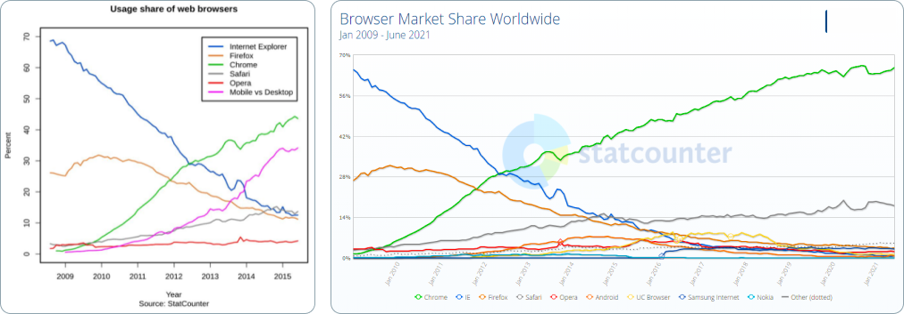
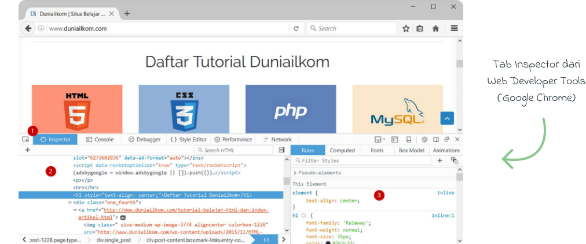

<div id="top"></div>

# JavaScript in One Page

Markdown ini ditulis oleh <a href="https://alamehan.github.io/">alamehan.github.io</a>. Jalur Belajar Web Developer akses di <a href="https://alamehan.github.io/road/webdev/">Right Tr4ck</a>. Materi utama di page ini diambil dari buku <a href="https://www.duniailkom.com/javascript-uncover-panduan-belajar-javascript-untuk-pemula/">JavaScript Uncover by Duniailkom.com</a>. Selebihnya merupakan materi pelengkap, gabungan dari beberapa website berikut:

1. <a href="https://www.youtube.com/channel/UCkXmLjEr95LVtGuIm3l2dPg">Web Programming UNPAS (ID)</a>
2. <a href="https://www.youtube.com/channel/UC14ZKB9XsDZbnHVmr4AmUpQ">Programmer Zaman Now (ID)</a>
3. <a href="https://bukureact.id/">Be Fullstack Javascript Developer | BukuReact.id (ID)</a>
4. <a href="https://flaviocopes.com/page/list-subscribed/">The JavaScript Beginner's & ES5 to ESNext Handbook by Flavio Copes (EN)</a>
5. <a href="https://github.com/sudheerj/ECMAScript-features">ECMAScript Features Cheat Sheet (EN)</a>
6. <a href="https://github.com/daumann/ECMAScript-new-features-list">ECMAScript New Features List (EN)</a>
7. <a href="https://www.w3schools.com/jsref/default.asp">W3Schools Cheat Sheet (EN)</a>
8. <a href="https://www.w3schools.com/">W3Schools (EN)</a>
9. <a href="https://www.w3docs.com/">W3Docs (EN)</a>

<!--⚠️⚠️⚠️ Note: Semua keterangan terkait mengacu ke bab sekian, segera perbaiki, karena strukturnya udah berubah ⚠️⚠️⚠️-->

## ① 𝒫𝑒𝓇𝓀𝑒𝓃𝒶𝓁𝒶𝓃 👋 <a href="#top">⟲</a>

<details>
<summary>Klik untuk membuka!</summary>
  
<div id="daftar_isi_bab1"></div>
<br>
  
| Bab 1                                            	    | Estimasi Baca 	|
|------------------------------------------------------	|---------------	|
| <a href="#bab1_1">1-1. Kenalan dengan JavaScript</a> 	| X Menit       	|
| <a href="#bab1_2">1-2. Sejarah & Perkembangan</a>    	| X Menit       	|
| <a href="#bab1_3">1-3. Menjalankan Kode</a>          	| X Menit       	|
| <a href="#bab1_4">1-4. Aturan Dasar</a>              	| X Menit       	|
| <a href="#bab1_5">1-5. Variable</a>                  	| X Menit       	|
  
<hr>
<div id="bab1_1"></div>
  
## 1-1. Kenalan dengan JavaScript <a href="#daftar_isi_bab1">🡅</a>

JavaScript merupakan bagian dari 5 materi dasar web programming, yakni: HTML, CSS, PHP, MySQL dan JavaScript. Bersama-sama dengan HTML dan CSS, ketiganya berbagi peran masing-masing. HTML digunakan untuk membuat struktur dan isi dari halaman web (content). CSS untuk mempercantik tampilan website (design). Sedangkan JavaScript berfungsi menangani interaksi (behavior).**“HTML for content, CSS for presentation and JavaScript for behavior”**.

HTML, CSS dan JavaScript sama-sama termasuk ke dalam kelompok “client side programming language”, yakni bahasa pemrograman yang dijalankan di sisi client (web browser). PHP juga merupakan bahasa pemrograman web, tapi berada di dalam server, sehingga disebut sebagai “server side programming language”.

**Client Side Programming**: Ini artinya, untuk menjalankan JavaScript kita hanya butuh 2 aplikasi, yakni text editor dan web browser. Text editor digunakan membuat kode JavaScript, dan kode JavaScript tersebut bisa langsung diakses dari web browser. Kita pun bisa melihat kode JavaScript yang digunakan dari sebuah website (sama seperti HTML dan CSS). Silahkan buka website apa saja, klik kanan lalu pilih View Page Source.

**Server Side Programming**: Untuk menjalankan kode program PHP kita harus menggunakan aplikasi seperti Apache web server (yang merupakan bagian dari XAMPP). Kita tidak bisa melihat kode PHP yang digunakan sebuah website secara langsung layaknya HTML, CSS dan JavaScript.

Perkembangan JavaScript yang sangat pesat akhir-akhir ini melahirkan banyak penerapan lain dari JavaScript. Sebagai contoh, **Node.js** adalah penggunaan JavaScript di sisi server. Dalam buku ini kita hanya fokus membahas penggunaan JavaScript di sisi client (di dalam web browser).

Apa yang akan kita pelajari dalam buku ini terdiri dari 2 kelompok besar: JavaScript dan **DOM (Document Object Model)**. JavaScript adalah bahasa pemrograman, sedangkan DOM merupakan objek HTML yang akan kita manipulasi, seperti teks, gambar, form, tombol, title bar web browser, event, dll. Bahasa pemrograman JavaScript dikembangkan oleh ECMA, sedangkan DOM dikembangkan oleh W3C (organisasi yang juga membuat standar HTML dan CSS). Bisa dibilang, JavaScript sepenuhnya terpisah dari HTML.

Setelah mempelajari JavaScript, barulah kita masuk ke DOM. Disinilah JavaScript digunakan untuk mengubah total tampilan halaman web. Jadi, jika anda merasa jenuh dengan pembahasan dari bab 2 hingga 13, tahan dulu! Paksakan untuk terus mempelajarinya. Dengan pemahaman JavaScript yang cukup, kita memiliki pondasi yang kuat untuk memanipulasi objek HTML yang nantinya diakses lewat DOM mulai dari bab 14 hingga akhir buku.

<hr>
<div id="bab1_2"></div>

## 1-2. Sejarah & Perkembangan <a href="#daftar_isi_bab1">🡅</a>

<br>

**Brendan Eich** membuat prototype bahasa baru dalam 10 hari. Pada Mei 1995, bahasa pemrograman “Mocha” lahir. Bahasa pemrograman inilah yang diputuskan untuk digunakan Netscape. Bahasa pemograman Mocha dirilis pertama kali ke dalam versi beta Netscape Navigator 2.0 di bulan September 1995, tetapi dengan menggunakan nama baru: LiveScript. Umur dari LiveScript ternyata tidak lama. 3 bulan kemudian, tepatnya Desember 1995, hadir Netscape Navigator 2.0 beta 3 dengan sebuah bahasa baru: JavaScript. Sebenarnya ini bukanlah bahasa pemrograman baru, tapi perubahan nama dari LiveScript. Nama JavaScript dipilih agar Netscape bisa ‘nompang tenar’ dari bahasa pemrograman JAVA milik Sun Microsystems, yang pada masa itu sangat populer di kalangan programmer.

“The first browser war”, perang web browser pertama antara Internet Explorer buatan Microsoft vs Netscape Navigator buatan Netscape Communications.

**ECMAScript** adalah sebuah standar bahasa pemrograman komputer, dimana JavaScript merupakan salah satu implementasi dari ECMAScript. JavaScript tidak bisa dijadikan standar karena masalah merk “JAVA” yang merupakan trademark SUN Micosystem (sekarang sudah diakuisisi Oracle). Intinya: Standarisasi **JavaScript = ECMAScript**. EMCAScript digunakan hanya saat merujuk ke versi dari JavaScript.

Pengembangan ECMAScript 4 berhenti di tengah jalan, ini disebabkan perbedaan pendapat antar anggota **komite TC39**, terutama mengenai fitur apa yang harus ada di ECMAScript 4. Proses “perseteruan” berlangsung cukup lama, memakan waktu hingga 10 tahun (sampai dengan 2009). Selama jangka waktu tersebut, tidak ada versi baru dari ECMAScript.

Di pasar web browser, Internet Explorer menjadi sangat dominan, menguasai lebih dari 80% -90% market share dari tahun 2001 hingga 2009. Netscape Navigator bisa dibilang sudah punah pada tahun 2004. Web browser Opera hadir sebagai alternatif, tapi tidak bisa berbuat banyak.

**AJAX**, singkatan dari **(Asynchronous JavaScript and XML)**. AJAX memungkinkan sebuah halaman web berkomunikasi langsung dengan server tanpa harus di-reload. Komunikasi antara web browser dengan web server berlangsung di latar belakang (background) secara asynchronous, hasilnya website menjadi lebih dinamis. Sebagai contoh, halaman registrasi bisa langsung mengecek apakah username yang diinput sudah ada di database atau belum. Ini dapat dilakukan sesaat setelah user berpindah dari kolom input username ke kolom dibawahnya. Tanpa menggunakan AJAX, proses pengecekan baru berlangsung saat user selesai mengisi form dan men-klik tombol submit (karena pengecekan harus dilakukan ke database yang ada di server).

Selain AJAX, berkembang juga berbagai komunitas dan library JavaScript seperti Prototype, **jQuery**, Dojo Toolkit, dan MooTools. Masa-masa ini bisa dibilang awal kebangkitan JavaScript. Dengan menggunakan library seperti jQuery, perbedaan implementasi ECMAScript dari berbagai web browser bisa diatasi dengan mudah. jQuery menyediakan ‘abstraction layer’ agar web programmer bisa berfokus kepada fitur yang ingin dicapai. Programmer yang sebelumnya “anti” dengan JavaScript (karena susahnya mengatasi perbedaan fitur web browser), mulai melirik library seperti jQuery.

Setelah perang web browser pertama berakhir dengan kekalahan telak Netscape, perang kedua segera mulai dengan dirilisnya Mozilla Firefox (sebagai "Reingkarnasi Netscape"). Dengan cepat Firefox menjadi web browser favorit yang sepertinya akan segera menggusur IE. Puncaknya di tahun 2010 Firefox menguasai sekitar 30% pasar web browser, walaupun IE masih tetap dominan tapi setiap tahun mengalami tren penurunan. Tidak lama lagi sepertinya Firefox bisa menjadi web browser paling populer menggantikan IE. Namun harapan ini pupus karena muncul web browser baru dari raja mesin pencari: Google Chrome yang dirilis pada Desember 2008. Didukung dengan promosi gencar, nama besar Google, fitur menawan, dan eksekusi yang cepat, membuat Google Chrome segera menjadi web browser paling banyak digunakan hingga saat ini, mengalahkan IE, Firefox, dan Opera.

<br>

ECMAScript 6 atau ES6 atau ECMAScript 2015 dirilis pada bulan Juni 2015. Cukup banyak penambahan baru pada versi ini, sebagian besar merupakan fitur lanjutan untuk membuat aplikasi yang memiliki kompleksitas tinggi, seperti penggunaan **JavaScript di server menggunakan Node.js**. Mulai dari ECMAScript 6 dan selanjutnya, penamaan ECMAScript akan menggunakan nama tahun saat standar tersebut dirilis, seperti ECMAScript 2015, ECMAScript 2016, dst. Banyak perdebatan mengenai pilihan nama ini, sehingga masih sering disebut sebagai ECMAScript 6 (ES6). Dalam buku ini kita lebih banyak membahas ECMAScript 5. Walaupun menggunakan ECMAScript 5, dasar JavaScript yang ada di buku ini tetap valid untuk versi 6 dan versi 7. Fitur tambahan yang ada di ECMAScript 6 dan ECMAScript 7 juga lebih banyak ke materi lanjutan yang terlalu kompleks jika dimasukkan ke buku JavaScript untuk pemula. ES6 dan ES7 lebih cocok jika anda berniat mempelajari JavaScript sebagai bahasa pemrograman server menggunakan Node.js.

**JavaScript Engine** adalah mekanisme internal yang dimiliki oleh web browser untuk menjalankan kode JavaScript. JavaScript Engine dapat disamakan dengan compiler dalam bahasa pemograman lain, yakni algoritma yang digunakan untuk menjalankan JavaScript. Semakin cepat sebuah web browser menjalankan JavaScript akan semakin baik. **V8** adalah nama JavaScript Engine untuk Google Chrome, **SpiderMonkey** untuk Mozilla Firefox, dan **Chakra** untuk Internet Explorer.

Perkembangan JavaScript Saat Ini: Website yang tidak berbentuk “website”, tetapi menyerupai aplikasi desktop yang dikenal sebagai **Single-page Application (SPA)**. Contoh dari Single-page Application ini seperti aplikasi Google: Gmail, GDrive, Google Doc, dll. Di website tersebut, halamannya akan tetap sama, tidak di reload seperti layaknya sebuah website.

Namun perlu juga dipahami bahwa walaupun materi di eBook JavaScript Uncover sudah lumayan rumit, ini barulah dasar dari JavaScript. Jika anda serius ingin mempelajari JavaScript lebih jauh lagi, bisa lanjut ke library seperti **jQuery**, framework seperti **AngularJS**, **ReactJS** maupun **VueJS**, atau ke server menggunakan **Node.js**.

Timeline sejarah JavaScript dari awal lahir hingga saat ini secara ringkas dapat diakses <a href="https://www.jetbrains.com/lp/javascript-25/">disini</a>. Daftar feature baru dari mulai **ES6 hingga ES.Next** dapat diakses di <a href="https://en.wikipedia.org/wiki/ECMAScript">Wikipedia</a>, <a href="https://www.javascripttutorial.net/es-next/">JavaScriptTutorial</a>, <a href="https://jsfeatures.in/">JSFeatures</a>, <a href="https://www.freecodecamp.org/news/es5-to-esnext-heres-every-feature-added-to-javascript-since-2015-d0c255e13c6e/">FreeCodeCamp</a>, <a href="https://github.com/daumann/ECMAScript-new-features-list">GitHub</a>, <a href="https://javascript.info/">JavaScriptInfo</a>.
  
<hr>
<div id="bab1_3"></div>
  
## 1-3. Menjalankan Kode <a href="#daftar_isi_bab1">🡅</a>

> - [X] 𝐀. Inline JavaScript
> - [X] 𝐁. Internal JavaScript
> - [X] 𝐂. External JavaScript
> - [X] 𝐃. Posisi Terbaik JavaScript
> - [X] 𝐄. Tag No-Script

### 𝐀. Inline JavaScript

```HTML
<html>
  <head>
    ...
  </head>
  <body>
    ...
    <button onclick="alert('Sedang Belajar JavaScript');"></button>
    ...
  </body> 
</html>
```

### 𝐁. Internal JavaScript

```HTML
<html>
  <head>
    ...
    <script>
      // Kode JavaScript Disini
    </script>
  </head>
  <body>
    ...
  </body> 
</html>
```

### 𝐂. External JavaScript

```HTML
<html>
  <head>
    ...
  </head>
  <body>
    ...
    <script src="script.js"></script>
  </body> 
</html>
```

Menempatkan kode JavaScript di bagian atas banyak ditemukan. Namun berkaitan dengan masalah performa, beberapa developer web menyarankan meletakkan JavaScript dibagian bawah tag ```<body>```, yakni sebelum tag penutup ```</body>```, sebagaimana yang dijelaskan dari sebuah artikel di Yahoo Developer Network: Best Practices for Speeding Up Your Web Site. 

Cara web browser dalam menampilkan sebuah halaman web, yakni secara berurutan dari atas ke bawah, mulai dari baris pertama hingga baris terakhir. Fitur **cache** dari web browser bisa mempercepat pengaksesan website dengan cara menyimpan file JavaScript di dalam cache.

Dengan memanggil file external JavaScript dari bagian bawah tag ```<body>```, memberi kesempatan web browser untuk memproses kode HTML terlebih dahulu, baru kemudian mendownload file JavaScript. Efeknya, pengujung web bisa langsung melihat tampilan web selama proses ini, tidak hanya halaman kosong. 

### 𝐃. Posisi Terbaik JavaScript

```HTML
<html>
  <head>
    ...
    <!-- External JavaScript -->
    <script src="script-penting.js" async></script>
    <script src="script.js" defer></script>
  </head>
  <body>
    ...
    <script>
      // Internal JavaScript
    </script>
  </body> 
</html>
```

Atribut **async** dan **defer**: kita bisa mengatur kapan dan bagaimana file external JavaScript diproses. Kedua atribut ini memungkinkan penulisan tag ```<script>``` tidak harus di bawah tag ```<body>```. Jika atribut **async** ditambahkan ke dalam tag ```<script>```, file JavaScript akan diproses pada saat yang bersamaan dengan kode HTML (secara simultan). Dengan kata lain, web browser tidak “terkunci” untuk menjalankan kode JavaScript. Metode ini juga dikenal dengan istilah **Asynchronous JavaScript** (Di proses secara bersamaan = Asynchronous). 

Dengan tambahan atribut **async**, kode HTML tetap diproses sembari mendownload file JavaScript. Dengan kata lain, web browser tidak masuk ke dalam Render-Blocking JavaScript. Atribut **defer** digunakan untuk mengatur kapan file JavaScript dijalankan. Dengan atribut ini, file JavaScript baru di download dan dieksekusi setelah seluruh kode HTML selesai diproses. Efek dari atribut **async** dan **defer** mungkin terdengar sama. Perbedaaan mendasar adalah, **async** digunakan untuk mengatur cara eksekusi kode JavaScript, sedangkan **defer** untuk mengatur kapan file JavaScript tersebut di download dan diproses.

Tambahan atribut **async** dan **defer** dari HTML5 membawa perubahan terkait posisi terbaik peletakan kode JavaScript. Standar saat ini adalah menempatkan kode JavaScript di bagian ```<head>``` dengan tambahan atribut **async**. Alasannya, web browser bisa langsung mengeksekusi file JavaScript pada saat yang bersamaan dengan proses kode HTML, sehingga website dapat ditampilkan dengan lebih cepat (tidak mengalami Render-Blocking JavaScript). Untuk kode JavaScript yang tidak terlalu penting (dan bisa menunggu), tambahkan atribut **defer**. Sebagai tambahan, atribut **async** dan **defer** hanya berlaku untuk external JavaScript. Untuk internal JavaScript, atribut ini akan diabaikan dan posisi terbaik tetap di bagian bawah tag ```<body>```.

Berbeda dengan mayoritas bahasa pemrograman lain, secara default kita tidak bisa melihat pesan error dari JavaScript. Padahal ini sangat penting selama pembuatan kode program. Tidak ada yang lebih membuat pusing dari program yang tidak berjalan, namun tidak tahu salahnya dimana. Untuk menampilkan pesan error JavaScript, kita bisa menggunakan menu **Web developer tools** bawaan web browser. Setiap web browser modern memiliki tools seperti ini.

<br>

Tab Inspector (1) bisa digunakan untuk menelusuri seluruh kode HTML yang terdapat di dalam halaman web (2), di sisi kanan kita bisa melihat kode CSS yang digunakan oleh tag HTML tersebut (3). Jika anda sering mengedit kode CSS, tab Inspector ini sangat bermanfaat untuk melihat dan menjalankan (mengedit) kode CSS tanpa perlu mengubah file asli.

Tab yang sering kita akses selama membuat kode program JavaScript adalah **Tab Console**, yang berada di sebelah kanan tab Inspector. Apabila kode yang anda buat tidak berjalan sebagaimana mestinya, hal pertama yang harus dilakukan adalah memeriksa tab Console ini. Selain menampilkan pesan error, di dalam tab Console kita juga bisa menjalankan kode program JavaScript secara langsung, tanpa harus menulisnya di dalam file HTML. Fungsi ```console.log()``` berguna untuk menampilkan hasil kode program ke tab Console.

### 𝐄. Tag No-Script

```HTML
<html>
  <head>
    ...
  </head>
  <body>
    ...
    <script>
      alert("JavaScript aktif");
    </script>
    <noscript>
      JavaScript anda tidak aktif, mohon diaktifkan untuk bisa mengakses web ini.
    </noscript>
  </body> 
</html>
```

Salah satu kelemahan (sekaligus keunggulan) dari JavaScript adalah, pengunjung web bisa mematikan JavaScript yang ada di web browser mereka. Tag ```<noscript>``` bisa digunakan untuk menampilkan teks keterangan yang hanya bisa terlihat pada web browser yang tidak memiliki JavaScript (atau JavaScriptnya dimatikan).
  
<hr>
<div id="bab1_4"></div>
  
## 1-4. Aturan Dasar <a href="#daftar_isi_bab1">🡅</a>

> - [X] 𝐀. Statement
> - [X] 𝐁. Case Sensitive
> - [X] 𝐂. Whitespace
> - [X] 𝐃. Indenting
> - [X] 𝐄. Comment

### 𝐀. Statement

**Statement** adalah sebutan untuk sebuah baris perintah JavaScript. Walaupun saya menggunakan kata “baris”, bisa saja sebuah Statement butuh beberapa baris (seperti Function). Atau dalam 1 baris bisa terdiri dari beberapa Statement. Setiap Statement diakhiri dengan tanda titik koma (semi colon): ‘ ; ‘. Sebenarnya, tanda titik koma untuk mengakhiri Statement JavaScript ini adalah opsional. Artinya, boleh tidak ditulis sepanjang Statement tersebut harus berada dalam baris baru (1 Statement, 1 baris). Sebaiknya kita tetap menambahkan tanda titik koma untuk mengakhiri setiap Statement di dalam JavaScript.

### 𝐁. Case Sensitive

**Case Sensitivity**: JavaScript termasuk bahasa pemrograman yang bersifat case sensitif, artinya huruf besar dan huruf kecil dianggap berbeda. Salah menulis huruf sangat sering terjadi, misalnya pada saat pendefinisian Variable.

### 𝐂. Whitespace

**Whitespace** mengacu pada karakter yang digunakan untuk memberikan ruang horizontal atau vertikal antara karakter lain, atau dengan kata lain karakter “kosong” seperti spasi, tab, atau baris baru (new line). Secara umum di dalam JavaScript whitespace akan diabaikan.

### 𝐃. Indenting

**Indenting** adalah istilah yang digunakan untuk menambahkan spasi atau tab diawal baris kode program. Tujuannya agar kode program lebih mudah dibaca terutama jika kode program tersebut sudah mencapai puluhan atau ratusan baris kode program. 

### 𝐄. Comment

**Comment** atau baris komentar adalah sebutan untuk kode program yang tidak akan di eksekusi oleh JavaScript. Selain sebagai dokumentasi, komentar juga sering digunakan untuk menghentikan sementara baris kode program. Di JavaScript, Comment ditulis menggunakan karakter ```// komentar``` (untuk single line) & ```/* komentar */``` (untuk multi line). Di sepanjang contoh kode yang disertakan di bab-bab selanjutnya, penggunaan Comment akan banyak sekali ditemukan (sebagai keterangan baris sebuah kode).

<hr>
<div id="bab1_5"></div>
  
## 1-5. Variable <a href="#daftar_isi_bab1">🡅</a>

Secara sederhana, Variable adalah “wadah/penampung” dari sebuah data. Disebut Variable karena data yang kita simpan bisa berubah-ubah sepanjang kode program (isinya tidak tetap). ```var angka = 192;``` **Operasi Assignment** atau memberikan nilai ke sebuah Variable dibaca dari kanan ke kiri (right-to-left, baca selengkapnya <a href="https://developer.mozilla.org/en-US/docs/Web/JavaScript/Reference/Operators/Operator_Precedence">disini</a>). Artinya, 192 “dimasukkan” sebagai nilai ke Variable ```angka```.

JavaScript termasuk ke dalam bahasa pemrograman **Typeless Programming Language**, yakni kelompok bahasa pemrograman yang Variablenya bisa diisi dengan tipe data apa saja tanpa harus dideklarasikan terlebih dahulu.

Apabila anda sering mengikuti tutorial programming dari situs berbahasa inggris, nama Variable **foo**, **bar**, dan **baz** sering digunakan. Ketiganya dikenal sebagai **dummy Variable**, yakni Variable yang fungsinya hanya sebagai contoh. Mirip seperti teks “Lorem Ipsum dolor sit amet” dalam bidang design.

Kita bisa memberi nama apa saja untuk Variable, apakah itu ```angka```, ```foo```, ```bar```, ```andi```, atau ```username```. Selain Variable (Var), kita juga bebas untuk membuat nama Konstanta (Const), Function, maupun Object. Semua inilah yang termasuk ke dalam kelompok **Identifier**. Identifier di dalam JavaScript memiliki aturan sebagai berikut:
   - Bersifat case sensitive, dimana huruf besar dan kecil dianggap berbeda.
   - Bisa terdiri dari huruf, angka, underscore “_”, dan tanda dollar “$“. Selain itu, dianggap sebagai karakter ilegal.
   - Karakter pertama dari Identifier tidak boleh berupa angka. Angka hanya bisa digunakan sebagai karakter kedua dan seterusnya.
   - Harus selain dari **reserved keyword**, yakni kata khusus yang berfungsi sebagai perintah di dalam JavaScript, seperti ```var```, ```while```, dll.

Di CSS kita menggunakan cara penulisan selector yang dipisah dengan tanda “ - ”, seperti ```main-box```, ```left-sidebar```, dan ```single-post```. Di PHP kita mengenal **Snake Case**, yakni menggunakan huruf kecil dan tanda underscore sebagai pemisah Variable, seperti ```jumlah_barang```, ```nama_dosen```, dan ```alamat_siswa```. Di JavaScript menggunakan **CamelCase**. CamelCase adalah cara penulisan Variable dimana jika sebuah Variable terdiri dari beberapa kata, huruf pertama dari kata kedua dan seterusnya diubah menjadi huruf besar, seperti: ```banyakAnggota```, ```totalBiaya```, ```mainBox```, atau ```jumlahKlikSatuHari```. Jika Variable tersebut hanya terdiri dari 1 kata, ditulis dengan huruf kecil semua.

**Strict Mode** memaksa JavaScript menampilkan error (di Tab Console) pada kode program yang seharusnya bisa berjalan “normal”. Tujuannya, meminimalisir kemungkinan bug karena penulisan yang salah, typo, dan berbagai hal lain. Strict mode sepenuhnya opsional dan mungkin tidak bisa selalu anda gunakan, terutama jika terdapat kode JavaScript pendahulu yang terlalu rumit untuk diubah semuanya. Strict Mode akan membuat web browser menampilkan error dimana sebelumnya hanya ada **“silent error”**. Salah satunya ketika membuat Variable tanpa perintah ```var```. Untuk masuk ke dalam Strict Mode, tambahkan String ```"use strict";``` di baris pertama kode JavaScript atau di baris paling awal dari sebuah Function.

EcmaScript 6 membawa fitur baru ke dalam JavaScript, yakni menggunakan perintah ```let``` untuk membuat Variable (sebagai alternatif dari ```var```). Perbedaan mendasar dari ```var``` dan ```let``` adalah terkait dengan **Variable scope**, yakni di bagian mana sebuah Variable masih bisa diakses. Penjelasan mengenai Variable scope akan dibahas pada bab tentang Function. Selain Let, ada juga Konstanta (```const```) yaitu Variable yang nilainya tidak bisa diubah sepanjang kode program. Setelah Konstanta ditulis dan diberi nilai awal, isi Konstanta tersebut tidak bisa diubah.

Format penulisan: Var/Let diawali huruf kecil (```total```, ```totalBiaya```, dst), Const huruf besar semua (```PI```, ```RUMUS_A```, dst), dan Class diawali huruf besar (```Mobil```, ```MobilBaru```, dst). **Class dibahas di bab 11**. Tujuan dari format penulisan ini yaitu agar programmer dapat dengan mudah membedakan mana Variable/Let, Konstanta maupun Class.

Pada contoh di bawah: Var ```harga```, Let ```namaLengkap```, dan Const ```NILAI_PI``` adalah **Identifier**. Sedangkan ```12000```, ```"Rudi Siswoyo"```, dan ```3.14``` adalah **Literal**.

```HTML
<html>
  <head>
    ...
  </head>
  <body>
    ...
    <script>
      "use strict";

      var harga = 12000;
      let namaLengkap = "Rudi Siswoyo";
      const NILAI_PI = 3.14;

      ...
    </script>
  </body> 
</html>
```

</details>

## ② 𝒦𝑜𝓃𝓈𝑒𝓅 𝒟𝒶𝓈𝒶𝓇 👨‍💻 <a href="#top">⟲</a>

<details>
<summary>Klik untuk membuka!</summary>
  
<div id="daftar_isi_bab2"></div>
<br>
  
| Bab 2                                 	    | Estimasi Baca 	|
|--------------------------------------------	|---------------	|
| <a href="#bab2_1">2-1. Tipe Data</a><br>   	| X Menit       	|
| <a href="#bab2_2">2-2. Operator</a>        	| X Menit       	|
| <a href="#bab2_3">2-3. Struktur Logika</a> 	| X Menit       	|
| <a href="#bab2_4">2-4. Perulangan</a>      	| X Menit       	|
| <a href="#bab2_5">2-5. Function</a>        	| X Menit       	|
| <a href="#bab2_6">2-6. Object</a>          	| X Menit       	|
  
<hr>
<div id="bab2_1"></div>
  
## 2-1. Tipe Data <a href="#daftar_isi_bab2">🡅</a>
  
> 𝐓𝐢𝐩𝐞 𝐃𝐚𝐭𝐚 𝐏𝐫𝐢𝐦𝐢𝐭𝐢𝐟
> > - [X] 𝐀. Number
> > - [X] 𝐁. NaN & Infinity
> > - [X] 𝐂. String
> > - [X] 𝐃. Boolean
> > - [X] 𝐄. Null & Undefined
> > - [ ] 𝐅. Symbol

> 𝐓𝐢𝐩𝐞 𝐃𝐚𝐭𝐚 𝐎𝐛𝐣𝐞𝐜𝐭
> > - [X] 𝐆. Array
> > - [X] 𝐇. Object, RegExp & Date
> > - [ ] 𝐈. Map & WeakMap
> > - [ ] 𝐉. Set & WeakSet

Secara garis besar, tipe data dalam JavaScript terdiri dari 2 kelompok, yakni tipe data primitif, dan tipe data object. Tipe data primitif disebut demikian karena tipe data ini “sederhana” dan hanya terdiri dari 1 nilai. Yang termasuk ke dalam **tipe data primitif**, yaitu: **Number, NaN, Infinity, String, Boolean, Null, Undefined, dan Symbol**. Sedangkan tipe data object, bisa disebut sebagai tipe data “khusus” yang prilaku dan isinya beragam. Adapun yang termasuk ke dalam **tipe data object**, yaitu: **Array, Object, RegExp, Date, Map, WeakMap, Set, dan WeakSet.**

### 𝐀. Number

```Javascript
var numA = 100;                       // Angka bulat
var numB = -100;                      // Angka bulat negatif
var numC = 0.66634;                   // Angka pecahan
var numD = -0.66634;                  // Angka pecahan negatif
var numE = 3e3;                       // ≈ 3 x 10^3
var numF = 0.4e-3;                    // ≈ 0.4 x 10^-3
var numG = 999;                       // Desimal (basis 10)
var numH = 0b1111100111;              // Biner (basis 2), diawali 0b
var numI = 0o1747;                    // Oktal (basis 8), diawali 0o
var numJ = 0x3E7;                     // Heksadesimal (basis 16), diawali 0x
```

### 𝐁. NaN & Infinity

```Javascript
var numK = NaN;                       // Keadaan dimana data bukan "angka yang sah/legal"
var numL = Infinity;                  // Keadaan dimana data "angka tak hingga"
var numM = -Infinity;                 // Keadaan dimana data "angka negatif tak hingga)
```
#### ⤷ Kasus yang menghasilkan NaN & Infinity:

```Javascript
var numN = 9/"a";                     // Membagi angka dengan bukan angka menghasilkan NaN
console.log(numK);                    // Output: NaN (Not a Number)

var numO = 9/0;                       // Membagi angka dengan nol menghasilkan Infinity
console.log(numL);                    // Output: Infinity (Tak Hingga)

var numP = -9/0;                      // Membagi angka negatif dengan nol menghasilkan -Infinity
console.log(numP);                    // Output: -Infinity (Negatif Tak Hingga)
```

### 𝐂. String

```Javascript
var strA = "Hello World!";            // String dengan kutip dua
var strB = 'Hello World!';            // String dengan kutip satu
var strC = "Hari Jum'at";             // Kutip satu di dalam kutip dua
var strD = 'Dia berkata: "Hey"';      // Kutip dua di dalam kutip satu
var strE = "Dia berkata: \"Hey\"";    // Kutip dua di dalam kutip dua, pakai escape character (\)
var strF = 'Hari Jum\'at';            // Kutip satu di dalam kutip satu, pakai escape character (\)
var strG = "\u2764 You!"              // Contoh pemakaian Unicode ⇨ Hasilnya: ❤ You!

var strH = `Hello World!`;            // String dengan backtick `` (Template String ES6)
var strI = `"Hei!", Jum'at today.`;   // Kutip satu & dua di dalam backtick
var strJ = `\u2764 You!`;             // Contoh pemakaian Unicode ⇨ Hasilnya: ❤ You!
```

| Escape Characters 	| Kegunaan                                                       	|
|-------------------	|----------------------------------------------------------------	|
| \0                	| Karakter NUL                                                   	|
| \b                	| Backspace                                                      	|
| \t                	| Horizontal tab                                                 	|
| \n                	| Newline                                                        	|
| \v                	| Vertical tab                                                   	|
| \f                	| Form feed                                                      	|
| \r                	| Carriage return                                                	|
| \"                	| Tanda kutip dua (double quote)                                 	|
| \'                	| Tanda kutip satu (apostrophe atau single quote)                	|
| \\                	| Garis miring (backslash)                                       	|
| \xXX              	| Karakter Latin-1 dengan menggunakan dua digit heksa desimal XX 	|
| \uXXXX            	| Karakter Unicode dengan menggunakan empat digit heksa XXXX     	|
| 📚 Bonus           	| Daftar Karakter Latin-1 & Unicode: http://unicode-table.com/   	|

### 𝐃. Boolean

```Javascript
var bolA = true;                      // Bernilai true, biasanya di pakai di if, else, while, dan do while
var bolB = false;                     // Bernilai false, biasanya di pakai di if, else, while, dan do while
```

### 𝐄. Null & Undefined

```Javascript
var nudA = null;                      // Keadaan dimana data "kosong", biasanya sengaja diinput oleh programmer
var nudB = undefined;                 // Keadaan dimana data "tidak terdefinisi", biasanya terjadi karena error
```

#### ⤷ Kasus yang menghasilkan Undefined:

```Javascript
var und1;                             // Var yang dibuat tanpa langsung diisi nilai menjadi Undefined
console.log(und1);                    // Output: undefined

var und2 = [1, 2, 3];                 // Mengakses Array diluar indeks yang dibuat menghasilkan Undefined
console.log(und2[3]);                 // Output: undefined

var und3 = {nama: "iyan", umur: 24};  // Mengakses Object diluar key yang dibuat menghasilkan Undefined
console.log(und3["alamat"]);          // Output: undefined
```

### 𝐅. Symbol

> 🚧 Tidak dibahas (mungkin saja nanti akan ditambahkan)

### 𝐆. Array

```Javascript
var arrSiswa = ["Andri", "Joko", "Sukma"];      // Array 1D berisi hanya data String
var arrAcak  = [1, 2.0, "tiga", true, null];    // Array 1D berisi beragam tipe data
var arr2D    = [[2,5], [9,5]];                  // Array 2D, misalnya untuk koordinat

console.log(arrSiswa);                // Output: ["Andri", "Joko", "Sukma"]
console.log(arrSiswa[0]);             // Output: Andri                        ⇨ Array di JavaScript dimulai dari indeks ke 0,
console.log(arrSiswa[1]);             // Output: Joko                            bukan dari indeks ke 1, ingat baik-baik ya.
console.log(arrSiswa[2]);             // Output: Sukma

console.log(arr2D);                   // Output: [[2,5],[9,5]]
console.log(arr2D[0]);                // Output: [2,5]
console.log(arr2D[1]);                // Output: [9,5]
console.log(arr2D[0][0]);             // Output: 2
console.log(arr2D[0][1]);             // Output: 5
console.log(arr2D[1][0]);             // Output: 9
console.log(arr2D[1][1]);             // Output: 5
```

### 𝐇. Object, RegExp & Date

> 🔔 Object dibahas di bab 2-6 & bab 3
> 
> 🔔 RegExp dibahas di bab 3-2 D
> 
> 🔔 Date dibahas di bab 3-2 F

### 𝐈. Map & WeakMap

> 🚧 Tidak dibahas (mungkin saja nanti akan ditambahkan)

### 𝐉. Set & WeakSet

> 🚧 Tidak dibahas (mungkin saja nanti akan ditambahkan)
  
<hr>
<div id="bab2_2"></div>
  
## 2-2. Operator <a href="#daftar_isi_bab2">🡅</a>
  
> 𝐏𝐞𝐧𝐭𝐢𝐧𝐠 𝐔𝐧𝐭𝐮𝐤 𝐃𝐢𝐤𝐞𝐭𝐚𝐡𝐮𝐢
> > - [X] 𝐀. Operator Precedence
> > - [X] 𝐁. Falsy & Truthy Value
  
> 𝐎𝐩𝐞𝐫𝐚𝐭𝐨𝐫 𝐝𝐢 𝐉𝐚𝐯𝐚𝐒𝐜𝐫𝐢𝐩𝐭
> > - [X] 𝐂. Operator typeof
> > - [X] 𝐃. Operator instanceof
> > - [X] 𝐄. Operator Aritmatika
> > - [X] 𝐅. Operator Assignment
> > - [X] 𝐆. Operator Increment & Decrement
> > - [X] 𝐇. Operator Perbandingan
> > - [X] 𝐈. Operator Logika
> > - [X] 𝐉. Operator String
> > - [ ] 𝐊. Operator Bitwise
> > - [X] 𝐋. Operator Spread

### 𝐀. Operator Precedence

Operator Precedence atau Prioritas Operator menentukan bagaimana suatu operator dieksekusi. Operator dengan prioritas lebih tinggi akan dioperasikan terlebih dahulu. Ada operator yang dioperasikan dari kiri ke kanan (left-to-right), ada pula yang dari kanan ke kiri (right-to-left).

📚 Tabel Operator Precedence lengkap beserta Associativity-nya dapat diakses di link MDN berikut:<br>
https://developer.mozilla.org/en-US/docs/Web/JavaScript/Reference/Operators/Operator_Precedence

### 𝐁. Falsy & Truthy Value

Di JavaScript sebuah tipe data akan berubah menjadi tipe data lain tergantung operator yang digunakan. Untuk operator perbandingan (==, !=, <, <=, >, >=, dst), tipe data ini akan dikonversi menjadi Boolean (true/false). Nilai yang dikonversi menjadi false disebut Falsy Value, dan nilai yang dikonversi menjadi true disebut Truthy Value. Simak tabel Falsy & Truthy Value berikut:

| Falsy Value 	| Keterangan      	|   	| Truthy Value 	| Keterangan                                                 	|
|-------------	|-----------------	|---	|--------------	|------------------------------------------------------------	|
| false       	| Nilai false     	|   	| true         	| Nilai true                                                 	|
| null        	| Nilai null      	|   	| {}           	| Object kosong                                              	|
| undefined   	| Nilai undefined 	|   	| []           	| Array kosong                                               	|
| 0           	| Angka nol       	|   	| 42           	| Sembarang angka (termasuk pecahan dan negatif), selain nol 	|
| NaN         	| Nilai NaN       	|   	| "foo"        	| Sembarang string, selama bukan string kosong               	|
| ''          	| String kosong   	|   	| infinity     	| Nilai infinity                                             	|
| ""          	| String kosong   	|   	| -infinity    	| Nilai -infinity                                            	|

#### ⤷ Kasus Falsy & Truthy Value:

```Javascript
console.log('' == '0');               // Output: false  (Hasil konversi: false == true)
console.log(0 == '');                 // Output: true   (Hasil konversi: false == false) 
console.log(0 == '0');                // Output: true   (Bukan operator indentik, jadinya true) 
console.log(false == 'false');        // Output: false  (Hasil konversi: false == true) 
console.log(false == '0');            // Output: true   (Bukan operator indentik & false kan bernilai 0, jadinya true) 
console.log(false == undefined);      // Output: false  (*Pengecualian) 
console.log(false == null);           // Output: false  (*Pengecualian) 
console.log(null == undefined);       // Output: true   (Hasil konversi: false == false) 
console.log('\t\r\n' == 0);           // Output: true   (*Pengecualian) 
```

### 𝐂. Operator typeof

#### ⤷ Oprator typeof digunakan untuk memeriksa tipe data suatu Variable:

```Javascript
var numA = 100;
var strA = "Hello World!";
var bolA = true;
var nudA = null;
var nudB = undefined;
var arrSiswa = ["Andri", "Joko", "Sukma"];

console.log(typeof numA);                 // Output: number
console.log(typeof strA);                 // Output: string
console.log(typeof bolA);                 // Output: boolean
console.log(typeof nudA);                 // Output: object (bukan Null)
console.log(typeof nudB);                 // Output: undefined
console.log(typeof arrSiswa);             // Output: object (Array termasuk Object)
```

#### ⤷ Tidak hanya typeof, terdapat beragam cara untuk memeriksa tipe data:

```Javascript
var num = 10;                             // Tipe data: Number
var nan = 9/"a";                          // Tipe data: NaN
var inf = 9/0;                            // Tipe data: Infinity
var str = "JavaScript";                   // Tipe data: String
var bol = true;                           // Tipe data: Boolean
var nul = null;                           // Tipe data: Null
var und = undefined;                      // Tipe data: Undefined
var arr = [1, 2, "tiga"];                 // Tipe data: Array
var obj = {nama: "Budi", umur: 13};       // Tipe data: Object      // 🔔 Object dibahas di bab 2-6 & bab 3
var reg = /^\d\w\s$/;                     // Tipe data: RegExp      // 🔔 RegExp dibahas di bab 3-2 D
var dat = new Date(2016,11,2,9,30,15);    // Tipe data: Date        // 🔔 Date dibahas di bab 3-2 F

console.log(typeof num === "number");     // Output: true   (Check apakah datanya Number)
console.log(Number.isNaN(nan));           // Output: true   (Check apakah datanya NaN)
console.log(inf === Infinity);            // Output: true   (Check apakah datanya Infinity)
console.log(typeof str === "string");     // Output: true   (Check apakah datanya String)
console.log(typeof bol === "boolean");    // Output: true   (Check apakah datanya Boolean)
console.log(nul === null);                // Output: true   (Check apakah datanya Null)
console.log(und === undefined);           // Output: true   (Check apakah datanya Undefined)
console.log(Array.isArray(arr));          // Output: true   (Check apakah datanya Array - cara 1)
console.log(arr instanceof Array);        // Output: true   (Check apakah datanya Array - cara 2)
console.log(arr.constructor === Array);   // Output: true   (Check apakah datanya Array - cara 3)
console.log(typeof obj === "object");     // Output: true   (Check apakah datanya Object - cara 1)
console.log(obj instanceof Object);       // Output: true   (Check apakah datanya Object - cara 2)
console.log(obj.constructor === Object);  // Output: true   (Check apakah datanya Object - cara 3)
console.log(reg instanceof RegExp);       // Output: true   (Check apakah datanya RegExp - cara 1)
console.log(reg.constructor === RegExp);  // Output: true   (Check apakah datanya RegExp - cara 2)
console.log(dat instanceof Date);         // Output: true   (Check apakah datanya Date - cara 1)
console.log(dat.constructor === Date);    // Output: true   (Check apakah datanya Date - cara 2)
```

### 𝐃. Operator instanceof

>  🔔 Oprator instanceof dibahas di bab 3-1 B

### 𝐄. Operator Aritmatika

```Javascript
var a = 10;
var b = 2;

console.log(a + b);                   // Output: 12     ⇨ Addition (tambah)
console.log(a - b);                   // Output: 8      ⇨ Substraction (kurang)
console.log(a * b);                   // Output: 20     ⇨ Multiplication (kali)
console.log(a / b);                   // Output: 5      ⇨ Division (bagi)
console.log(a % b);                   // Output: 0      ⇨ Modulo (sisa bagi)
console.log(a ** b);                  // Output: 100    ⇨ Exponentiation (pangkat)

console.log(4+6/5-3*2+3);             // Output: 2.2    ⇨ Operator * dan / diproses lebih awal (Precedence: 15)
console.log((4+6)/(5-3)*2+3);         // Output: 13     ⇨ Operator () diproses lebih awal (Precedence: 21)
```

### 𝐅. Operator Assignment

```Javascript
var g = 10;         // Artinya 10 dimasukkan sebagai nilai ke Variable g (Operator assignment memiliki precedence: 3)
var h = 10 + 5;     // Artinya jumlahkan 10 + 5 dulu (Operator "+" memiliki precedence: 14), lalu masukkan hasilnya ke Variable h
var i = g + h;      // Artinya jumlahkan g + h dulu (Operator "+" memiliki precedence: 14), lalu masukkan hasilnya ke Variable i
```

#### ⤷ Gabungan Assignment:

```Javascript
var gabA = gabB = gabC = gabD = gabE = 20;

gabA += 10;                           // gabA = gabA + 10 🡲 gabA = 20 + 10      (Hasilnya: 30) 
gabB -= 10;                           // gabB = gabB - 10 🡲 gabB = 20 - 10      (Hasilnya: 10)
gabC /= 10;                           // gabC = gabC / 10 🡲 gabC = 20 / 10      (Hasilnya: 2)
gabD *= 10;                           // gabD = gabD * 10 🡲 gabD = 20 * 10      (Hasilnya: 200) 
gabE %= 10;                           // gabE = gabE % 10 🡲 gabE = 20 % 10      (Hasilnya: 0)
```

### 𝐆. Operator Increment & Decrement

```Javascript
var c = 10, d = 10, e = 10, f = 10;

console.log(++c);                     // Output: 11     ⇨ Pre-increment: langsung tambahkan
console.log(c);                       // Output: 11
console.log(--d);                     // Output: 9      ⇨ Pre-decrement: langsung kurangi
console.log(d);                       // Output: 9

console.log(e++);                     // Output: 10     ⇨ Post-increment: tampilkan dulu, baru tambahkan
console.log(e);                       // Output: 11
console.log(f--);                     // Output: 10     ⇨ Post-decrement: tampilkan dulu, baru kurangi
console.log(f);                       // Output: 9
```

### 𝐇. Operator Perbandingan

```Javascript
console.log(8 == 12);                 // Output: false  ⇨ Equality (sama dengan)
console.log(8 != 12);                 // Output: true   ⇨ Inquality (tidak sama dengan)
console.log(10 < 11);                 // Output: true   ⇨ Less than (kurang dari)
console.log(11 <= 11);                // Output: true   ⇨ Less than or equal (kurang dari atau sama dengan)
console.log(21 > 20);                 // Output: true   ⇨ Greater than (lebih dari)
console.log(21 >= 21);                // Output: true   ⇨ Greater than or equal (lebih dari atau sama dengan)

console.log(9 == "9");                // Output: true
console.log(9 === "9");               // Output: false  ⇨ Strict equality (identik dengan)
console.log(9 != '9');                // Output: false
console.log(9 !== '9');               // Output: true   ⇨ Strict inequality (tidak identik dengan)
```

#### ⤷ Kasus Perbadingan Unik:

```Javascript
console.log(1 == true);               // Output: true
console.log(1 === true);              // Output: false
console.log(0 == false);              // Output: true
console.log(0 === false);             // Output: false
console.log(0.3 == 3e-1);             // Output: true
console.log(0.3 === 3e-1);            // Output: true   (Karena memang nilainya sama)
console.log(true > false)             // Output: true   (Ingat: true = 1, false = 0)
```

#### ⤷ Kasus Perbandingan String:

📚 Setiap karakter dalam String menggunakan nomor urut desimal di ASCII-Code: https://www.ascii-code.com/

```Javascript
console.log("a" < "b");               // Output: true   (a = 97, b = 98)
console.log("a" < "A");               // Output: false  (a = 97, A = 65)
console.log("ali" < "ala");           // Output: false  (ali = 97→108→105, ala = 97→108→97)
console.log("ali" < "alo");           // Output: true   (ali = 97→108→105, alo = 97→108→111)
console.log("ali" < "alika");         // Output: true   (String yang lebih pendek akan dianggap lebih kecil) 
console.log("ali" < 9999999);         // Output: false  (Perbandingan String & Number selalu menghasilkan false)
```

### 𝐈. Operator Logika

```Javascript
console.log(true && false);           // Output: false  ⇨ and operator (true hanya jika kedua nilai true)
console.log(true || false);           // Output: true   ⇨ or operator (true jika salah satu nilai true)
console.log(!false);                  // Output: true   ⇨ not operator (negasi/kebalikannya)
console.log(true || true && false);   // Output: true   ⇨ Operator && diproses lebih awal (precedence: 7)
```

#### ⤷ Short-Circuit-Evaluation:

Operasi logika menggunakan prinsip short-circuit-evaluation, maksudnya jika dengan memeriksa 1 nilai saja hasil operasi tersebut sudah diketahui, nilai-nilai lain tidak akan diperiksa, kecuali jika terdapat operator && dan || dalam 1 operasi, maka operator && akan dijalankan terlebih dahulu (karena nilai precedence && lebih tinggi daripada ||).

```Javascript
console.log(true || false || true);   // Kiri ke kanan: true bertemu operator ||, stop, sudah pasti hasilnya true
console.log(false && true && true);   // Kiri ke kanan: false bertemu operator &&, stop, sudah pasti hasilnya false
console.log(true || true && false);   // Operator && duluan, menjadi: true || false, hasilnya true

console.log(true && alert("HYA!"));   // Function alert() berjalan, karena true bertemu &&, lanjut ke alert()
console.log(false && alert("HYA!"));  // Function alert() tidak berjalan, karena false bertemu &&, stop
console.log(true || alert("HYA!"));   // Function alert() tidak berjalan, karena true bertemu ||, stop
console.log(false || alert("HYA!"));  // Function alert() berjalan, karena false bertemu ||, lanjut ke alert()
```

#### ⤷ Operasi Logika Non-Boolean:

Nilai yang dibandingkan menggunakan operator logika harus bertipe Boolean, jika tidak, akan di konversi secara otomatis berdasarkan ketentuan Falsy & Truthy Value. Lalu, hasil akhir dari operasi logika non-Boolean ini berupa nilai dari posisi terakhir yang diperiksa.

```Javascript
console.log("Hello" || "World");      // Output: Hello  ("Hello" ≈ true, lalu bertemu ||, stop, hasilnya String Hello)
console.log("Hello" && "World");      // Output: World  ("Hello" ≈ true, lalu bertemu &&, lanjut, hasilnya String World)
console.log(true || "World");         // Output: true   (true bertemu ||, stop, hasilnya true)
console.log(false || "World");        // Output: World  (false bertemu ||, lanjut, "World" ≈ true, hasilnya String World)
console.log("Hello" && false);        // Output: false  ("Hello" ≈ true, lalu bertemu &&, lanjut, hasilnya false)
console.log(false && "World");        // Output: false  (false bertemu &&, stop, hasilnya false)

console.log(false || false && true || "World");   // Output: World  (&& duluan, menjadi: false || false || "World", ...)
console.log(true || false && true || "World");    // Output: true   (&& duluan, menjadi: true || false || "World", ...)
```

### 𝐉. Operator String

```Javascript
var arr  = ["Andri", "Joko", "Sukma"];
var strA = arr[0] + " dan " + arr[1] + " adalah teman akrab.";  // String Concatenation (sebelum ES6), "+" sebagai penyambung
var strB = `${arr[0]} dan ${arr[1]} adalah teman akrab.`;       // Template String (setelah ES6), memakai backtick (``)

console.log(strA);                                              // Output: Andri dan Joko adalah teman akrab.
console.log(strB);                                              // Output: Andri dan Joko adalah teman akrab.

var number = 24;
var result = `${number} ditambah 6 = ${number+6}`;              // Template String bisa dipakai juga untuk expressions

console.log(result);                                            // Output: 24 ditambah 6 = 30
```

#### ⤷ Kasus Konversi Number ke String:

```Javascript
console.log(10 + 10 + 9);             // Output: 29     (Number)
console.log("10" + 10 + 9);           // Output: 10109  (String)  dari hasil konversi: console.log("10" + "10" + "9");
console.log(10 + "10" + 9);           // Output: 10109  (String)  dari hasil konversi: console.log(10 + "10" + "9");
console.log(10 + 10 + "9");           // Output: 209    (String)  dari hasil konversi: console.log(20 + "9");
```

### 𝐊. Operator Bitwise

> 🚧 Tidak dibahas (mungkin saja nanti akan ditambahkan)

### 𝐋. Operator Spread

Spread merupakan operator baru di ES6. Operator ini digunakan untuk berbagai keperluan yang berhubungan dengan Array, salah satunya untuk menggabungkan Array. Operator ini menggunakan tanda titik tiga kali (...), kemudian diikuti dengan nama Variable.<br>

🔔 Kegunaan lain dari operator Spread yaitu dapat digunakan sebagai Rest Parameter, dibahas di bab 2-5 E.

```Javascript
var nilai1 = ["a", "b", "c", "d"];
var nilai2 = [1, 2, 3, 4];

var nilai3 = [...nilai1, "e", "f"];   // ...nilai1 berarti mengakses seluruh element dari array nilai1
console.log(nilai3);                  // Output: ["a", "b", "c", "d", "e", "f"]

var nilai4 = [0, ...nilai2, 5, 6];    // ...nilai2 berarti mengakses seluruh element dari array nilai2
console.log(nilai4);                  // Output: [0, 1, 2, 3, 4, 5, 6]

var nilai5 = [...nilai3, ...nilai4];
console.log(nilai5);                  // Output: ["a", "b", "c", "d", "e", "f", 0, 1, 2, 3, 4, 5, 6]
```

<hr>
<div id="bab2_3"></div>
  
## 2-3. Struktur Logika <a href="#daftar_isi_bab2">🡅</a>
  
> - [X] 𝐀. If & Else
> - [X] 𝐁. Switch
> - [X] 𝐂. Operator Conditional Ternary
> - [X] 𝐃. Operator Nullish Coalescing

### 𝐀. If & Else

```Javascript
var nilai = 90;                     

if (nilai >= 0 && nilai <= 100){      // Jika nilai >= 0 dan <= 100, masuk ke kondisi berikutnya, selain itu tidak valid!
  if (nilai >= 80){
    console.log("A");
  } else if (nilai >= 70){
    console.log("B");
  } else if (nilai >= 60){
    console.log("C");
  } else if (nilai >= 50){
    console.log("D");
  } else{
    console.log("E");
  }
} else {
  console.log("Tidak Valid!");
}
```

### 𝐁. Switch

```Javascript
var nilaiTK = 6;   

switch(nilaiTK){                      // Case 1-5: kurang, case 6-7: cukup, case 8-10: baik, selain itu tidak valid!
  case 1:
  case 2:
  case 3:
  case 4:
  case 5:
    console.log("kurang");
    break;
  case 6:
  case 7:
    console.log("cukup");
    break;
  case 8:
  case 9:
  case 10:
    console.log("baik");
    break;
  default:
    console.log("Tidak Valid!");
}
```

### 𝐂. Operator Conditional Ternary

```Javascript
var jumlah = 501;
var pesan = jumlah > 500 ? "Cukup!" : "Produksi lagi!"; // Cara baca: Apakah jumlah > 500? jika iya (true), kirim String "Cukup!"
                                                        // ke Var pesan. Jika tidak (false) kirim String "Produksi lagi!".

var user = "admin";                                             
var akses = user === "admin" ? true : false;            // Cara baca: Apakah user === "admin"? jika iya, kirim Boolean true ke
if (akses){ // jika akses bernilai true                 // Var akses, lalu kondisi "if (akses)" akan dijalankan. Jika tidak,
  console.log("Welcome, admin!");                       // kirim false ke Var akses, dan kondisi "if (akses)" tidak jalan.
}
```

### 𝐃. Operator Nullish Coalescing

```Javascript
var dataDariLuar1;
data1 = dataDariLuar1 ?? "Nilai Default";               // Cara baca: Apakah dataDariLuar1 bernilai Null atau Undefined? jika iya
                                                        // (true), isi dataDariLuar1 dengan String "Nilai Default". Jika tidak
                                                        // (bukan null/undefined), tidak perlu dilakukan apapun.

console.log(data1);                                     // Output: Nilai Default  (sebelumnya dataDariLuar1 bernilai undefined)

var dataDariLuar2 = "Ada isinya";
data2 = dataDariLuar2 ?? "Nilai Defailt";               // Cara baca: Apakah dataDariLuar2 bernilai Null atau Undefined? jika iya
                                                        // (true), isi dataDariLuar2 dengan String "Nilai Default". Jika tidak
                                                        // (bukan null/undefined), tidak perlu dilakukan apapun.

console.log(data2);                                     // Output: Ada isinya     (sebelumnya dataDariLuar2 memang sudah berisi)
```
  
<hr>
<div id="bab2_4"></div>

## 2-4. Perulangan <a href="#daftar_isi_bab2">🡅</a>
  
> - [X] 𝐀. For Loop
> - [X] 𝐁. While Loop
> - [X] 𝐂. Do While Loop
> - [X] 𝐃. For of Loop
> - [X] 𝐄. For in Loop

### 𝐀. For Loop

Perulangan For cocok digunakan untuk situasi dimana kita sudah tahu berapa banyak perulangan yang mesti dijalankan.

```Javascript
for (var i=1; i<=10; i++){
  console.log(i);
}                                     // Output: 1, 2, 3, 4, 5, 6, 7, 8, 9, 10

for (var j=20; j>0; j=j-2){
  console.log(j);
}                                     // Output: 20, 18, 16, 14, 12, 10, 8, 6, 4, 2

for (var k=1; k<3; k++){
  for (var l=1; l<=3; l++){           
    console.log(`outer ${k} inner ${l}`);
  }
}                                     // Output: outer 1 inner 1 s/d outer 2 inner 3
```

#### ⤷ Keyword break:

```Javascript
for (var m=10; m>=1; m--){
  if (m === 2){
    break;                            // Break: Berhenti memproses perulangan (keluar dari perulangan)
  }
  console.log(m);
}                                     // Output: 10, 9, 8, 7, 6, 5, 4, 3
```

#### ⤷ Keyword continue:

```Javascript
for (var m=10; m>=1; m--){
  if (m === 2){
    continue;                         // Continue: Berhenti memproses perulangan saat ini & lanjut ke perulangan berikutnya
  }
  console.log(m);
}                                     // Output: 10, 9, 8, 7, 6, 5, 4, 3, 1
```

#### ⤷ Menampilkan element Array:

```Javascript
var arrSiswa = ["Andri", "Joko", "Sukma", "Rina", "Sari"];
for (var n=0; n<arrSiswa.length; n++){
  console.log(arrSiswa[n]);
}                                     // Output: Andri, Joko, Sukma, Rina, Sari
```

### 𝐁. While Loop

Perulangan While cocok digunakan untuk situasi dimana kita tidak tahu berapa banyak perulangan yang mesti dijalankan.

```Javascript
var i = 1;
while (i <= 10){
  console.log(i);
  i++;
}                                     // Output: 1, 2, 3, 4, 5, 6, 7, 8, 9, 10

var j = 10;
while (j > 1){
  if (j === 5){
    break;
  }
  console.log(j*2);
  j--;
}                                     // Output: 20, 18, 16, 14, 12
```

### 𝐂. Do While Loop

Berbeda dengan perulangan While, dalam perulangan Do While kondisi akan di check di akhir. Hal ini menyebabkan setidaknya perulangan akan diproses 1 kali, walaupun kondisi tersebut sudah tidak terpenuhi sejak awal.

```Javascript
var i = 1;
do {
  console.log(i);
  i++;
} while (i <= 10);                    // Output: 1, 2, 3, 4, 5, 6, 7, 8, 9, 10

var j = 1;
do {
  console.log(j);
  j--;
} while (j > 999);                    // Output: 1
```

### 𝐃. For of Loop

Perulangan For of digunakan khusus untuk menampilkan element Erray. Hasil dari perulangan For of di bawah ini sama saja dengan hasil perulangan For untuk menampilkan element Array pada point A di atas.

```Javascript
var arrSiswa = ["Andri", "Joko", "Sukma", "Rina", "Sari"];

for (var i of arrSiswa){
  console.log(i);
}                                     // Output: Andri, Joko, Sukma, Rina, Sari

for (var [index, i] of arrSiswa.entries()){
  console.log(index, i);
}                                     // Output: 0 "Andri", 1 "Joko", 2 "Sukma", 3 "Rina", 4 "Sari"
```

### 𝐄. For in Loop

Perulangan For in digunakan khusus untuk menampilkan seluruh isi Object (property dan method). Sebenarnya, bisa juga digunakan untuk menampilkan isi Array (karena Array pun termasuk ke dalam tipe data Object), namun tidak disarankan.<br>

🔔 Object dibahas di bab 2-6 & bab 3

```Javascript
var objMobil = {
  merk: "Toyota Avanza",
  tipe: "MPV",
  harga: 200000000,
  warna: "biru",
  hidupkan: function(){return "Mesin dihidupkan!";}
};

for (var i in objMobil){
  console.log(`Isi ${i} = ${objMobil[i]}`);
}

/* 
Output:
Isi merk = Toyota Avanza
Isi tipe = MPV
Isi harga = 200000000
Isi warna = biru
Isi hidupkan = function(){return "Mesin dihidupkan!";}
*/
```
  
<hr>
<div id="bab2_5"></div>
  
## 2-5. Function <a href="#daftar_isi_bab2">🡅</a>
  
> 𝐊𝐨𝐧𝐬𝐞𝐩 𝐔𝐭𝐚𝐦𝐚
> > - [X] 𝐀. Function Declaration
> > - [X] 𝐁. Parameter, Argument & Return Value
> > - [X] 𝐂. Default Parameter
> > - [X] 𝐃. Arguments Object
> > - [X] 𝐄. Rest Parameter
> > - [X] 𝐅. Variable Scope
> > - [X] 𝐆. Var, Let & Const
> > - [X] 𝐇. Inner & Outer Function
> > - [X] 𝐈. Closures (Function)
> > - [X] 𝐉. JavaScript Hoisting

> 𝐅𝐢𝐫𝐬𝐭-𝐂𝐥𝐚𝐬𝐬 𝐅𝐮𝐧𝐜𝐭𝐢𝐨𝐧
> > - [X] 𝐊. Function Expressions & Anonymous Function
> > - [X] 𝐋. Callback & Higher Order Function
> > - [X] 𝐌. Function as Return Value
> > - [X] 𝐍. Factory Function
> > - [X] 𝐎. Immediately Invoked Function Expression (IIFE)
> > - [X] 𝐏. Arrow Function

### 𝐀. Function Declaration

```Javascript
function pagiMalam(){
  console.log("Selamat Pagi!");
  console.log("Selamat Malam!");
}

pagiMalam();                          // Output: Selamat Pagi!      ⇨ Cara menjalankan sebuah Function yaitu dengan memanggil
                                      //         Selamat Malam!        nama Function yang dipilih, lalu ditambah tanda ().

console.log(pagiMalam);               // Output: pagiMalam(){                         ⇨ Tanpa tanda (), maka Function tidak
                                      //           console.log("Selamat Pagi!");         dijalankan, hanya ditampilkan isinya.
                                      //           console.log("Selamat Malam!");
                                      //         }
```

### 𝐁. Parameter, Argument & Return Value

```Javascript
function salam(kapan, nama){          // Kapan & nama adalah sebuah parameter yang akan menampung nilai dari argument
  return `Selamat ${kapan} ${nama}!`; // return berfungsi untuk mengembalikan nilai & memberhentikan Function
}

function ratarata(a, b, c, d){
  var hasil = (a+b+c+d)/4;
  return hasil;
}

console.log(salam("Pagi", "Budi"));   // Output: Selamat Pagi Budi!     ⇨ "Pagi" & "Budi" merupakan sebuah argument
console.log(salam("Malam", "Putri")); // Output: Selamat Malam Putri!   ⇨ "Malam" & "Putri" merupakan sebuah argument

console.log(ratarata(1, 2, 3, 4));    // Output: 2.5  (Hasil dari (1+2+3+4)/4 🡲 10/4)
console.log(ratarata(1, 2, 3, 4, 5)); // Output: 2.5  (Argument ke-5 akan diabaikan, karena tidak ada "slot"-nya di Function)
console.log(ratarata(1, 2, 3));       // Output: NaN  (Argument ke-4 tidak ada, maka secara defaultnya nilainya Undefined)
```

### 𝐂. Default Parameter

```Javascript
function tambah(a=10, b=10, c=10, d=10){  // Seluruh parameter (a, b, c & d) memiliki nilai default
  return a+b+c+d;
}

function kurang(a, b, c=10, d=10){    // 2 parameter terakhir (c & d) memiliki nilai default
  return a-b-c-d;
}

function kali(a=10, b=10, c, d){      // 2 parameter pertama (a & b) memiliki nilai default
  return a*b*c*d;
}

console.log(tambah());                // Output: 40   (Hasil dari 10+10+10+10)
console.log(tambah(20));              // Output: 50   (Hasil dari 20+10+10+10)
console.log(tambah(20, 25));          // Output: 65   (Hasil dari 20+25+10+10)
console.log(tambah(20, 25, 30));      // Output: 85   (Hasil dari 20+25+30+10)
console.log(tambah(20, 25, 30, 15));  // Output: 90   (Hasil dari 20+25+30+15)

console.log(kurang());                // Output: NaN  (Function kurang() butuh minimal 2 argument! untuk parameter a & b)
console.log(kurang(20));              // Output: NaN  (Function kurang() butuh minimal 2 argument! kurang argument ke-2)
console.log(kurang(20, 25));          // Output: -25  (Argument c & d jika tidak diisi, maka akan diisi nilai defaultnya)
console.log(kurang(20, 25, 30));      // Output: -45  (Hasil dari 20-25-30-10)
console.log(kurang(20, 25, 30, 15));  // Output: -50  (Hasil dari 20-25-30-15)

console.log(kali());                  // Output: NaN  (Function kali butuh minimal 4 argument! untuk parameter a, b, c & d)
console.log(kali(20, 25));            // Output: NaN  (Function kali butuh minimal 4 argument! kurang argument ke-3 & ke-4)
console.log(kali(20, 25, 30, 15));    // Output: 225000 (Hasil dari 20*25*30*15)
console.log(kali(undefined, undefined, 30, 15));  // Output: 45000 (Hasil dari 10*10*30*15), Undefined akan diisi nilai default
```

### 𝐃. Arguments Object

#### ⤷ Array Argument

```Javascript
function numA(){                      // Function numA() dibuat tanpa parameter (tanpa wadah untuk argument), namun sebenarnya
  console.log(arguments[0]);          // setiap argument akan ditangkap oleh Array argument (Arguments Object) bawaan JavaScript.
  console.log(arguments[1]);
  console.log(arguments[2]);
  console.log(arguments[3]);
}

numA(20, 25, 30, 15);                 // Output: 20, 25, 30, 15
numA(20, 25);                         // Output: 20, 25, undefined, undefined
```

#### ⤷ arguments.length

```Javascript
function numB(){                      // Karena Array argument merupakan sebuah Array, maka kita dapat menghitung jumlah argument
  total = arguments.length;           // yang dikirimkan pada saat pemanggilan Function dengan menggunakan property length.
  return total;
}

console.log(numB());                  // Output: 0  (Terdapat 0 argument saat pemanggilan Function)
console.log(numB(20));                // Output: 1  (Terdapat 1 argument saat pemanggilan Function)
console.log(numB(20, 25));            // Output: 2  (Terdapat 2 argument saat pemanggilan Function)
console.log(numB(20, 25, 30));        // Output: 3  (Terdapat 3 argument saat pemanggilan Function)
console.log(numB(20, 25, 30, 15));    // Output: 4  (Terdapat 4 argument saat pemanggilan Function)
```

#### ⤷ Studi Kasus: Rata-Rata (V1)

```Javascript
function ratarata(){                  // Berbekal Array argument dan arguments.length, kita bisa membuat sebuah Function
  var totalArg = arguments.length;    // rata-rata yang bisa menerima berarapun jumlah argumentnya (fleksibel).
  var hasil = 0;
  for (var i=0; i<totalArg; i++){
    hasil += arguments[i];
  }
  return hasil/totalArg;
}

console.log(ratarata(2, 4));          // Output: 3    (Hasil dari (2+4)/2 🡲 6/2)
console.log(ratarata(2, 4, 8, 16));   // Output: 7.5  (Hasil dari (2+4+8+16)/4 🡲 30/4)
```

### 𝐄. Rest Parameter

Selain untuk menggabungkan Array seperti yang sudah dibahas di bab 2-2 L, Spread (...) juga dapat digunakan untuk menggantikan peran Arguments Object, dan inilah yang disebut dentan Rest Parameter. Hasil pemanggilan Function sama saja dengan point D di atas.

```Javascript
function numC(...arg){                // Rest Parameter. Penulisannya tidak harus ...arg, bisa dengan kata lain, ...bebas.
  console.log(arg[0]);
  console.log(arg[1]);
  console.log(arg[2]);
  console.log(arg[3]);
}

numC(20, 25, 30, 15);                 // Output: 20, 25, 30, 15
numC(20, 25);                         // Output: 20, 25, undefined, undefined

function numD(a, b, ...sisa){         // Cara baca: jika Function numD dipanggil dengan lebih dari 3 argument, maka argument
  console.log(a);                     // pertama dan kedua masuk ke Variable a dan b, sisanya disimpan ke dalam Rest Parameter.
  console.log(b);
  console.log(sisa);
}

numD(20, 25);                         // Output: 20, 25, []
numD(20, 25, 30);                     // Output: 20, 25, [30]
numD(20, 25, 30, 15);                 // Output: 20, 25, [30, 15]
```

#### ⤷ Studi Kasus: Rata-Rata (V2)

```Javascript
function rataratav2(...nilai){        // Studi kasus rata-rata pada point D di atas, dapat kita buat ulang dengan memanfaatkan
  var totalArg = nilai.length;        // Rest Parameter serta perulangan for of, hasilnya aka sama saja.
  var hasil = 0;
  for (var i of nilai){
    hasil += i;
  }
  return hasil/totalArg;
}

console.log(rataratav2(2, 4));        // Output: 3    (hasil dari (2+4)/2 🡲 6/2)
console.log(rataratav2(2, 4, 8, 16)); // Output: 7.5  (hasil dari (2+4+8+16)/4 🡲 30/4)
```

### 𝐅. Variable Scope

Variable Scope adalah istilah tentang sejauh mana sebuah Variable masih dapat diakses. Global Variable dapat diakses dari mana saja, sedangkan Local Variable hanya bisa diakses di dalam ruang lingkup yang terbatas, milsanya di dalam sebuah Function.

#### ⤷ Global Variable

```Javascript
var a = "Belajar JS";                 // Var a disini merupakan global Variable dan dapat diakses darimana saja
function boo(){
  console.log(a);                     // a yang diakses disini yaitu a di global Varibale, ini terjadi karena di dalam Function
}                                     // boo() tidak ada local Variable a, maka JS akan mencari "keluar" hingga menemukan a.

boo();                                // Output: Belajar JS   (Hasil dari dalam Function 🡲 global Variable a)
console.log(a);                       // Output: Belajar JS   (Hasil dari global Variable a)
```

#### ⤷ Local Variable

```Javascript
var b = "Belajar JS";                 // Var b disini merupakan global Variable dan dapat diakses darimana saja
function coo(){
  var b = "Belajar CSS";              // b disini merupakan local Variable dan hanya bisa diakses di dalam Function coo() saja
  console.log(b);                     // b yang diakses disini yaitu b local Variable (karena memang terdapat local Variable b)
}

coo();                                // Output: Belajar CSS  (Hasil dari dalam Function 🡲 local Variable b)
console.log(b);                       // Output: Belajar JS   (Hasil dari global Variable b)
```

#### ⤷ Studi Kasus 1

```Javascript
function doo(c, d){
  var c = 20;                         // c disini merupakan local Variable
  var d = 40;                         // d disini merupakan local Variable
  return c+d;                         // Function mengembalikan nilai 60
}

var c = 5;                            // c disini merupakan global Variable
var d = 10;                           // d disini merupakan global Variable
var e = doo(c, d);                    // Argument yang dikirim yaitu doo(5, 10)

console.log(c);                       // Output: 5  (c berasal dari global Variable c)
console.log(d);                       // Output: 10 (d berasal dari global Variable d)
console.log(e);                       // Output: 60 (nilai global Var c & d tertimpa oleh local Var saat di dalam Function doo())
```

#### ⤷ Studi Kasus 2

```Javascript
function foo(){
  c = 20;                             // c disini menimpa global Variable c (Jika didefinisikan tanpa var, maka berefek ke global)
  d = 40;                             // d disini menimpa global Variable d (Jika didefinisikan tanpa var, maka berefek ke global)
  return c+d;                         // Function mengembalikan nilai 60
}

var c = 5;                            // c disini merupakan global Variable
var d = 10;                           // d disini merupakan global Variable
var e = foo();                        // Tidak ada argument yang dikirim

console.log(c);                       // Output: 20 (Bukan 5, karena nilai c tertimpa saat di dalam Function foo())
console.log(d);                       // Output: 40 (Bukan 10, karena nilai d tertimpa saat di dalam Function foo())
console.log(e);                       // Output: 60 (Bukan 15, karena nilai var c & d tertimpa saat di dalam Function foo())
```

### 𝐆. Var, Let & Const

Penggunaan Var dapat mempengaruhi nilai diluar scope (tidak aman!), sedangkan penggunaan Let tidak mempengaruhi nilai diluar scope (aman!). Var bersifat **Function Scope**, artinya cakupan scopenya itu Function, seolah tidak Private (jika memang mendefinisikan Var tidak berada dalam sebuah Function). Sedangkat Let bersifat **Block Scope**, artinya cakupan scopenya itu tanda block yaitu {}, seolah menjadi Private. Let sendiri merupakan fitur baru di ES6 yang tujuannya untuk "menggantikan" penggunaan Var. Namun selain Let ada juga Const, yang mana jika didefinisikan dan langsung diberi nilai awal, isi Const tersebut tidak bisa diubah sepanjang kode program (isinya tetap).

#### ⤷ Var & Let (1)

```Javascript
for (var i=1; i<3; i++){
  console.log(i);
}
console.log(i);                       // Output: 3
                                      // Var malah bisa diakses dari luar For (ini tidak aman!), seolah tidak Private.

for (let j=1; j<3; j++){
  console.log(j);
}
console.log(j);                       // Output: ReferenceError j is not defined
                                      // Let tidak bisa diakses dari luar For (ini aman!), seolah Private.
```

#### ⤷ Var & Let (2)

```Javascript
var k = 1000;
for (var k=1; k<3; k++){
  console.log(k);
}
console.log(`Harganya Rp.${k}`);      // Output: Harganya Rp.3      (Nilai k global tertimpa saat di dalam perulangan)

let l = 1000;
for (let l=1; l<3; l++){
  console.log(l);
}
console.log(`Harganya Rp.${l}`);      // Output: Harganya Rp.1000   (Nilai l global tidak tertimpa & memang ini yang diinginkan)
```

#### ⤷ Var, Let & Const

```Javascript
console.log(tempA);                   // Output: Undefined (Terjadi karena efek hoisting, dibahas pada point H di bawah)
console.log(tempB);                   // Output: ReferenceError Cannot access 'tempB' before init (benar, memang seharusnya error)
console.log(tempC);                   // Output: ReferenceError Cannot access 'tempC' before init (benar, memang seharusnya error)

var tempA   = "Hello Wolrd!";
let tempB   = "Hello Wolrd!";
const tempC = "Hello Wolrd!";

temC = "Teks diganti!";               // Output: TypeError Assignment to constant variable (Const tidak bisa ditimpa nilai baru)
```

### 𝐇. Inner & Outer Function

Inner Function mengacu pada Function yang berada di dalam Function, sedangkan Outer Function mengacu pada Function "parent-nya".

```Javascript
function luar(){                      // luar() merupakan Outer Function bagi tengah()
  console.log("A");
  function tengah(){                  // tengah() merupakan Inner Function bagi luar() & Outer Function bagi dalam()
    console.log("B");
    function dalam(){                 // dalam() merupakan Inner Function bagi tengah()
      console.log("C");
    }
    dalam();
  }
  tengah();
}
luar();                               // Output: A B C
```

### 𝐈. Closures (Function)

Inner Function yang memiliki akses/menggunakan data yang ada di parent scope-nya (Outer Function), disebut sebagai Closures.

```Javascript
function init(){
  let nama = "Budi";
  function tampilNama(){              // Di dalam Function tampilNama() tidak terdapat pendefinisian Var/Let nama, sehingga
    console.log(nama);                // perintah console.log(nama) akan "mencari keluar" scope, dan ditemukanlah Let nama di
  }                                   // parent-nya, lalu digunakan. Dengan demikian Function tampilNama() disebut Closures.
  tampilNama();                       // Menjalankan Function tampilNama() yang berada di dalam Function init().
}
init();                               // Output: Budi
```

### 𝐉. JavaScript Hoisting

Hoisting terkait cara JavaScript mengeksekusi kode program, dimana terdapat 2 fase yaitu creation & execution. Di fase creation, pertama-tama JavaScript akan "mengangkat" (hoisting) semua Variable & Function yang dibuat ke baris paling atas kode program. Untuk setiap Variable akan diisi nilai Undefined, sedangkan Function akan diisi Functionnya itu sendiri. Selanjutya, barulah masuk ke fase execution, dimana kode program akan dieksekusi baris per baris, dari atas ke bawah. Efek hoisting ini hanya berlaku ke Variable dan Function Declaration saja. Let, Const, Function Expressions, Anonymous Function, dan Arrow Function (nanti dibahas setelah bagian ini) tidak terkena efek hoisting.

📚 Gunakan tools visualusasi berikut: http://pythontutor.com/javascript.html

#### ⤷ Variable Hoisting

```Javascript
// Contoh 1-1                         ʏᴀɴɢ ᴛᴇʀᴊᴀᴅɪ ᴅɪ ʙᴇʟᴀᴋᴀɴɢ ʟᴀʏᴀʀ:
console.log(teksB);                   // var teksB = undefined;           🡲 𝙃𝙤𝙞𝙨𝙩𝙞𝙣𝙜 ("𝙙𝙞𝙣𝙖𝙞𝙠𝙠𝙖𝙣" 𝙠𝙚 𝙖𝙩𝙖𝙨)
console.log(teksC);                   // console.log(teksB);              🡲 Output: undefined
var teksB = "Belajar JS";             // console.log(teksC);              🡲 Output: ReferenceError teksC is not defined
                                      // teksB = "Belajar JS";            🡲 Baris ini tidak akan dieksekusi, karena error di atas
```

```Javascript
// Contoh 1-2                         ʏᴀɴɢ ᴛᴇʀᴊᴀᴅɪ ᴅɪ ʙᴇʟᴀᴋᴀɴɢ ʟᴀʏᴀʀ:
console.log(teksD);                   // var teksD = undefined;           🡲 𝙃𝙤𝙞𝙨𝙩𝙞𝙣𝙜 ("𝙙𝙞𝙣𝙖𝙞𝙠𝙠𝙖𝙣" 𝙠𝙚 𝙖𝙩𝙖𝙨)
var teksD = "Belajar JS";             // console.log(teksD);              🡲 Output: undefined
console.log(teksD);                   // teksD = "Belajar JS";
                                      // console.log(teksD);              🡲 Output: Belajar JS
```

```Javascript
// Contoh 1-3                         ʏᴀɴɢ ᴛᴇʀᴊᴀᴅɪ ᴅɪ ʙᴇʟᴀᴋᴀɴɢ ʟᴀʏᴀʀ:
console.log(satu);                    // var satu = undefined;            🡲 𝙃𝙤𝙞𝙨𝙩𝙞𝙣𝙜 ("𝙙𝙞𝙣𝙖𝙞𝙠𝙠𝙖𝙣" 𝙠𝙚 𝙖𝙩𝙖𝙨)
console.log(dua);                     // var dua = undefined;             🡲 𝙃𝙤𝙞𝙨𝙩𝙞𝙣𝙜 ("𝙙𝙞𝙣𝙖𝙞𝙠𝙠𝙖𝙣" 𝙠𝙚 𝙖𝙩𝙖𝙨)
var satu = "Belajar HTML";            // var tiga = undefined;            🡲 𝙃𝙤𝙞𝙨𝙩𝙞𝙣𝙜 ("𝙙𝙞𝙣𝙖𝙞𝙠𝙠𝙖𝙣" 𝙠𝙚 𝙖𝙩𝙖𝙨)
var dua = "Belajar CSS";              // console.log(satu);               🡲 Output: undefined
console.log(tiga);                    // console.log(dua);                🡲 Output: undefined
var tiga = "Belajar JS";              // satu = "Belajar HTML";
console.log(satu);                    // dua = "Belajar CSS";
                                      // console.log(tiga);               🡲 Output: undefined
                                      // tiga = "Belajar JS";
                                      // console.log(satu);               🡲 Output: Belajar HTML
```

#### ⤷ Function Hoisting 

```Javascript
// Contoh 2-1                         ʏᴀɴɢ ᴛᴇʀᴊᴀᴅɪ ᴅɪ ʙᴇʟᴀᴋᴀɴɢ ʟᴀʏᴀʀ:
console.log(sapaPagi);                // sapaPagi=function sapaPagi(){..}   🡲 𝙃𝙤𝙞𝙨𝙩𝙞𝙣𝙜 ("𝙙𝙞𝙣𝙖𝙞𝙠𝙠𝙖𝙣" 𝙠𝙚 𝙖𝙩𝙖𝙨)
console.log(sapaPagi());              // console.log(sapaPagi)              🡲 Output: function sapaPagi(){..}
function sapaPagi(){                  // console.log(sapaPagi());           🡲 Output: Selamat Pagi!
  console.log("Selamat Pagi!");       // function sapaPagi(){                  ⤷ Function bisa berjalan! padahal pendefinisiannya
}                                     //   console.log("Selamat Pagi!");         dibawah, ini terjadi akibat efek hoisting.
                                      // }                                  🡲 Output: undefined (terjadi karena tidak ada return)
```

```Javascript
// Contoh 2-2                         ʏᴀɴɢ ᴛᴇʀᴊᴀᴅɪ ᴅɪ ʙᴇʟᴀᴋᴀɴɢ ʟᴀʏᴀʀ:
console.log(sapaSiang);               // sapaSiang=function sapaSiang(){..} 🡲 𝙃𝙤𝙞𝙨𝙩𝙞𝙣𝙜 ("𝙙𝙞𝙣𝙖𝙞𝙠𝙠𝙖𝙣" 𝙠𝙚 𝙖𝙩𝙖𝙨)
console.log(sapaSiang());             // console.log(sapaSiang)             🡲 Output: function sapaSiang(){..}
function sapaSiang(){                 // console.log(sapaSiang());          🡲 Output: Selamat Siang!
  return "Selamat Siang!";            // function sapaSiang(){
}                                     //   return "Selamat Siang!";
                                      // }                                  🡲 Karena ada return, maka tidak ada Output: undefined
```

```Javascript
// Contoh 2-3                         ʏᴀɴɢ ᴛᴇʀᴊᴀᴅɪ ᴅɪ ʙᴇʟᴀᴋᴀɴɢ ʟᴀʏᴀʀ:
console.log(sapaSore());              // sapaSore=function sapaSore(){..}   🡲 𝙃𝙤𝙞𝙨𝙩𝙞𝙣𝙜 ("𝙙𝙞𝙣𝙖𝙞𝙠𝙠𝙖𝙣" 𝙠𝙚 𝙖𝙩𝙖𝙨)
function sapaSore(){                  // sapaMalam=function sapaMalam(){..} 🡲 𝙃𝙤𝙞𝙨𝙩𝙞𝙣𝙜 ("𝙙𝙞𝙣𝙖𝙞𝙠𝙠𝙖𝙣" 𝙠𝙚 𝙖𝙩𝙖𝙨)
  return "Selamat Sore!";             // console.log(sapaSore());           🡲 Output: Selamat Sore!
}                                     // function sapaSore(){
console.log(sapaMalam());             //   return "Selamat Sore!";
function sapaMalam(){                 // }
  return "Selamat Malam!";            // console.log(sapaMalam());          🡲 Output: Selamat Malam!
}                                     // function sapaMalam(){
                                      //   return "Selamat Malam!";
                                      // }
```

#### ⤷ Variable & Function Hoisting 

```Javascript
// Contoh 3-1                         ʏᴀɴɢ ᴛᴇʀᴊᴀᴅɪ ᴅɪ ʙᴇʟᴀᴋᴀɴɢ ʟᴀʏᴀʀ:
console.log(sapaSatu());              // var nama = undefined;            🡲 𝙃𝙤𝙞𝙨𝙩𝙞𝙣𝙜 ("𝙙𝙞𝙣𝙖𝙞𝙠𝙠𝙖𝙣" 𝙠𝙚 𝙖𝙩𝙖𝙨)
var nama = "Budi";                    // var umur = undefined;            🡲 𝙃𝙤𝙞𝙨𝙩𝙞𝙣𝙜 ("𝙙𝙞𝙣𝙖𝙞𝙠𝙠𝙖𝙣" 𝙠𝙚 𝙖𝙩𝙖𝙨)
var umur = 25;                        // sapaSatu=function sapaSatu(){..} 🡲 𝙃𝙤𝙞𝙨𝙩𝙞𝙣𝙜 ("𝙙𝙞𝙣𝙖𝙞𝙠𝙠𝙖𝙣" 𝙠𝙚 𝙖𝙩𝙖𝙨)
function sapaSatu(){                  // console.log(sapaSatu());         🡲 Output: undefined, undefined tahun!
  return `${nama}, ${umur} tahun!`;   // nama = "Budi";
}                                     // umur = 25;
                                      // function sapaSatu(){
                                      //   return `${nama}, ${umur} tahun!`;
                                      // }
```

```Javascript
// Contoh 3-2                         ʏᴀɴɢ ᴛᴇʀᴊᴀᴅɪ ᴅɪ ʙᴇʟᴀᴋᴀɴɢ ʟᴀʏᴀʀ:
var nama = "Budi";                    // var nama = undefined;            🡲 𝙃𝙤𝙞𝙨𝙩𝙞𝙣𝙜 ("𝙙𝙞𝙣𝙖𝙞𝙠𝙠𝙖𝙣" 𝙠𝙚 𝙖𝙩𝙖𝙨)
var umur = 25;                        // var umur = undefined;            🡲 𝙃𝙤𝙞𝙨𝙩𝙞𝙣𝙜 ("𝙙𝙞𝙣𝙖𝙞𝙠𝙠𝙖𝙣" 𝙠𝙚 𝙖𝙩𝙖𝙨)
console.log(sapaDua());               // sapaDua = function sapaDua(){..} 🡲 𝙃𝙤𝙞𝙨𝙩𝙞𝙣𝙜 ("𝙙𝙞𝙣𝙖𝙞𝙠𝙠𝙖𝙣" 𝙠𝙚 𝙖𝙩𝙖𝙨)
function sapaDua(){                   // nama = "Budi";
  return `${nama}, ${umur} tahun!`;   // umur = 25;
}                                     // console.log(sapaDua());          🡲 Output: Budi, 25 tahun!
                                      // function sapaDua(){
                                      //   return `${nama}, ${umur} tahun!`;
                                      // }
```

#### ⤷ Global & Local Hoisting

```Javascript
// Contoh 4-1                         ʏᴀɴɢ ᴛᴇʀᴊᴀᴅɪ ᴅɪ ʙᴇʟᴀᴋᴀɴɢ ʟᴀʏᴀʀ:
var nama = "Budi Lorem";              // var nama = undefined;            🡲 𝙂𝙡𝙤𝙗𝙖𝙡 𝙃𝙤𝙞𝙨𝙩𝙞𝙣𝙜
var user = "@budilorem";              // var user = undefined;            🡲 𝙂𝙡𝙤𝙗𝙖𝙡 𝙃𝙤𝙞𝙨𝙩𝙞𝙣𝙜
function cetakURL(user){              // cetakURL=function cetakURL(){..} 🡲 𝙂𝙡𝙤𝙗𝙖𝙡 𝙃𝙤𝙞𝙨𝙩𝙞𝙣𝙜
  var twtURL = "http://twitter.com/"; // nama = "Budi Lorem";
  return twtURL+user;                 // user = "@budilorem";
}                                     // function cetakURL(user){
console.log(cetakURL(user));          //   var twtURL = undefined;        🡲 𝙇𝙤𝙘𝙖𝙡 𝙃𝙤𝙞𝙨𝙩𝙞𝙣𝙜 𝙇𝙫𝙡.1
                                      //   twtURL = "http://twitter.com/";
                                      //   return twtURL+user;
                                      // }
                                      // console.log(cetakURL(user));     🡲 Output: http://twitter.com/@budilorem
```

```Javascript
// Contoh 4-2                         ʏᴀɴɢ ᴛᴇʀᴊᴀᴅɪ ᴅɪ ʙᴇʟᴀᴋᴀɴɢ ʟᴀʏᴀʀ:
function luar(){                      // luar = function luar(){..}       🡲 𝙂𝙡𝙤𝙗𝙖𝙡 𝙃𝙤𝙞𝙨𝙩𝙞𝙣𝙜
  console.log("A");                   // function luar(){
  function tengah(){                  //   tengah = function tengah(){..} 🡲 𝙇𝙤𝙘𝙖𝙡 𝙃𝙤𝙞𝙨𝙩𝙞𝙣𝙜 𝙇𝙫𝙡.1
    console.log("B");                 //   console.log("A");
    function dalam(){                 //   function tengah(){
      console.log("C");               //     dalam = function dalam(){..} 🡲 𝙇𝙤𝙘𝙖𝙡 𝙃𝙤𝙞𝙨𝙩𝙞𝙣𝙜 𝙇𝙫𝙡.2
    }                                 //     console.log("B");
    dalam();                          //     function dalam(){
  }                                   //       console.log("C");
  tengah();                           //     }
}                                     //     dalam();
luar();                               //   }
                                      //   tengah();
                                      // }
                                      // luar();                          🡲 Urutan Output: A, B, C
```

#### ⤷ Latihan JavaScript Hoisting

```Javascript
// Contoh 5                           ʏᴀɴɢ ᴛᴇʀᴊᴀᴅɪ ᴅɪ ʙᴇʟᴀᴋᴀɴɢ ʟᴀʏᴀʀ:
function funA(){                      // var nama = undefined;            🡲 𝙂𝙡𝙤𝙗𝙖𝙡 𝙃𝙤𝙞𝙨𝙩𝙞𝙣𝙜
  var nama = "Budi";                  // funA = function funA(){..}       🡲 𝙂𝙡𝙤𝙗𝙖𝙡 𝙃𝙤𝙞𝙨𝙩𝙞𝙣𝙜
  console.log(nama);                  // funB = function funB(){..}       🡲 𝙂𝙡𝙤𝙗𝙖𝙡 𝙃𝙤𝙞𝙨𝙩𝙞𝙣𝙜
}                                     // function funA(){
function funB(){                      //   var nama = undefined;          🡲 𝙇𝙤𝙘𝙖𝙡 𝙃𝙤𝙞𝙨𝙩𝙞𝙣𝙜 𝙇𝙫𝙡.1
  console.log(nama);                  //   nama = "Budi";
  console.log(arguments[0]);          //   console.log(nama);
}                                     // } 
console.log(nama);                    // function funB(){                 🡲 Tidak ada parameter yang menangkap argument
var nama = "Jaka";                    //   console.log(nama);             🡲 Baris ini akan mencari variable "nama" di Global
funA();                               //   console.log(arguments[0]);     🡲 Argument yang dikirim akan masuk ke Array Argument
funB("Tono");                         // }                                   ⤷ Lihat lagi point D di atas
console.log(nama);                    // console.log(nama);               🡲 Output: undefined
                                      // nama = "Jaka";
                                      // funA();                          🡲 Output: Budi
                                      // funB("Tono");                    🡲 Output: Jaka (dari var "nama" di luar Function)
                                      //                                             Tono (dari Array Argument)
                                      // console.log(nama);               🡲 Output: Jaka
```

#### ⤷ Kesimpulan JavaScript Hoisting

Pertama, selalu definisikan Variable (var) diawal kode program/Function, dan sebaiknya langsung diisi nilai agar tidak Undefined. Kedua, agar lebih "aman" dari kesalahan, definisikan Function Declaration diawal kode program juga. Ketiga, gunakan Let & Const sebagai alternatif dari Var. Prilaku Let & Const lebih "masuk akal" dibandingkan dengan Var. Let & Const akan menghasilkan error jika dipanggil namun belum didefinisikan di baris atas kode programnya (memang ini yang seharusnya terjadi, error!), sedangkan Var malah menghasilkan undefined (karena efek hoisting). Selain itu Let & Const pun sudah bersifat Block Scope, ini lebih "aman" karena tidak mempengaruhi nilai diluar scope.

### 𝐊. Function Expressions & Anonymous Function

Hal yang unik dari JavaScript yaitu Function dianggap sebagai tipe data. Ini berarti Function dapat disimpan ke dalam Variable (Var/Let), disebut sebagai Function Expressions. Lalu jika sebuah Function Expressions ditulis tanpa nama Function-nya, disebut sebagai Anonymous Function.

#### ⤷ Function Expressions

```Javascript
let hitung = function ratarata(a, b){ // Function Expressions (dimana Function ratarata disimpan ke dalam Let hitung)
  return (a+b)/2;
}
console.log(hitung(4, 8));            // Output: 6  ⇨ Yang dipanggil yaitu nama Let nya (bukan nama Functionnya)
console.log(ratarata(4, 8));          // Output: ReferenceError ratarata is not defined
```

#### ⤷ Anonymous Function

```Javascript
let hitung = function(a, b){          // Function Expressions tanpa nama Function disebut sebagai Anonymous Function
  return (a+b)/2;                     // Kedepannya penggunaan Anonymous Function inlah yang lebih banyak dijumpai
}
console.log(hitung(4, 8));            // Output: 6
```

### 𝐋. Callback & Higher Order Function

Selanjutnya karena dianggap sebagai tipe data inilah Function juga dapat digunakan sebagai argument, disebut Callback. Lalu Function yang memiliki Callback sebagai argument disebut sebagai Higher Order Function.

#### ⤷ Menjalankan Function di Argument

```Javascript
function rerata(a, b){
  return (a+b)/2;
}
function tambah(c, d){
  return c+d;
}
let hasil = tambah(6, rerata(7, 3));  // Jalankan Function rerata(7, 3) lalu hasil return-nya yang bernilai 5 gunakan sebagai
                                      // argument. Dengan demikian tambah(6, rerata(7, 3)) akan diolah menjadi tambah(6, 5).
                                      // Lalu hasil dari Function tambah(6, 5) yang bernilai 11 disimpan ke dalam Let hasil.
console.log(hasil);                   // Output: 11
```

#### ⤷ Mengirim Function sebagai Argument

```Javascript
function rerata(a, b){
  return (a+b)/2;
}
function tambah(c, d){                // Step 2 🡲 Parameter d akan menangkap Function bernama rerata dari argument
  return c+d(7, 3);                   // Step 3 🡲 Dengan demikian d(7, 3) akan menjadi rerata(7, 3)
}
let hasil = tambah(6, rerata);        // Step 1 🡲 Kirim Function bernama rerata (bukan menjalankannya) sebagai sebuah argument
console.log(hasil);                   // Output: 11
```

```Javascript
function foo(apa){
  alert(apa);                         // Step 4 🡲 foo("Belajar JS") akan dieksekusi sebagai alert("Belajar JS")
}
function salam(bar){                  // Step 2 🡲 Parameter bar akan menangkap Function bernama foo dari argument
  bar("Belajar JS");                  // Step 3 🡲 Dengan demikian bar("Belajar JS") akan menjadi foo("Belajar JS")
}
salam(foo);                           // Step 1 🡲 Kirim Function bernama foo (bukan menjalankannya) sebagai sebuah argument
```

#### ⤷ Istilah Callback & Higher Order Function

```Javascript
function ulangi(n, aksi){             // aksi merupakan Callback, sehingga Function ulangi disebut sebagai Higher Order Function
  for (let i=0; i<n; i++){
    aksi(i);                          // aksi(i) akan menjadi console.log(i)/alert(i), sesuai dengan nama Function dari argument
  }
}

ulangi(10, console.log);              // Output: 0 s.d. 9                 ⇨ Mengirim Function console.log sebagai argument
ulangi(5, alert);                     // Output: Muncul alert 0 s.d. 4    ⇨ Mengirim Function alert sebagai argument
```

```Javascript
function funA(){
  console.log(`Hello World!`);
}
function funB(param="Programmer"){    // param mempunyai nilai default yaitu String "Programmer"
  console.log(`Hello ${param}!`);
}
function coba(aksi1, aksi2){          // aksi1 & aksi2 merupakan Callback, sehingga Function coba disebut Higher Order Function
  aksi1();                            // aksi1() akan menjadi funA()
  aksi2();                            // aksi2() akan menjadi funB()
  aksi2("JavaScript");                // aksi2("JavaScript") akan menjadi funB("JavaScript")
}
coba(funA, funB);                     // Output: Hello World!             ⇨ Mengirim function funA & funB sebagai argument
                                      //         Hello Programmer!
                                      //         Hello JavaScript!
```

```Javascript
function funA(){
  console.log(`Hello World!`);
}
function coba(aksi1, aksi2, n){       // aksi1 & aksi2 merupakan Callback, sehingga Function coba disebut Higher Order Function
  aksi1();                            // aksi1() akan menjadi funA()
  aksi2();                            // aksi2() akan menjadi function(){console.log("Ciluk")}
  console.log(`Baa ${n} kali`);
}
coba(funA, function(){console.log("Ciluk")}, 100);  // Output: Hello World!   ⇨ Mengirim funA, function(){console.log("Ciluk")}
                                                    //         Ciluk             dan nilai 100 sebagai argument. Perhatikan bahwa
                                                    //         Baa 100 kali      function bisa langsung didefinisikan di argument.
```

🔔 Implementasi Callback & Higher Order Function dibahas di bab 3-2 E (forEach, map, filter, every, some, find, reduce, dll).

### 𝐌. Function as Return Value

Masih dengan alasan karena dianggap sebagai tipe data, Function juga dapat digunakan sebagai return value dari Function lainnya. Dan ketika sebuah Function memiliki return value berupa Function, ini disebut sebagai Higher Order Function juga.

#### ⤷ Tipe 1: Function Langsung Didefinisikan di Return Value

```Javascript
function cetak(){
  console.log("Hello 1!");
  return function(){
    console.log("Hello 2!");
  }
}
cetak()();                            // Output: Hello 1!
                                      //         Hello 2!
```

```Javascript
function cetak(){
  console.log("Hello 1!");
  return function(){
    console.log("Hello 2!");
    return function(){
      console.log("Hello 3!");
    }
  }
}
cetak()()();                          // Output: Hello 1!
                                      //         Hello 2!
                                      //         Hello 3!
```

#### ⤷ Tipe 2: Function Dipanggil (Bukan Dijalankan) di Return Value

```Javascript
function luar(){
  console.log("Hello 1!");
  function dalam(){
    console.log("Hello 2!");
  }
  return dalam;
}
luar()();                             // Output: Hello 1!
                                      //         Hello 2!
```

```Javascript
function luar(){
  console.log("Hello 1!");
    function tengah(){
        console.log("Hello 2!");
        function dalam(){
          console.log("Hello 3!");
        }
        return dalam;
    }
    return tengah;
}
luar()()();                           // Output: Hello 1!
                                      //         Hello 2!
                                      //         Hello 3!
```

#### ⤷ Tipe 3: Function Dijalankan di Return Value

```Javascript
function luar(){
  console.log("Hello 1!");
  function dalam(){
    console.log("Hello 2!");
  }
  return dalam();
}
luar();                               // Output: Hello 1!
                                      //         Hello 2!
```

```Javascript
function luar(){
  console.log("Hello 1!");
    function tengah(){
        console.log("Hello 2!");
        function dalam(){
          console.log("Hello 3!");
        }
        return dalam();
    }
    return tengah();
}
luar();                               // Output: Hello 1!
                                      //         Hello 2!
                                      //         Hello 3!
```

#### ⤷ Kasus Function Sebagai Argument (Dipanggil Dari Luar)

```Javascript
function external(){
  console.log("Hello 2!");
}
function cetak(temp){                 // STEP 2 🡲 Parameter temp menangkap Function external
  console.log("Hello 1!");
  return temp;                        // STEP 3 🡲 Dengan demikian temp akan menjadi external
}
cetak(external)();                    // Output: Hello 1!     STEP 1 🡲 Mengirim Fuction external sebagai argumnet
                                      //         Hello 2!
```

```Javascript
function external(){
  console.log("Hello 2!");
}
function cetak(temp){                 // STEP 2 🡲 Parameter temp menangkap Function external
  console.log("Hello 1!");
  return temp();                      // STEP 3 🡲 Dengan demikian temp() akan menjadi external()
}
cetak(external);                      // Output: Hello 1!     STEP 1 🡲 Mengirim Fuction external sebagai argumnet
                                      //         Hello 2!
```

### 𝐍. Factory Function

Pada Implementasinya, Function as Return Value yang dibahas di atas akan sering dijumpai di Factory Function, yaitu Function yang berjalan dari hasil Function lainnya. Bisa dianggap Function yang baru berjalan separuhnya, lalu dijalankan secara penuh melalui Factory Function.

```Javascript
function luar(waktu){
  function dalam(nama){
    console.log(`${waktu}, ${nama}!`);
  }
  return dalam;
}

let pagi = luar("Pagi");              // luar() baru berjalan ½ nya, dimana waktu sudah berisi dengan nilai String "Pagi",
                                      // lalu disimpan ke Let pagi yang nantinya akan digunakan sebagai Factory Function.

pagi("Budi");                         // Output: Pagi, Budi!          ⇨ Menjalankan Factory Function pagi("Budi");
pagi("Joko");                         // Output: Pagi, Joko!          ⇨ Menjalankan Factory Function pagi("Joko");

let sore = luar("Sore");              // luar() baru berjalan ½ nya, dimana waktu sudah berisi dengan nilai String "Sore",
                                      // lalu disimpan ke Let sore yang nantinya akan digunakan sebagai Factory Function.

sore("Budi");                         // Output: Sore, Budi!          ⇨ Menjalankan Factory Function sore("Budi");
sore("Joko");                         // Output: Sore, Joko!          ⇨ Menjalankan Factory Function sore("Budi");
```

```Javascript
function luar(waktu){
  function tengah(nama){
    function dalam(tambahan){
      console.log(`${waktu}, ${nama} ${tambahan}!`);
    }
    return dalam;
  }
  return tengah;
}

let pagi = luar("Pagi");              // luar() baru berjalan ⅓ nya, dimana waktu sudah berisi dengan nilai String "Pagi".
let sapaBudi = pagi("Budi");          // luar() baru berjalan ⅔ nya, dimana waktu berisi "Pagi" & nama berisi "Budi".
let sapaJoko = pagi("Joko");          // luar() baru berjalan ⅔ nya, dimana waktu berisi "Pagi" & nama berisi "Joko".

sapaBudi("Pintar");                   // Output: Pagi, Budi Pintar!   ⇨ Menjalankan Factory Function sapaBudi("Pintar");
sapaBudi("Cerdas");                   // Output: Pagi, Budi Cerdas!   ⇨ Menjalankan Factory Function sapaBudi("Cerdas");
sapaJoko("Pintar");                   // Output: Pagi, Joko Pintar!   ⇨ Menjalankan Factory Function sapaJoko("Pintar");
sapaJoko("Cerdas");                   // Output: Pagi, Joko Cerdas!   ⇨ Menjalankan Factory Function sapaJoko("Cerdas");

let sore = luar("Sore");              // luar() baru berjalan ⅓ nya, dimana waktu sudah berisi dengan nilai String "Sore".
let sapaTono = sore("Tono");          // luar() baru berjalan ⅔ nya, dimana waktu berisi "Sore" & nama berisi "Tono".
let sapaJaka = sore("Jaka");          // luar() baru berjalan ⅔ nya, dimana waktu berisi "Sore" & nama berisi "Jaka".

sapaTono("Pintar");                   // Output: Pagi, Tono Pintar!   ⇨ Menjalankan Factory Function sapaTono("Pintar");
sapaTono("Cerdas");                   // Output: Pagi, Tono Cerdas!   ⇨ Menjalankan Factory Function sapaTono("Cerdas");
sapaJaka("Pintar");                   // Output: Pagi, Jaka Pintar!   ⇨ Menjalankan Factory Function sapaJaka("Pintar");
sapaJaka("Cerdas");                   // Output: Pagi, Jaka Cerdas!   ⇨ Menjalankan Factory Function sapaJaka("Cerdas");
```

### 𝐎. Immediately Invoked Function Expression (IIFE)

Kita bisa membuat sebuah Function sekaligus menjalankannya, inilah yang disebut sebagai IIFE. Jika dalam Function biasa kita menjalankan Function dengan cara memanggil nama Function yang dipilih lalu ditambahkan tanda (), maka dalam IIFE kita dapat menjalankan Function langsung saat Function tersebut dibuat dengan cara menulis perintah berpola ```(___)()```, dimana ___ diisi dengan Function yang hendak dibuat, misalnya ```(function(){ console.log("A") })()```. Atau bisa juga polanya ```(___())```, misalnya ```(function(){ console.log("A") }())```.

Sebenarnya ide awalnya yaitu perintah berpola ```___()``` saja, namun kita tidak bisa langsung membuat Function lalu ditambahkan tanda () begitu saja, karena akan terjadi error. Melainkan Function tersebut harus dibungkus terlebih dahulu menggunakan tanda () lalu ditambah lagi tanda () yang kedua sebagai perintah untuk menjalankan Function tersebut. Sehingga pola perintahnya ```(___)()``` atau ```(___())```, bukan ```___()```.

Selain itu, IIFE digunakan juga untuk membuat Var yang mulanya bersifat **Function Scope** seolah menjadi **Block Scope** (lihat kembali point G di atas), sehingga Var menjadi Private, tidak bisa diakses dari luar scope (tidak mempengaruhi nilai di luar scope). Namun semenjak ES6, Var sudah "digantikan" oleh Let yang secara default memang sudah bersifat Block Scope.

#### ⤷ Function Biasa & IIFE

```Javascript
function cetak(){                     // Cara penulisan Function Declaration biasa
  for (let i = 1; i <= 10; i++){
    console.log(i);
  }
}
cetak();                              // Function dipanggil terlebih dahulu untuk dijalankan

(function cetak(){                    // Cara penulisan IImmediately-invoked Function Expression (IIFE)
  for (let i = 1; i <= 10; i++){
    console.log(i);
  }
})();                                 // Function secara otomatis akan berjalan tanpa perlu dipanggil
```

```Javascript
cetak = function(){                   // Cara penulisan Function Expressions (Annonymous Function) biasa
  for (let i = 1; i <= 10; i++){
    console.log(i);
  }
}
cetak();                              // Function dipanggil terlebih dahulu untuk dijalankan

cetak = (function(){                  // Cara penulisan IImmediately-invoked Function Expression (IIFE)
  for (let i = 1; i <= 10; i++){ 
    console.log(i);
  }
})();                                 // Function secara otomatis akan berjalan tanpa perlu dipanggil
```

#### ⤷ Studi Kasus 1

```Javascript
let sapa = (function(waktu){          // Secara bersamaan Outer & Inner Function akan otomatis berjalan, berbeda dengan
  waktu = "Pagi";                     // kasus di Function Factory, dimana hanya Outer Function-nya saja yang berjalan.
  function tampilkan(nama){
    console.log(`${waktu}, ${nama}!`);
  }
  return tampilkan;
})();

sapa("Budi");                         // Output: Pagi, Budi!    ⇨ Menjalankan IIFE sapa("Budi");
sapa("Joko");                         // Output: Pagi, Joko!    ⇨ Menjalankan IIFE sapa("Joko");
```

#### ⤷ Studi Kasus 2

```Javascript
let add = (function(){
  let counter = 0;                    // Baik didefinisikan sebagai Var maupun Let, dengan IIFE, counter seolah
  function tambah(){                  // akan menjadi Private, nilainya tidak bisa diubah dari luar scope.
    return ++counter;
  }
  return tambah;
})();

console.log(add());                   // Output: 1              ⇨ Menjalankan IIFE add();
console.log(add());                   // Output: 2              ⇨ Menjalankan IIFE add();
console.log(add());                   // Output: 3              ⇨ Menjalankan IIFE add();
```

### 𝐏. Arrow Function

Arrow Function merupakan fitur baru ES6, digunakan sebagai alternatif penulisan Function Expressions. Arrow Function lebih sederhana secara penulisan syntax. Namun tidak hanya itu, di bab (...) nanti akan dibahas fitur lainnya terkait konteks this pada Arrow Function.

#### ⤷ Contoh Tanpa Argument

```Javascript
let pagiA = function(){ return "Selamat Pagi!"; };    // Penulisan Function Expressions biasa
let pagiB = () => { return "Selamat Pagi!"; };        // Penulisan Function Expressions dengan Arrow Function
let pagiC = () => "Selamat Pagi!";                    // Note: Bahkan jika isi Function hanya berupa return saja, maka keyword
                                                      //       return serta tanda {} tidak perlu ditulis, keren bukan?

console.log(pagiA());                                 // Output: Selamat Pagi!
console.log(pagiB());                                 // Output: Selamat Pagi!
console.log(pagiC());                                 // Output: Selamat Pagi!
```

#### ⤷ Contoh Dengan 1 Argument

```Javascript
let sapaA = function(nama){ return `Hi ${nama}!`; };  // Penulisan Function Expressions biasa
let sapaB = (nama) => `Hi ${nama}!`;                  // Penulisan Function Expressions dengan Arrow Function
let sapaC = nama => `Hi ${nama}!`;                    // Note: Bahkan jika jumlah parameter hanya 1 saja, maka tanda ()
                                                      //       tidak perlu ditulis, lebih keren lagi bukan?

console.log(sapaA("Budi"));                           // Output: Hi Budi!
console.log(sapaB("Budi"));                           // Output: Hi Budi!
console.log(sapaC("Budi"));                           // Output: Hi Budi!
```

#### ⤷ Contoh Dengan Banyak Argument

```Javascript
let totalA = function(a, b, c){ return a+b+c; };      // Penulisan Function Expressions biasa
let totalB = (a, b, c) => { return a+b+c; };          // Penulisan Function Expressions dengan Arrow Function (1)
let totalC = (a, b, c) => a+b+c;                      // Penulisan Function Expressions dengan Arrow Function (2)

console.log(totalA(1, 2, 3));                         // Output: 6
console.log(totalB(1, 2, 3));                         // Output: 6
console.log(totalC(1, 2, 3));                         // Output: 6
```

#### ⤷ Studi Kasus 1: Return Array

```Javascript
let arrSiswa = ["Budi", "Joko", "Sukma"];

let jumlahHurufA = arrSiswa.map(function(nama) {      // Penulisan Function Expressions biasa
  return nama.length;                                 // Note: Object instance method "map" dibahas di bab 3-2 E
});

let jumlahHurufB = arrSiswa.map((nama) => {           // Penulisan dengan Arrow Function (1)
  return nama.length;
});

let jumlahHurufC = arrSiswa.map(nama => nama.length); // Penulisan dengan Arrow Function (2)

console.log(jumlahHurufA);                            // Output: [4, 4, 5]
console.log(jumlahHurufB);                            // Output: [4, 4, 5]
console.log(jumlahHurufC);                            // Output: [4, 4, 5]
```

#### ⤷ Studi Kasus 2: Return Object

🔔 Object dibahas di bab 2-6 & bab 3

```Javascript
let arrSiswa = ["Budi", "Joko", "Sukma"];

let jumlahHurufD = arrSiswa.map(function(nama) {      // Penulisan Function Expressions biasa
  return {nama: nama, jumlah: nama.length}; 
});

let jumlahHurufE = arrSiswa.map((nama) => {           // Penulisan dengan Arrow Function (1)
  return {nama: nama, jumlah: nama.length}
})

let jumlahHurufF = arrSiswa.map(nama => ({            // Penulisan dengan Arrow Function (2)
  nama: nama, jumlah: nama.length
}));

console.log(jumlahHurufD);                            // Output: [{0: {nama: "Budi", jumlah: 4}}, {...}, {...}]
console.log(jumlahHurufE);                            // Output: [{0: {nama: "Budi", jumlah: 4}}, {...}, {...}]
console.log(jumlahHurufF);                            // Output: [{0: {nama: "Budi", jumlah: 4}}, {...}, {...}]
```

Pada contoh "Penulisan dengan Arrow Function (2)" di atas, saat kita ingin me-return Object di Arrow Function tidak bisa langsung ditulis dengan cara ```arrSiswa.map(nama => {nama: nama});```, karena tanda {} akan dianggap sebagai pembuka Function oleh JavaScript. Solusinya bungkus terlebih dahulu menggunakan tanda (), menjadi ```arrSiswa.map(nama => ({nama: nama}));```. Kemudian, yang membuat menarik yaitu jika nama Property Object sama dengan nama nilainya maka tidak perlu ditulis keduanya, menjadi ```arrSiswa.map(nama => ({nama}));```.

🔔 Pembungkusan menggunakan tanda () serupa dengan pembungkusan pada point O di atas terkait IIFE

<hr>
<div id="bab2_6"></div>
  
## 2-6. Object <a href="#daftar_isi_bab2">🡅</a>
  
> - [X] 𝐀. Object Sebagai Tipe Data
> - [X] 𝐁. Nested Object
> - [X] 𝐂. Object Reference
> - [X] 𝐃. Keyword this

### 𝐀. Object Sebagai Tipe Data

JavaScript menggunakan konsep Prototypical Inheritance untuk menerapkan konsep pemrograman berbasis Object. Secara singkatnya, untuk membuat Object di JavaScript, caranya dengan langsung menulis Object tersebut (tidak perlu membuat Class, seperti yang dilakukan di bahasa pemrograman lain). Di dalam Object, terdapat istilah Property & Method.

Property merupakan Variable (Var/Let/Const) yang berada di dalam Object, sedangkan Method merupakan Function yang berada di dalam Object. Untuk Method, ditulis menggunakan Function Expressions (Anonymous Function). Baik Property maupun Method diberi nilai menggunakan tanda titik dua ":", bukan tanda sama dengan "=" sebagaimana layaknya pengisian Variable biasa. Serta, diantara Property maupun Method yang satu dengan yang lain, dipisahkan menggunakan tanda koma ",".

#### ⤷ Pendefinisian Object

```Javascript
let objA = {};                        // Let objA berisi Object kosong
console.log(typeof objA);             // Output: object

let objB = {                          // Let objB berisi Object dengan Property & Method
  property1: "isi_property1",         // Penulisan Property
  property2: "isi_property1",
  property3: "isi_property1",

  method1(){                          // Penulisan Method cara 1: Function Declaration
    "isi method 1";
  },
  method2: function(){                // Penulisan Method cara 2: Function Expressions (Anonymous Function)
    "isi method 2";
  },
  method3: () => {                    // Penulisan Method cara 3: Arrow Function
    "isi method 3";
  }
};
```

#### ⤷ Contoh Object

```Javascript
let mobil = {                         // Let mobil berisi Object tentang mobil (Contoh saja)
  merk: "Toyota Avanza",
  tipe: "MPV",
  harga: 200000000,

  hidupkan(){                         // Penulisan menggunakan Function Declaration
    return "Mesin Dihidupkan!";
  },
  pergi(tempat){                      // Penulisan menggunakan Function Declaration
    return `Pergi ke ${tempat}`;
  }
};
```

#### ⤷ Mengakses Property & Method

```Javascript
console.log(mobil.merk);              // Output: Toyota Avanza      ⇨ Mengakses Property menggunakan Dot Notation (✔️ Recommended)
console.log(mobil["merk"]);           // Output: Toyota Avanza      ⇨ Mengakses Property menggunakan Bracket (❌ Not Recommended)
console.log(mobil.hidupkan());        // Output: Mesin Dihidupkan!  ⇨ Mengakses Method tanpa Argument
console.log(mobil.pergi("Bali"));     // Output: Pergi ke Bali      ⇨ Mengakses Method dengan Argument
```

#### ⤷ Menambah Property & Method

```Javascript
mobil.warna = "Biru";                 // Menambah Property warna ke Object mobil (ditambahkan di luar pendefinisian Object mobil)
mobil.modif = true;                   // Menambah Property modif ke Object mobil (ditambahkan di luar pendefinisian Object mobil)
mobil.matikan = function(){           // Menambah Method matikan ke Object mobil (ditambahkan di luar pendefinisian Object mobil)
  return "Mesin Dimatikan!";
};

console.log(mobil.warna);             // Output: Biru
console.log(mobil.modif);             // Output: true
console.log(mobil.matikan());         // Output: Mesin Dimatikan!
```

#### ⤷ Mengubah nilai Property & Method

```Javascript
console.log(mobil.merk);              // Output: Toyota Avanza      (Nilai property merk sebelum diubah)
console.log(mobil.tipe);              // Output: MPV                (Nilai property tipe sebelum diubah)
console.log(mobil.hidupkan());        // Output: Mesin Dihidupkan!  (Hasil return method hidupkan sebelum diubah)

mobil.merk = "Honda Civic";           // Menimpa nilai property merk dari object mobil
mobil.tipe = "Sedan";                 // Menimpa nilai property tipe dari object mobil
mobil.hidupkan = function(){          // Menimpa nilai method hidupkan dari object mobil
  return "Mesin Dinyalakan!";
};

console.log(mobil.merk);              // Output: Honda Civic        (Nilai property merk sesudah diubah)
console.log(mobil.tipe);              // Output: Sedan              (Nilai property tipe sesudah diubah)
console.log(mobil.hidupkan());        // Output: Mesin Dinyalakan!  (Hasil return method hidupkan sesudah diubah)
```

### 𝐁. Nested Object

```Javascript
let mahasiswa = {
  nama: "Budi",
  jurusan: "Informatika",
  ipk: {                              // Nested Object (Object ipk di dalam Object mahasiswa)
    semester1: 3.1,
    semester2: 3.6,
  },
  smt: 3
};

console.log(mahasiswa.ipk)            // Output: {semester1: 3.1, semester2: 3.6}
console.log(mahasiswa.ipk.semester1)  // Output: 3.1                ⇨ Mengakses Nested Object dengan Dot Notation
console.log(mahasiswa.ipk.semester2)  // Output: 3.6                ⇨ Mengakses Nested Object dengan Dot Notation
```

### 𝐂. Object Reference

Tipe data primitif bersifat Assignment by Value, artinya saat dipindahkan/disalin ke Variable lain, yang disalin yaitu nilainya. Sedangkan, Tipe data Object bersifat Assignment by Reference, artinya saat dipindahkan/disalin ke Variable lain, yang disalin yaitu alamat memory-nya.

#### ⤷ Tipe Data Primitif: Assignment by Value

```Javascript
let motor = "NMax";
let motorBaru = motor;                // Assignment by Value        ⇨ Value (nilai) dari Let motor di-copy ke Let motorBaru
console.log(motor);                   // Output: NMax
console.log(motorBaru);               // Output: NMax

motorBaru = "Ninja";                  // Update nilai motorBaru
console.log(motor);                   // Output: NMax               ⇨ Nilai dari motor tidak terpengaruh
console.log(motorBaru);               // Output: Ninja              ⇨ Nilai dari motorBaru sudah berubah

motor = "PCX";                        // Update nilai motor
console.log(motor);                   // Output: PCX
console.log(motorBaru);               // Output: Ninja
```

#### ⤷ Tipe Data Object: Assignment by Reference

```Javascript
let mobil = {
  merk: "Toyota Avanza",
  tipe: "MPV"
};
let mobilBaru = mobil;                // Assignment by Reference    ⇨ Reference (alamat memory) mobil di-copy ke mobilBaru
console.log(mobil.merk);              // Output: Toyota Avanza
console.log(mobilBaru.merk);          // Output: Toyota Avanza

mobilBaru.merk = "Honda Civic";       // Update nilai mobilBaru.merk
console.log(mobil.merk);              // Output: Honda Civic        ⇨ Nilai dari mobil.merk ikut terpengaruh
console.log(mobilBaru.merk);          // Output: Honda Civic        ⇨ Nilai dari mobilBaru.merk sudah berubah

mobil.tipe = "Sedan";                 // Update nilai mobil.tipe
console.log(mobil.tipe);              // Output: Sedan
console.log(mobilBaru.tipe);          // Output: Sedan
```

#### ⤷ Efek Assignment by Reference di Operasi Perbandingan

```Javascript
let mhs1 = {
  nama: "Budi",
  jurusan: "Informatika"
};
let mhs1Baru = mhs1;                  // Assignment by Reference
console.log(mhs1 == mhs1Baru);        // Output: true
console.log(mhs1 === mhs1Baru);       // Output: true

let mhs2 = {
  nama: "Joko",
  jurusan: "Arsitektur"
};
let mhs2Baru = {
  nama: "Joko",
  jurusan: "Arsitektur"
};
console.log(mhs2 == mhs2Baru);        // Output: false  (Why? meskipun mhs2 & mhs2Baru isinya sama, tapi berbeda alamat memory)
console.log(mhs2 === mhs2Baru);       // Output: false  (Why? meskipun mhs2 & mhs2Baru isinya sama, tapi berbeda alamat memory)
```

### 𝐃. Keyword this

Di JavaScript, keyword this mengacu/merujuk ke suatu Object tertentu tergantung dari konteks dimana keyword this dipanggil. Apakah dipanggil langsung di baris kode, atau di dalam sebuah Function, atau di dalam Method, atau di sebuah Event, dll. Simak contoh di bawah.

#### ⤷ ⓵ Keyword this merujuk ke Global Object (Windows).
  
```Javascript
console.log(this);                    // Output: Window {window: Window, self: Window, ...}
console.log(window);                  // Output: Window {window: Window, self: Window, ...}
console.log(window === this);         // Output: true

let conA = this;
console.log(conA);                    // Output: Window {window: Window, self: Window, ...}
```

#### ⤷ ⓶ Di dalam Function, keyword this merujuk ke Global Object (Windows).

```Javascript
function funA(){                      // Penulisan Function Declaration
  console.log(this);                  // Output: Window {window: Window, self: Window, ...}
}; funA();

funB = function(){                    // Penulisan Function Expressions (Anonymous Function)
  console.log(this);                  // Output: Window {window: Window, self: Window, ...}
}; funB();

funC = () => {                        // Penulisan Arrow Function
  console.log(this);                  // Output: Window {window: Window, self: Window, ...}
}; funC();
```

#### ⤷ ⓷ Di dalam Function yang memakai Strict Mode, keyword this menjadi undefined, terkecuali Arrow Function.

```Javascript
function funA(){                      // Penulisan Function Declaration
  "use strict";
  console.log(this);                  // Output: undefined
}; funA();

funB = function(){                    // Penulisan Function Expressions (Anonymous Function)
  "use strict";
  console.log(this);                  // Output: undefined
}; funB();

funC = () => {                        // Penulisan Arrow Function
  "use strict";
  console.log(this);                  // Output: Window {window: Window, self: Window, ...}
}; funC();
```

#### ⤷ ⓸ Di dalam Method di Object, keyword this merujuk ke Owner Object (Object yang dibuat), terkecuali Arrow Function.
   
```Javascript
let mhs = {
  nama: "Budi",
  umur: 16,
                                      // ʏᴀɴɢ ᴛᴇʀᴊᴀᴅɪ ᴅɪ ʙᴇʟᴀᴋᴀɴɢ ʟᴀʏᴀʀ:
  halo1(){                            // halo1(){                           🡲 Penulisan Method cara 1: Function Declaration
    console.log(this);                //   console.log(mhs);                🡲 Output: {nama: "Budi", umur: 16, halo: ƒ}
    console.log(this.nama);           //   console.log(mhs.nama);           🡲 Output: Budi
    console.log(this.umur);           //   console.log(mhs.umur);           🡲 Output: 16
  },                                  // },

                                      // ʏᴀɴɢ ᴛᴇʀᴊᴀᴅɪ ᴅɪ ʙᴇʟᴀᴋᴀɴɢ ʟᴀʏᴀʀ:
  halo2: function(){                  // halo2: function(){                 🡲 Penulisan Method cara 2: Function Expressions
    console.log(this);                //   console.log(mhs);                🡲 Output: {nama: "Budi", umur: 16, halo: ƒ}
    console.log(this.nama);           //   console.log(mhs.nama);           🡲 Output: Budi
    console.log(this.umur);           //   console.log(mhs.umur);           🡲 Output: 16
  },                                  // },

                                      // ʏᴀɴɢ ᴛᴇʀᴊᴀᴅɪ ᴅɪ ʙᴇʟᴀᴋᴀɴɢ ʟᴀʏᴀʀ:
  halo3: () => {                      // halo3: () => {                     🡲 Penulisan Method cara 3: Arrow Function
    console.log(this);                //   console.log(window);             🡲 Output: Window {window: Window, self: Window, ...}
    console.log(this.nama);           //   console.log(window.nama);        🡲 Output: undefined
    console.log(this.umur);           //   console.log(window.umur);        🡲 Output: undefined
  },                                  // },
}

mhs.halo1();
mhs.halo2();
mhs.halo3();
```

#### ⤷ ⓹ Di dalam Method di Constructor Function, keyword this merujuk ke Owner Object (Object yang dibuat).

🔔 Constructor Function dibahas di bab 3-1 B

```Javascript
// ...
```

#### ⤷ ⓺ Di dalam Method di Class, , keyword this merujuk ke Owner Object (Object yang dibuat).

🔔 Class dibahas di bab 3-1 B

```Javascript
// ...
```

#### ⤷ ⓻ Di dalam Event, keyword this merujuk ke Element yang menerima Event tersebut.

🔔 Event dibahas di bab 4-7

```HTML
<html>
  <head>
    <title>Belajar this</title>
  </head>
  <body>
    <button onclick="this.style.display='none'">Click to Remove Me!</button>
  </body> 
</html>
```

#### ⤷ ⓼ Method bind(), call() & apply() membuat keyword this merujuk pada Object yang dituju.

🔔 Method bawaan JavaScript dibahas di bab 3-2

```Javascript
const userA = {
  name: 'Budi',
  age: 17,
};
const userB = {
  name: 'Joko',
  age: 21,
};

function sapa1() {
  console.log(`Saya ${this.name}, ${this.age} tahun.`);
};
function sapa2(a, b) {
  console.log(`Saya ${this.name}, ${this.age} tahun, asal ${a} ${b}.`);
};

const sapaBudi1 = sapa1.bind(userA);  // Buat Function sapa1() baru dgn this mengacu pada Object userA, simpan ke Const sapaBudi.
const sapaJaka1 = sapa1.bind(userB);  // Buat Function sapa1() baru dgn this mengacu pada Object userB, simpan ke Const sapaJaka.
const sapaBudi2 = sapa2.bind(userA, "Bandung", "ID"); // bind() juga dapat disisipkan Argument, dan bahkan bisa lebih dari 1.
const sapaJaka2 = sapa2.bind(userB, "Jakarta", "ID");

sapaBudi1();                          // Output: Saya Budi, 17 tahun.                     ⇨ Menjalankan Function sapa1() "baru"
sapaJaka1();                          // Output: Saya Joko, 21 tahun.                     ⇨ Menjalankan Function sapa1() "baru"
sapaBudi2();                          // Output: Saya Budi, 17 tahun, asal Bandung ID.    ⇨ Menjalankan Function sapa2() "baru"
sapaJaka2();                          // Output: Saya Joko, 21 tahun, asal Jakarta ID.    ⇨ Menjalankan Function sapa2() "baru"

sapa1.call(userA);                    // Langsung panggil (tidak membuat) Function sapa1() dengan this mengacu pada Object userA.
sapa1.call(userB);                    // Langsung panggil (tidak membuat) Function sapa1() dengan this mengacu pada Object userB.
sapa2.call(userA, "Bandung", "ID");   // call() juga dapat disisipkan Argument, dan bahkan bisa lebih dari 1.
sapa2.call(userB, "Jakarta", "ID");   // Outputnya sama saja dengan Output pada contoh bind() di atas.

sapa1.apply(userA);                   // Sama saja dengan call(), bedanya pada apply(), Argument yang disisipkan berupa Array.
sapa1.apply(userB);                   // Outputnya sama saja dengan Output pada contoh bind() & call() di atas.
sapa2.apply(userA, ["Bandung", "ID"]);
sapa2.apply(userB, ["Bandung", "ID"]);
```
  
</details>

## ③ 𝒦𝑜𝓃𝓈𝑒𝓅 𝒪𝒪𝒫 🚀 <a href="#top">⟲</a>

<details>
<summary>Klik untuk membuka!</summary>
  
<div id="daftar_isi_bab3"></div>
<br>

| Bab 3                                                      	| Estimasi Baca 	|
|------------------------------------------------------------	|---------------	|
| <a href="#bab3_1">3-1. Object Oriented Programming</a><br> 	| X Menit       	|
| <a href="#bab3_2">3-2. JavaScript Native Object</a>        	| X Menit       	|
| <a href="#bab3_3">3-3. Global Property & Function</a>      	| X Menit       	|
  
<hr>
<div id="bab3_1"></div>
  
## 3-1. Object Oriented Programming <a href="#daftar_isi_bab3">🡅</a>
  
> - [X] 𝐀. Prosedural VS OOP
> - [X] 𝐁. Object Sebagai OOP
> - [X] 𝐂. Pengantar Native Object
  
<hr>
<div id="bab3_2"></div>
  
## 3-2. JavaScript Native Object <a href="#daftar_isi_bab3">🡅</a>
  
> - [X] 𝐀. Number Object
> - [X] 𝐁. Math Object
> - [X] 𝐂. String Object
> - [X] 𝐃. RegExp Object
> - [X] 𝐄. Array Object
> - [X] 𝐅. Date Object

### 𝐀. Number Object

```Javascript
// A1. Object property

console.log(Number.EPSILON);          // Output: 2.220446049250313e-16    ⇨ Interval terkecil dari dua angka di dalam JS
console.log(Number.MAX_VALUE);        // Output: 1.7976931348623157e+308  ⇨ Angka tertinggi yang bisa ditampung di dalam JS
console.log(Number.MIN_VALUE);        // Output: 5e-324                   ⇨ Angka positif terkecil yang bisa ditampung JS
console.log(Number.MAX_SAFE_INTEGER); // Output: 9007199254740991         ⇨ Nilai maksimum integer (standar IEEE-754) ≈ 2⁵³-1
console.log(Number.MIN_SAFE_INTEGER); // Output: -9007199254740991        ⇨ Nilai minimum integer (standar IEEE-754) ≈ -(2⁵³-1)
console.log(Number.NaN);              // Output: NaN                      ⇨ Cara untuk membuat nilai NaN (Not a Number)
console.log(Number.POSITIVE_INFINITY) // Output: Infinity                 ⇨ Cara untuk membuat nilai infinity
console.log(Number.NEGATIVE_INFINITY) // Output: -Infinity                ⇨ Cara untuk membuat nilai -infinity

// A2. Object method

console.log(Number.isNaN(5/'a'));                     // Output: true     ⇨ Check apakah hasil operasi/suatu Var/Let berisi NaN
console.log(Number.isNaN(Number.NaN));                // Output: true
console.log(Number.isFinite(3.21456));                // Output: true     ⇨ Check apakah sebuah nilai/Var/Let berisi angka standar
console.log(Number.isFinite(1/0));                    // Output: false
console.log(Number.isInteger(9007199254740992));      // Output: true     ⇨ Check apakah suatu nilai/Var/Let berisi angka integer
console.log(Number.isInteger(3.21456));               // Output: false
console.log(Number.isSafeInteger(9007199254740992));  // Output: false    ⇨ Sama seperti isInteger, tapi dibatasi standar IEEE-754
console.log(Number.isSafeInteger(3.21456));           // Output: false
console.log(Number.parseFloat("1.23"));               // Output: 1.23 (number)  ⇨ Mengkonversi String menjadi Number (Pecahan)
console.log(Number.parseFloat("10.3% keuntungan"));   // Output: 10.3 (number)  ⤷ Selain Number akan dihilangkan di Output-nya
console.log(Number.parseInt("1.23"));                 // Output: 1    (number)  ⇨ Mengkonversi String menjadi Number (Bulat)
console.log(Number.parseInt("10.3% keuntungan"));     // Output: 10   (number)  ⤷ Default: proses sebagai desimal (Basis 10)
console.log(Number.parseInt("10101101", 2));          // Output: 173  (number)  ⤷ 2 artinya: proses sebagai biner (Basis 2)
console.log(Number.parseInt("255", 8));               // Output: 173  (number)  ⤷ 8 artinya: proses sebagai oktal (Basis 8)
console.log(Number.parseInt("AD", 16));               // Output: 173  (number)  ⤷ 8 artinya: proses sebagai heksa (Basis 16)

// A3. Object instance method

numA = 500.123;
numB = 50;
numC = 1234500.346;

console.log(numA.toExponential());    // Output: 5.00123e+2       ≈ 5.00123x10² ⇨ Format angka menjadi scientific notation
console.log(numA.toExponential(1));   // Output: 5.0e+2           ≈ 5.0x10²
console.log(numA.toExponential(5));   // Output: 5.00123e+2       ≈ 5.00123x10² 
console.log(numA.toExponential(10));  // Output: 5.0012300000e+2  ≈ 5.0012300000x10²
console.log(numA.toFixed());          // Output: 500              ⇨ Format angka dengan jumlah digit desimal (angka belakang koma)
console.log(numA.toFixed(1));         // Output: 500.1              yang tetap, toFixed(5) artinya 5 digit angka di belakang koma.
console.log(numA.toFixed(5));         // Output: 500.12300
console.log(numA.toFixed(10));        // Output: 500.1230000000
console.log(numA.toPrecision());      // Output: 500.123          ⇨ Format angka dengan jumlah digit yang tetap, toPrecision(5)
console.log(numA.toPrecision(1));     // Output: 5e+2               artinya total digit angka berjumlah 5 digit.
console.log(numA.toPrecision(5));     // Output: 500.12
console.log(numA.toPrecision(10));    // Output: 500.1230000
console.log(numB.toString());         // Output: 50     (string)  ⇨ Mengkonversi Number menjadi String
console.log(numB.toString(2));        // Output: 110010 (string)  ⤷ Konversi ke biner (Basis 2)
console.log(numB.toString(8));        // Output: 62     (string)  ⤷ Konversi ke oktal (Basis 8) 
console.log(numB.toString(16));       // Output: 32     (string)  ⤷ Konversi ke heksa (Basis 16)
console.log(numC.toLocaleString('id-ID'));  // Output: 1.234.500,346  ⇨ Konversi Number ke String + memakai format angka lokal
console.log(numC.toLocaleString('en-US'));  // Output: 1,234,500.346  ⤷ en-US: Format angka Amerika Serikat (US)
console.log(numC.toLocaleString('fr-FR'));  // Output: 1 234 500,346  ⤷ fr-FR: Format angka Perancis (FR)
console.log(numC.toLocaleString('id-ID', {style: 'decimal'}));                    // Output: 1.234.500,346    (Default)
console.log(numC.toLocaleString('id-ID', {style: 'percent'}));                    // Output: 123.450.035%     (Persen)
console.log(numC.toLocaleString('id-ID', {style: 'currency', currency: 'IDR'}));  // Output: Rp 1.234.500,35  (Mata uang)
```

### 𝐁. Math Object

```Javascript
// B1. Object property

console.log(Math.E);                  // Output: 2.718281828459045        ⇨ Angka logaritma natural e
console.log(Math.LN10);               // Output: 2.302585092994046        ⇨ Angka logaritma natural 10
console.log(Math.LN2);                // Output: 0.6931471805599453       ⇨ Angka logaritma natural 2
console.log(Math.LOG10E);             // Output: 0.4342944819032518       ⇨ Angka logaritma natural e basis 10
console.log(Math.LOG2E);              // Output: 1.4426950408889634       ⇨ Angka logaritma natural e basis 2
console.log(Math.PI);                 // Output: 3.141592653589793        ⇨ Angka pi (π)
console.log(Math.SQRT1_2);            // Output: 0.7071067811865476       ⇨ Angka 1 dibagi dengan akar kuadrat 2
console.log(Math.SQRT2);              // Output: 1.4142135623730951       ⇨ Angka akar kuadrat dari 2

let jariJari = 7;                                     // Studi kasus: contoh penggunaan Math.PI & toFixed() untuk mencari luas
let luasLingkaran = Math.PI * jariJari * jariJari;    // lingkaran kemudian memformat angkanya dengan jumlah digit desimal = 2
console.log(luasLingkaran);                           // Output: 153.93804002589985
console.log(luasLingkaran.toFixed(2));                // Output: 153.94

// B2. Object method

console.log(Math.floor(12.54));       // Output: 12             ⇨ Pembulatan ke bawah
console.log(Math.ceil(12.54));        // Output: 13             ⇨ Pembulatan ke atas
console.log(Math.round(12.54));       // Output: 13             ⇨ Pembulatan ke bawah jika < 0.5 & pembulatan ke atas jika >= 0.5
console.log(Math.random());           // Output: 0.734554...    ⇨ Generate angka acak rentang 0-1 (0, 0.9, dst), 1 tidak termasuk
console.log(Math.max(45,90,12,55));   // Output: 90             ⇨ Mencari nilai paling besar dari angka yang di input di argument
console.log(Math.min(45,90,12,55));   // Output: 12             ⇨ Mencari nilai paling kecil dari angka yang di input di argument
console.log(Math.abs(-5));            // Output: 5              ⇨ Menghasilkan nilai absolut, jika angka negatif maka jadi positif
console.log(Math.pow(5, 2));          // Output: 25 ≈ 5²        ⇨ Pemangkatan angka (Update: sudah diganti dengan operator **)
console.log(Math.sqrt(81));           // Output: 9              ⇨ Akar kuadrat dari suatu angka (81 ya 9, karena 81 dari 9x9) 
console.log(Math.log(10));            // Output: 2.302585...    ⇨ Mencari nilai logaritma natural (e)
console.log(Math.log10(1000));        // Output: 3              ⇨ Mencari nilai logaritma basis 10 (desimal) (Biasa digunakan)
console.log(Math.log2(256));          // Output: 8              ⇨ Mencari nilai logaritma basis 2 (biner)
console.log(Math.sin(60));            // Output: -0.30481...    ⇨ Mencari nilai sinus   (Nilai argument: radian, bukan derajat)
console.log(Math.cos(60));            // Output: -0.95241...    ⇨ Mencari nilai cosinus (Nilai argument: radian, bukan derajat)
console.log(Math.tan(60));            // Output: 0.320040...    ⇨ Mencari nilai tangen  (Nilai argument: radian, bukan derajat)

let mthA = Math.floor(Math.random()*(10))   // Studi kasus: tips untuk generate angka bulat acak rentang 0-9 (tidak lagi pecahan!)
console.log(mthA);                          // Output: 7 (contoh)

let mthB = [45, 90, 12, 55];                // Studi kasus: mencari nilai paling besar/kecil dari Array (pakai spread operator)
console.log(Math.max(...mthB));             // Output: 90
console.log(Math.min(...mthB));             // Output: 12
```

### 𝐂. String Object

```Javascript
// C1. Object method

console.log(String.fromCharCode(65, 66, 67));               // Output: ABC      ⇨ Membuat String berdasarkan kode unicode
console.log(String.fromCharCode(9749, 10052, 12096));       // Output: ☕❄⽀   ⤷ Penulisan dengan nomor urut desimal
console.log(String.fromCharCode(0x2615, 0x2744, 0x2F40));   // Output: ☕❄⽀   ⤷ Penulisan dengan nomor urut heksadesimal (0x...)
console.log(String.fromCharCode(128656, 128663, 128690));   // Output:      ‏‏‎ ‎‎⤷ Gagal menampilkan karakter terbaru unicode
console.log(String.fromCodePoint(65, 66, 67));              // Output: ABC      ⇨ Membuat String berdasarkan kode unicode (ES6)
console.log(String.fromCodePoint(9749, 10052, 12096));      // Output: ☕❄⽀     fromCodePoint "Versi Update" dari fromCharCode
console.log(String.fromCodePoint(0x2615, 0x2744, 0x2F40));  // Output: ☕❄⽀
console.log(String.fromCodePoint(128656, 128663, 128690));  // Output: 🚐🚗🚲  ⤷ Berhasil menampilkan karakter terbaru unicode
                                                            // 📚 Daftar Karakter Latin-1 & Unicode: http://unicode-table.com/ 

// C2. Object instance property

let strA = "Hello World!";
let strB = "Belajar JavaScript";

console.log(strA.length);               // Output: 12       ⇨ Mengambil info panjang karakter dari sebuah String
console.log(strB.length);               // Output: 18       ⤷ Banyak digunakan di validasi form, misal syarat minimal 8 karakter

// C3. Object instance method

let strC = "Bandung";
let strD = "Bandung kota kembang";
let strE = "Satu, dua, tiga, empat";
let strF = "satu,dua;tiga-empat";
let strG = "  username  ";

console.log(strC.toLowerCase());        // Output: bandung  ⇨ Mengubah String menjadi huruf kecil
console.log(strC.toUpperCase());        // Output: BANDUNG  ⇨ Mengubah String menjadi huruf besar
console.log(strC.toLocaleLowerCase());  // Output: bandung  ⇨ Serupa dengan toLowerCase namun sesuai settingan bahasa lokal
console.log(strC.toLocaleUpperCase());  // Output: BANDUNG  ⇨ Serupa dengan toUpperCase namun sesuai settingan bahasa lokal
console.log(strC.charAt(0));            // Output: B        ⇨ Menampilkan karakter yang berada di posisi tertentu dari String
console.log(strC.charAt(5));            // Output: n        ⤷ strC.charAt(5) sebenarnya bisa juga diakses dengan strC[5]
console.log(strC.charCodeAt(0));        // Output: 66       ⇨ Menampilkan kode unicode dari sebuah karakter di String (B = 66)
console.log(strC.codePointAt(0));       // Output: 66       ⇨ codePointAt (ES6) merupakan "Versi Update" dari charCodeAt
console.log(strC.substr(2));            // Output: ndung    ⇨ Ambil String dari indeks ke 2 (depan) s.d. akhir
console.log(strC.substr(-2));           // Output: ng       ⤷ Ambil String dari indeks ke 2 (belakang) s.d. akhir
console.log(strC.substr(2, 4));         // Output: ndun     ⤷ Ambil String dari indeks ke 2 (depan) sebanyak 4 karakter
console.log(strC.substr(-4, 3));        // Output: dun      ⤷ Ambil String dari indeks ke 4 (belakang) sebanyak 3 karakter
console.log(strC.substring(2));         // Output: ndung    ⇨ Ambil String dari indeks ke 2 (depan) s.d. akhir
console.log(strC.substring(2, 4));      // Output: nd       ⤷ Ambil String dari indeks ke 2 (depan) s.d indeks ke 4 (depan)
console.log(strC.substring(-4, 6));     // Output: Bandun   ⤷ Ambil String dari indeks ke 0 s.d indeks ke 6 (negatif jadi 0)
console.log(strC.substring(4, 0));      // Output: Band     ⤷ Ambil 4 karakter pertama dari String (indeks ke 0 s.d. ke 4)
console.log(strC.slice(2));             // Output: ndung    ⇨ Ambil String dari indeks ke 2 (depan) s.d. akhir
console.log(strC.slice(2, 4));          // Output: nd       ⤷ Ambil String dari indeks ke 2 (depan) s.d indeks ke 4 (depan)
console.log(strC.slice(-4, 6));         // Output: dun      ⤷ Ambil String dari indeks ke 4 (belakang) s.d. indeks ke 6 (depan)
console.log(strC.slice(-4));            // Output: dung     ⤷ Ambil String dari indeks ke 4 (belakang) s.d. akhir
                                        // Note: Object instance method substr(), substring() & slice() sangat mirip satu 
                                        // sama lain, perbedaannya hanya pada prilaku argument kedua masing-masing method

console.log(strD.split());              // Output: ["Bandung kota kembang"]         ⇨ split() dipakai untuk memecah sebuah String
console.log(strD.split(""));            // Output: ["B", "a", "n", "d" ...]            menjadi sebuah Array, argument pertama diisi
console.log(strD.split("", 1));         // Output: ["B"]                               karakter "pembatas" yang digunakan untuk
console.log(strD.split(" "));           // Output: ["Bandung", "kota", "kembang"]      memecah String (atau bisa juga diisi dengan 
console.log(strD.split(" ", 2));        // Output: ["Bandung", "kota"]                 RegExp, dibahas di point D), sedangkan 
console.log(strE.split(", "));          // Output: ["Satu", "dua", "tiga", "empat"]    argument kedua (optional), diisi dengan 
console.log(strE.split(", ", 3));       // Output: ["Satu", "dua", "tiga"]             jumlah element Array yang ingin diambil.
console.log(strF.split(/\W/));          // Output: ["Satu", "dua", "tiga", "empat"]  ⤷ /\W/ merupakan contoh pemakaian RegExp
console.log(strF.split(/\W/, 3));       // Output: ["Satu", "dua", "tiga"]            
console.log(strG.trim());               // Output: username       ⇨ Hapus karakter whitespace (tab, dll) di awal & akhir String
console.log(strC.concat(" Juara"));     // Output: Bandung Juara  ⇨ Menyambung String (Update: diganti menjadi operator concat +) 
console.log(strD.includes("kota"));     // Output: true           ⇨ Check apakah String "kota" ada di dalam String strD
console.log(strD.includes("kota", 9));  // Output: false          ⤷ Argument ke 2: 9 menjadi indeks dimana pencarian dimulai
console.log(strE.startsWith("Satu"));   // Output: true           ⇨ Check apakah String strE diawali dengan String "Satu"
console.log(strE.startsWith("dua", 6)); // Output: true           ⤷ Argument ke 2: 6 menjadi indeks awal String
console.log(strE.endsWith("empat"));    // Output: true           ⇨ Check apakah String strE diakhiri dengan String "empat"
console.log(strE.endsWith("dua", 9));   // Output: true           ⤷ Argument ke 2: 9 menjadi indeks akhir String
console.log(strC.repeat(2));            // Output: BandungBandung ⇨ Mengulang String sebanyak jumlah yang diinput di argument
console.log(numB.toString());           // Output: 50 (String)    ⇨ Konversi menjadi tipe data String (primitif)
console.log(strD.indexOf("kota"));      // Output: 8              ⇨ Serupa dengan includes(), namun outputnya berupa posisi indeks
console.log(strD.indexOf("city"));      // Output: -1             ⤷ Jika Output = -1, artinya String yang dicari tidak ditemukan
console.log(strD.indexOf("kota", 9));   // Output: -1             ⤷ Argument ke 2: 9 menjadi indeks dimana pencarian dimulai
console.log(strD.lastIndexOf("kota"));  // Output: 8              ⇨ Serupa dengan indexOf(), namun pencarian dimulai dari akhir
console.log(strD.lastIndexOf("ota", 9));// Output: 9              ⤷ 9 menjadi indeks dimana pencarian dimulai (gerak dari 9 ke 0)
console.log(strD.search(/KOTA/i));      // Output: 8              ⇨ Serupa dengan indexOf(), namun argument diisi dengan RegExp
console.log(strD.match(/\w*o\w*/g));    // Output: ["kota"]       ⇨ Serupa dengan search(), namun Output berupa Array
console.log(strD.match(/\w*z\w*/g));    // Output: null           ⤷ Jika Output = null, artinya tidak ada pola tersebut di String
console.log(strD.replace("kota", "X")); // Output: Bandung X kembang      ⇨ Mengganti String dengan String lain (di argument)
console.log(strD.replace(/a/g, "o"));   // Output: Bondung koto kembong   ⤷ Argument ke 1: bisa diisi juga dengan RegExp

let strH = "Nama saya Budi Setiawan";   // Studi kasus: menghitung berapa kali String "a" muncul di dalam String strH
let count = 0;                          // Dengan memanfaatkan Object instance method indexOf() dan perulangan while
let posisi = strH.indexOf("a");
while (posisi !== -1){                  // Perulangan berhenti saat posisi = -1 (Artinya String "a" tidak ditemukan lagi)
  count++;                              // count menghitung berapa kali perulangan berjalan = jumlah String "a" muncul
  posisi = strH.indexOf("a", posisi+1); // Perintah di baris ini berarti terus mencari posisi berikutnya dari String "a"
}
console.log(count);                     // Output: 6
```

### 𝐃. RegExp Object

```Javascript
// D1. Object instance method

let regA = "Belajar JavaScript dari buku JavaScript Uncover";
let polaA = /JavaScript/;

console.log(polaA.test(regA));          // Output: true           ⇨ Check apakah pola /JavaScript/ terdapat di dalam String regA
console.log(/buku/.test(regA));         // Output: true           ⤷ Penulisan bisa langsung, tanpa disimpan ke dalam Let, hal ini
console.log(/Buku/.test(regA));         // Output: false          ⤷ berlaku juga untuk semua Object instance property & method 🔔
console.log(/Buku/i.test(regA));        // Output: true           ⤷ i artinya mengabaikan Case Sensitive (selebihnya di point D2)

// D2. Pola Regular Expression (RegExp)

// ➊ Pola RegExp sebagai String

let regB = "Belajar JavaScript";
let regC = "Satu Dua Tiga Empat";

console.log(/JavaScript/.test(regB));   // Output: true
console.log(/Javascript/.test(regB));   // Output: false
console.log(/Belajar/.test(regB));      // Output: true
console.log(/ajar/.test(regB));         // Output: true

// ➋ RegExp Flag (Penanda)

console.log(/jAvASCriPt/.test(regB));   // Output: false                ⇨ Flag i (ignore case) untuk mengabaikan Case Sensitive
console.log(/jAvASCriPt/i.test(regB));  // Output: true                    atau disebut juga sebagai Case Insensitive.
console.log(regB.replace(/a/, "o"));    // Output: Belojar JavaScript   ⇨ Flag g (global match) untuk mencari seluruh String yang
console.log(regB.replace(/a/g, "o"));   // Output: Belojor JovoScript      cocok dengan pola, hanya bisa dipakai di method yang
console.log(regB.replace(/a/g, "u"));   // Output: Belujur JuvuScript      mendukung banyak pencarian sekaligus, seperti replace(),
console.log(regC.match(/\w*u\w*/g));    // Output: ["Satu", "Dua"]         match() & exec(). Jika flag g tidak ditambahkan, RegExp
console.log(regC.match(/\w*o\w*/g));    // Output: null                    akan langsung berhenti di pola pertama.

                                        // Note: terdapat beberapa flag lainnya seperti m (multiline), u (unicode), s (dot all) &
                                        // d (has indices), namun tidak banyak digunakan. Selebihnya lihat dokumentasi di MDN.

// ➌ Pola Awal & Akhir

console.log(/^Belajar/.test(regB));     // Output: true                     ⇨ ^ sebagai karakter penanda awal pola          
console.log(/^Bel/.test(regB));         // Output: true       
console.log(regB.replace(/^/, "GO! ")); // Output: GO! Belojar JavaScript
console.log(/Script$/.test(regB));      // Output: true                     ⇨ $ sebagai karakter penanda akhir pola
console.log(/ipt$/.test(regB));         // Output: true
console.log(regB.replace(/$/, " GO!")); // Output: Belajar JavaScript GO!

// ➍ Pola Wildcard

                                        // Wildcard, pola yang bisa diganti dengan karakter apa saja (bebas), ditulis dengan titik:
let polaB = /.b../;                     // ⤷ Artinya: [minimal 1 karakter bebas] + [huruf b] + [minimal 2 karakter bebas]
let polaC = /^.b..$/;                   // ⤷ Artinya: [tepat 1 karakter apa saja] + [huruf b] + [tepat 2 karakter]
                                        // ⤷ ^ diawal dan $ diakhir, artinya tidak boleh ada karakter lain sebelum & sesudah String

console.log(polaB.test("abaa"));        // Output: true     ⇨ Test pola /.b../ di dalam String "abaa"
console.log(polaB.test("1b11"));        // Output: true
console.log(polaB.test(" b  "));        // Output: true
console.log(polaB.test("aaabaaaa"));    // Output: true
console.log(polaB.test("aba"));         // Output: false
console.log(polaB.test("acaa"));        // Output: false

console.log(polaC.test("abaa"));        // Output: true     ⇨ Test pola /^.b..$/ di dalam String "abaa"
console.log(polaC.test("1b11"));        // Output: true
console.log(polaC.test(" b  "));        // Output: true
console.log(polaC.test("aaabaaaa"));    // Output: false
console.log(polaC.test("aba"));         // Output: false
console.log(polaC.test("acaa"));        // Output: false

// ➎ Pola Character Set

                                        // Character Set, membuat syarat bahwa hanya karakter tertentu saja yang boleh ditulis:
let polaD = /[abcde]/;                  // ⤷ Artinya: [minimal terdapat 1 karakter diantara huruf a-e]
let polaE = /[a-e]/;                    // ⤷ [a-e] merupakan alternatif penulisan dari [abcde] (✔️ Recommended)
let polaF = /^[a-e]$/;                  // ⤷ Artinya: [tepat terdapat 1 karakter diantara huruf a-e]
let polaG = /^[a-e][1-9]../;            // ⤷ Artinya: [tepat 1 karakter a-e] + [min 1 karakter 1-9] + [min 2 karakter bebas]
let polaH = /[a-e][1-9]..$/;            // ⤷ Artinya: [min 1 karakter a-e] + [tepat 1 karakter 1-9] + [tepat 2 karakter bebas]
let polaI = /^[a-e][1-9]..$/;           // ⤷ Artinya: [tepat 1 karakter a-e] + [tepat 1 karakter 1-9] + [tepat 2 karakter bebas]

console.log(polaE.test("a"));           // Output: true     ⇨ Test pola /[a-e]/ di dalam String "a"
console.log(polaE.test("f"));           // Output: false
console.log(polaE.test("af"));          // Output: true
console.log(polaE.test("fa"));          // Output: true
console.log(polaE.test("  e  "));       // Output: true
console.log(polaE.test("  g  "));       // Output: false

console.log(polaF.test("a"));           // Output: true     ⇨ Test pola /^[a-e]$/ di dalam String "a"
console.log(polaF.test("f"));           // Output: false
console.log(polaF.test("af"));          // Output: false
console.log(polaF.test("fa"));          // Output: false
console.log(polaF.test("  e  "));       // Output: false
console.log(polaF.test("  g  "));       // Output: false

console.log(polaG.test("a1bc"));        // Output: true     ⇨ Test pola /^[a-e][1-9]../ di dalam String "a1bc"
console.log(polaG.test("a197bcxyz"));   // Output: true
console.log(polaG.test("a1    "));      // Output: true
console.log(polaG.test("e123  "));      // Output: true
console.log(polaG.test("f1    "));      // Output: false
console.log(polaG.test("ae1   "));      // Output: false

console.log(polaH.test("a1bc"));        // Output: true     ⇨ Test pola /[a-e][1-9]..$/ di dalam String "a1bc"
console.log(polaH.test("a1bcd"));       // Output: false
console.log(polaH.test("aa1bc"));       // Output: true
console.log(polaH.test("a1  "));        // Output: true
console.log(polaH.test("a1   "));       // Output: false
console.log(polaH.test("abcde1  "));    // Output: true

console.log(polaI.test("a1bc"));        // Output: true     ⇨ Test pola /^[a-e][1-9]..$/ di dalam String "a1bc"
console.log(polaI.test("aa1bc"));       // Output: false
console.log(polaI.test("a12bc"));       // Output: false
console.log(polaI.test("a1bcd"));       // Output: false
console.log(polaI.test("a1  "));        // Output: true
console.log(polaI.test("a1   "));       // Output: false

// ➏ Pola Negasi Character Set

                                        // Negasi Character Set, artinya pola "selain" di character set, simak contoh berikut:
let polaJ = /^[a-e]$/;                  // ⤷ Artinya: [tepat 1 karakter a-e]
let polaK = /^[^a-e]$/;                 // ⤷ Artinya: [tepat 1 karakter selain a-e] (^ di dalam character set menandakan negasi)
let polaL = /^[^a-e].[^1-9]b..$/;       // ⤷ Artinya: [tepat 1 karakter selain a-e] + [tepat 1 karakter bebas] + [tepat 1
                                        //            karakter selain 1-9] + [huruf b] + [tepat 2 karakter bebas]

console.log(polaK.test("a"));           // Output: false    ⇨ Test pola /^[^a-e]$/ di dalam String "a"
console.log(polaK.test("f"));           // Output: true
console.log(polaK.test("z"));           // Output: true
console.log(polaK.test("zz"));          // Output: false

console.log(polaL.test("f$xb--"));      // Output: true     ⇨ Test pola /^[^a-e].[^1-9]b..$/ di dalam String "f$xb--"
console.log(polaL.test("xyzb00"));      // Output: true
console.log(polaL.test("zzzb  "));      // Output: true
console.log(polaL.test("zz1b  "));      // Output: false

// ➐ Membatasi Jumlah Karakter

                                        // Karakter yang digunakan untuk membuat pola batas jumlah karakter yaitu kurung kurawal:
let polaM = /A{2}1{3}/;                 // ⤷ Artinya: [min 2 huruf A] + [min 3 angka 1]
let polaN = /^A{2}1{3}$/;               // ⤷ Artinya: [tepat 2 huruf A] + [tepat 3 angka 1]
let polaO = /^A{2}1{2,4}$/;             // ⤷ Artinya: [tepat 2 huruf A] + [min 2 & max 4 angka 1]
let polaP = /^A{2}1{2,}$/;              // ⤷ Artinya: [tepat 2 huruf A] + [min 2 & max ∞ angka 1] (∞ artinya tak terbatas)
let polaQ = /^[A-Z0-9]{2,}z{2}_$/;      // ⤷ Artinya: [min 2 huruf A-Z/angka 1-9] + [tepat 2 huruf z] + [karakter underscore: _]

console.log(polaM.test("AA111"));       // Output: true     ⇨ Test pola /A{2}1{3}/ di dalam String "AA111"
console.log(polaM.test("xyzAA111xyz")); // Output: true
console.log(polaM.test("  AA111  "));   // Output: true
console.log(polaM.test("BA111"));       // Output: false

console.log(polaN.test("AA111"));       // Output: true     ⇨ Test pola /^A{2}1{3}$/ di dalam String "AA111"
console.log(polaN.test("xyzAA111xyz")); // Output: false
console.log(polaN.test("  AA111  "));   // Output: false
console.log(polaN.test("BA111"));       // Output: false

console.log(polaO.test("AA11"));        // ouput: true      ⇨ Test pola /^A{2}1{2,4}$/ di dalam String "AA11"
console.log(polaO.test("AA1111"));      // ouput: true
console.log(polaO.test("AA11111"));     // ouput: false
console.log(polaO.test("A1111"));       // ouput: false

console.log(polaP.test("AA11"));        // ouput: true      ⇨ Test pola /^A{2}1{2,}$/ di dalam String "AA11"
console.log(polaP.test("AA1111"));      // ouput: true
console.log(polaP.test("AA11111111"));  // ouput: true
console.log(polaP.test("AA11111111x")); // ouput: false

console.log(polaQ.test("AAzz_"));       // Output: true     ⇨ Test pola /^[A-Z0-9]{2,}z{2}_$/ di dalam String "AAzz_"
console.log(polaQ.test("11zz_"));       // Output: true
console.log(polaQ.test("A1zz_"));       // Output: true
console.log(polaQ.test("1A2B3C4Dzz_")); // Output: true

// ➑ Karakter Pembatas Pola

                                        // RegExp menyediakan beberapa karakter khusus untuk membatasi pola, yaitu:
let polaR = /ab*c/;                     // * sama dengan {0,} maka b* di samping = b{0,}    (Artinya 0 atau lebih huruf b)
let polaS = /ab+c/;                     // + sama dengan {1,} maka b+ di samping = b{1,}    (Artinya 1 atau lebih huruf b)
let polaT = /ab?c/;                     // ? sama dengan {0,1} maka b? di samping = b{0,1}  (Artinya 0 atau 1 huruf b)

console.log(polaR.test("abc"));         // Output: true     ⇨ Test pola /ab*c/ di dalam String "abc"
console.log(polaR.test("abbbbbc"));     // Output: true
console.log(polaR.test("ac"));          // Output: true
console.log(polaR.test("aaaab"));       // Output: false

console.log(polaS.test("abc"));         // Output: true     ⇨ Test pola /ab+c/ di dalam String "abc"
console.log(polaS.test("abbbbbc"));     // Output: true
console.log(polaS.test("ac"));          // Output: false
console.log(polaS.test("aaaab"));       // Output: false

console.log(polaT.test("abc"));         // Output: true     ⇨ Test pola /ab?c/ di dalam String "abc"
console.log(polaT.test("abbbbbc"));     // Output: false
console.log(polaT.test("ac"));          // Output: true
console.log(polaT.test("aaaab"));       // Output: false

// ➒ Pola Karakter Khusus

                                        // RegExp menyediakan beberapa karakter khusus untuk mewakiki pola tertentu, yaitu:
let polaU01 = /\d/;                     // \d sama dengan [0-9]           Artinya seluruh digit angka
let polaU02 = /\D/;                     // \D sama dengan [^0-9]          Artinya seluruh digit selain angka
let polaU03 = /\w/;                     // \w sama dengan [A-Za-z0-9_]    Artinya seluruh huruf dan angka serta underscore
let polaU04 = /\W/;                     // \W sama dengan [^A-Za-z0-9_]   Artinya seluruh karakter selain huruf/angka/underscore
let polaU05 = /\s/;                     // \s sama dengan whitespace                      (Spasi, tab, linefeed, form-feed, dll)
let polaU06 = /\S/;                     // \S sama dengan satu karakter selain whitespace
let polaU07 = /\t/;                     // \t sama dengan satu karakter tab               (Horizontal tab)
let polaU08 = /\r/;                     // \r sama dengan satu karakter enter             (Carriage return)
let polaU09 = /\n/;                     // \n sama dengan satu karakter new line          (Linefeed)
let polaU10 = /\v/;                     // \v sama dengan satu karakter tab vertikal      (Vertical tab)
let polaU11 = /\f/;                     // \f sama dengan satu karakter form-feed
let polaU12 = /\./;                     // Backslash "\" digunakan sebagai karakter escape, fungsinya untuk mencegah sebuah karak-
let polaU13 = /\//;                     // ⤷ ter dianggap sebagai karakter khusus, misalnya membuat karakter titik & garis miring,
                                        // ⤷ kita tidak bisa langsung menulis titik begitu saja (karena akan dianggap wildcard)
                                        // ⤷ atau menulis langsung garis miring begitu saja (karena akan dianggap comment), oleh
                                        // ⤷ karena itu untuk menulis titik atau garis miring di dalam RegExp perlu diawali "\"

let polaV = /^\d\w\s$/;                 // Pola di samping sama dengan /^[0-9][A-Za-z0-9_][whitespace]$/
let polaW = /^www\.....\.com$/;         // Artinya: [wwww.] + [4 karakter bebas] + [.com] (\. bukan wildcard ya!)
let polaX = /^.+@.+\..+$/;              // Pola di samping sama dengan /^.{1,}@.{1,}\..{1,}$/ artinya [1/lebih karakter bebas] +
                                        // ⤷ [@] + [1/lebih karakter bebas] + [.] + [1/lebih karakter bebas] (pola untuk email)

console.log(polaV.test("1a "));                       // Output: true     ⇨ Test pola /^\d\w\s$/ di dalam String "1a "
console.log(polaV.test("19 "));                       // Output: true
console.log(polaV.test("1_ "));                       // Output: true
console.log(polaV.test("1a"));                        // Output: false

console.log(polaW.test("www.abcd.com"));              // Output: true     ⇨ Test pola /^www\.....\.com$/ di dalam "www.abcd.com"
console.log(polaW.test("www.xyz1.com"));              // Output: true
console.log(polaW.test("www.123 .com"));              // Output: true
console.log(polaW.test("www.google.com"));            // Output: false    False karena terdapat 5 karakter bebas, harusnya tepat 4

console.log(polaX.test("aku@gmail.com"));             // Output: true     ⇨ Test pola /^.+@.+\..+$/ di dalam "aku@gmail.com"
console.log(polaX.test("hehe@co.cocok"));             // Output: true
console.log(polaX.test("123@123.12"));                // Output: true
console.log(polaX.test(" @ . "));                     // Output: true
console.log(polaX.test("duniailkom@gmail.com"));      // Output: true
console.log(polaX.test("raihanralam@gmail.com"));     // Output: true

/* 
polaX tujuannya untuk pola penulisan email, namun tidak sempurna, lihat " @ . " dianggap true (ya karena memang lolos dari polaX),
oleh karena itu untuk kebutuhan pengecheck-an pola email yang lebih tepat & akurat dapat gunakan pola RegExp di link berikut:
📚 http://emailregex.com/ (pola RegExp yang disusun sangat kompleks, itu tidak lain untuk ketepatan pola email yang akurat)
*/

// ➓ Pola Logika OR

                                        // RegExp menyediakan karakter khusus untuk membuat kondisi OR yaitu karakter pipe "|":
let polaY = /aku|dia|kami/;             // ⤷ true jika terdapat setidaknya 1 kata dari 3 kemungkinan di samping (aku/dia/kami)

console.log(polaY.test("aku disini"));                // Output: true
console.log(polaY.test("dia disana"));                // Output: true
console.log(polaY.test("akuu dan diaa di Bali"));     // Output: true
console.log(polaY.test("kami belajar JavaScript"));   // Output: true
console.log(polaY.test("Budi belajar JavaScript"));   // Output: false

// Bonus: Latihan RegExp

let polaZ = /^[A-Za-z]{1,2}\s*\d{1,4}\s*[A-Za-z]{1,3}$/;    // Artinya: [1/2 karakter A-Za-z] + [0/lebih whitespace] +
                                                            // ⤷ [min 1 & max 4 karakter 0-9] + [0/lebih whitespace] +
                                                            // ⤷ [min 1 & max 3 karakter A-Za-z], juga karena diawali ^ dan
                                                            // ⤷ diakhiri $, maka tidak boleh ada karakter sebelum/sesudah String
                                                            // ⤷ pola RegExp ini merupakan pola untuk memeriksa nomor polisi

console.log(polaZ.test("B 1 RI"));                    // Output: true
console.log(polaZ.test("B1RI"));                      // Output: true
console.log(polaZ.test("DA 9999 XYZ "));              // Output: false
console.log(polaZ.test("DA 9999 XYZ"));               // Output: true
console.log(polaZ.test("bk9he"));                     // Output: true
console.log(polaZ.test("zz 9YES"));                   // Output: true
console.log(polaZ.test("_zz9YES"));                   // Output: false
```

### 𝐄. Array Object

```Javascript
// E1. Object method

console.log(Array.isArray([1, 2, 3]));                // Output: true     ⇨ Check apakah sebuah nilai/var bertipe data Array
console.log(Array.isArray(["satu", 2, null]));        // Output: true
console.log(Array.isArray([]));                       // Output: true

// E2. Object instance property

let arrA = ["a","b","c","d","e"];
let arrB = [[1,2],[3,4],[5,6]];
let arrC = [1,2,3,4,5];
let arrD = [1,2,3,4,5];

console.log(arrA.length);               // Output: 5        ⇨ Mengambil info jumlah element dari sebuah Array
console.log(arrB.length);               // Output: 3
console.log(arrB[0].length);            // Output: 2

arrC.length = 3;                        // Property length sebuah Array bisa dikurangi
console.log(arrC);                      // Output: [1,2,3]
console.log(arrC.length);               // Output: 3

arrD.length = 7;                        // Property length sebuah Array bisa ditambah
console.log(arrD);                      // Output: [1,2,3,4,5,<2 empty slots>]
console.log(arrD.length);               // Output: 7

let arrSiswa = ["Andri", "Joko", "Sukma", "Rina", "Sari"];  // Contoh ini sama seperti di bab 8 (D3). Kondisi (n<arrSiswa.length)
for (let n=0; n<arrSiswa.length; n++){                      // ⤷ akan selalu di check nilainya dalam setiap perulangan, padahal
  console.log(arrSiswa[n]);                                 // ⤷ nilai arrSiswa.length tidak pernah berubah (tidak efisien).
}                                                           // Output: Andri, Joko, Sukma, Rina, Sari

let arrSiswa = ["Andri", "Joko", "Sukma", "Rina", "Sari"];  // Contoh ini merupakan versi perbaikan (lebih efisien) dari contoh
let panjangArr = arrSiswa.length;                           // ⤷ di atas, karena nilai arrSiswa.length tidak disimpan langsung di
for (let n=0; n<panjangArr; n++){                           // ⤷ kondisi, melainkan ditampung terlebih dahulu ke dalam sebuah Let.
  console.log(arrSiswa[n]);                                 // Output: Andri, Joko, Sukma, Rina, Sari
}                                                           

// E3. Object instance method

let arrE = ["a","b","c"];
let arrF = [1,2,3];
let arrG = ["a","b","c","d","e","f","g"];

console.log(arrE.reverse());            // Output: ["c","b","a"]          ⇨ Membalik urutan element Array
console.log(arrE);                      // Output: ["c","b","a"]          ⤷ Method reverse() bersifat Mutating ⚠️
console.log(arrE.concat(arrF));         // Output: ["c","b","a",1,2,3]    ⇨ Menggabungkan/menyambung Array
console.log(arrE.concat(arrF,4,5));     // Output: ["c","b","a",1,2,3,4,5]⤷ Argument bisa lebih dari satu
console.log(arrG.slice(3));             // Output: ["d","e","f","g"]      ⇨ Mengambil sebagian element Array
console.log(arrG.slice(3,5));           // Output: ["d","e"]              ⤷ Argument ke 1: index awal pengambilan
console.log(arrG.slice(-5));            // Output: ["c","d","e","f","g"]  ⤷ Argument ke 2: index akhir pengambilan
console.log(arrG.slice(-5,-2));         // Output: ["c","d","e"]          ⤷ (Tetapi tidak termasuk index akhir itu sendiri)

let arrH = [1,2,3,4,5,6];
let arrI = [1,2,3,4,5,6];
let arrJ = [1,2,3,4,5,6];
let arrK = [1,2,3,4,5,6];

console.log(arrH.splice(3));            // Output: [4,5,6]                ⇨ Menambah atau mengurangi element Array
console.log(arrH);                      // Output: [1,2,3]                ⤷ Method splice() bersifat Mutating ⚠️
console.log(arrI.splice(3,2));          // Output: [4,5]                  ⤷ Argument ke 1: index awal penambahan/pengurangan
console.log(arrI);                      // Output: [1,2,3,6]              ⤷ Argument ke 2: jumlah element yang akan dihapus, jika
console.log(arrJ.splice(3,2,"new"));    // Output: [4,5]                  ⤷ Diisi 0 (nol), artinya tidak ada element yang dihapus
console.log(arrJ);                      // Output: [1,2,3,"new",6]        ⤷ Argument ke 3 dan seterusnya: element Array baru yang
console.log(arrK.splice(3,0,97,98,99)); // Output: []                     ⤷ Ingin ditambahkan (ditambahkannya dimulai dari index
console.log(arrK);                      // Output: [1,2,3,97,98,99,4,5,6] ⤷ yang diinputkan di argument ke 1)

let arrL = ["a","b","c"];
let tempA, tempB;

console.log(arrL.join());               // Output: a,b,c                  ⇨ Menggabungkan element Array menjadi String
console.log(arrL.join("-"));            // Output: a-b-c                  ⤷ Argument diisi dengan karakter yang diinginkan sebagai
console.log(arrL.join(" "));            // Output: a b c                  ⤷ Pemisah antar element (Defaul pemisahnya ialah koma)
arrL.push("d","e","f");                 // push() untuk menambah element Array ke posisi terakhir (bisa lebih dari 1 argument)
console.log(arrL);                      // ⤷ Output: ["a","b","c","d","e","f"]
tempA = arrL.pop();                     // pop() untuk mengurangi element Array dari posisi terakhir (hanya 1 element saja)
console.log(tempA);                     // ⤷ Output: f
console.log(arrL);                      // ⤷ Output: ["a","b","c","d","e"]
arrL.unshift("x","y","z");              // unshift() untuk menambah element Array ke posisi awal (bisa lebih dari 1 argument)
console.log(arrL);                      // ⤷ Output: ["x","y","z","a","b","c","d","e"]
tempB = arrL.shift();                   // shift() untuk mengurangi element Array dari posisi awal (hanya 1 elemnt saja)
console.log(tempB);                     // ⤷ Output: x
console.log(arrL);                      // ⤷ Output: ["y","z","a","b","c","d","e"]
                                        // method push(), pop(), unshift() & shift() bersifat Mutating ⚠️

let arrM = ["a","b","c","d"];

console.log(arrM.toString());           // Output: a,b,c,d  ⇨ Konversi Array menjadi String (serupa dengan join())
console.log(arrM.toLocaleString());     // Output: a,b,c,d  ⇨ Konversi Array menjadi String + memakai format bahasa lokal
console.log(arrM.includes("a"));        // Output: true     ⇨ Check apakah sebuah nilai ada di dalam element Array
console.log(arrM.includes("a",1));      // Output: false    ⤷ Argument ke 2: 1 menjadi indeks dimana pencarian dimulai
console.log(arrM.includes("e"));        // Output: false
console.log(arrM.indexOf("a"));         // Output: 0        ⇨ Serupa dengan includes(), namun outputnya berupa posisi indeks
console.log(arrM.indexOf("a",1));       // Output: -1       ⤷ jika Output = -1, artinya nilai yang dicari tidak ditemukan
console.log(arrM.indexOf("e"));         // Output: -1


// E4. Object instance method (𝗱𝗲𝗻𝗴𝗮𝗻 𝗖𝗮𝗹𝗹𝗯𝗮𝗰𝗸)

/* 
Dari semua method bawaan JavaScript yang telah kita pelajari hingga saat ini, seluruh argument dari method tersebut berupa tipe
data primitif (String, Number, Array, dll). Sekarang, kita akan mulai membahas method yang argumentnya berupa Function (Callback).
*/

let arrN = ["a","b","c","d"];
let arrO = ["Budi","Joko","Putri"];

arrN.forEach(                                         // forEach() berfungsi menjalankan Function untuk setiap element Array
  function(element, index, array){                    // (mirip seperti perulangan for of, jalan sebanyak jumlah element di Array)
    console.log(`Index ke-${index} = ${element}`);    // ⤷ Argument ke 1: nilai element/value Array 
  }                                                   // ⤷ Argument ke 2: index element/key Array   (optional)
);                                                    // ⤷ Argument ke 3: isi seluruh Array         (optional)
                                                      // ⤷ Penulisan argument tidak harus element/index/arrray (bebas saja)
                                                      // ⤷ Peranan argument ke 3 tidak sepenting argument ke 1 & ke 2, oleh
                                                      // ⤷ karena itu contoh di samping tidak menyertakan console.log(array);

/*
Output:
Index ke-0 = a
Index ke-1 = b
Index ke-2 = c
Index ke-3 = d
*/

function tampil(elm, idx, arr){                       // Dalam contoh di atas, Function Callback secara langsung disimpan dalam
  console.log(`Index ke-${idx} = ${elm}`);            // argument, namun sebenarnya bisa pula dipisah menjadi Function tersendiri
}                                                     // (dipisahkan keluar), dengan demikian dapat dipakai oleh Array lainnya.
arrN.forEach(tampil);                                 // Simak cara penulisan & pemanggilan Callback-nya pada contoh di samping.
arrO.forEach(tampil);                                 // ⤷ Lihat, Function tampil() bisa dipakai oleh arrN & arrO

/* 
Output:
Index ke-0 = a
Index ke-1 = b
Index ke-2 = c
Index ke-3 = d
Index ke-0 = Budi
Index ke-1 = Joko
Index ke-2 = Putri
*/                                          

let arrP = [1,2,3,4,5];
let arrQ = [5,6,7,8,9];
let arrR = [4,9,16,25];
let arrS = [36,49,64,81];

function kaliDua(elm){ return elm*2; }                                 
function pangkatTiga(elm){ return elm**3; }
function akarKuadrat(elm){ return Math.sqrt(elm); }
function ganjilGenap(elm){ return elm%2 === 0 ? "genap" : "ganjil"; }

                                                      // map() serupa dengan forEach(), bedanya method map() mengembalikan sebuah
                                                      // Array baru (memakai keyword return). map() tidak mengubah Array asal.
console.log(arrP.map(kaliDua));                       // Output: [2,4,6,8,10]
console.log(arrQ.map(kaliDua));                       // Output: [10,12,14,16,18]
console.log(arrP.map(pangkatTiga));                   // Output: [1,8,27,64,125]
console.log(arrQ.map(pangkatTiga));                   // Output: [125,216,343,512,729]
console.log(arrR.map(akarKuadrat));                   // Output: [2,3,4,5]
console.log(arrS.map(akarKuadrat));                   // Output: [6,7,8,9]
console.log(arrR.map(ganjilGenap));                   // Output: ["genap","ganjil","genap","ganjil"]
console.log(arrS.map(ganjilGenap));                   // Output: ["genap","ganjil","genap","ganjil"]

function genapOnly(elm){                              // Jika genap return true, jika ganjil return false. Sebenarnya bisa juga
  return (elm%2 === 0);                               // ditulis dengan IF-ELSE, namun tidak efisien (baris kode-nya panjang).
}
function besarDari10(elm){                            // Jika lebih dari 10 return true, jika tidak, return false. Sama seperti
  return (elm>10);                                    // genapOnly(), sebenarnya bisa ditulis dengan IF-ELSE, tapi tidak efisien.
}
                                                      // filter() serupa dengan map(), bedanya hasil return berupa true/false.
                                                      // Jika true pertahankan element Array, jika false hapus element tersebut.
console.log(arrP.filter(genapOnly));                  // Output: [2,4]
console.log(arrQ.filter(genapOnly));                  // Output: [6,8]
console.log(arrR.filter(genapOnly));                  // Output: [4,16]
console.log(arrS.filter(genapOnly));                  // Output: [36,64]

                                                      // every() berfungsi memeriksa apakah seluruh element Array memenuhi syarat
                                                      // tertentu (syarat kita definisikan sendiri di dalam Function). Jika ya
                                                      // (seluruh element menghasilkan true), maka method every() akan me-return
                                                      // true. Namun jika tidak (ada salah satu saja element yang menghasilkan 
                                                      // false), maka method every () akan me-return false.
console.log(arrR.every(besarDari10));                 // Output: false  (karena terdapat nilai 4 & 9 yang memang kurang dari 10)
console.log(arrS.every(besarDari10));                 // Output: true   (karena semua element di arrS bernilai lebih besar dari 10)

                                                      // some() serupa dengan every(), bedanya syaratnya terbalik, yaitu method
                                                      // some() akan me-return true jika ada salah satu element saja yang meng-
                                                      // hasilkan true (memenuhi syarat yang telah didefinisikan).
console.log(arrQ.some(besarDari10));                  // Output: false  (karena semua element di arrQ bernilai lebih kecil dari 10)
console.log(arrR.some(besarDari10));                  // Output: true   (karena terdapat nilai 16 & 25 yang memang memenuhi syarat)

                                                      // find() & findIndex() digunakan untuk mencari suatu nilai di dalam Array
                                                      // berdasarkan syarat tertentu. Kedua method ini akan langsung berhenti dan
                                                      // me-return nilai yang ditemukan pertama kali. find() akan me-return nilai
                                                      // element Arrray tersebut, sedangkan findIndex() me-return index Array-nya.
console.log(arrR.find(besarDari10));                  // Output: 16
console.log(arrS.find(besarDari10));                  // Output: 36
console.log(arrQ.find(besarDari10));                  // Output: undefined
console.log(arrR.findIndex(besarDari10));             // Output: 2
console.log(arrQ.findIndex(besarDari10));             // Output: -1

function tambah(total, elm, idx, arr){
  return total + elm;
}
function pangkat2(total, elm, idx, arr){
  return total + Math.pow(elm, 2);
}
                                                      // reduce() & reduceRight() digunakan untuk memproses total seluruh element
                                                      // Array dan menghasilkan 1 nilai akhir. reduce() memproses dari awal Array,
                                                      // sedangkan reduceRight() memproses dari akhir element Array.
                                                      // ⤷ argument ke 1: Var/Let penampung nilai total
                                                      // ⤷ argument ke 2: nilai element/value Array
                                                      // ⤷ argument ke 3: index element/key Array       (optional)
                                                      // ⤷ argument ke 4: isi seluruh Array             (optional)
console.log(arrP.reduce(tambah));                     // Output: 15   (hasil dari 1+2+3+4+5)
console.log(arrP.reduce(tambah,10));                  // Output: 25   (hasil dari 10+1+2+3+4+5)
console.log(arrQ.reduce(pangkat2));                   // Output: 235  (hasil dari 5+6²+7²+8²+9²)
console.log(arrQ.reduce(pangkat2,0));                 // Output: 255  (hasil dari 0+5²+6²+7²+8²+9²)
console.log(arrP.reduceRight(tambah));                // Output: 15   (hasil dari 5+4+3+2+1)
console.log(arrP.reduceRight(tambah,10));             // Output: 25   (hasil dari 10+5+4+3+2+1)
console.log(arrQ.reduceRight(pangkat2));              // Output: 183  (hasil dari 9+8²+7²+6²+5²)
console.log(arrQ.reduceRight(pangkat2,0));            // Output: 255  (hasil dari 0+9²+8²+7²+6²+5²)

/*
Note: Argument ke 1 yang berisi Var/Let penampung nilai total pada awalnya akan langsung diisi oleh nilai dari element pertama di
Array (default). Perhatikan proses perhitungan pada baris console.log(arrQ.reduce(pangkat2)), element pertama arrQ yang bernilai 5
tidak ikut dipangkatkan 2, itu karena 5 langsung disimpan ke dalam Var/Let total. Untuk menghindari hal seperti ini, kita dapat
mengatur nilai awal untuk Var/Let total dengan cara menyisipkan argument tambahan setelah Callback. Perhatikan proses perhitungan
pada baris console.log(arrQ.reduce(pangkat2,0)), Var/Let total diisi oleh nilai 0 diawal, sesuai dengan argument tambahan yang
disisipkan setelah Callback, tidak lagi mengambil dari element pertama Array.
*/

let arrT = ["Zaki","Aldo","Erpan","Joko","Budi"];
let arrU = [3,5,2,8,1,31,22,44,33,11];

                                                      // sort() berfungsi mengurutkan element Array berdasarkan nomor urut Unicode
                                                      // ⤷ method sort() bersifat Mutating ⚠️
arrT.sort(); console.log(arrT);                       // Output: ["Aldo","Budi","Erpan","Joko","Zaki"]
arrU.sort(); console.log(arrU);                       // Output: [1,11,2,22,3,31,33,44,5,8]
                                                      // ⤷ Terjadi karena Number mula-mula akan dikonversi menjadi String, lalu
                                                      // ⤷ selanjutnya barulah diurutkan berdasarkan nomor urut Unicode-nya

let arrV = [3,5,2,8,1,31,22,44,33,11];

function bandingkan(a, b){                            // Function ini mempunyai logika sebagai berikut:
  return a-b;                                         // ⤷ Jika a < b, return angka negatif, artinya a diurutkan sebelum b.
}                                                     // ⤷ Jika a > b, return angka positif, artinya a diurutkan setelah b.
                                                      // ⤷ Jika a = b, return 0, artinya a dan b sama, urutan tidak berubah.

arrV.sort(bandingkan);                                // sort() yang menggunakan Callback sebagai pengatur urutan element Array
console.log(arrV);                                    // Output: [1,2,3,5,8,11,22,31,33,44]
```

### 𝐅. Date Object

```Javascript
// F1. Membuat Date Object

// ➊ Tanpa argument

let datA = new Date();                                // Cara penulisan 1: Tanpa argument
console.log(datA);                                    // Output: Fri Jun 04 2021 17:42:22 GMT+0700 (GMT+07:00)
                                                      // ⤷ Menampilkan waktu saat kode console.log(datA) dieksekusi
                                                      // ⤷ Kode dieksekusi di Jawa Barat Indonesia (WIB), oleh karena itu muncul 
                                                      // ⤷ GMT+0700 yang artinya waktu di WIB lebih cepat 7 jam dari waktu GMT/UTC
                                                      // ⤷ (standard waktu internasional), berarti waktu di GMT yaitu 17:35:22.

// ➋ Dengan 7 argument

let datB = new Date(2021,05,04,17,42,22,125);         // Cara penulisan 2: Dengan 7 argument
                                                      // ⤷ Argument ke 1: tahun
                                                      // ⤷ Argument ke 2: bulan     (Indeks dimulai dari 0 = Januari, dst)
                                                      // ⤷ Argument ke 3: hari
                                                      // ⤷ Argument ke 4: jam
                                                      // ⤷ Argument ke 5: menit
                                                      // ⤷ Argument ke 6: detik
                                                      // ⤷ Argument ke 7: milidetik
                                                      // ⤷ Kita tidak harus menginput ke 7 argument ini sekaligus (optional),
                                                      // ⤷ namun jika menginput hanya argument ke 1 saja, secara otomatis JS
                                                      // ⤷ membacanya sebagai milidetik, bukan tahun, catat baik-baik ya.
console.log(datB);                                    // Output: Fri Jun 04 2021 17:42:22 GMT+0700 (GMT+07:00)
                                                      // ⤷ Menampilkan waktu sesuai dengan yang diinputkan di argument

// ➌ Dengan 1 argument dateString

let datC = new Date("04 Jun 2021 17:42:22");          // Cara penulisan 3: Dengan 1 argument dateString
                                                      // ⤷ dateString yaitu String yang berformat tanggal, nantinya String ini
                                                      // ⤷ akan dikonversi menjadi Date oleh JS. Contoh di samping merupakan salah
                                                      // ⤷ satu format penulisan saja, karena terdapat banyak format dateString
                                                      // ⤷ misalnya "06/04/2021 17:42:22" atau "June 04, 2021 17:42:22", dll.
console.log(datC);                                    // Output: Fri Jun 04 2021 17:42:22 GMT+0700 (GMT+07:00)
                                                      // ⤷ Menampilkan waktu sesuai dengan yang diinputkan di argument

// ➍ Dengan 1 argument milidetik

let datD = new Date(1622803342000);                   // Cara penulisan 4: Dengan 1 argument milidetik
                                                      // ⤷ Argument merupakan total milidetik sejak tanggal 1 Januari 1970 atau
                                                      // ⤷ yang disebut UNIX Epoch Time. Dalam contoh di samping 1622803342000
                                                      // ⤷ milidetik berarti ± 51 tahun 167 hari 10 jam 42 menit 22 detik
                                                      // ⤷ semenjak 1 Januari 1970, maka itu berarti ± 4 Juni 2021.
console.log(datD);                                    // Output: Fri Jun 04 2021 17:42:22 GMT+0700 (GMT+07:00)
                                                      // ⤷ Menampilkan waktu sesuai dengan yang diinputkan di argument

// F2. Object instance method

/*
GMT atau UTC merupakan standard waktu internasional. WIB merupakan waktu untuk daerah Jawa Barat, Indonesia (dimana konten ini
ditulis). GMT/UTC dengan WIB memiliki selisih waktu, dimana WIB lebih cepat 7 jam dibandingkan GMT/UTC. Misalnya:
Sabtu, 5 Juni 2021 pukul 07:55:30 WIB   ⇨ Sabtu, 5 Juni 2021 pukul 00:55:30 GMT   (Waktu di WIB dikurangi 7 jam, jadinya GMT/UTC)
Sabtu, 5 Juni 2021 pukul 03:30:00 WIB   ⇨ Sabtu, 4 Juni 2021 pukul 20:30:00 GMT   (Waktu di WIB dikurangi 7 jam, jadinya GMT/UTC)

Method Getter & Setter UTC yang akan dijelaskan di bawah menampilkan tanggal dan waktu dalam UTC (standard waktu internasional),
Method Getter & Setter Locale menampilkan tanggal dan waktu sesuai settingan di sistem lokal, dalam kasus ini WIB (Jawa Barat).
⤷ Dari mana JavaScript tahu sistem lokal memakai waktu WIB? Dari web browser, dimana web browser mengambilnya dari sistem operasi,
  yakni settingan tanggal dari Windows. Umumnya, tampilan seperti inilah yang akan dipakai di website nanti.

𝗡𝗼𝘁𝗲: 
- Method Getter UTC & Getter Locale pada contoh di bawah dieksekusi pada    : Sabtu, 5 Juni 2021, pukul 07:55:30 (di Jawa Barat)
- Method Setter UTC & Setter Locale pada contoh di bawah dibuat ke tanggal  : Sabtu, 5 Juni 2021, pukul 10:55:30
*/

// ➊ Getter UTC (Waktu UTC)

let datE = new Date();

console.log(datE.toISOString());        // Output: 2021-06-05T00:55:30.215Z       ⇨ Tanggal dalam format ISO 
console.log(datE.toJSON());             // Output: 2021-06-05T00:55:30.215Z       ⇨ Sama seperti toISOString()
console.log(datE.toUTCString());        // Output: Sat, 05 Jun 2021 00:55:30 GMT  ⇨ Tanggal dalam format UTC
console.log(datE.valueOf());            // Output: 1622854530215                  ⇨ Milidetik sejak 1 Januari 1970 hingga saat ini
console.log(datE.getTime());            // Output: 1622854530215                  ⇨ Milidetik sejak 1 Januari 1970 hingga saat ini

console.log(datE.getUTCFullYear());     // Output: 2021                           ⇨ Tahun UTC
console.log(datE.getUTCMonth());        // Output: 5                              ⇨ Bulan UTC     (Indeks dari 0, 5 artinya Juni)
console.log(datE.getUTCDate());         // Output: 5                              ⇨ Tanggal UTC
console.log(datE.getUTCDay());          // Output: 6                              ⇨ Hari UTC      (Indeks dari 0, 6 artinya Sabtu)
console.log(datE.getUTCHours());        // Output: 0                              ⇨ Jam UTC       (Hasil dari waktu di WIB-7 jam)
console.log(datE.getUTCMinutes());      // Output: 55                             ⇨ Menit UTC
console.log(datE.getUTCSeconds());      // Output: 30                             ⇨ Detik UTC
console.log(datE.getUTCMilliseconds()); // Output: 215                            ⇨ Milidetik UTC

// ➋ Getter Locale (Waktu Sistem Lokal)

console.log(datE.toDateString());       // Output: Sat Jun 05 2021                ⇨ Hari Bulan Tanggal Tahun
console.log(datE.toTimeString());       // Output: 07:55:30 GMT+0700 (GMT+07:00)  ⇨ Jam Menit Detik
console.log(datE.toLocaleDateString()); // Output: 6/5/2021                       ⇨ Serupa toDateString(), format = sistem lokal
console.log(datE.toLocaleTimeString()); // Output: 7:55:30 AM                     ⇨ Serupa toTimeString(), format = sistem lokal
console.log(datE.toLocaleString());     // Output: 6/5/2021, 7:55:30 AM           ⇨ toLocaleDateString() & toLocaleTimeString()
console.log(datE.toString());           // Output: Sat Jun 05 2021 07:55:30       ⇨ Tampilan default ketika Date "dipaksa" tampil
                                        //         GMT+0700 (GMT+07:00)           ⤷ Misalnya jika dibuat ke dalam jendela alert()

console.log(datE.getFullYear());        // Output: 2021                           ⇨ Tahun S.Lokal
console.log(datE.getMonth());           // Output: 5                              ⇨ Bulan S.Lokal (Indeks dari 0, 5 artinya Juni)
console.log(datE.getDate());            // Output: 5                              ⇨ Tanggal S.Lokal
console.log(datE.getDay());             // Output: 6                              ⇨ Hari S.Lokal  (Indeks dari 0, 6 artinya Sabtu)
console.log(datE.getHours());           // Output: 7                              ⇨ Jam S.Lokal
console.log(datE.getMinutes());         // Output: 55                             ⇨ Menit S.Lokal
console.log(datE.getSeconds());         // Output: 30                             ⇨ Detik S.Lokal
console.log(datE.getMilliseconds());    // Output: 215                            ⇨ Milidetik S.Lokal
console.log(datE.getTimezoneOffset());  // Output: -420                           ⇨ Selisih waktu antara UTC dengan waktu S.lokal
                                        //                                        ⤷ -420 milidetik = -7 jam = 7 jam selisih waktu

// ➌ Setter UTC (Waktu UTC)

let datF = new Date(0);       console.log(datF.toUTCString());    // Output: Thu, 01 Jan 1970 00:00:00 GMT  ⇨ UNIX Epoch
datF.setUTCFullYear(2021);    console.log(datF.toUTCString());    // Output: Fri, 01 Jan 2021 00:00:00 GMT  ⇨ Ubah tahun
datF.setUTCMonth(5);          console.log(datF.toUTCString());    // Output: Tue, 01 Jun 2021 00:00:00 GMT  ⇨ Ubah bulan
datF.setUTCDate(5);           console.log(datF.toUTCString());    // Output: Sat, 05 Jun 2021 00:00:00 GMT  ⇨ Ubah tanggal
datF.setUTCHours(10);         console.log(datF.toUTCString());    // Output: Sat, 05 Jun 2021 10:00:00 GMT  ⇨ Ubah jam
datF.setUTCMinutes(55);       console.log(datF.toUTCString());    // Output: Sat, 05 Jun 2021 10:55:00 GMT  ⇨ Ubah menit
datF.setUTCSeconds(30);       console.log(datF.toUTCString());    // Output: Sat, 05 Jun 2021 10:55:30 GMT  ⇨ Ubah detik
datF.setUTCMilliseconds(215); console.log(datF.toISOString());    // Output: 2021-06-05T10:55:30.215Z       ⇨ Ubah milidetik

// ➍ Setter Locale (Waktu Sistem Lokal)

let datG = new Date(0);       console.log(datG.toLocaleString()); // Output: 1/1/1970, 7:00:00 AM           ⇨ UNIX Epoch (+7 jam)
datG.setFullYear(2021);       console.log(datG.toLocaleString()); // Output: 1/1/2021, 7:00:00 AM           ⇨ Ubah tahun
datG.setMonth(5);             console.log(datG.toLocaleString()); // Output: 6/1/2021, 7:00:00 AM           ⇨ Ubah bulan
datG.setDate(5);              console.log(datG.toLocaleString()); // Output: 6/5/2021, 7:00:00 AM           ⇨ Ubah tanggal
datG.setHours(10);            console.log(datG.toLocaleString()); // Output: 6/5/2021, 10:00:00 AM          ⇨ Ubah jam
datG.setMinutes(55);          console.log(datG.toLocaleString()); // Output: 6/5/2021, 10:55:00 AM          ⇨ Ubah menit
datG.setSeconds(30);          console.log(datG.toLocaleString()); // Output: 6/5/2021, 10:55:30 AM          ⇨ Ubah detik
datG.setMilliseconds(125);    console.log(datG.toISOString());    // Output: 2021-06-05T03:55:30.125Z       ⇨ Ubah milidetik

// F3. Latihan Program

// ➊ Menampilkan Tanggal dengan Format Tertentu

let datH    = new Date();
let tahun   = datH.getFullYear();           // Dapatkan tahun     (Getter Locale)
let bulan   = datH.getMonth();              // Dapatkan bulan     (Getter Locale)
let tanggal = datH.getDate();               // Dapatkan tanggal   (Getter Locale)
let hari    = datH.getDay();                // Dapatkan hari      (Getter Locale)
let jam     = datH.getHours();              // Dapatkan jam       (Getter Locale)
let menit   = datH.getMinutes();            // Dapatkan menit     (Getter Locale)
let detik   = datH.getSeconds();            // Dapatkan detik     (Getter Locale)
let mdetik  = datH.getMilliseconds();       // Dapatkan milidetik (Getter Locale)

let namaHari;
let namaBulan;

switch (hari){                              // Memanfaatkan index hari untuk membuat
  case 0: namaHari = "Minggu";  break;      // nama hari dalam Bahasa Indonesia
  case 1: namaHari = "Senin";   break;
  case 2: namaHari = "Selasa";  break;
  case 3: namaHari = "Rabu";    break;
  case 4: namaHari = "Kamis";   break;
  case 5: namaHari = "Jumat";   break;
  case 6: namaHari = "Sabtu";   break;
}

switch (bulan){                             // Memanfaatkan index bulan untuk membuat
  case 0: namaBulan = "Januari";    break;  // nama bulan dalam Bahasa Indonesia
  case 1: namaBulan = "Februari";   break;
  case 2: namaBulan = "Maret";      break;
  case 3: namaBulan = "April";      break;
  case 4: namaBulan = "Mei";        break;
  case 5: namaBulan = "Juni";       break;
  case 6: namaBulan = "Juli";       break;
  case 7: namaBulan = "Agustus";    break;
  case 8: namaBulan = "September";  break;
  case 9: namaBulan = "Oktober";    break;
  case 10: namaBulan = "November";  break;
  case 11: namaBulan = "Desember";  break;
}

let hasil = `${namaHari}, ${tanggal} ${namaBulan} ${tahun} ${jam}:${menit}:${detik}`;
console.log(hasil);                         // Output: Sabtu, 5 Juni 2021 13:25:30 (Waktu dimana kode dieksekusi)
                                            // ⤷ Format seperti ini umum digunakan di Indonesia

// ➋ Menghitung Selisih Tanggal

                                            // Membuat Date Object dengan 1 argument dateString
let tglAwal   = new Date("06/05/2021");     // Let tglAwal diisi dengan 5 Juni 2021          Note: Perhatikan, urutan tanggal
let tglAkhir  = new Date("12/20/2021");     // Let tglAkhir diisi dengan 12 Desember 2021          dan bulan terbalik 🔔

let timeAwal  = tglAwal.getTime();          // Dapatkan total milidetik sejak 1 Januari 1970 hingga tglAwal (5 Juni 2021)
let timeAkhir = tglAkhir.getTime();         // Dapatkan total milidetik sejak 1 Januari 1970 hingga tglAkhir (12 Desember 2021)

let selisihTgl = timeAkhir-timeAwal;        // Menghitung selisih milidetek antara tglAwal dengan tglAkhir
console.log(Math.abs(selisihTgl));          // Output: 17107200000 (Dalam milidetik)
                                            // ⤷ Math.abs() digunakan untuk mendapatkan angka multak (jika negatif jadi positif)

let ms1Hari_coba     = 1000*60*60*24;               // Menghitung banyak milidetik dalam 1 hari
let selisihHari_coba = selisihTgl/ms1Hari_coba;     // Dapatkan selisih hari
console.log(`Selisih = ${selisihHari_coba} hari`);  // Output: Selisih = 198 hari

/*
Tantangan selanjutnya, bagaimana mengkonversi 198 hari ini menjadi sekian tahun, sekian bulan dan sekian hari?
Di bawah ini merupakan contoh algoritma (lebih ke ilustrasi menjawab persoalan) yang dapat diaplikasikan.

500 hari itu berapa tahun, berapa bulan dan berapa hari?
⤷ Pertama, bagi 500 dengan 365, 500/365 = 1.37. Artinya 500 hari sama dengan 1.37 tahun.
  Simpan angka 1 tahun, dan kita akan konversi kelebihan 0.37 tahun menjadi bulan dan hari.
⤷ Kedua, karena 500 hari terdiri dari 1 tahun lebih, sisa hari bisa didapat dengan rumus 500-(1*365) = 135.
  Dengan mengasumsikan 1 bulan = 30 hari, maka 135 hari sama dengan 135/30 = 4.5 bulan.
  Simpan angka 4 bulan, dan kita akan konversi kelebihan 0.5 bulan ini menjadi hari.
⤷ Ketiga, sisa hari didapat dari pengurangan jumlah tahun dan jumlah bulan.
  Ini bisa dicari dengan rumus 500-(1*365)-(4*30) = 15 hari.
⤷ Akhirnya didapat bahwa 500 hari = 1 tahun 4 bulan 15 hari.

Sekarang, bagaimana dengan 198 hari? Mari kita hitung.
⤷ Jumlah tahun  = 198/365 = 0.54            Artinya tidak cukup 1 tahun. Simpan 0.
⤷ Jumlah bulan  = 198-(0*365)/30 = 6.6      Artinya terdapat 6 bulan lebih. Simpan 6, dan kita akan cari berapa hari lebihnya.
⤷ Jumlah hari   = 198-(0*365)-(6*30) = 18   Akhirnya didapat bahwa 198 hari = 0 tahun 6 bulan 18 hari.

Di bawah ini merupakan implementasi algoritma untuk mencari selisih tanggal (berdasarkan ilustrasi di atas):
*/

let ms1Hari   = 1000*60*60*24;              // Menghitung banyak milidetik dalam 1 hari
let ms1Bulan  = 1000*60*60*24*30;           // Menghitung banyak milidetik dalam 1 bulan
let ms1Tahun  = 1000*60*60*24*365;          // Menghitung banyak milidetik dalam 1 tahun

let selisihTahun  = Math.floor(selisihTgl/ms1Tahun);                                                  // Dapatkan selisih tahun
let selisihBulan  = Math.floor((selisihTgl-(selisihTahun*ms1Tahun))/ms1Bulan);                        // Dapatkan selisih bulan
let selisihHari   = Math.floor((selisihTgl-(selisihTahun*ms1Tahun)-(selisihBulan*ms1Bulan))/ms1Hari); // Dapatkan selisih hari

let hasil = `${selisihTahun} Tahun ${selisihBulan} Bulan ${selisihHari} Hari`;
console.log(hasil);                         // Output: 0 Tahun 6 Bulan 18 Hari

/*
Note: Program menghitung selisih tanggal ini belum sempurna, karena tidak memperhitungkan aspek lainnya seperti tahun kabisat dan
perbedaan hari dalam tiap bulan. Untuk pemrosesan Date yang lebih advanced, pelajari library JavaScript seperti 𝗠𝗼𝗺𝗲𝗻𝘁𝗝𝗦.

Info: Algoritma di atas, serupa juga dengan algoritma "Membagi nilai rupiah". Misalnya jika inputan awal 257,500. Hasil kode
program berupa: 2 lembar uang 100.000, 1 lembar uang 50.000, 1 lembar uang 5000, 1 lembar uang 2000, 1 lembar uang 500. Untuk
mempertajam kemampuan problem solving & analysis, coba buat program "Membagi nilai rupiah" ini menggunakan JavaScript. Good Luck!
*/
```
  
<hr>
<div id="bab3_3"></div>
  
## 3-3. Global Property & Function <a href="#daftar_isi_bab3">🡅</a>
  
> - [X] 𝐀. Global Property
> - [X] 𝐁. Global Function
  
</details>

## ④ 𝒦𝑜𝓃𝓈𝑒𝓅 𝒟𝒪𝑀 🧩 <a href="#top">⟲</a>

<details>
<summary>Klik untuk membuka!</summary>
  
<div id="daftar_isi_bab4"></div>
<br>
  
| Bab 4                                               	| Estimasi Baca 	|
|-----------------------------------------------------	|---------------	|
| <a href="#bab4_1">4-1. Pengantar DOM</a><br>        	| X Menit       	|
| <a href="#bab4_2">4-2. Window Object</a>            	| X Menit       	|
| <a href="#bab4_3">4-3. Document Object (Part 1)</a> 	| X Menit       	|
| <a href="#bab4_4">4-4. Node Object (Part 1)</a>     	| X Menit       	|
| <a href="#bab4_5">4-5. Document Object (Part 2)</a> 	| X Menit       	|
| <a href="#bab4_6">4-6. Node Object (Part 2)</a>     	| X Menit       	|
| <a href="#bab4_7">4-7. DOM Event</a>     	            | X Menit       	|
| <a href="#bab4_8">4-8. Event Object</a>     	        | X Menit       	|
| <a href="#bab4_9">4-9. Event Prevent Default</a>      | X Menit       	|

<hr>
<div id="bab4_1"></div>
  
## 4-1. Pengantar DOM <a href="#daftar_isi_bab4">🡅</a>
  
<hr>
<div id="bab4_2"></div>
  
## 4-2. Window Object <a href="#daftar_isi_bab4">🡅</a>
  
<hr>
<div id="bab4_3"></div>
  
## 4-3. Document Object (Part 1) <a href="#daftar_isi_bab4">🡅</a>
  
<hr>
<div id="bab4_4"></div>
  
## 4-4. Node Object (Part 1) <a href="#daftar_isi_bab4">🡅</a>
  
<hr>
<div id="bab4_5"></div>
  
## 4-5. Document Object (Part 2) <a href="#daftar_isi_bab4">🡅</a>
  
<hr>
<div id="bab4_6"></div>
  
## 4-6. Node Object (Part 2) <a href="#daftar_isi_bab4">🡅</a>
  
<hr>
<div id="bab4_7"></div>
  
## 4-7. DOM Event <a href="#daftar_isi_bab4">🡅</a>
  
<hr>
<div id="bab4_8"></div>
  
## 4-8. Event Object <a href="#daftar_isi_bab4">🡅</a>
  
<hr>
<div id="bab4_9"></div>
  
## 4-9. Event Prevent Default <a href="#daftar_isi_bab4">🡅</a>
  
</details>

## ⑤ 𝑀𝑜𝒹𝑒𝓇𝓃 𝒥𝒶𝓋𝒶𝒮𝒸𝓇𝒾𝓅𝓉 🦸‍♂️ <a href="#top">⟲</a>

<details>
<summary>Klik untuk membuka!</summary>
  
</details>

## ⑥ 𝒥𝒶𝓋𝒶𝒮𝒸𝓇𝒾𝓅𝓉 𝐿𝒾𝒷𝓇𝒶𝓇𝒾𝑒𝓈 🤖 <a href="#top">⟲</a>

<details>
<summary>Klik untuk membuka!</summary>
  
</details>
