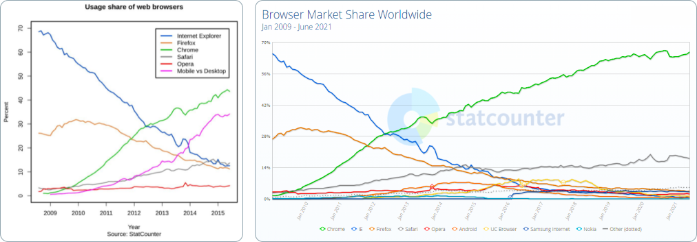
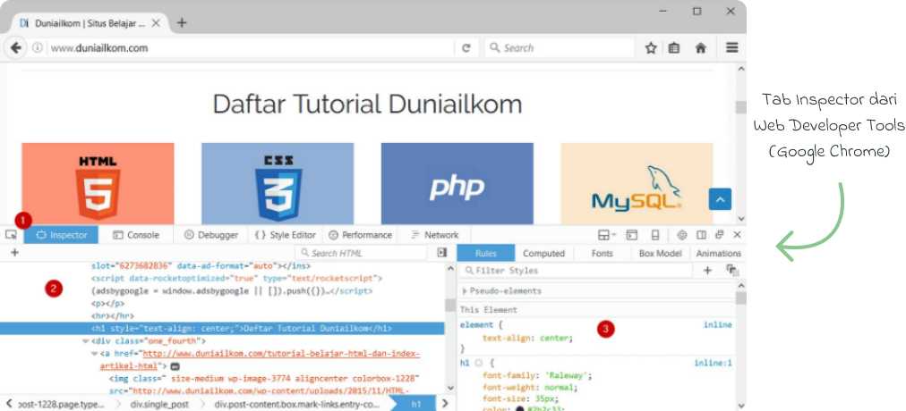
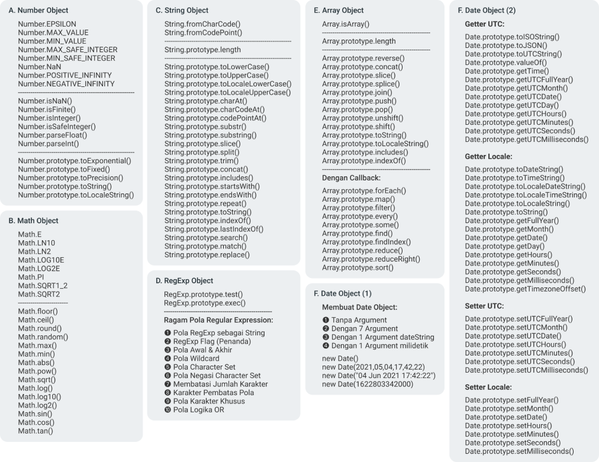
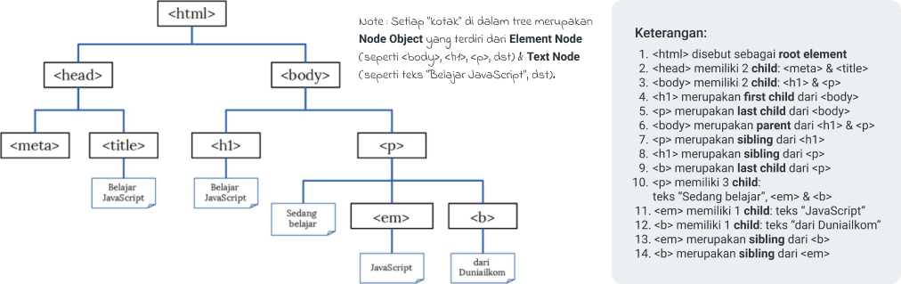
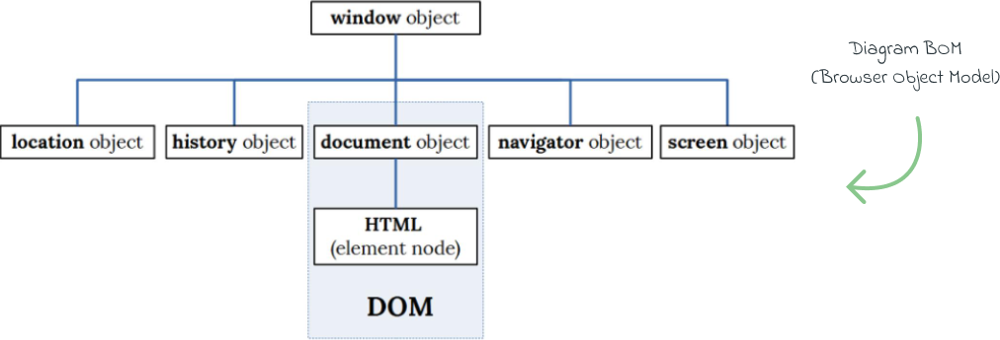
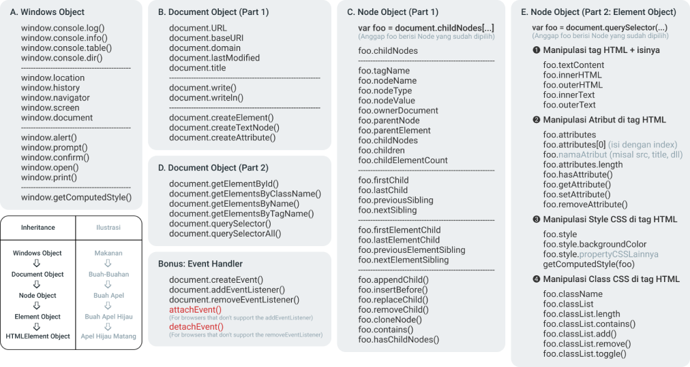

<!-- Variable -->
[✔]: assets/check-mark-1.png
<!-- End -->

<!-- 
⚠️Catatan Penting⚠️:
1. Tanda 🔴 artinya catatan tersebut belum dilengkapi, menyusul.
2. Keyword lihat../lihat di../point.. dinamis, harus diperbarui jika memang struktur tulisan berubah.
-->

<div id="top"></div>

# The Only JavaScript

Markdown ini ditulis oleh <a href="https://alamehan.github.io/">alamehan.github.io</a>. Jalur Belajar Web Developer akses di <a href="https://alamehan.github.io/road/webdev/">Right Tr4ck</a>. Materi utama di page ini diambil dari buku <a href="https://www.duniailkom.com/javascript-uncover-panduan-belajar-javascript-untuk-pemula/">JavaScript Uncover by Duniailkom.com</a>. Selebihnya merupakan materi pelengkap, gabungan dari beberapa website di bawah (lihat Footer).

## ① 𝒫𝑒𝓇𝓀𝑒𝓃𝒶𝓁𝒶𝓃 👋 <a href="#top">⟲</a>

<details>
<summary>Klik untuk membuka!</summary>

<div id="daftar_isi_bab1"></div>
<br>

| Bab 1                                            	    | Estimasi Baca 	|
|------------------------------------------------------	|---------------	|
| <a href="#bab1_1">1-1. Kenalan dengan JavaScript</a> 	| X Menit       	|
| <a href="#bab1_2">1-2. Sejarah & Perkembangan</a>    	| X Menit       	|
| <a href="#bab1_3">1-3. Menjalankan Kode</a>          	| X Menit       	|
| <a href="#bab1_4">1-4. Aturan Dasar</a>              	| X Menit       	|
| <a href="#bab1_5">1-5. Variable</a>                  	| X Menit       	|

<hr>
<div id="bab1_1"></div>

## `1-1. Kenalan dengan JavaScript` <a href="#daftar_isi_bab1">🡅</a>

JavaScript (JS) merupakan bagian dari 5 materi dasar web programming, yakni: HTML, CSS, PHP, MySQL dan JavaScript. Bersama-sama dengan HTML dan CSS, ketiganya berbagi peran masing-masing. HTML digunakan untuk membuat struktur dan isi dari halaman web (content). CSS untuk mempercantik tampilan website (design). Sedangkan JavaScript berfungsi menangani interaksi (behavior).**“HTML for content, CSS for presentation and JavaScript for behavior”**.

HTML, CSS dan JavaScript sama-sama termasuk ke dalam kelompok “client side programming language”, yakni bahasa pemrograman yang dijalankan di sisi client (web browser). PHP juga merupakan bahasa pemrograman web, tapi berada di dalam server, sehingga disebut sebagai “server side programming language”.

**Client Side Programming**: Ini artinya, untuk menjalankan JavaScript kita hanya butuh 2 aplikasi, yakni text editor dan web browser. Text editor digunakan membuat kode JavaScript, dan kode tersebut bisa langsung diakses dari web browser. Kita pun bisa melihat kode JavaScript yang digunakan dari sebuah website (sama seperti HTML dan CSS). Silahkan buka website apa saja, klik kanan lalu pilih View Page Source.

**Server Side Programming**: Untuk menjalankan kode program PHP kita harus menggunakan aplikasi seperti Apache web server (bagian dari XAMPP). Kita tidak bisa melihat kode PHP yang digunakan sebuah website secara langsung layaknya HTML, CSS dan JavaScript.

Perkembangan JavaScript yang sangat pesat akhir-akhir ini melahirkan banyak penerapan lain dari JavaScript. Sebagai contoh, **Node.js** adalah penggunaan JavaScript di sisi server. Dalam buku ini kita hanya fokus membahas penggunaan JavaScript di sisi client (di dalam web browser).

Apa yang akan kita pelajari dalam buku ini terdiri dari 2 kelompok besar: JavaScript dan **DOM (Document Object Model)**. JavaScript adalah bahasa pemrograman, sedangkan DOM merupakan Object HTML yang akan kita manipulasi, seperti teks, gambar, form, tombol, title bar web browser, event, dll. Bahasa pemrograman JavaScript dikembangkan oleh ECMA, sedangkan DOM dikembangkan oleh W3C (organisasi yang juga membuat standar HTML dan CSS). Bisa dibilang, JavaScript sepenuhnya terpisah dari HTML.

Setelah mempelajari JavaScript, barulah kita masuk ke DOM. Disinilah JavaScript digunakan untuk mengubah total tampilan halaman web. Jadi, jika anda merasa jenuh dengan pembahasan dari bab 1 hingga 3, tahan dulu! Paksakan untuk terus mempelajarinya. Dengan pemahaman JavaScript yang cukup, kita memiliki pondasi yang kuat untuk memanipulasi Object HTML yang nantinya diakses lewat DOM di bab 4.

<hr>
<div id="bab1_2"></div>

## `1-2. Sejarah & Perkembangan` <a href="#daftar_isi_bab1">🡅</a>

<br>

**Brendan Eich** membuat prototype bahasa baru dalam 10 hari. Pada Mei 1995, bahasa pemrograman “Mocha” lahir. Bahasa pemrograman inilah yang diputuskan untuk digunakan Netscape. Bahasa pemograman Mocha dirilis pertama kali ke dalam versi beta Netscape Navigator 2.0 di bulan September 1995, tetapi dengan menggunakan nama baru: LiveScript. Umur dari LiveScript ternyata tidak lama. 3 bulan kemudian, tepatnya Desember 1995, hadir Netscape Navigator 2.0 beta 3 dengan sebuah bahasa baru: JavaScript. Sebenarnya ini bukanlah bahasa pemrograman baru, tapi perubahan nama dari LiveScript. Nama JavaScript dipilih agar Netscape bisa ‘nompang tenar’ dari bahasa pemrograman JAVA milik Sun Microsystems, yang pada masa itu sangat populer di kalangan programmer.

“The first browser war” antara Internet Explorer buatan Microsoft vs Netscape Navigator buatan Netscape Communications.

**ECMAScript** adalah sebuah standar bahasa pemrograman komputer, dimana JavaScript merupakan salah satu implementasi dari ECMAScript. JavaScript tidak bisa dijadikan standar karena masalah merk “JAVA” yang merupakan trademark SUN Micosystem (sekarang sudah diakuisisi Oracle). Intinya: **Standarisasi JavaScript = ECMAScript**. EMCAScript digunakan hanya saat merujuk ke versi dari JavaScript.

Pengembangan ECMAScript 4 berhenti di tengah jalan, ini disebabkan perbedaan pendapat antar anggota **komite TC39**, terutama mengenai fitur apa yang harus ada di ECMAScript 4. Proses “perseteruan” berlangsung cukup lama, memakan waktu hingga 10 tahun (sampai dengan 2009). Selama jangka waktu tersebut, tidak ada versi baru dari ECMAScript.

Di pasar web browser, Internet Explorer menjadi sangat dominan, menguasai lebih dari 80% -90% market share dari tahun 2001 hingga 2009. Netscape Navigator bisa dibilang sudah punah pada tahun 2004. Web browser Opera hadir sebagai alternatif, tapi tidak bisa berbuat banyak.

**AJAX**, singkatan dari **(Asynchronous JavaScript and XML)**. AJAX memungkinkan sebuah halaman web berkomunikasi langsung dengan server tanpa harus di-reload. Komunikasi antara web browser dengan web server berlangsung di latar belakang (background) secara asynchronous, hasilnya website menjadi lebih dinamis. Sebagai contoh, halaman registrasi bisa langsung mengecek apakah username yang diinput sudah ada di database atau belum. Ini dapat dilakukan sesaat setelah user berpindah dari kolom input username ke kolom dibawahnya. Tanpa menggunakan AJAX, proses pengecekan baru berlangsung saat user selesai mengisi form dan men-klik tombol submit (karena pengecekan harus dilakukan ke database yang ada di server).

Selain AJAX, berkembang juga berbagai komunitas dan library JavaScript seperti Prototype, **jQuery**, Dojo Toolkit, dan MooTools. Masa-masa ini bisa dibilang awal kebangkitan JavaScript. Dengan menggunakan library seperti jQuery, perbedaan implementasi ECMAScript dari berbagai web browser bisa diatasi dengan mudah. jQuery menyediakan ‘abstraction layer’ agar web programmer bisa berfokus kepada fitur yang ingin dicapai. Programmer yang sebelumnya “anti” dengan JavaScript (karena susahnya mengatasi perbedaan fitur web browser), mulai melirik library seperti jQuery.

Setelah perang web browser pertama berakhir dengan kekalahan telak Netscape, perang kedua segera mulai dengan dirilisnya Mozilla Firefox (sebagai "Reingkarnasi Netscape"). Dengan cepat Firefox menjadi web browser favorit yang sepertinya akan segera menggusur IE. Puncaknya di tahun 2010 Firefox menguasai sekitar 30% pasar web browser, walaupun IE masih tetap dominan tapi setiap tahun mengalami tren penurunan. Tidak lama lagi sepertinya Firefox bisa menjadi web browser paling populer menggantikan IE. Namun harapan ini pupus karena muncul web browser baru dari raja mesin pencari: Google Chrome yang dirilis pada Desember 2008. Didukung dengan promosi gencar, nama besar Google, fitur menawan, dan eksekusi yang cepat, membuat Google Chrome segera menjadi web browser paling banyak digunakan hingga saat ini, mengalahkan IE, Firefox, dan Opera.

<br>

ECMAScript 6 atau ES6 atau ECMAScript 2015 dirilis pada bulan Juni 2015. Banyak penambahan baru pada versi ini, sebagian besar merupakan fitur lanjutan untuk membuat aplikasi yang kompleks, seperti penggunaan **JavaScript di server menggunakan Node.js**. Mulai dari ECMAScript 6 dan selanjutnya, penamaan ECMAScript akan menggunakan nama tahun saat standar tersebut dirilis, seperti ECMAScript 2015, ECMAScript 2016, dst. Banyak perdebatan mengenai pilihan nama ini, sehingga masih sering disebut sebagai ECMAScript 6 (ES6).

**JavaScript Engine** adalah mekanisme internal yang dimiliki oleh web browser untuk menjalankan kode JavaScript. JavaScript Engine dapat disamakan dengan compiler dalam bahasa pemograman lain, yakni algoritma yang digunakan untuk menjalankan JavaScript. Semakin cepat sebuah web browser menjalankan JavaScript akan semakin baik. **V8** adalah nama JavaScript Engine untuk Google Chrome, **SpiderMonkey** untuk Mozilla Firefox, dan **Chakra** untuk Internet Explorer.

Perkembangan JavaScript Saat Ini: Website yang tidak berbentuk “website”, tetapi menyerupai aplikasi desktop yang dikenal sebagai **Single-page Application (SPA)**. Contoh dari Single-page Application ini seperti aplikasi Google: Gmail, GDrive, Google Doc, dll. Di website tersebut, halamannya akan tetap sama, tidak di reload seperti layaknya sebuah website.

Namun perlu juga dipahami bahwa walaupun materi di eBook JavaScript Uncover sudah lumayan rumit, ini barulah dasar dari JavaScript. Jika anda serius ingin mempelajari JavaScript lebih jauh lagi, bisa lanjut ke library seperti **jQuery**, framework seperti **AngularJS**, **ReactJS** maupun **VueJS**, atau ke server menggunakan **Node.js**.

Timeline sejarah JavaScript dari awal lahir hingga saat ini secara ringkas dapat diakses di:
- <a href="https://en.wikipedia.org/wiki/ECMAScript">ECMAScript (Wikipedia)</a>
- <a href="https://www.jetbrains.com/lp/javascript-25/">25 years of JavaScript history (JetBrains)</a>
- <a href="https://turriate.com/articles/modern-javascript-everything-you-missed-over-10-years">Modern Javascript: Everything you missed over the last 10 years (Turriate)</a>
- <a href="https://www.freecodecamp.org/news/es5-to-esnext-heres-every-feature-added-to-javascript-since-2015-d0c255e13c6e/">ES5 to ESNext: Here’s every feature added to JavaScript since 2015 (FreeCodeCamp)</a>

<hr>
<div id="bab1_3"></div>

## `1-3. Menjalankan Kode` <a href="#daftar_isi_bab1">🡅</a>

> - [X] 𝐀. Inline JavaScript
> - [X] 𝐁. Internal JavaScript
> - [X] 𝐂. External JavaScript
> - [X] 𝐃. Posisi Terbaik JavaScript
> - [X] 𝐄. Helper Methods
> - [X] 𝐅. Tag No-Script

### ![✔] 𝐀. Inline JavaScript

```HTML
<html>
  <head>
    ...
  </head>
  <body>
    ...
    <button onclick="alert('Sedang Belajar JavaScript');"></button>
    ...
  </body>
</html>
```

### ![✔] 𝐁. Internal JavaScript

```HTML
<html>
  <head>
    ...
  </head>
  <body>
    ...
    <script>
      // Kode JavaScript Disini
    </script>
  </body>
</html>
```

### ![✔] 𝐂. External JavaScript

```HTML
<html>
  <head>
    ...
  </head>
  <body>
    ...
    <script src="script.js"></script>
  </body>
</html>
```

Menempatkan kode JavaScript di bagian atas banyak ditemukan. Namun berkaitan dengan masalah performa, beberapa developer web menyarankan meletakkan JavaScript dibagian bawah tag ```<body>```, yakni sebelum tag penutup ```</body>```, sebagaimana yang dijelaskan dari sebuah artikel di <a href="https://developer.yahoo.com/performance/rules.html">Yahoo Developer Network: Best Practices for Speeding Up Your Web Site</a>.

Cara web browser dalam menampilkan sebuah halaman web, yakni secara berurutan dari atas ke bawah, mulai dari baris pertama hingga baris terakhir. Fitur **cache** dari web browser bisa mempercepat pengaksesan website dengan cara menyimpan file JavaScript di dalam cache.

Dengan memanggil file external JavaScript dari bagian bawah tag ```<body>```, memberi kesempatan web browser untuk memproses kode HTML terlebih dahulu, baru kemudian mendownload file JavaScript. Efeknya, pengujung web bisa langsung melihat tampilan web selama proses ini, tidak hanya halaman kosong.

### ![✔] 𝐃. Posisi Terbaik JavaScript

```HTML
<html>
  <head>
    ...
    <!-- External JavaScript -->
    <script src="script-penting.js" async></script>
    <script src="script.js" defer></script>
  </head>
  <body>
    ...
    <script>
      // Internal JavaScript
    </script>
  </body>
</html>
```

Atribut **async** dan **defer**: kita bisa mengatur kapan dan bagaimana file external JavaScript diproses. Kedua atribut ini memungkinkan penulisan tag ```<script>``` tidak harus di bawah tag ```<body>```. Jika atribut **async** ditambahkan ke dalam tag ```<script>```, file JavaScript akan diproses pada saat yang bersamaan dengan kode HTML (secara simultan). Dengan kata lain, web browser tidak “terkunci” untuk menjalankan kode JavaScript. Metode ini juga dikenal dengan istilah **Asynchronous JavaScript** (Di proses secara bersamaan = Asynchronous).

Dengan tambahan atribut **async**, kode HTML tetap diproses sembari mendownload file JavaScript. Dengan kata lain, web browser tidak masuk ke dalam Render-Blocking JavaScript. Atribut **defer** digunakan untuk mengatur kapan file JavaScript dijalankan. Dengan atribut ini, file JavaScript baru di download dan dieksekusi setelah seluruh kode HTML selesai diproses. Efek dari atribut **async** dan **defer** mungkin terdengar sama. Perbedaaan mendasar adalah, **async** digunakan untuk mengatur cara eksekusi kode JavaScript, sedangkan **defer** untuk mengatur kapan file JavaScript tersebut di download dan diproses.

Tambahan atribut **async** dan **defer** dari HTML5 membawa perubahan terkait posisi terbaik peletakan kode JavaScript. Standar saat ini adalah menempatkan kode JavaScript di bagian ```<head>``` dengan tambahan atribut **async**. Alasannya, web browser bisa langsung mengeksekusi file JavaScript pada saat yang bersamaan dengan proses kode HTML, sehingga website dapat ditampilkan dengan lebih cepat (tidak mengalami Render-Blocking JavaScript). Untuk kode JavaScript yang tidak terlalu penting (dan bisa menunggu), tambahkan atribut **defer**. Sebagai tambahan, atribut **async** dan **defer** hanya berlaku untuk external JavaScript. Untuk internal JavaScript, atribut ini akan diabaikan dan posisi terbaik tetap di bagian bawah tag ```<body>```.

Berbeda dengan mayoritas bahasa pemrograman lain, secara default kita tidak bisa melihat pesan error dari JavaScript. Padahal ini sangat penting selama pembuatan kode program. Tidak ada yang lebih membuat pusing dari program yang tidak berjalan, namun tidak tahu salahnya dimana. Untuk menampilkan pesan error JavaScript, kita bisa menggunakan menu **Web developer tools** bawaan web browser. Setiap web browser modern memiliki tools seperti ini.

<br>

Tab Inspector (1) bisa digunakan untuk menelusuri seluruh kode HTML yang terdapat di dalam halaman web (2), di sisi kanan kita bisa melihat kode CSS yang digunakan oleh tag HTML tersebut (3). Jika anda sering mengedit kode CSS, tab Inspector ini sangat bermanfaat untuk melihat dan menjalankan (mengedit) kode CSS tanpa perlu mengubah file asli.

Tab yang sering kita akses selama membuat kode program JavaScript adalah **Tab Console**, yang berada di sebelah kanan tab Inspector. Apabila kode yang anda buat tidak berjalan sebagaimana mestinya, hal pertama yang harus dilakukan adalah memeriksa tab Console ini. Selain menampilkan pesan error, di dalam tab Console kita juga bisa menjalankan kode program JavaScript secara langsung, tanpa harus menulisnya di dalam file HTML. Fungsi ```console.log()``` berguna untuk menampilkan hasil kode program ke tab Console.

### ![✔] 𝐄. Helper Methods

Terdapat 3 method bawaan JavaScript yang digunakan untuk membantu proses belajar dan debugging yaitu:

```Javascript
document.write("hello world");
alert("hello world");
console.log("hello world");
```

Dari ketiga methods tersebut, ```console.log()``` lah yang lebih banyak dan lebih disarankan untuk digunakan, beberapa kelebihannya yaitu informasi yang ditampilkan lebih lengkap, bisa menampilkan tipe data Object, serta bisa menulis perintah secara langsung di console.

### ![✔] 𝐅. Tag No-Script

```HTML
<html>
  <head>
    ...
  </head>
  <body>
    ...
    <script>
      alert("JavaScript aktif");
    </script>
    <noscript>
      JavaScript anda tidak aktif, mohon diaktifkan untuk bisa mengakses web ini.
    </noscript>
  </body>
</html>
```

Salah satu kelemahan (sekaligus keunggulan) dari JavaScript adalah, pengunjung web bisa mematikan JavaScript yang ada di web browser mereka. Tag ```<noscript>``` bisa digunakan untuk menampilkan teks keterangan yang hanya bisa terlihat pada web browser yang tidak memiliki JavaScript (atau JavaScriptnya dimatikan).

<hr>
<div id="bab1_4"></div>

## `1-4. Aturan Dasar` <a href="#daftar_isi_bab1">🡅</a>

> - [X] 𝐀. Statement
> - [X] 𝐁. Case Sensitive
> - [X] 𝐂. Whitespace
> - [X] 𝐃. Indenting
> - [X] 𝐄. Comment

### ![✔] 𝐀. Statement

**Statement** adalah sebutan untuk sebuah baris perintah JavaScript. Walaupun saya menggunakan kata “baris”, bisa saja sebuah Statement butuh beberapa baris (seperti Function). Atau dalam 1 baris bisa terdiri dari beberapa Statement. Setiap Statement diakhiri dengan tanda titik koma (semi colon): ```;```. Sebenarnya, tanda titik koma untuk mengakhiri Statement JavaScript ini adalah opsional. Artinya, boleh tidak ditulis sepanjang Statement tersebut harus berada dalam baris baru (1 Statement, 1 baris). Untuk meminimalisir error, sebaiknya kita tetap menambahkan tanda titik koma saat mengakhiri setiap Statement di dalam JavaScript.

### ![✔] 𝐁. Case Sensitive

**Case Sensitivity**: JavaScript termasuk bahasa pemrograman yang bersifat case sensitif, artinya huruf besar dan huruf kecil dianggap berbeda. Salah menulis huruf sangat sering terjadi, misalnya pada saat pendefinisian Variable (```var nama``` berbeda dengan ```var Nama```).

### ![✔] 𝐂. Whitespace

**Whitespace** mengacu pada karakter yang digunakan untuk memberikan ruang horizontal atau vertikal antara karakter lain, atau dengan kata lain karakter “kosong” seperti spasi, tab, atau baris baru (new line). Secara umum di dalam JavaScript whitespace akan diabaikan.

### ![✔] 𝐃. Indenting

**Indenting** adalah istilah yang digunakan untuk menambahkan spasi atau tab diawal baris kode program. Tujuannya agar kode program lebih mudah dibaca terutama jika kode program tersebut sudah mencapai puluhan atau ratusan baris kode program.

### ![✔] 𝐄. Comment

**Comment** atau baris komentar adalah sebutan untuk kode program yang tidak akan di eksekusi oleh JavaScript. Selain sebagai dokumentasi, komentar juga sering digunakan untuk menghentikan sementara baris kode program. Di JavaScript, Comment ditulis menggunakan karakter ```// komentar``` (untuk single line) & ```/* komentar */``` (untuk multi line). Di sepanjang contoh kode yang disertakan di bab-bab selanjutnya, penggunaan Comment akan banyak sekali ditemukan sebagai keterangan/penjelasan dari baris sebuah kode.

<hr>
<div id="bab1_5"></div>

## `1-5. Variable` <a href="#daftar_isi_bab1">🡅</a>

Secara sederhana, Variable adalah “wadah/penampung” dari sebuah data. Disebut Variable karena data yang kita simpan bisa berubah-ubah sepanjang kode program (isinya tidak tetap). ```var angka = 192;``` **Operasi Assignment** atau memberikan nilai ke sebuah Variable dibaca dari kanan ke kiri (right-to-left, baca selengkapnya di <a href="https://developer.mozilla.org/en-US/docs/Web/JavaScript/Reference/Operators/Operator_Precedence">MDN: Operator Precedence</a>). Artinya, 192 “dimasukkan” sebagai nilai ke Variable ```angka```.

JavaScript termasuk ke dalam bahasa pemrograman **Typeless Programming Language**, yakni kelompok bahasa pemrograman yang Variablenya bisa diisi dengan tipe data apa saja tanpa harus dideklarasikan terlebih dahulu.

Apabila anda sering mengikuti tutorial programming, nama Variable **foo**, **bar**, dan **baz** sering digunakan. Ketiganya dikenal sebagai **dummy Variable**, yakni Variable yang fungsinya hanya sebagai contoh. Mirip seperti teks “Lorem Ipsum dolor sit amet” dalam bidang design.

Kita bisa memberi nama apa saja untuk Variable, apakah itu ```angka```, ```foo```, ```bar```, ```andi```, atau ```username```. Selain Variable (var), kita juga bebas untuk membuat nama Konstanta (c), Function, Object muapun Class. Semua inilah yang termasuk ke dalam kelompok **Identifier**. Identifier di dalam JavaScript memiliki aturan sebagai berikut:
   - Bersifat case sensitive, dimana huruf besar dan kecil dianggap berbeda.
   - Bisa terdiri dari huruf, angka, underscore “_”, dan tanda dollar “$“. Selain itu, dianggap sebagai karakter ilegal.
   - Karakter pertama dari Identifier tidak boleh berupa angka. Angka hanya bisa digunakan sebagai karakter kedua dan seterusnya.
   - Harus selain dari **reserved keyword**, yakni kata khusus yang berfungsi sebagai perintah di dalam JavaScript, seperti ```var```, ```while```, dll.

Di CSS kita menggunakan cara penulisan selector yang dipisah dengan tanda “ - ”, seperti ```main-box```, ```left-sidebar```, dan ```single-post```. Di PHP kita mengenal **Snake Case**, yakni menggunakan huruf kecil dan tanda underscore sebagai pemisah Variable, seperti ```jumlah_barang```, ```nama_dosen```, dan ```alamat_siswa```. Di JavaScript menggunakan **CamelCase**. CamelCase adalah cara penulisan Variable dimana jika sebuah Variable terdiri dari beberapa kata, huruf pertama dari kata kedua dan seterusnya diubah menjadi huruf besar, seperti: ```banyakAnggota```, ```totalBiaya```, ```mainBox```, atau ```jumlahKlikSatuHari```. Jika Variable tersebut hanya terdiri dari 1 kata, ditulis dengan huruf kecil semua.

**Strict Mode** memaksa JavaScript menampilkan error (di Tab Console) pada kode program yang seharusnya bisa berjalan “normal”. Tujuannya, meminimalisir kemungkinan bug karena penulisan yang salah, typo, dan berbagai hal lain. Strict mode sepenuhnya opsional dan mungkin tidak bisa selalu anda gunakan, terutama jika terdapat kode JavaScript pendahulu yang terlalu rumit untuk diubah semuanya. Strict Mode akan membuat web browser menampilkan error dimana sebelumnya hanya ada **“silent error”**. Salah satunya ketika membuat Variable tanpa perintah ```var```. Untuk masuk ke dalam Strict Mode, tambahkan String ```"use strict";``` di baris pertama kode JavaScript atau di baris paling awal dari sebuah Function (jika ingin menerapkanya hanya pada sebuah Function tertentu).

EcmaScript 6 membawa fitur baru ke dalam JavaScript, yakni menggunakan perintah ```let``` untuk membuat Variable (sebagai alternatif dari ```var```). Perbedaan mendasar dari ```var``` dan ```let``` adalah terkait dengan **Variable scope**, yakni di bagian mana sebuah Variable masih bisa diakses. Penjelasan mengenai Variable scope akan dibahas pada bab tentang Function. Selain let, ada juga Konstanta (```const```) yaitu Variable yang nilainya tidak bisa diubah sepanjang kode program. Setelah Konstanta ditulis dan diberi nilai awal, isi Konstanta tersebut tidak bisa diubah.

Format penulisan: var/let diawali huruf kecil (```total```, ```totalBiaya```, dst), const huruf besar semua (```PI```, ```RUMUS_A```, dst), dan Class diawali huruf besar (```Mobil```, ```MobilBaru```, dst). **Class dibahas di bab 11**. Tujuan dari format penulisan ini yaitu agar programmer dapat dengan mudah membedakan mana Variable, Konstanta maupun Class.

Terdapat istilah **Identifier** dan **Literal**, pada contoh di bawah ini: var ```harga```, let ```namaLengkap```, dan const ```NILAI_PI``` adalah Identifier. Sedangkan ```12000```, ```"Rudi Siswoyo"```, dan ```3.14``` adalah Literal.

```HTML
<html>
  <head>
    ...
  </head>
  <body>
    ...
    <script>
      "use strict";

      var harga = 12000;
      let namaLengkap = "Rudi Siswoyo";
      const NILAI_PI = 3.14;

      ...
    </script>
  </body>
</html>
```

</details>

## ② 𝒦𝑜𝓃𝓈𝑒𝓅 𝒟𝒶𝓈𝒶𝓇 👨‍💻 <a href="#top">⟲</a>

<details>
<summary>Klik untuk membuka!</summary>

<div id="daftar_isi_bab2"></div>
<br>

| Bab 2                                 	    | Estimasi Baca 	|
|--------------------------------------------	|---------------	|
| <a href="#bab2_1">2-1. Tipe Data</a><br>   	| X Menit       	|
| <a href="#bab2_2">2-2. Operator</a>        	| X Menit       	|
| <a href="#bab2_3">2-3. Struktur Logika</a> 	| X Menit       	|
| <a href="#bab2_4">2-4. Perulangan</a>      	| X Menit       	|
| <a href="#bab2_5">2-5. Function</a>        	| X Menit       	|
| <a href="#bab2_6">2-6. Object</a>          	| X Menit       	|

<hr>
<div id="bab2_1"></div>

## `2-1. Tipe Data` <a href="#daftar_isi_bab2">🡅</a>

> 𝐓𝐢𝐩𝐞 𝐃𝐚𝐭𝐚 𝐏𝐫𝐢𝐦𝐢𝐭𝐢𝐟
> > - [X] 𝐀. Number
> > - [X] 𝐁. NaN & Infinity
> > - [X] 𝐂. String
> > - [X] 𝐃. Boolean
> > - [X] 𝐄. Null & Undefined
> > - [ ] 𝐅. Symbol

> 𝐓𝐢𝐩𝐞 𝐃𝐚𝐭𝐚 𝐎𝐛𝐣𝐞𝐜𝐭
> > - [X] 𝐆. Array
> > - [X] 𝐇. Object, RegExp & Date
> > - [ ] 𝐈. Map & WeakMap
> > - [ ] 𝐉. Set & WeakSet

Secara garis besar, tipe data dalam JavaScript terdiri dari 2 kelompok, yakni tipe data primitif, dan tipe data Object. Tipe data primitif disebut demikian karena tipe data ini “sederhana” dan hanya terdiri dari 1 nilai. Yang termasuk ke dalam **tipe data primitif**, yaitu: **Number, NaN, Infinity, String, Boolean, Null, Undefined, dan Symbol**. Sedangkan tipe data Object, bisa disebut sebagai tipe data “khusus” yang prilaku dan isinya beragam. Adapun yang termasuk ke dalam **tipe data Object**, yaitu: **Array, Object, RegExp, Date, Map, WeakMap, Set, dan WeakSet.**

### ![✔] 𝐀. Number

```Javascript
var numA = 100;                       // Angka bulat
var numB = -100;                      // Angka bulat negatif
var numC = 0.66634;                   // Angka pecahan
var numD = -0.66634;                  // Angka pecahan negatif
var numE = 3e3;                       // ≈ 3 x 10^3
var numF = 0.4e-3;                    // ≈ 0.4 x 10^-3
var numG = 999;                       // Desimal (basis 10)
var numH = 0b1111100111;              // Biner (basis 2), diawali 0b
var numI = 0o1747;                    // Oktal (basis 8), diawali 0o
var numJ = 0x3E7;                     // Heksadesimal (basis 16), diawali 0x
```

### ![✔] 𝐁. NaN & Infinity

```Javascript
var numK = NaN;                       // Keadaan dimana data "bukan angka yang sah/legal"
var numL = Infinity;                  // Keadaan dimana data "angka tak hingga"
var numM = -Infinity;                 // Keadaan dimana data "angka negatif tak hingga"
```

#### ⤷ Kasus yang menghasilkan NaN & Infinity:

```Javascript
var numN = 9/"a";                     // Membagi angka dengan bukan angka menghasilkan NaN
console.log(numK);                    // Output: NaN (Not a Number)

var numO = 9/0;                       // Membagi angka dengan nol menghasilkan Infinity
console.log(numL);                    // Output: Infinity (Tak Hingga)

var numP = -9/0;                      // Membagi angka negatif dengan nol menghasilkan -Infinity
console.log(numP);                    // Output: -Infinity (Negatif Tak Hingga)
```

### ![✔] 𝐂. String

```Javascript
var strA = "Hello World!";            // String dengan kutip dua
var strB = 'Hello World!';            // String dengan kutip satu
var strC = "Hari Jum'at";             // Kutip satu di dalam kutip dua
var strD = 'Dia berkata: "Hey"';      // Kutip dua di dalam kutip satu
var strE = "Dia berkata: \"Hey\"";    // Kutip dua di dalam kutip dua, pakai escape character (\)
var strF = 'Hari Jum\'at';            // Kutip satu di dalam kutip satu, pakai escape character (\)
var strG = "\u2764 You!"              // Contoh pemakaian Unicode ⇨ Hasilnya: ❤ You!

var strH = `Hello World!`;            // String dengan backtick `` (Template String ES6)
var strI = `"Hei!", Jum'at today.`;   // Kutip satu & dua di dalam backtick
var strJ = `\u2764 You!`;             // Contoh pemakaian Unicode ⇨ Hasilnya: ❤ You!
```

| Escape Characters 	| Kegunaan                                                       	|
|-------------------	|----------------------------------------------------------------	|
| ```\0```            | Karakter NUL                                                   	|
| ```\b```            | Backspace                                                      	|
| ```\t```            | Horizontal tab                                                 	|
| ```\n```            | Newline                                                        	|
| ```\v```            | Vertical tab                                                   	|
| ```\f```            | Form feed                                                      	|
| ```\r```            | Carriage return                                                	|
| ```\"```            | Tanda kutip dua (double quote)                                 	|
| ```\'```            | Tanda kutip satu (apostrophe atau single quote)                	|
| ```\\```            | Garis miring (backslash)                                       	|
| ```\xXX```          | Karakter Latin-1 dengan menggunakan dua digit heksa desimal XX 	|
| ```\uXXXX```        | Karakter Unicode dengan menggunakan empat digit heksa XXXX     	|
| 📚 Bonus            | Daftar Karakter Latin-1 & Unicode: http://unicode-table.com/   	|

### ![✔] 𝐃. Boolean

```Javascript
var bolA = true;                      // Bernilai true, biasanya di pakai di Struktur Logika, Perulangan, dll
var bolB = false;                     // Bernilai false, biasanya di pakai di Struktur Logika, Perulangan, dll
```

### ![✔] 𝐄. Null & Undefined

```Javascript
var nudA = null;                      // Keadaan dimana data "kosong", biasanya sengaja diinput oleh programmer
var nudB = undefined;                 // Keadaan dimana data "tidak terdefinisi", biasanya terjadi karena error
```

Null biasanya sengaja didefinisikan oleh programmer untuk tujuan tertentu. Undefined artinya JavaScript tidak dapat menemukan nilainya, namun sebenarnya "slot"nya sudah ada di memory. 🔔 Hal ini terkait dengan JavaScript Hoisting yang dibahas di bab 2-5 J.

#### ⤷ Kasus unik:

```Javascript
console.log(20 + null);               // Output: 20     (null jadi 0, maka 20+0 = 20)
console.log(20 + undefined);          // Output: NaN    (Not a Number)
```

Null menjadi sesuatu yang kita tetapkan sebagai nilai, dalam kasus di atas Null menjadi Number. Sedangkan Undefined ditetapkan oleh JavaScript itu sendiri, dalam kasus di atas penjumlahan Number dengan Undefined menghasilkan NaN.

#### ⤷ Kasus yang menghasilkan Undefined:

```Javascript
var und1;                             // var yang dibuat tanpa langsung diisi nilai menjadi Undefined
console.log(und1);                    // Output: undefined

var und2 = [1, 2, 3];                 // Mengakses Array di luar indeks yang dibuat menghasilkan Undefined
console.log(und2[3]);                 // Output: undefined

var und3 = {nama: "iyan", umur: 24};  // Mengakses Object di luar key yang dibuat menghasilkan Undefined
console.log(und3["alamat"]);          // Output: undefined
```

### ![✔] 𝐅. Symbol

> 🚧 Tidak dibahas (mungkin saja nanti akan ditambahkan)

### ![✔] 𝐆. Array

```Javascript
var arrSiswa = ["Andri", "Joko", "Sukma"];      // Array 1D berisi hanya data String
var arrAcak  = [1, 2.0, "tiga", true, null];    // Array 1D berisi beragam tipe data
var arr2D    = [[2,5], [9,5]];                  // Array 2D, misalnya untuk koordinat

console.log(arrSiswa);                // Output: ["Andri", "Joko", "Sukma"]
console.log(arrSiswa[0]);             // Output: Andri                        ⇨ ⚠️ Array di JavaScript dimulai dari indeks ke 0,
console.log(arrSiswa[1]);             // Output: Joko                            bukan dari indeks ke 1, ingat baik-baik ya.
console.log(arrSiswa[2]);             // Output: Sukma

console.log(arr2D);                   // Output: [[2,5],[9,5]]
console.log(arr2D[0]);                // Output: [2,5]
console.log(arr2D[1]);                // Output: [9,5]
console.log(arr2D[0][0]);             // Output: 2
console.log(arr2D[0][1]);             // Output: 5
console.log(arr2D[1][0]);             // Output: 9
console.log(arr2D[1][1]);             // Output: 5
```

### ![✔] 𝐇. Object, RegExp & Date

> 🔔 Object dibahas di bab 2-6 & bab 3
>
> 🔔 RegExp dibahas di bab 3-2 D
>
> 🔔 Date dibahas di bab 3-2 F

### ![✔] 𝐈. Map & WeakMap

> 🚧 Tidak dibahas (mungkin saja nanti akan ditambahkan)

### ![✔] 𝐉. Set & WeakSet

> 🚧 Tidak dibahas (mungkin saja nanti akan ditambahkan)

<hr>
<div id="bab2_2"></div>

## `2-2. Operator` <a href="#daftar_isi_bab2">🡅</a>

> 𝐏𝐞𝐧𝐭𝐢𝐧𝐠 𝐔𝐧𝐭𝐮𝐤 𝐃𝐢𝐤𝐞𝐭𝐚𝐡𝐮𝐢
> > - [X] 𝐀. Operator Precedence
> > - [X] 𝐁. Falsy & Truthy Value

> 𝐎𝐩𝐞𝐫𝐚𝐭𝐨𝐫 𝐝𝐢 𝐉𝐚𝐯𝐚𝐒𝐜𝐫𝐢𝐩𝐭
> > - [X] 𝐂. Operator typeof
> > - [X] 𝐃. Operator instanceof
> > - [X] 𝐄. Operator Aritmatika
> > - [X] 𝐅. Operator Assignment
> > - [X] 𝐆. Operator Increment & Decrement
> > - [X] 𝐇. Operator Perbandingan
> > - [X] 𝐈. Operator Logika
> > - [X] 𝐉. Operator String
> > - [ ] 𝐊. Operator Bitwise
> > - [X] 𝐋. Operator Spread

### ![✔] 𝐀. Operator Precedence

Operator Precedence atau Prioritas Operator menentukan bagaimana suatu operator dieksekusi. Operator dengan prioritas lebih tinggi akan dioperasikan terlebih dahulu. Ada operator yang dioperasikan dari kiri ke kanan (left-to-right), ada pula yang dari kanan ke kiri (right-to-left).

📚 Tabel Operator Precedence lengkap beserta Associativity-nya dapat diakses di <a href="https://developer.mozilla.org/en-US/docs/Web/JavaScript/Reference/Operators/Operator_Precedence">MDN: Operator Precedence</a>.


### ![✔] 𝐁. Falsy & Truthy Value

Di JavaScript sebuah tipe data akan berubah menjadi tipe data lain tergantung operator yang digunakan. Untuk operator perbandingan (==, !=, <, <=, >, >=, dst), tipe data ini akan dikonversi menjadi Boolean (true/false). Nilai yang dikonversi menjadi false disebut Falsy Value, dan nilai yang dikonversi menjadi true disebut Truthy Value. Simak tabel Falsy & Truthy Value berikut:

| Falsy Value 	| Keterangan      	|   	| Truthy Value 	| Keterangan                                                 	|
|-------------	|-----------------	|---	|--------------	|------------------------------------------------------------	|
| false       	| Nilai false     	|   	| true         	| Nilai true                                                 	|
| null        	| Nilai null      	|   	| {}           	| Object kosong                                              	|
| undefined   	| Nilai undefined 	|   	| []           	| Array kosong                                               	|
| 0           	| Angka nol       	|   	| 42           	| Sembarang angka (termasuk pecahan dan negatif), selain nol 	|
| NaN         	| Nilai NaN       	|   	| "foo"        	| Sembarang string, selama bukan string kosong               	|
| ''          	| String kosong   	|   	| infinity     	| Nilai infinity                                             	|
| ""          	| String kosong   	|   	| -infinity    	| Nilai -infinity                                            	|

#### ⤷ Kasus Falsy & Truthy Value:

```Javascript
console.log('' == '0');               // Output: false  (Hasil konversi: false == true)
console.log(0 == '');                 // Output: true   (Hasil konversi: false == false)
console.log(0 == '0');                // Output: true   (Bukan operator indentik, jadinya true)
console.log(false == 'false');        // Output: false  (Hasil konversi: false == true)
console.log(false == '0');            // Output: true   (Bukan operator indentik & false kan bernilai 0, jadinya true)
console.log(false == undefined);      // Output: false  (*Pengecualian)
console.log(false == null);           // Output: false  (*Pengecualian)
console.log(null == undefined);       // Output: true   (Hasil konversi: false == false)
console.log('\t\r\n' == 0);           // Output: true   (*Pengecualian)
```

📚 Tabel perbandingan "unik" dapat diakses di <a href="https://developer.mozilla.org/en-US/docs/Web/JavaScript/Equality_comparisons_and_sameness">MDN: Equality Comparions and Sameness</a>.

```Javascript
var text = "Hello World!";

if (text) {
 console.log("text berupa Truthy");   // Output: "text berupa Truthy
} else {
 console.log("text berupa Falsy");
}
```

🔔 If & Else dibahas di bab 2-3 A

### ![✔] 𝐂. Operator typeof

#### ⤷ Oprator typeof digunakan untuk memeriksa tipe data suatu Variable:

```Javascript
var numA = 100;
var strA = "Hello World!";
var bolA = true;
var nudA = null;
var nudB = undefined;
var arrSiswa = ["Andri", "Joko", "Sukma"];
var funA = function(){ return "Hello World!" };

console.log(typeof numA);                 // Output: number
console.log(typeof strA);                 // Output: string
console.log(typeof bolA);                 // Output: boolean
console.log(typeof nudA);                 // Output: object (bukan Null)
console.log(typeof nudB);                 // Output: undefined
console.log(typeof arrSiswa);             // Output: object (Array termasuk Object)
console.log(typeof funA);                 // Output: function
```

Jika kita menggunakan ```typeof``` untuk tipe data ```null```, misalnya perintah ```console.log(typeof null);``` maka hasilnya yaitu ```object```. Padahal Null itu bukan Object, ini merupakan sebuah bug JavaScript dari semenjak pertama ia dibuat.

#### ⤷ Tidak hanya typeof, terdapat beragam cara untuk memeriksa tipe data:

```Javascript
var num = 10;                             // Tipe data: Number
var nan = 9/"a";                          // Tipe data: NaN
var inf = 9/0;                            // Tipe data: Infinity
var str = "JavaScript";                   // Tipe data: String
var bol = true;                           // Tipe data: Boolean
var nul = null;                           // Tipe data: Null
var und = undefined;                      // Tipe data: Undefined
var arr = [1, 2, "tiga"];                 // Tipe data: Array
var obj = {nama: "Budi", umur: 13};       // Tipe data: Object      // 🔔 Object dibahas di bab 2-6 & bab 3
var reg = /^\d\w\s$/;                     // Tipe data: RegExp      // 🔔 RegExp dibahas di bab 3-2 D
var dat = new Date(2016,11,2,9,30,15);    // Tipe data: Date        // 🔔 Date dibahas di bab 3-2 F
var fun = function(){ return "Hello!" };  // Function Expressions   // 🔔 Function dibahas di bab 2-5

console.log(typeof num === "number");     // Output: true   (Check apakah datanya Number)
console.log(Number.isNaN(nan));           // Output: true   (Check apakah datanya NaN)
console.log(inf === Infinity);            // Output: true   (Check apakah datanya Infinity)
console.log(typeof str === "string");     // Output: true   (Check apakah datanya String)
console.log(typeof bol === "boolean");    // Output: true   (Check apakah datanya Boolean)
console.log(nul === null);                // Output: true   (Check apakah datanya Null)
console.log(und === undefined);           // Output: true   (Check apakah datanya Undefined)
console.log(Array.isArray(arr));          // Output: true   (Check apakah datanya Array - cara 1)
console.log(arr instanceof Array);        // Output: true   (Check apakah datanya Array - cara 2)
console.log(arr.constructor === Array);   // Output: true   (Check apakah datanya Array - cara 3)
console.log(typeof obj === "object");     // Output: true   (Check apakah datanya Object - cara 1)
console.log(obj instanceof Object);       // Output: true   (Check apakah datanya Object - cara 2)
console.log(obj.constructor === Object);  // Output: true   (Check apakah datanya Object - cara 3)
console.log(reg instanceof RegExp);       // Output: true   (Check apakah datanya RegExp - cara 1)
console.log(reg.constructor === RegExp);  // Output: true   (Check apakah datanya RegExp - cara 2)
console.log(dat instanceof Date);         // Output: true   (Check apakah datanya Date - cara 1)
console.log(dat.constructor === Date);    // Output: true   (Check apakah datanya Date - cara 2)
console.log(typeof fun === "function");   // Output: true   (Check apakah datanya Function Expressions - cara 1)
console.log(fun instanceof Function);     // Output: true   (Check apakah datanya Function Expressions - cara 2)
console.log(fun.constructor === Function);// Output: true   (Check apakah datanya Function Expressions - cara 3)
```

### ![✔] 𝐃. Operator instanceof

>  🔔 Operator instanceof dibahas di bab 3-1 B

### ![✔] 𝐄. Operator Aritmatika

```Javascript
var a = 10;
var b = 2;

console.log(a + b);                   // Output: 12     ⇨ Addition (tambah)
console.log(a - b);                   // Output: 8      ⇨ Substraction (kurang)
console.log(a * b);                   // Output: 20     ⇨ Multiplication (kali)
console.log(a / b);                   // Output: 5      ⇨ Division (bagi)
console.log(a % b);                   // Output: 0      ⇨ Modulo (sisa bagi)
console.log(a ** b);                  // Output: 100    ⇨ Exponentiation (pangkat)

console.log(4+6/5-3*2+3);             // Output: 2.2    ⇨ Operator * dan / diproses lebih awal (Precedence: 15)
console.log((4+6)/(5-3)*2+3);         // Output: 13     ⇨ Operator () diproses lebih awal (Precedence: 21)
```

### ![✔] 𝐅. Operator Assignment

```Javascript
var g = 10;         // Artinya 10 dimasukkan sebagai nilai ke Variable g (Operator assignment memiliki precedence: 3)
var h = 10 + 5;     // Artinya jumlahkan 10 + 5 dulu (Operator "+" memiliki precedence: 14), lalu masukkan hasilnya ke Variable h
var i = g + h;      // Artinya jumlahkan g + h dulu (Operator "+" memiliki precedence: 14), lalu masukkan hasilnya ke Variable i

console.log(g);     // Output: 10
console.log(h);     // Output: 15
console.log(i);     // Output: 25
```

#### ⤷ Gabungan Assignment:

```Javascript
var gabA = gabB = gabC = gabD = gabE = 20;

gabA += 10;                           // gabA = gabA + 10 🡲 gabA = 20 + 10
gabB -= 10;                           // gabB = gabB - 10 🡲 gabB = 20 - 10
gabC /= 10;                           // gabC = gabC / 10 🡲 gabC = 20 / 10
gabD *= 10;                           // gabD = gabD * 10 🡲 gabD = 20 * 10
gabE %= 10;                           // gabE = gabE % 10 🡲 gabE = 20 % 10

console.log(gabA);                    // Output: 30
console.log(gabB);                    // Output: 10
console.log(gabC);                    // Output: 2
console.log(gabD);                    // Output: 200
console.log(gabE);                    // Output: 0
```

### ![✔] 𝐆. Operator Increment & Decrement

```Javascript
var c = 10, d = 10, e = 10, f = 10;

console.log(++c);                     // Output: 11     ⇨ Pre-increment: langsung tambahkan
console.log(c);                       // Output: 11
console.log(--d);                     // Output: 9      ⇨ Pre-decrement: langsung kurangi
console.log(d);                       // Output: 9

console.log(e++);                     // Output: 10     ⇨ Post-increment: tampilkan dulu, baru tambahkan
console.log(e);                       // Output: 11
console.log(f--);                     // Output: 10     ⇨ Post-decrement: tampilkan dulu, baru kurangi
console.log(f);                       // Output: 9
```

### ![✔] 𝐇. Operator Perbandingan

```Javascript
console.log(8 == 12);                 // Output: false  ⇨ Equality (sama dengan)
console.log(8 != 12);                 // Output: true   ⇨ Inquality (tidak sama dengan)
console.log(10 < 11);                 // Output: true   ⇨ Less than (kurang dari)
console.log(11 <= 11);                // Output: true   ⇨ Less than or equal (kurang dari atau sama dengan)
console.log(21 > 20);                 // Output: true   ⇨ Greater than (lebih dari)
console.log(21 >= 21);                // Output: true   ⇨ Greater than or equal (lebih dari atau sama dengan)

console.log(9 == "9");                // Output: true
console.log(9 === "9");               // Output: false  ⇨ Strict equality (identik dengan)
console.log(9 != '9');                // Output: false
console.log(9 !== '9');               // Output: true   ⇨ Strict inequality (tidak identik dengan)
```

#### ⤷ Kasus Perbadingan Unik:

```Javascript
console.log(1 == true);               // Output: true
console.log(1 === true);              // Output: false
console.log(0 == false);              // Output: true
console.log(0 === false);             // Output: false
console.log(0.3 == 3e-1);             // Output: true
console.log(0.3 === 3e-1);            // Output: true   (Karena memang nilainya sama)
console.log(true > false)             // Output: true   (Ingat: true = 1, false = 0)
```

#### ⤷ Kasus Perbandingan String:

📚 Setiap karakter dalam String menggunakan nomor urut desimal di <a href="https://www.ascii-code.com/">ASCII-Code</a>.

```Javascript
console.log("a" < "b");               // Output: true   (a = 97, b = 98)
console.log("a" < "A");               // Output: false  (a = 97, A = 65)
console.log("ali" < "ala");           // Output: false  (ali = 97→108→105, ala = 97→108→97)
console.log("ali" < "alo");           // Output: true   (ali = 97→108→105, alo = 97→108→111)
console.log("ali" < "alika");         // Output: true   (String yang lebih pendek akan dianggap lebih kecil)
console.log("ali" < 9999999);         // Output: false  (Perbandingan String & Number selalu menghasilkan false)
```

### ![✔] 𝐈. Operator Logika

```Javascript
console.log(true && false);           // Output: false  ⇨ and operator (true hanya jika kedua nilai true)
console.log(true || false);           // Output: true   ⇨ or operator (true jika salah satu nilai true)
console.log(!false);                  // Output: true   ⇨ not operator (negasi/kebalikannya)
console.log(true || true && false);   // Output: true   ⇨ Operator && diproses lebih awal (precedence: 7)
```

#### ⤷ Short-Circuit-Evaluation:

Operasi logika menggunakan prinsip short-circuit-evaluation, maksudnya jika dengan memeriksa 1 nilai saja hasil operasi tersebut sudah diketahui, nilai-nilai lain tidak akan diperiksa, kecuali jika terdapat operator && dan || dalam 1 operasi, maka operator && akan dijalankan terlebih dahulu (karena nilai precedence && lebih tinggi daripada ||).

```Javascript
console.log(true || false || true);   // Kiri ke kanan: true bertemu operator ||, stop, sudah pasti hasilnya true
console.log(false && true && true);   // Kiri ke kanan: false bertemu operator &&, stop, sudah pasti hasilnya false
console.log(true || true && false);   // Operator && duluan, menjadi: true || false, hasilnya true

console.log(true && alert("HYA!"));   // Function alert() berjalan, karena true bertemu &&, lanjut ke alert()
console.log(false && alert("HYA!"));  // Function alert() tidak berjalan, karena false bertemu &&, stop
console.log(true || alert("HYA!"));   // Function alert() tidak berjalan, karena true bertemu ||, stop
console.log(false || alert("HYA!"));  // Function alert() berjalan, karena false bertemu ||, lanjut ke alert()
```

#### ⤷ Operasi Logika Non-Boolean:

Nilai yang dibandingkan menggunakan operator logika harus bertipe Boolean, jika tidak, akan di konversi secara otomatis berdasarkan ketentuan Falsy & Truthy Value. Lalu, hasil akhir dari operasi logika non-Boolean ini berupa nilai dari posisi terakhir yang diperiksa.

```Javascript
console.log("Hello" || "World");      // Output: Hello  ("Hello" ≈ true, lalu bertemu ||, stop, hasilnya String Hello)
console.log("Hello" && "World");      // Output: World  ("Hello" ≈ true, lalu bertemu &&, lanjut, hasilnya String World)
console.log(true || "World");         // Output: true   (true bertemu ||, stop, hasilnya true)
console.log(false || "World");        // Output: World  (false bertemu ||, lanjut, "World" ≈ true, hasilnya String World)
console.log("Hello" && false);        // Output: false  ("Hello" ≈ true, lalu bertemu &&, lanjut, hasilnya false)
console.log(false && "World");        // Output: false  (false bertemu &&, stop, hasilnya false)

console.log(false || false && true || "World");   // Output: World  (&& duluan, menjadi: false || false || "World", ...)
console.log(true || false && true || "World");    // Output: true   (&& duluan, menjadi: true || false || "World", ...)

console.log(null || "World");         // Output: World      (null ≈ false, lalu bertemu ||, lanjut, hasilnya String World)
console.log(null && "World");         // Output: null       (null ≈ false, lalu bertemu &&, stop, hasilnya null)
console.log(undefined || "World");    // Output: World      (undefined ≈ false, lalu bertemu ||, lanjut, hasilnya String World)
console.log(undefined && "World");    // Output: undefined  (undefined ≈ false, lalu bertemu &&, stop, hasilnya undefined)
```

### ![✔] 𝐉. Operator String

```Javascript
var arr  = ["Andri", "Joko", "Sukma"];
var strA = arr[0] + " dan " + arr[1] + " adalah teman akrab.";  // String Concatenation (sebelum ES6), "+" sebagai penyambung
var strB = `${arr[0]} dan ${arr[1]} adalah teman akrab.`;       // Template String (setelah ES6), memakai backtick (``)

console.log(strA);                                              // Output: Andri dan Joko adalah teman akrab.
console.log(strB);                                              // Output: Andri dan Joko adalah teman akrab.

var number = 24;
var result = `${number} ditambah 6 = ${number+6}`;              // Template String bisa dipakai juga untuk expressions

console.log(result);                                            // Output: 24 ditambah 6 = 30
```

#### ⤷ Implicit Type Conversion: Number to String

```Javascript
console.log(10 + 10 + 9);             // Output: 29     (Number)
console.log("10" + 10 + 9);           // Output: 10109  (String)  dari hasil konversi: console.log("10" + "10" + "9");
console.log(10 + "10" + 9);           // Output: 10109  (String)  dari hasil konversi: console.log(10 + "10" + "9");
console.log(10 + 10 + "9");           // Output: 209    (String)  dari hasil konversi: console.log(20 + "9");
```

#### ⤷ Implicit Type Conversion: String to Number

```Javascript
let num1 = "10";
let num2 = "23";

console.log(num1 + num2);             // Output: 1023   (String)
console.log(num1 - num2);             // Output: -13    (Number)
console.log(num1 * num2);             // Output: 230    (Number)
console.log(num1 / num2);             // Output: 0.4347 (Number)
```

Hati-hati dengan Implicit Type Conversion ini karena bisa menimbulkan sebuah bug, misalnya user input berupa Number namun dibaca JavaScript sebagai String atau sebaliknya. Ingatlah bahwa kode anda itu nantinya bisa bergantung pada banyak hal, entah itu data dari database, data dari eksternal API, atau data dari user input. Anda perlu hati-hati akan masalah yang tampaknya "sepele" namun berbahaya ini. Dengan alasan itu, lahirlah **TypeScript** sebagai **Strongly typed JavaScript** (Tidak dibahas disini, anda bisa pelajari secara mandiri).

### ![✔] 𝐊. Operator Bitwise

> 🚧 Tidak dibahas (mungkin saja nanti akan ditambahkan)

### ![✔] 𝐋. Operator Spread

Spread merupakan operator baru di ES6. Operator ini digunakan untuk berbagai keperluan yang berhubungan dengan Array, salah satunya untuk menggabungkan Array. Operator ini menggunakan tanda titik tiga kali (...), kemudian diikuti dengan nama Variable.<br>

🔔 Kegunaan lain dari operator Spread yaitu Rest Parameter (bab 2-5 E) & Assignment by Value untuk Object (bab 2-6 C).

```Javascript
var nilai1 = ["a", "b", "c", "d"];
var nilai2 = [1, 2, 3, 4];

var nilai3 = [...nilai1, "e", "f"];   // ...nilai1 berarti mengakses seluruh element dari array nilai1
console.log(nilai3);                  // Output: ["a", "b", "c", "d", "e", "f"]

var nilai4 = [0, ...nilai2, 5, 6];    // ...nilai2 berarti mengakses seluruh element dari array nilai2
console.log(nilai4);                  // Output: [0, 1, 2, 3, 4, 5, 6]

var nilai5 = [...nilai3, ...nilai4];
console.log(nilai5);                  // Output: ["a", "b", "c", "d", "e", "f", 0, 1, 2, 3, 4, 5, 6]
```

<hr>
<div id="bab2_3"></div>

## `2-3. Struktur Logika` <a href="#daftar_isi_bab2">🡅</a>

> - [X] 𝐀. If & Else
> - [X] 𝐁. Switch
> - [X] 𝐂. Operator Conditional Ternary
> - [X] 𝐃. Operator Nullish Coalescing

### ![✔] 𝐀. If & Else

```Javascript
var nilai = 90;

if (nilai >= 0 && nilai <= 100){      // Jika nilai >= 0 dan <= 100, masuk ke kondisi berikutnya, selain itu tidak valid!
  if (nilai >= 80){
    console.log("A");
  } else if (nilai >= 70){
    console.log("B");
  } else if (nilai >= 60){
    console.log("C");
  } else if (nilai >= 50){
    console.log("D");
  } else{
    console.log("E");
  }
} else {
  console.log("Tidak Valid!");
}
```

### ![✔] 𝐁. Switch

```Javascript
var nilaiTK = 6;

switch(nilaiTK){                      // Case 1-5: kurang, case 6-7: cukup, case 8-10: baik, selain itu tidak valid!
  case 1:
  case 2:
  case 3:
  case 4:
  case 5:
    console.log("kurang");
    break;
  case 6:
  case 7:
    console.log("cukup");
    break;
  case 8:
  case 9:
  case 10:
    console.log("baik");
    break;
  default:
    console.log("Tidak Valid!");
}
```

### ![✔] 𝐂. Operator Conditional Ternary

Terdapat istilah unary, binary dan ternary. Dimana perbedaannya yaitu sebagai berikut, titik-titik tiga ```…``` mewakili operand:

| Istilah 	| Definisi        	| Contoh                                           	|
|---------	|-----------------	|--------------------------------------------------	|
| Unary   	| Punya 1 operand 	| ```typeof …``` (typeof) & ```… ++``` (increment) 	|
| Binary  	| Punya 2 operand 	| ```… = …``` (assignment) & ```… + …``` addition  	|
| Ternary 	| Punya 3 operand 	| ```… ? … : …``` (conditional ternary)            	|

```Javascript
var jumlah = 501;
var pesan = jumlah > 500 ? "Cukup!" : "Produksi lagi!"; // Cara baca: Apakah jumlah > 500? jika iya (true), kirim String "Cukup!"
                                                        // ke var pesan. Jika tidak (false) kirim String "Produksi lagi!".

var user = "admin";
var akses = user === "admin" ? true : false;            // Cara baca: Apakah user === "admin"? jika iya, kirim Boolean true ke
if (akses){ // jika akses bernilai true                 // var akses, lalu kondisi "if (akses)" akan dijalankan. Jika tidak,
  console.log("Welcome, admin!");                       // kirim false ke var akses, dan kondisi "if (akses)" tidak jalan.
}
```

Note: ```if (akses) { ... }``` merupakan **Shorthand** untuk ```if (akses === true) { ... }```. Selain itu ada juga ```if (!akses) { ... }``` yang berarti ```if (akses !== true) { ... }``` atau sama juga dengan ```if (akses === false) { ... }```.

### ![✔] 𝐃. Operator Nullish Coalescing

```Javascript
var dataDariLuar1;
data1 = dataDariLuar1 ?? "Nilai Default";               // Cara baca: Apakah dataDariLuar1 bernilai Null atau Undefined? jika iya
                                                        // (true), isi dataDariLuar1 dengan String "Nilai Default". Jika tidak
                                                        // (bukan null/undefined), tidak perlu dilakukan apapun.

console.log(data1);                                     // Output: Nilai Default  (sebelumnya dataDariLuar1 bernilai undefined)

var dataDariLuar2 = "Ada isinya";
data2 = dataDariLuar2 ?? "Nilai Defailt";               // Cara baca: Apakah dataDariLuar2 bernilai Null atau Undefined? jika iya
                                                        // (true), isi dataDariLuar2 dengan String "Nilai Default". Jika tidak
                                                        // (bukan null/undefined), tidak perlu dilakukan apapun.

console.log(data2);                                     // Output: Ada isinya     (sebelumnya dataDariLuar2 memang sudah berisi)
```

<hr>
<div id="bab2_4"></div>

## `2-4. Perulangan` <a href="#daftar_isi_bab2">🡅</a>

> - [X] 𝐀. For Loop
> - [X] 𝐁. While Loop
> - [X] 𝐂. Do While Loop
> - [X] 𝐃. For of Loop
> - [X] 𝐄. For in Loop

### ![✔] 𝐀. For Loop

Perulangan For cocok digunakan untuk situasi dimana kita sudah tahu berapa banyak perulangan yang mesti dijalankan.

```Javascript
for (var i=1; i<=10; i++){
  console.log(i);
}                                     // Output: 1, 2, 3, 4, 5, 6, 7, 8, 9, 10

for (var j=20; j>0; j=j-2){
  console.log(j);
}                                     // Output: 20, 18, 16, 14, 12, 10, 8, 6, 4, 2

for (var k=1; k<3; k++){
  for (var l=1; l<=3; l++){
    console.log(`outer ${k} inner ${l}`);
  }
}                                     // Output: outer 1 inner 1 s/d outer 2 inner 3
```

#### ⤷ Keyword break:

```Javascript
for (var m=10; m>=1; m--){
  if (m === 2){
    break;                            // Break: Berhenti memproses perulangan (keluar dari perulangan)
  }
  console.log(m);
}                                     // Output: 10, 9, 8, 7, 6, 5, 4, 3
```

#### ⤷ Keyword continue:

```Javascript
for (var m=10; m>=1; m--){
  if (m === 2){
    continue;                         // Continue: Berhenti memproses perulangan saat ini & lanjut ke perulangan berikutnya
  }
  console.log(m);
}                                     // Output: 10, 9, 8, 7, 6, 5, 4, 3, 1
```

#### ⤷ Menampilkan element Array:

```Javascript
var arrSiswa = ["Andri", "Joko", "Sukma", "Rina", "Sari"];
for (var n=0; n<arrSiswa.length; n++){
  console.log(arrSiswa[n]);
}                                     // Output: Andri, Joko, Sukma, Rina, Sari
```

### ![✔] 𝐁. While Loop

Perulangan While cocok digunakan untuk situasi dimana kita tidak tahu berapa banyak perulangan yang mesti dijalankan.

```Javascript
var i = 1;
while (i <= 10){
  console.log(i);
  i++;                                // Jangan lupa tambahkan baris untuk Increment/Decrement
}                                     // Output: 1, 2, 3, 4, 5, 6, 7, 8, 9, 10

var j = 10;
while (j > 1){
  if (j === 5){
    break;
  }
  console.log(j*2);
  j--;                                // Jangan lupa tambahkan baris untuk Increment/Decrement
}                                     // Output: 20, 18, 16, 14, 12
```

### ![✔] 𝐂. Do While Loop

Berbeda dengan perulangan While, dalam perulangan Do While kondisi akan di check di akhir. Hal ini menyebabkan setidaknya perulangan akan diproses 1 kali, walaupun kondisi tersebut sudah tidak terpenuhi sejak awal.

```Javascript
var i = 1;
do {
  console.log(i);
  i++;                                // Jangan lupa tambahkan baris untuk Increment/Decrement
} while (i <= 10);                    // Output: 1, 2, 3, 4, 5, 6, 7, 8, 9, 10

var j = 1;
do {
  console.log(j);
  j--;                                // Jangan lupa tambahkan baris untuk Increment/Decrement
} while (j > 999);                    // Output: 1
```

### ![✔] 𝐃. For of Loop

Perulangan For of digunakan khusus untuk menampilkan element Erray. Hasil dari perulangan For of di bawah ini sama saja dengan hasil perulangan For untuk menampilkan element Array pada point A di atas.

```Javascript
var arrSiswa = ["Andri", "Joko", "Sukma", "Rina", "Sari"];

for (var i of arrSiswa){
  console.log(i);
}                                     // Output: Andri, Joko, Sukma, Rina, Sari

for (var [index, i] of arrSiswa.entries()){
  console.log(index, i);
}                                     // Output: 0 "Andri", 1 "Joko", 2 "Sukma", 3 "Rina", 4 "Sari"
```

### ![✔] 𝐄. For in Loop

Perulangan For in digunakan khusus untuk menampilkan seluruh isi Object (property dan method). Sebenarnya, bisa juga digunakan untuk menampilkan isi Array (karena Array pun termasuk ke dalam tipe data Object), namun tidak disarankan.<br>

🔔 Object dibahas di bab 2-6 & bab 3

```Javascript
var objMobil = {
  merk: "Toyota Avanza",
  tipe: "MPV",
  harga: 200000000,
  warna: "biru",
  hidupkan: function(){return "Mesin dihidupkan!";}
};

for (var i in objMobil){
  console.log(`Isi ${i} = ${objMobil[i]}`);
}

/*
Output:
Isi merk = Toyota Avanza
Isi tipe = MPV
Isi harga = 200000000
Isi warna = biru
Isi hidupkan = function(){return "Mesin dihidupkan!";}
*/
```

<hr>
<div id="bab2_5"></div>

## `2-5. Function` <a href="#daftar_isi_bab2">🡅</a>

> 𝐊𝐨𝐧𝐬𝐞𝐩 𝐔𝐭𝐚𝐦𝐚
> > - [X] 𝐀. Function Declaration
> > - [X] 𝐁. Parameter, Argument & Return Value
> > - [X] 𝐂. Default Parameter
> > - [X] 𝐃. Arguments Object
> > - [X] 𝐄. Rest Parameter
> > - [X] 𝐅. Variable Scope
> > - [X] 𝐆. Var, Let & Const
> > - [X] 𝐇. Inner & Outer Function
> > - [X] 𝐈. Closures (Function)
> > - [X] 𝐉. JavaScript Hoisting

> 𝐅𝐢𝐫𝐬𝐭-𝐂𝐥𝐚𝐬𝐬 𝐅𝐮𝐧𝐜𝐭𝐢𝐨𝐧
> > - [X] 𝐊. Function Expressions & Anonymous Function
> > - [X] 𝐋. Callback & Higher Order Function
> > - [X] 𝐌. Function as Return Value
> > - [X] 𝐍. Factory Function
> > - [X] 𝐎. Immediately Invoked Function Expression (IIFE)
> > - [X] 𝐏. Arrow Function

### ![✔] 𝐀. Function Declaration

```Javascript
function pagiMalam(){
  console.log("Selamat Pagi!");
  console.log("Selamat Malam!");
}

pagiMalam();                          // Output: Selamat Pagi!      ⇨ Cara menjalankan sebuah Function yaitu dengan memanggil
                                      //         Selamat Malam!        nama Function yang dipilih, lalu ditambah tanda ().

console.log(pagiMalam);               // Output: pagiMalam(){                         ⇨ Tanpa tanda (), maka Function tidak
                                      //           console.log("Selamat Pagi!");         dijalankan, hanya ditampilkan isinya.
                                      //           console.log("Selamat Malam!");
                                      //         }
```

### ![✔] 𝐁. Parameter, Argument & Return Value

```Javascript
function salam(kapan, nama){          // kapan & nama merupakan Parameter yang akan menampung nilai yang dikirim dari Argument
  return `Selamat ${kapan} ${nama}!`; // keyword return berfungsi untuk mengembalikan nilai & memberhentikan Function
}

console.log(salam("Pagi", "Budi"));   // Output: Selamat Pagi Budi!     ⇨ "Pagi" & "Budi" merupakan sebuah Argument
console.log(salam("Malam", "Putri")); // Output: Selamat Malam Putri!   ⇨ "Malam" & "Putri" merupakan sebuah Argument

function ratarata(a, b, c, d){        // Function ratarata memiliki 4 Argument, yaitu a, b, c dan d
  var hasil = (a+b+c+d)/4;
  return hasil;
}

console.log(ratarata(1, 2, 3, 4));    // Output: 2.5  (Hasil dari (1+2+3+4)/4 🡲 10/4)
console.log(ratarata(1, 2, 3, 4, 5)); // Output: 2.5  (Argument ke-5 akan diabaikan, karena tidak ada "slot"-nya di Function)
console.log(ratarata(1, 2, 3));       // Output: NaN  (Argument ke-4 tidak ada, maka secara defaultnya nilainya Undefined)
```

Jika kita (secara eksplisit) tidak menuliskan keyword ```return``` beserta nilai yang di-return dari sebuah Function, maka secara default Function tersebut akan me-return nilai ```undefined```. Lantas apakah itu berarti bahwa setiap Function perlu me-return sesuatu? Jawabannya tidak, namun jika anda memiliki Function tanpa return, secara default akan me-return ```undefined```. Apa pun yang ditulis setelah keyword ```return``` akan diabaikan, dengan kata lain ```return``` selain untuk mengembalikan sebuah nilai, juga untuk memberhentikan Function.

### ![✔] 𝐂. Default Parameter

```Javascript
function tambah(a=10, b=10, c=10, d=10){  // Seluruh Parameter (a, b, c & d) memiliki nilai default
  return a+b+c+d;
}

function kurang(a, b, c=10, d=10){    // 2 Parameter terakhir (c & d) memiliki nilai default
  return a-b-c-d;
}

function kali(a=10, b=10, c, d){      // 2 Parameter pertama (a & b) memiliki nilai default
  return a*b*c*d;
}

console.log(tambah());                // Output: 40   (Hasil dari 10+10+10+10)
console.log(tambah(20));              // Output: 50   (Hasil dari 20+10+10+10)
console.log(tambah(20, 25));          // Output: 65   (Hasil dari 20+25+10+10)
console.log(tambah(20, 25, 30));      // Output: 85   (Hasil dari 20+25+30+10)
console.log(tambah(20, 25, 30, 15));  // Output: 90   (Hasil dari 20+25+30+15)

console.log(kurang());                // Output: NaN  (Function kurang butuh minimal 2 Argument! untuk Parameter a & b)
console.log(kurang(20));              // Output: NaN  (Function kurang butuh minimal 2 Argument! kurang Argument ke-2)
console.log(kurang(20, 25));          // Output: -25  (Argument c & d jika tidak diisi, maka akan diisi nilai defaultnya)
console.log(kurang(20, 25, 30));      // Output: -45  (Hasil dari 20-25-30-10)
console.log(kurang(20, 25, 30, 15));  // Output: -50  (Hasil dari 20-25-30-15)

console.log(kali());                  // Output: NaN  (Function kali butuh minimal 4 Argument! untuk Parameter a, b, c & d)
console.log(kali(20, 25));            // Output: NaN  (Function kali butuh minimal 4 Argument! kurang Argument ke-3 & ke-4)
console.log(kali(20, 25, 30, 15));    // Output: 225000 (Hasil dari 20*25*30*15)
console.log(kali(undefined, undefined, 30, 15));  // Output: 45000 (Hasil dari 10*10*30*15), Undefined akan diisi nilai default
```

### ![✔] 𝐃. Arguments Object

#### ⤷ Array Argument

```Javascript
function numA(){                      // Function numA dibuat tanpa Parameter (tanpa wadah untuk Argument), namun sebenarnya
  console.log(arguments[0]);          // setiap Argument akan ditangkap oleh Array Argument (Arguments Object) bawaan JavaScript.
  console.log(arguments[1]);
  console.log(arguments[2]);
  console.log(arguments[3]);
}

numA(20, 25, 30, 15);                 // Output: 20, 25, 30, 15
numA(20, 25);                         // Output: 20, 25, undefined, undefined
```

#### ⤷ arguments.length

```Javascript
function numB(){                      // Karena Array Argument merupakan sebuah Array, maka kita dapat menghitung jumlah Argument
  total = arguments.length;           // yang dikirimkan pada saat pemanggilan Function dengan menggunakan property length.
  return total;
}

console.log(numB());                  // Output: 0  (Terdapat 0 Argument saat pemanggilan Function)
console.log(numB(20));                // Output: 1  (Terdapat 1 Argument saat pemanggilan Function)
console.log(numB(20, 25));            // Output: 2  (Terdapat 2 Argument saat pemanggilan Function)
console.log(numB(20, 25, 30));        // Output: 3  (Terdapat 3 Argument saat pemanggilan Function)
console.log(numB(20, 25, 30, 15));    // Output: 4  (Terdapat 4 Argument saat pemanggilan Function)
```

#### ⤷ Studi Kasus: Rata-Rata (V1)

```Javascript
function ratarata(){                  // Berbekal Array Argument dan arguments.length, kita bisa membuat sebuah Function
  var totalArg = arguments.length;    // rata-rata yang bisa menerima berarapun jumlah Argumentnya (fleksibel).
  var hasil = 0;
  for (var i=0; i<totalArg; i++){
    hasil += arguments[i];
  }
  return hasil/totalArg;
}

console.log(ratarata(2, 4));          // Output: 3    (Hasil dari (2+4)/2 🡲 6/2)
console.log(ratarata(2, 4, 8, 16));   // Output: 7.5  (Hasil dari (2+4+8+16)/4 🡲 30/4)
```

### ![✔] 𝐄. Rest Parameter

Selain untuk menggabungkan Array seperti yang sudah dibahas di bab 2-2 L, Spread (...) juga dapat digunakan untuk menggantikan peran Arguments Object, dan inilah yang disebut dentan Rest Parameter. Hasil pemanggilan Function sama saja dengan point D di atas.

```Javascript
function numC(...arg){                // Rest Parameter. Penulisannya tidak harus ...arg, bisa dengan kata lain, ...bebas.
  console.log(arg[0]);
  console.log(arg[1]);
  console.log(arg[2]);
  console.log(arg[3]);
}

numC(20, 25, 30, 15);                 // Output: 20, 25, 30, 15
numC(20, 25);                         // Output: 20, 25, undefined, undefined

function numD(a, b, ...sisa){         // Cara baca: jika Function numD dipanggil dengan lebih dari 3 Argument, maka Argument
  console.log(a);                     // pertama dan kedua masuk ke Variable a dan b, sisanya disimpan ke dalam Rest Parameter.
  console.log(b);
  console.log(sisa);
}

numD(20, 25);                         // Output: 20, 25, []
numD(20, 25, 30);                     // Output: 20, 25, [30]
numD(20, 25, 30, 15);                 // Output: 20, 25, [30, 15]
```

#### ⤷ Studi Kasus: Rata-Rata (V2)

```Javascript
function rataratav2(...nilai){        // Studi kasus rata-rata pada point D di atas, dapat kita buat ulang dengan memanfaatkan
  var totalArg = nilai.length;        // Rest Parameter serta perulangan for of, hasilnya aka sama saja.
  var hasil = 0;
  for (var i of nilai){
    hasil += i;
  }
  return hasil/totalArg;
}

console.log(rataratav2(2, 4));        // Output: 3    (hasil dari (2+4)/2 🡲 6/2)
console.log(rataratav2(2, 4, 8, 16)); // Output: 7.5  (hasil dari (2+4+8+16)/4 🡲 30/4)
```

### ![✔] 𝐅. Variable Scope

Variable Scope adalah istilah tentang sejauh mana sebuah Variable masih dapat diakses. Global secara umum artinya **"Not insinde a Code Block"**, bisa berupa Blok Function, Blok Kondisi If-Else, Blok Perulangan For & While, atau bahkan Code Block itu sendiri yaitu ```{}```. 

Global Variable dapat diakses dari mana saja, sedangkan Local Variable hanya bisa diakses di dalam ruang lingkup yang terbatas, jika memakai ```var``` maka ruang lingkupnya berupa Function, sedangkan jika memakai ```let``` atau ```const``` maka ruang lingkupnya berupa Code Block ```{}```.

#### ⤷ Global Variable

```Javascript
var a = "Belajar JS";                 // var a disini merupakan global Variable dan dapat diakses darimana saja

function boo(){                       // 𝗖𝗼𝗻𝘁𝗼𝗵 𝟭: 𝗕𝗹𝗼𝗸 𝗙𝘂𝗻𝗰𝘁𝗶𝗼𝗻
  console.log(a);                     // a yang diakses disini yaitu a di global Variable, ini terjadi karena di dalam Function
  a = "Belajar CSS";                  // boo() tidak ada local Variable a, maka JS akan mencari "keluar" hingga menemukan a.
}                                     
boo();                                // Output: Belajar JS 
console.log(a);                       // Output: Belajar CSS

if (true){                            // 𝗖𝗼𝗻𝘁𝗼𝗵 𝟮: 𝗕𝗹𝗼𝗸 𝗜𝗳-𝗘𝗹𝘀𝗲                          
  console.log(a);                     // Output: Belajar CSS
  a = "Belajar HTML";
}
console.log(a);                       // Output: Belajar HTML

{                                     // 𝗖𝗼𝗻𝘁𝗼𝗵 𝟯: 𝗖𝗼𝗱𝗲 𝗕𝗹𝗼𝗰𝗸 (𝗶𝘁𝘀𝗲𝗹𝗳)
  console.log(a);                     // Output: Belajar HTML
  a = "Belajar PHP";
}
console.log(a);                       // Output: Belajar PHP
```

#### ⤷ Local Variable

```Javascript
var b = "Belajar JS";                 // var b disini merupakan global Variable dan dapat diakses darimana saja

function coo(){                       // 𝗖𝗼𝗻𝘁𝗼𝗵 𝟭: 𝗕𝗹𝗼𝗸 𝗙𝘂𝗻𝗰𝘁𝗶𝗼𝗻
  var b = "Belajar CSS";              // b disini merupakan local Variable dan hanya bisa diakses di dalam Function coo saja
  console.log(b);                     // b yang diakses disini yaitu b local Variable (karena memang terdapat local Variable b)
}
coo();                                // Output: Belajar CSS  (hasil dari local Variable b)
console.log(b);                       // Output: Belajar JS   (hasil dari global Variable b)

if (true){                            // 𝗖𝗼𝗻𝘁𝗼𝗵 𝟮: 𝗕𝗹𝗼𝗸 𝗜𝗳-𝗘𝗹𝘀𝗲
  var umur1   = 100;
  let umur2   = 200;
  const umur3 = 300;
}
console.log(umur1);                   // Output: 100
console.log(umur2);                   // Output: ReferenceError: umur2 is not defined   (tidak bisa diakses di luar Code Block)
console.log(umur3);                   // Output: ReferenceError: umur3 is not defined   (tidak bisa diakses di luar Code Block)

{                                     // 𝗖𝗼𝗻𝘁𝗼𝗵 𝟯: 𝗖𝗼𝗱𝗲 𝗕𝗹𝗼𝗰𝗸 (𝗶𝘁𝘀𝗲𝗹𝗳)
  var kota1   = "Bali";
  let kota2   = "Solo";
  const kota3 = "Medan";
}
console.log(kota1);                   // Output: Bali
console.log(kota2);                   // Output: ReferenceError: kota2 is not defined   (tidak bisa diakses di luar Code Block)
console.log(kota3);                   // Output: ReferenceError: kota3 is not defined   (tidak bisa diakses di luar Code Block)
```

**Variable Lookup**: Dimana saat sebuah Variable digunakan, JavaScript akan memakai Variable yang berada di Lokal scope-nya terlebih dahulu, jika tidak ditemukan, JavaScript akan "naik" mencari di scope parent-nya, namun jika masih tidak ditemukan, JavaScript akan "naik lagi" untuk mencari, dan begitu seterusnya, hingga sampai ke Global scope. Jika memang tidak ada, barulah JavaScript akan memunculkan error.

🔔 Detail terkait dengan perbedaan antara ```var```, ```let``` dan ```const``` dibahas di bagian berikutnya.

#### ⤷ Studi Kasus 1

```Javascript
function doo(c, d){                   // STEP 4 🡲 Function doo dijalankan 
  var c = 20;                         // c disini merupakan local Variable
  var d = 40;                         // d disini merupakan local Variable
  return c+d;                         // Function mengembalikan nilai 60
}

var c = 5;                            // STEP 1 🡲 c disini merupakan global Variable
var d = 10;                           // STEP 2 🡲 d disini merupakan global Variable
var e = doo(c, d);                    // STEP 3 🡲 Jalankan Function doo dengan Argument & hasil return-nya simpan ke dalam var e

console.log(c);                       // STEP 5 🡲 Output: 5  (c berasal dari global Variable c)
console.log(d);                       // STEP 6 🡲 Output: 10 (d berasal dari global Variable d)
console.log(e);                       // STEP 7 🡲 Output: 60 (nilai global var c & d tertimpa saat di dalam Function doo)
```

#### ⤷ Studi Kasus 2

```Javascript
function foo(){                       // STEP 4 🡲 Function foo dijalankan
  c = 20;                             // c disini menimpa global Variable c (Jika didefinisikan tanpa var, maka berefek ke global)
  d = 40;                             // d disini menimpa global Variable d (Jika didefinisikan tanpa var, maka berefek ke global)
  return c+d;                         // Function mengembalikan nilai 60
}

var c = 5;                            // STEP 1 🡲 c disini merupakan global Variable
var d = 10;                           // STEP 2 🡲 d disini merupakan global Variable
var e = foo();                        // STEP 3 🡲 Jalankan Function foo (disini global Variable c & d akan tertimpa)

console.log(c);                       // STEP 5 🡲 Output: 20 (Bukan 5, karena nilai c tertimpa saat di dalam Function foo)
console.log(d);                       // STEP 6 🡲 Output: 40 (Bukan 10, karena nilai d tertimpa saat di dalam Function foo)
console.log(e);                       // STEP 7 🡲 Output: 60 (Bukan 15, karena nilai var c & d tertimpa di dalam Function foo)
```

🔔 Keterangan STEP 1, STEP 2, dst untuk menunjukkan tahapan eksekusi baris kode (Code Execution).

### ![✔] 𝐆. Var, Let & Const

Pada bagian sebelumnya bisa dilihat bahwa penggunaan ```var``` sebagai Local Variable dapat mempengaruhi nilai di luar scope **(tidak aman!)**, sedangkan penggunaan ```let``` & ```const``` sama sekali tidak mempengaruhi nilai di luar scope **(aman!)**.

var bersifat **Function Scope** artinya cakupan scopenya itu hanya blok Function saja, maka ini berarti tidak termasuk blok If-Else dan semua yang bertanda Code Block ```{}``` (selain dari pada Code Block di Function tentunya), akibatnya saat didefinisikan sebagai Local Variable seolah menjadi **tidak private** dan bisa diakses di luar scope. 

Sedangkan let & const bersifat **Block Scope** artinya cakupan scopenya itu semua yang bertanda Code Block ```{}``` (blok Function, blok If-Else, blok perulangan, dst), akibatnya saat didefinisikan sebagai Local Variable seolah menjadi **private** dan tidak bisa diakses di luar scope.

let & const sendiri merupakan fitur baru di ES6 yang tujuannya untuk "menggantikan" penggunaan var. Perbedaan antara let & const yaitu let nilainya bisa berubah-ubah sedangkan const nilainya tidak bisa diubah sepanjang kode program (isinya tetap).

🔔 Mulai dari sini, istilah Variable itu bisa berarti var/let/const.

#### ⤷ Var & Let (1)

```Javascript
for (var i=1; i<3; i++){
  console.log(i);
}
console.log(i);                       // Output: 3
                                      // var malah bisa diakses dari luar For (ini tidak aman!), seolah tidak Private.

for (let j=1; j<3; j++){
  console.log(j);
}
console.log(j);                       // Output: ReferenceError j is not defined
                                      // let tidak bisa diakses dari luar For (ini aman!), seolah Private.
```

#### ⤷ Var & Let (2)

```Javascript
var k = 1000;
for (var k=1; k<3; k++){
  console.log(k);
}
console.log(`Harganya Rp.${k}`);      // Output: Harganya Rp.3      (Nilai k global tertimpa saat di dalam perulangan)

let l = 1000;
for (let l=1; l<3; l++){
  console.log(l);
}
console.log(`Harganya Rp.${l}`);      // Output: Harganya Rp.1000   (Nilai l global tidak tertimpa & memang ini yang diinginkan)
```

#### ⤷ Var, Let & Const

```Javascript
console.log(tempA);                   // Output: Undefined (Terjadi karena efek hoisting, dibahas pada point J di bawah)
console.log(tempB);                   // Output: ReferenceError Cannot access 'tempB' before init (benar, memang seharusnya error)
console.log(tempC);                   // Output: ReferenceError Cannot access 'tempC' before init (benar, memang seharusnya error)

var tempA   = "Hello Wolrd!";
let tempB   = "Hello Wolrd!";
const tempC = "Hello Wolrd!";

temC = "Teks diganti!";               // Output: TypeError Assignment to constant variable (const tidak bisa ditimpa nilai baru)
```

### ![✔] 𝐇. Inner & Outer Function

Inner Function mengacu pada Function yang berada di dalam Function, sedangkan Outer Function mengacu pada Function "parent-nya".

```Javascript
function luar(){                      // STEP 2 🡲 Function luar dijalankan    (Outer Function bagi tengah)
  console.log("A");                   // STEP 3 🡲 Jalankan console.log("A")   ⇨ Output: A
  function tengah(){                  // STEP 5 🡲 Function tengah dijalankan  (Inner Func. bagi luar & Outer Func. bagi dalam)
    console.log("B");                 // STEP 6 🡲 Jalankan console.log("B")   ⇨ Output: B
    function dalam(){                 // STEP 8 🡲 Function dalam dijalankan   (Inner Function bagi tengah)
      console.log("C");               // STEP 9 🡲 Jalankan console.log("C")   ⇨ Output: C
    }
    dalam();                          // STEP 7 🡲 Jalankan Function dalam
  }
  tengah();                           // STEP 4 🡲 Jalankan Function tengah
}
luar();                               // STEP 1 🡲 Jalankan Function luar
```

📚 Gunakan tools berikut untuk visualisasi **Execution Context** & **Execution Stack**: <a href="http://pythontutor.com/javascript.html">Visualize JavaScript Code Execution</a>.

### ![✔] 𝐈. Closures (Function)

Inner Function yang memiliki akses/menggunakan data yang ada di parent scope-nya (Outer Function), disebut sebagai Closures.

```Javascript
function init(){
  let nama = "Budi";
  function tampilNama(){              // Di dalam Function tampilNama tidak terdapat pendefinisian Variable nama, sehingga
    console.log(nama);                // perintah console.log(nama) akan "mencari keluar" scope, dan ditemukanlah let nama di
  }                                   // parent-nya, lalu digunakan. Dengan demikian Function tampilNama disebut Closures.
  tampilNama();                       // Menjalankan Function tampilNama yang berada di dalam Function init
}
init();                               // Output: Budi
```

### ![✔] 𝐉. JavaScript Hoisting

Hoisting terkait cara JavaScript mengeksekusi kode program, dimana terdapat 2 fase yaitu creation & execution. Di fase creation, pertama-tama JavaScript akan mengatur ruang memory untuk setiap Variable & Function yang dibuat. Teknisnya JavaScript seolah "mengangkat" (hoisting) semua Variable & Function yang dibuat ke baris paling atas kode program. Untuk setiap Variable akan diisi nilai ```undefined```, sedangkan Function akan diisi Functionnya itu sendiri. 

Selanjutya, barulah masuk ke fase execution, dimana kode program akan dieksekusi baris per baris, dari atas ke bawah. **Efek hoisting ini hanya berlaku ke Variable dan Function Declaration saja**. let, const, Function Expressions, Anonymous Function, dan Arrow Function (nanti dibahas setelah bagian ini) tidak terkena efek hoisting.

📚 Gunakan tools berikut untuk visualisasi Hoisting: <a href="http://pythontutor.com/javascript.html">Visualize JavaScript Code Execution</a>.

#### ⤷ Variable Hoisting

```Javascript
// Contoh 1-1                         ʏᴀɴɢ ᴛᴇʀᴊᴀᴅɪ ᴅɪ ʙᴇʟᴀᴋᴀɴɢ ʟᴀʏᴀʀ:
console.log(teksB);                   // var teksB = undefined;           🡲 𝙃𝙤𝙞𝙨𝙩𝙞𝙣𝙜 ("𝙙𝙞𝙣𝙖𝙞𝙠𝙠𝙖𝙣" 𝙠𝙚 𝙖𝙩𝙖𝙨)
console.log(teksC);                   // console.log(teksB);              🡲 Output: undefined
var teksB = "Belajar JS";             // console.log(teksC);              🡲 Output: ReferenceError teksC is not defined
                                      // teksB = "Belajar JS";            🡲 Baris ini tidak akan dieksekusi, karena error di atas
```

```Javascript
// Contoh 1-2                         ʏᴀɴɢ ᴛᴇʀᴊᴀᴅɪ ᴅɪ ʙᴇʟᴀᴋᴀɴɢ ʟᴀʏᴀʀ:
console.log(teksD);                   // var teksD = undefined;           🡲 𝙃𝙤𝙞𝙨𝙩𝙞𝙣𝙜 ("𝙙𝙞𝙣𝙖𝙞𝙠𝙠𝙖𝙣" 𝙠𝙚 𝙖𝙩𝙖𝙨)
var teksD = "Belajar JS";             // console.log(teksD);              🡲 Output: undefined
console.log(teksD);                   // teksD = "Belajar JS";
                                      // console.log(teksD);              🡲 Output: Belajar JS
```

```Javascript
// Contoh 1-3                         ʏᴀɴɢ ᴛᴇʀᴊᴀᴅɪ ᴅɪ ʙᴇʟᴀᴋᴀɴɢ ʟᴀʏᴀʀ:
console.log(satu);                    // var satu = undefined;            🡲 𝙃𝙤𝙞𝙨𝙩𝙞𝙣𝙜 ("𝙙𝙞𝙣𝙖𝙞𝙠𝙠𝙖𝙣" 𝙠𝙚 𝙖𝙩𝙖𝙨)
console.log(dua);                     // var dua = undefined;             🡲 𝙃𝙤𝙞𝙨𝙩𝙞𝙣𝙜 ("𝙙𝙞𝙣𝙖𝙞𝙠𝙠𝙖𝙣" 𝙠𝙚 𝙖𝙩𝙖𝙨)
var satu = "Belajar HTML";            // var tiga = undefined;            🡲 𝙃𝙤𝙞𝙨𝙩𝙞𝙣𝙜 ("𝙙𝙞𝙣𝙖𝙞𝙠𝙠𝙖𝙣" 𝙠𝙚 𝙖𝙩𝙖𝙨)
var dua = "Belajar CSS";              // console.log(satu);               🡲 Output: undefined
console.log(tiga);                    // console.log(dua);                🡲 Output: undefined
var tiga = "Belajar JS";              // satu = "Belajar HTML";
console.log(satu);                    // dua = "Belajar CSS";
                                      // console.log(tiga);               🡲 Output: undefined
                                      // tiga = "Belajar JS";
                                      // console.log(satu);               🡲 Output: Belajar HTML
```

#### ⤷ Function Hoisting

```Javascript
// Contoh 2-1                         ʏᴀɴɢ ᴛᴇʀᴊᴀᴅɪ ᴅɪ ʙᴇʟᴀᴋᴀɴɢ ʟᴀʏᴀʀ:
console.log(sapaPagi);                // sapaPagi=function sapaPagi(){..}   🡲 𝙃𝙤𝙞𝙨𝙩𝙞𝙣𝙜 ("𝙙𝙞𝙣𝙖𝙞𝙠𝙠𝙖𝙣" 𝙠𝙚 𝙖𝙩𝙖𝙨)
console.log(sapaPagi());              // console.log(sapaPagi)              🡲 Output: function sapaPagi(){..}
function sapaPagi(){                  // console.log(sapaPagi());           🡲 Output: Selamat Pagi!
  console.log("Selamat Pagi!");       // function sapaPagi(){                  ⤷ Function bisa berjalan! padahal pendefinisiannya
}                                     //   console.log("Selamat Pagi!");         dibawah, ini terjadi akibat efek hoisting.
                                      // }                                  🡲 Output: undefined (terjadi karena tidak ada return)
```

```Javascript
// Contoh 2-2                         ʏᴀɴɢ ᴛᴇʀᴊᴀᴅɪ ᴅɪ ʙᴇʟᴀᴋᴀɴɢ ʟᴀʏᴀʀ:
console.log(sapaSiang);               // sapaSiang=function sapaSiang(){..} 🡲 𝙃𝙤𝙞𝙨𝙩𝙞𝙣𝙜 ("𝙙𝙞𝙣𝙖𝙞𝙠𝙠𝙖𝙣" 𝙠𝙚 𝙖𝙩𝙖𝙨)
console.log(sapaSiang());             // console.log(sapaSiang)             🡲 Output: function sapaSiang(){..}
function sapaSiang(){                 // console.log(sapaSiang());          🡲 Output: Selamat Siang!
  return "Selamat Siang!";            // function sapaSiang(){
}                                     //   return "Selamat Siang!";
                                      // }                                  🡲 Karena ada return, maka tidak ada Output: undefined
```

```Javascript
// Contoh 2-3                         ʏᴀɴɢ ᴛᴇʀᴊᴀᴅɪ ᴅɪ ʙᴇʟᴀᴋᴀɴɢ ʟᴀʏᴀʀ:
console.log(sapaSore());              // sapaSore=function sapaSore(){..}   🡲 𝙃𝙤𝙞𝙨𝙩𝙞𝙣𝙜 ("𝙙𝙞𝙣𝙖𝙞𝙠𝙠𝙖𝙣" 𝙠𝙚 𝙖𝙩𝙖𝙨)
function sapaSore(){                  // sapaMalam=function sapaMalam(){..} 🡲 𝙃𝙤𝙞𝙨𝙩𝙞𝙣𝙜 ("𝙙𝙞𝙣𝙖𝙞𝙠𝙠𝙖𝙣" 𝙠𝙚 𝙖𝙩𝙖𝙨)
  return "Selamat Sore!";             // console.log(sapaSore());           🡲 Output: Selamat Sore!
}                                     // function sapaSore(){
console.log(sapaMalam());             //   return "Selamat Sore!";
function sapaMalam(){                 // }
  return "Selamat Malam!";            // console.log(sapaMalam());          🡲 Output: Selamat Malam!
}                                     // function sapaMalam(){
                                      //   return "Selamat Malam!";
                                      // }
```

#### ⤷ Variable & Function Hoisting

```Javascript
// Contoh 3-1                         ʏᴀɴɢ ᴛᴇʀᴊᴀᴅɪ ᴅɪ ʙᴇʟᴀᴋᴀɴɢ ʟᴀʏᴀʀ:
console.log(sapaSatu());              // var nama = undefined;            🡲 𝙃𝙤𝙞𝙨𝙩𝙞𝙣𝙜 ("𝙙𝙞𝙣𝙖𝙞𝙠𝙠𝙖𝙣" 𝙠𝙚 𝙖𝙩𝙖𝙨)
var nama = "Budi";                    // var umur = undefined;            🡲 𝙃𝙤𝙞𝙨𝙩𝙞𝙣𝙜 ("𝙙𝙞𝙣𝙖𝙞𝙠𝙠𝙖𝙣" 𝙠𝙚 𝙖𝙩𝙖𝙨)
var umur = 25;                        // sapaSatu=function sapaSatu(){..} 🡲 𝙃𝙤𝙞𝙨𝙩𝙞𝙣𝙜 ("𝙙𝙞𝙣𝙖𝙞𝙠𝙠𝙖𝙣" 𝙠𝙚 𝙖𝙩𝙖𝙨)
function sapaSatu(){                  // console.log(sapaSatu());         🡲 Output: undefined, undefined tahun!
  return `${nama}, ${umur} tahun!`;   // nama = "Budi";
}                                     // umur = 25;
                                      // function sapaSatu(){
                                      //   return `${nama}, ${umur} tahun!`;
                                      // }
```

```Javascript
// Contoh 3-2                         ʏᴀɴɢ ᴛᴇʀᴊᴀᴅɪ ᴅɪ ʙᴇʟᴀᴋᴀɴɢ ʟᴀʏᴀʀ:
var nama = "Budi";                    // var nama = undefined;            🡲 𝙃𝙤𝙞𝙨𝙩𝙞𝙣𝙜 ("𝙙𝙞𝙣𝙖𝙞𝙠𝙠𝙖𝙣" 𝙠𝙚 𝙖𝙩𝙖𝙨)
var umur = 25;                        // var umur = undefined;            🡲 𝙃𝙤𝙞𝙨𝙩𝙞𝙣𝙜 ("𝙙𝙞𝙣𝙖𝙞𝙠𝙠𝙖𝙣" 𝙠𝙚 𝙖𝙩𝙖𝙨)
console.log(sapaDua());               // sapaDua = function sapaDua(){..} 🡲 𝙃𝙤𝙞𝙨𝙩𝙞𝙣𝙜 ("𝙙𝙞𝙣𝙖𝙞𝙠𝙠𝙖𝙣" 𝙠𝙚 𝙖𝙩𝙖𝙨)
function sapaDua(){                   // nama = "Budi";
  return `${nama}, ${umur} tahun!`;   // umur = 25;
}                                     // console.log(sapaDua());          🡲 Output: Budi, 25 tahun!
                                      // function sapaDua(){
                                      //   return `${nama}, ${umur} tahun!`;
                                      // }
```

#### ⤷ Global & Local Hoisting

```Javascript
// Contoh 4-1                         ʏᴀɴɢ ᴛᴇʀᴊᴀᴅɪ ᴅɪ ʙᴇʟᴀᴋᴀɴɢ ʟᴀʏᴀʀ:
var nama = "Budi Lorem";              // var nama = undefined;            🡲 𝙂𝙡𝙤𝙗𝙖𝙡 𝙃𝙤𝙞𝙨𝙩𝙞𝙣𝙜
var user = "@budilorem";              // var user = undefined;            🡲 𝙂𝙡𝙤𝙗𝙖𝙡 𝙃𝙤𝙞𝙨𝙩𝙞𝙣𝙜
function cetakURL(user){              // cetakURL=function cetakURL(){..} 🡲 𝙂𝙡𝙤𝙗𝙖𝙡 𝙃𝙤𝙞𝙨𝙩𝙞𝙣𝙜
  var twtURL = "http://twitter.com/"; // nama = "Budi Lorem";
  return twtURL+user;                 // user = "@budilorem";
}                                     // function cetakURL(user){
console.log(cetakURL(user));          //   var twtURL = undefined;        🡲 𝙇𝙤𝙘𝙖𝙡 𝙃𝙤𝙞𝙨𝙩𝙞𝙣𝙜 𝙇𝙫𝙡.1
                                      //   twtURL = "http://twitter.com/";
                                      //   return twtURL+user;
                                      // }
                                      // console.log(cetakURL(user));     🡲 Output: http://twitter.com/@budilorem
```

```Javascript
// Contoh 4-2                         ʏᴀɴɢ ᴛᴇʀᴊᴀᴅɪ ᴅɪ ʙᴇʟᴀᴋᴀɴɢ ʟᴀʏᴀʀ:
function luar(){                      // luar = function luar(){..}       🡲 𝙂𝙡𝙤𝙗𝙖𝙡 𝙃𝙤𝙞𝙨𝙩𝙞𝙣𝙜
  console.log("A");                   // function luar(){
  function tengah(){                  //   tengah = function tengah(){..} 🡲 𝙇𝙤𝙘𝙖𝙡 𝙃𝙤𝙞𝙨𝙩𝙞𝙣𝙜 𝙇𝙫𝙡.1
    console.log("B");                 //   console.log("A");
    function dalam(){                 //   function tengah(){
      console.log("C");               //     dalam = function dalam(){..} 🡲 𝙇𝙤𝙘𝙖𝙡 𝙃𝙤𝙞𝙨𝙩𝙞𝙣𝙜 𝙇𝙫𝙡.2
    }                                 //     console.log("B");
    dalam();                          //     function dalam(){
  }                                   //       console.log("C");
  tengah();                           //     }
}                                     //     dalam();
luar();                               //   }
                                      //   tengah();
                                      // }
                                      // luar();                          🡲 Urutan Output: A, B, C
```

#### ⤷ Latihan JavaScript Hoisting

```Javascript
// Contoh 5                           ʏᴀɴɢ ᴛᴇʀᴊᴀᴅɪ ᴅɪ ʙᴇʟᴀᴋᴀɴɢ ʟᴀʏᴀʀ:
function funA(){                      // var nama = undefined;            🡲 𝙂𝙡𝙤𝙗𝙖𝙡 𝙃𝙤𝙞𝙨𝙩𝙞𝙣𝙜
  var nama = "Budi";                  // funA = function funA(){..}       🡲 𝙂𝙡𝙤𝙗𝙖𝙡 𝙃𝙤𝙞𝙨𝙩𝙞𝙣𝙜
  console.log(nama);                  // funB = function funB(){..}       🡲 𝙂𝙡𝙤𝙗𝙖𝙡 𝙃𝙤𝙞𝙨𝙩𝙞𝙣𝙜
}                                     // function funA(){
function funB(){                      //   var nama = undefined;          🡲 𝙇𝙤𝙘𝙖𝙡 𝙃𝙤𝙞𝙨𝙩𝙞𝙣𝙜 𝙇𝙫𝙡.1
  console.log(nama);                  //   nama = "Budi";
  console.log(arguments[0]);          //   console.log(nama);
}                                     // }
console.log(nama);                    // function funB(){                 🡲 Tidak ada Parameter yang menangkap Argument
var nama = "Jaka";                    //   console.log(nama);             🡲 Baris ini akan mencari variable "nama" di Global
funA();                               //   console.log(arguments[0]);     🡲 Argument yang dikirim akan masuk ke Array Argument
funB("Tono");                         // }                                   ⤷ Lihat lagi point D di atas
console.log(nama);                    // console.log(nama);               🡲 Output: undefined
                                      // nama = "Jaka";
                                      // funA();                          🡲 Output: Budi
                                      // funB("Tono");                    🡲 Output: Jaka (dari var "nama" di luar Function)
                                      //                                             Tono (dari Array Argument)
                                      // console.log(nama);               🡲 Output: Jaka
```

#### ⤷ Kesimpulan JavaScript Hoisting

Pertama, selalu definisikan Variable (var) diawal kode program/Function, dan sebaiknya langsung diisi nilai agar tidak Undefined. Kedua, agar lebih "aman" dari kesalahan, definisikan Function Declaration diawal kode program juga. Ketiga, gunakan let & const sebagai alternatif dari Var. Prilaku let & const lebih "masuk akal" dibandingkan dengan Var. 

let & const akan menghasilkan error jika dipanggil namun belum didefinisikan di baris atas kode programnya (memang ini yang seharusnya terjadi, error!), sedangkan var malah menghasilkan undefined (karena efek hoisting). Selain itu let & const pun sudah bersifat Block Scope, ini lebih "aman" karena tidak mempengaruhi nilai di luar scope. Sebagai catatan, banyak programmer mendefinisikan semua Variablenya diawal menggunakan const, kemudian jika satu waktu Variable tersebut memang perlu diubah nilainya, maka barulah diubah/ditimpa menjadi Let.

### ![✔] 𝐊. Function Expressions & Anonymous Function

Hal yang unik dari JavaScript yaitu Function dianggap sebagai tipe data. Ini berarti Function dapat disimpan ke dalam Variable (var/let/const), disebut sebagai Function Expressions. Jika sebuah Function Expressions ditulis tanpa nama Function-nya, disebut sebagai Anonymous Function.

#### ⤷ Function Expressions

```Javascript
let hitung = function ratarata(a, b){ // Function Expressions (dimana Function ratarata disimpan ke dalam let hitung)
  return (a+b)/2;
}
console.log(hitung(4, 8));            // Output: 6  ⇨ Yang dipanggil yaitu nama let-nya (bukan nama Function-nya)
console.log(ratarata(4, 8));          // Output: ReferenceError ratarata is not defined
```

#### ⤷ Anonymous Function

```Javascript
let hitung = function(a, b){          // Function Expressions tanpa nama Function disebut sebagai Anonymous Function
  return (a+b)/2;                     // Kedepannya penggunaan Anonymous Function inlah yang lebih banyak dijumpai
}
console.log(hitung(4, 8));            // Output: 6
```

### ![✔] 𝐋. Callback & Higher Order Function

Selanjutnya karena dianggap sebagai tipe data inilah Function juga dapat digunakan sebagai Argument (Dilempar ke Function lainnya sebagai Argument dan dieksekusi di dalam Function tersebut), disebut Callback. Lalu Function yang memiliki Callback sebagai Argument disebut sebagai Higher Order Function. 🔔 Nantinya Callback banyak dijumpai di **Asynchronous JS**.

#### ⤷ Menjalankan Function di Argument (❌ Bukan Callback)

```Javascript
function rerata(a, b){
  return (a+b)/2;
}
function tambah(c, d){
  return c+d;
}
let hasil = tambah(6, rerata(7, 3));  // Jalankan Function rerata(7, 3) lalu hasil return-nya yang bernilai 5 gunakan sebagai
                                      // Argument. Dengan demikian tambah(6, rerata(7, 3)) akan diolah menjadi tambah(6, 5).
                                      // Lalu hasil dari Function tambah(6, 5) yang bernilai 11 disimpan ke dalam let hasil.
console.log(hasil);                   // Output: 11
```

#### ⤷ Mengirim Function sebagai Argument (✔️ Callback)

```Javascript
function rerata(a, b){
  return (a+b)/2;
}
function tambah(c, d){                // STEP 2 🡲 Parameter d akan menangkap Function bernama rerata dari Argument
  return c+d(7, 3);                   // STEP 3 🡲 Dengan demikian d(7, 3) akan menjadi rerata(7, 3)
}
let hasil = tambah(6, rerata);        // STEP 1 🡲 Kirim Function bernama rerata (bukan menjalankannya) sebagai sebuah Argument
console.log(hasil);                   // Output: 11
```

```Javascript
function foo(apa){
  alert(apa);                         // STEP 4 🡲 foo("Belajar JS") akan dieksekusi sebagai alert("Belajar JS")
}
function salam(bar){                  // STEP 2 🡲 Parameter bar akan menangkap Function bernama foo dari Argument
  bar("Belajar JS");                  // STEP 3 🡲 Dengan demikian bar("Belajar JS") akan menjadi foo("Belajar JS")
}
salam(foo);                           // STEP 1 🡲 Kirim Function bernama foo (bukan menjalankannya) sebagai sebuah Argument
```

#### ⤷ Istilah Callback & Higher Order Function (1)

```Javascript
function ulangi(n, aksi){             // aksi merupakan Callback, sehingga Function ulangi disebut sebagai Higher Order Function
  for (let i=0; i<n; i++){
    aksi(i);                          // aksi(i) akan menjadi console.log(i)/alert(i), sesuai dengan nama Function dari Argument
  }
}

ulangi(10, console.log);              // Output: 0 s.d. 9                 ⇨ Mengirim Function console.log sebagai Argument
ulangi(5, alert);                     // Output: Muncul alert 0 s.d. 4    ⇨ Mengirim Function alert sebagai Argument
```

```Javascript
function funA(){
  console.log(`Hello World!`);
}
function funB(param="Programmer"){    // param mempunyai nilai default yaitu String "Programmer"
  console.log(`Hello ${param}!`);
}
function coba(aksi1, aksi2){          // aksi1 & aksi2 merupakan Callback, sehingga Function coba disebut Higher Order Function
  aksi1();                            // aksi1() akan menjadi funA()
  aksi2();                            // aksi2() akan menjadi funB()
  aksi2("JavaScript");                // aksi2("JavaScript") akan menjadi funB("JavaScript")
}
coba(funA, funB);                     // Output: Hello World!             ⇨ Mengirim function funA & funB sebagai Argument
                                      //         Hello Programmer!
                                      //         Hello JavaScript!
```

#### ⤷ Istilah Callback & Higher Order Function (2)

```Javascript
function funA(){
  console.log(`Hello World!`);
}
function coba(aksi1, aksi2, n){       // aksi1 & aksi2 merupakan Callback, sehingga Function coba disebut Higher Order Function
  aksi1();                            // aksi1() akan menjadi funA()
  aksi2();                            // aksi2() akan menjadi (function(){console.log("Ciluk")})() ⇨ IIFE, lihat point O di bawah.
  console.log(`Baa ${n} kali`);
}
coba(funA, function(){console.log("Ciluk")}, 100);  // Output: Hello World!   ⇨ Mengirim funA, function(){console.log("Ciluk")}
                                                    //         Ciluk             dan nilai 100 sebagai Argument. Perhatikan bahwa
                                                    //         Baa 100 kali      Function bisa langsung didefinisikan di Argument.
```

```Javascript
function funA(nama, aksi){            // aksi merupakan Callback, sehingga Function funA disebut Higher Order Function
  aksi(`Pagi, ${nama}!`);             // aksi(`Pagi, ${nama}!`); menjadi (function(arg){ console.log(arg) }))(`Pagi, ${nama}!`);
}                                     //                                  ⤷ IIFE dengan Argument, lihat point O di bawah.

funA("Budi", function(arg){ console.log(arg) });    // Output: Pagi, Budi!    ⇨ Mengirim String "Budi" & function(arg){ ... }
                                                    //                           sebagai Argument. Perhatikan bahwa Function
                                                    //                           yang memiliki Parameter pun, bisa langsung
                                                    //                           didefinisikan di Argument.

function funB(nama, aksi){            // Function ini sama seperti funA di atas
  aksi(`Pagi, ${nama}!`);             // aksi(`Pagi, ${nama}!`); menjadi ((arg) => console.log(arg))(`Pagi, ${nama}!`);
                                      //                                  ⤷ IIFE dengan Argument, lihat point O di bawah.
                                      //                                  ⤷ Arrow Function, lihat point P di bawah.
}
funB("Joko", (arg) => console.log(arg));            // Output: Pagi, Joko!    ⇨ Sama seperti di atas, bedanya Function
                                                    //                           ditulis dengan cara Arrow Function.
```

🔔 Contoh Callback & Higher Order Function dibahas di bab 3-2 E (forEach, map, filter, every, some, find, reduce, dll).

### ![✔] 𝐌. Function as Return Value

Masih dengan alasan karena dianggap sebagai tipe data, Function juga dapat digunakan sebagai return value dari Function lainnya. Dan ketika sebuah Function memiliki return value berupa Function, ini disebut sebagai Higher Order Function juga.

#### ⤷ Tipe 1: Function Langsung Didefinisikan di Return Value

```Javascript
function cetak(){                     // Function cetak merupakan Higher Order Function karena memiliki return value Function
  console.log("Hello 1!");
  return function(){
    console.log("Hello 2!");
  }
}
cetak()();                            // Output: Hello 1!   ⇨ Tanda () pertama untuk menjalankan Function cetak, dan tanda ()
                                      //         Hello 2!      kedua untuk menjalankan return value Function di dalamnya.
```

```Javascript
function cetak(){                     // Function cetak merupakan Higher Order Function karena memiliki return value Function
  console.log("Hello 1!");
  return function(){
    console.log("Hello 2!");
    return function(){
      console.log("Hello 3!");
    }
  }
}
cetak()()();                          // Output: Hello 1!   ⇨ Tanda () pertama untuk menjalankan Function cetak, dan tanda ()
                                      //         Hello 2!      kedua untuk menjalankan return value Function (Lvl.1), serta
                                      //         Hello 3!      tanda () ketiga untuk menjalankan return value Function (Lvl.2).
```

#### ⤷ Tipe 2: Function Dipanggil (Bukan Dijalankan) di Return Value

```Javascript
function luar(){
  console.log("Hello 1!");
  function dalam(){
    console.log("Hello 2!");
  }
  return dalam;
}
luar()();                             // Output: Hello 1!
                                      //         Hello 2!
```

```Javascript
function luar(){
  console.log("Hello 1!");
    function tengah(){
        console.log("Hello 2!");
        function dalam(){
          console.log("Hello 3!");
        }
        return dalam;
    }
    return tengah;
}
luar()()();                           // Output: Hello 1!
                                      //         Hello 2!
                                      //         Hello 3!
```

#### ⤷ Tipe 3: Function Dijalankan di Return Value

```Javascript
function luar(){
  console.log("Hello 1!");
  function dalam(){
    console.log("Hello 2!");
  }
  return dalam();
}
luar();                               // Output: Hello 1!   ⇨ Perhatikan bahwa pemanggilannya tidak lagi luar()(), ini karena
                                      //         Hello 2!      return value-nya sudah langsung menjalankan Function.
```

```Javascript
function luar(){
  console.log("Hello 1!");
    function tengah(){
        console.log("Hello 2!");
        function dalam(){
          console.log("Hello 3!");
        }
        return dalam();
    }
    return tengah();
}
luar();                               // Output: Hello 1!   ⇨ Perhatikan bahwa pemanggilannya tidak lagi luar()()(), ini karena
                                      //         Hello 2!      return value-nya (Lvl.1 & Lvl.2) langsung menjalankan Function.
                                      //         Hello 3!
```

#### ⤷ Kasus Function Sebagai Argument (Dipanggil Dari Luar)

```Javascript
function external(){
  console.log("Hello 2!");
}
function cetak(temp){                 // STEP 2 🡲 Parameter temp menangkap Function external
  console.log("Hello 1!");
  return temp;                        // STEP 3 🡲 Dengan demikian temp akan menjadi external
}
cetak(external);                      // Output: Hello 1!
cetak(external)();                    // Output: Hello 1!     STEP 1 🡲 Mengirim Fuction external sebagai Argument dan return
                                      //         Hello 2!               value Function di dalamnya langsung dijalankan.
```

```Javascript
function external(){
  console.log("Hello 2!");
}
function cetak(temp){                 // STEP 2 🡲 Parameter temp menangkap Function external
  console.log("Hello 1!");
  return temp();                      // STEP 3 🡲 Dengan demikian temp() akan menjadi external()
}
cetak(external);                      // Output: Hello 1!     STEP 1 🡲 Mengirim Fuction external sebagai Argumnet
                                      //         Hello 2!
```

### ![✔] 𝐍. Factory Function

Pada Implementasinya, Function as Return Value yang dibahas di atas akan sering dijumpai di Factory Function, yaitu Function yang berjalan dari hasil Function lainnya. Bisa dianggap Function yang baru berjalan separuhnya, lalu dijalankan secara penuh melalui Factory Function.

```Javascript
function luar(waktu){
  function dalam(nama){
    console.log(`${waktu}, ${nama}!`);
  }
  return dalam;
}

let pagi = luar("Pagi");              // luar() baru berjalan ½ nya, dimana waktu sudah berisi dengan nilai String "Pagi",
                                      // lalu disimpan ke let pagi yang nantinya akan digunakan sebagai Factory Function.

pagi("Budi");                         // Output: Pagi, Budi!          ⇨ Menjalankan Factory Function pagi("Budi");
pagi("Joko");                         // Output: Pagi, Joko!          ⇨ Menjalankan Factory Function pagi("Joko");

let sore = luar("Sore");              // luar() baru berjalan ½ nya, dimana waktu sudah berisi dengan nilai String "Sore",
                                      // lalu disimpan ke let sore yang nantinya akan digunakan sebagai Factory Function.

sore("Budi");                         // Output: Sore, Budi!          ⇨ Menjalankan Factory Function sore("Budi");
sore("Joko");                         // Output: Sore, Joko!          ⇨ Menjalankan Factory Function sore("Budi");
```

```Javascript
function luar(waktu){
  function tengah(nama){
    function dalam(tambahan){
      console.log(`${waktu}, ${nama} ${tambahan}!`);
    }
    return dalam;
  }
  return tengah;
}

let pagi = luar("Pagi");              // luar() baru berjalan ⅓ nya, dimana waktu sudah berisi dengan nilai String "Pagi".
let sapaBudi = pagi("Budi");          // luar() baru berjalan ⅔ nya, dimana waktu berisi "Pagi" & nama berisi "Budi".
let sapaJoko = pagi("Joko");          // luar() baru berjalan ⅔ nya, dimana waktu berisi "Pagi" & nama berisi "Joko".

sapaBudi("Pintar");                   // Output: Pagi, Budi Pintar!   ⇨ Menjalankan Factory Function sapaBudi("Pintar");
sapaBudi("Cerdas");                   // Output: Pagi, Budi Cerdas!   ⇨ Menjalankan Factory Function sapaBudi("Cerdas");
sapaJoko("Pintar");                   // Output: Pagi, Joko Pintar!   ⇨ Menjalankan Factory Function sapaJoko("Pintar");
sapaJoko("Cerdas");                   // Output: Pagi, Joko Cerdas!   ⇨ Menjalankan Factory Function sapaJoko("Cerdas");

let sore = luar("Sore");              // luar() baru berjalan ⅓ nya, dimana waktu sudah berisi dengan nilai String "Sore".
let sapaTono = sore("Tono");          // luar() baru berjalan ⅔ nya, dimana waktu berisi "Sore" & nama berisi "Tono".
let sapaJaka = sore("Jaka");          // luar() baru berjalan ⅔ nya, dimana waktu berisi "Sore" & nama berisi "Jaka".

sapaTono("Pintar");                   // Output: Pagi, Tono Pintar!   ⇨ Menjalankan Factory Function sapaTono("Pintar");
sapaTono("Cerdas");                   // Output: Pagi, Tono Cerdas!   ⇨ Menjalankan Factory Function sapaTono("Cerdas");
sapaJaka("Pintar");                   // Output: Pagi, Jaka Pintar!   ⇨ Menjalankan Factory Function sapaJaka("Pintar");
sapaJaka("Cerdas");                   // Output: Pagi, Jaka Cerdas!   ⇨ Menjalankan Factory Function sapaJaka("Cerdas");
```

### ![✔] 𝐎. Immediately Invoked Function Expression (IIFE)

Kita bisa membuat sebuah Function sekaligus menjalankannya, inilah yang disebut sebagai IIFE. Jika dalam Function biasa kita menjalankan Function dengan cara memanggil nama Function yang dipilih lalu ditambahkan tanda (), maka dalam IIFE kita dapat menjalankan Function langsung saat Function tersebut dibuat dengan cara menulis perintah berpola ```(___)()```, dimana ___ diisi dengan Function yang hendak dibuat, misalnya ```(function(){ console.log("A") })()```. Atau bisa juga polanya ```(___())```, misalnya ```(function(){ console.log("A") }())```.

Sebenarnya ide awalnya yaitu perintah berpola ```___()``` saja, namun kita tidak bisa langsung membuat Function lalu ditambahkan tanda () begitu saja, karena akan terjadi error. Melainkan Function tersebut harus dibungkus terlebih dahulu menggunakan tanda () lalu ditambah lagi tanda () yang kedua sebagai perintah untuk menjalankan Function tersebut. Sehingga pola perintahnya ```(___)()``` atau ```(___())```, bukan ```___()```.

Selain itu, IIFE digunakan juga untuk membuat var yang mulanya bersifat **Function Scope** seolah menjadi **Block Scope** (lihat kembali point G di atas), sehingga var menjadi Private, tidak bisa diakses dari luar scope (tidak mempengaruhi nilai di luar scope). Namun semenjak ES6, var sudah "digantikan" oleh let yang secara default memang sudah bersifat Block Scope.

#### ⤷ Function Biasa & IIFE

```Javascript
function cetak(){                     // Cara penulisan Function Declaration biasa
  for (let i = 1; i <= 10; i++){
    console.log(i);
  }
}
cetak();                              // Function dipanggil terlebih dahulu untuk dijalankan

(function cetak(){                    // Cara penulisan IImmediately-invoked Function Expression (IIFE)
  for (let i = 1; i <= 10; i++){
    console.log(i);
  }
})();                                 // Function secara otomatis akan berjalan tanpa perlu dipanggil
```

```Javascript
cetak = function(){                   // Cara penulisan Function Expressions (Anonymous Function) biasa
  for (let i = 1; i <= 10; i++){
    console.log(i);
  }
}
cetak();                              // Function dipanggil terlebih dahulu untuk dijalankan

cetak = (function(){                  // Cara penulisan IImmediately-invoked Function Expression (IIFE)
  for (let i = 1; i <= 10; i++){
    console.log(i);
  }
})();                                 // Function secara otomatis akan berjalan tanpa perlu dipanggil
```

#### ⤷ IIFE dengan Argument

```Javascript
function cetak(nama, umur){           // Cara penulisan Function Declaration biasa
  console.log(`${nama}, ${umur} tahun.`);
}
cetak("Budi", 17);                    // Function dipanggil terlebih dahulu untuk dijalankan

(function(nama, umur){                // Cara penulisan IImmediately-invoked Function Expression (IIFE)
  console.log(`${nama}, ${umur} tahun.`);
})("Budi", 17);                       // Function secara otomatis akan berjalan tanpa perlu dipanggil
```

#### ⤷ Studi Kasus 1

```Javascript
let sapa = (function(waktu){          // Secara bersamaan Outer & Inner Function akan otomatis berjalan, berbeda dengan
  waktu = "Pagi";                     // kasus di Factory Function, dimana hanya Outer Function-nya saja yang berjalan.
  function tampilkan(nama){
    console.log(`${waktu}, ${nama}!`);
  }
  return tampilkan;
})();

sapa("Budi");                         // Output: Pagi, Budi!    ⇨ Menjalankan IIFE sapa("Budi");
sapa("Joko");                         // Output: Pagi, Joko!    ⇨ Menjalankan IIFE sapa("Joko");
```

#### ⤷ Studi Kasus 2

```Javascript
let add = (function(){
  let counter = 0;                    // Baik didefinisikan sebagai var maupun let, dengan IIFE, counter seolah
  function tambah(){                  // akan menjadi Private, nilainya tidak bisa diubah dari luar scope.
    return ++counter;
  }
  return tambah;
})();

console.log(add());                   // Output: 1              ⇨ Menjalankan IIFE add();
console.log(add());                   // Output: 2              ⇨ Menjalankan IIFE add();
console.log(add());                   // Output: 3              ⇨ Menjalankan IIFE add();
```

### ![✔] 𝐏. Arrow Function

Arrow Function merupakan fitur baru ES6, digunakan sebagai alternatif penulisan Function Expressions. Arrow Function lebih sederhana secara penulisan syntax. Namun tidak hanya itu, di bab 2-6 D nanti akan dibahas fitur lainnya terkait konteks this pada Arrow Function.

#### ⤷ Contoh Tanpa Argument

```Javascript
let pagiA = function(){ return "Selamat Pagi!"; };    // Penulisan Function Expressions biasa
let pagiB = () => { return "Selamat Pagi!"; };        // Penulisan Function Expressions dengan Arrow Function
let pagiC = () => "Selamat Pagi!";                    // Note: Bahkan jika isi Function hanya berupa return saja, maka keyword
                                                      //       return serta tanda {} tidak perlu ditulis, keren bukan?

console.log(pagiA());                                 // Output: Selamat Pagi!
console.log(pagiB());                                 // Output: Selamat Pagi!
console.log(pagiC());                                 // Output: Selamat Pagi!
```

#### ⤷ Contoh Dengan 1 Argument

```Javascript
let sapaA = function(nama){ return `Hi ${nama}!`; };  // Penulisan Function Expressions biasa
let sapaB = (nama) => `Hi ${nama}!`;                  // Penulisan Function Expressions dengan Arrow Function
let sapaC = nama => `Hi ${nama}!`;                    // Note: Bahkan jika jumlah Parameter hanya 1 saja, maka tanda ()
                                                      //       tidak perlu ditulis, lebih keren lagi bukan?

console.log(sapaA("Budi"));                           // Output: Hi Budi!
console.log(sapaB("Budi"));                           // Output: Hi Budi!
console.log(sapaC("Budi"));                           // Output: Hi Budi!
```

#### ⤷ Contoh Dengan Banyak Argument

```Javascript
let totalA = function(a, b, c){ return a+b+c; };      // Penulisan Function Expressions biasa
let totalB = (a, b, c) => { return a+b+c; };          // Penulisan Function Expressions dengan Arrow Function (1)
let totalC = (a, b, c) => a+b+c;                      // Penulisan Function Expressions dengan Arrow Function (2)

console.log(totalA(1, 2, 3));                         // Output: 6
console.log(totalB(1, 2, 3));                         // Output: 6
console.log(totalC(1, 2, 3));                         // Output: 6
```

#### ⤷ Studi Kasus 1: Return Array

```Javascript
let arrSiswa = ["Budi", "Joko", "Sukma"];

let jumlahHurufA = arrSiswa.map(function(nama) {      // Penulisan Function Expressions biasa
  return nama.length;                                 // Note: Object instance method "map" dibahas di bab 3-2 E
});

let jumlahHurufB = arrSiswa.map((nama) => {           // Penulisan dengan Arrow Function (1)
  return nama.length;
});

let jumlahHurufC = arrSiswa.map(nama => nama.length); // Penulisan dengan Arrow Function (2)

console.log(jumlahHurufA);                            // Output: [4, 4, 5]
console.log(jumlahHurufB);                            // Output: [4, 4, 5]
console.log(jumlahHurufC);                            // Output: [4, 4, 5]
```

#### ⤷ Studi Kasus 2: Return Object

🔔 Object dibahas di bab 2-6 & bab 3

```Javascript
let arrSiswa = ["Budi", "Joko", "Sukma"];

let jumlahHurufD = arrSiswa.map(function(nama) {      // Penulisan Function Expressions biasa
  return {nama: nama, jumlah: nama.length};
});

let jumlahHurufE = arrSiswa.map((nama) => {           // Penulisan dengan Arrow Function (1)
  return {nama: nama, jumlah: nama.length}
});

let jumlahHurufF = arrSiswa.map(nama => ({            // Penulisan dengan Arrow Function (2)
  nama: nama, jumlah: nama.length
}));

console.log(jumlahHurufD);                            // Output: [{0: {nama: "Budi", jumlah: 4}}, {...}, {...}]
console.log(jumlahHurufE);                            // Output: [{0: {nama: "Budi", jumlah: 4}}, {...}, {...}]
console.log(jumlahHurufF);                            // Output: [{0: {nama: "Budi", jumlah: 4}}, {...}, {...}]
```

Pada contoh "Penulisan dengan Arrow Function (2)" di atas, saat kita ingin me-return Object di Arrow Function tidak bisa langsung ditulis dengan cara ```arrSiswa.map(nama => {nama: nama});```, karena tanda {} akan dianggap sebagai pembuka Function oleh JavaScript. Solusinya bungkus terlebih dahulu menggunakan tanda (), menjadi ```arrSiswa.map(nama => ({nama: nama}));```. Kemudian, yang membuat menarik yaitu jika nama property Object sama dengan nama nilainya maka tidak perlu ditulis keduanya, menjadi ```arrSiswa.map(nama => ({nama}));```.

🔔 Pembungkusan menggunakan tanda () serupa dengan pembungkusan pada point O di atas terkait IIFE

<hr>
<div id="bab2_6"></div>

## `2-6. Object` <a href="#daftar_isi_bab2">🡅</a>

> - [X] 𝐀. Object Sebagai Tipe Data
> - [X] 𝐁. Nested Object
> - [X] 𝐂. Object Reference
> - [X] 𝐃. Keyword this
> - [X] 𝐄. Kesimpulan keyword this

### ![✔] 𝐀. Object Sebagai Tipe Data

JavaScript menggunakan konsep Prototypical Inheritance untuk menerapkan konsep pemrograman berbasis Object. Secara singkatnya, untuk membuat Object di JavaScript, caranya dengan langsung menulis Object tersebut (tidak perlu membuat Class, seperti yang dilakukan di bahasa pemrograman lain). Di dalam Object, terdapat istilah property & method.

property merupakan Variable (var/let/const) yang berada di dalam Object, sedangkan method merupakan Function yang berada di dalam Object. Baik property maupun method diberi nilai menggunakan tanda titik dua ":", bukan tanda sama dengan "=" sebagaimana layaknya pengisian Variable biasa. Serta, diantara property maupun method yang satu dengan yang lain, dipisahkan menggunakan tanda koma ",".

#### ⤷ Pendefinisian Object

```Javascript
let objA = {};                        // let objA berisi Object kosong
console.log(typeof objA);             // Output: object

let objB = {                          // let objB berisi Object dengan property & method
  property1: "isi_property1",         // Penulisan property
  property2: "isi_property1",
  property3: "isi_property1",

  method1(){                          // Penulisan method cara 1: Function Declaration (Tanpa perlu keyword function di depannya)
    "isi method 1";                   // Cara penulisan seperti ini merupakan fitur baru di ES6
  },
  method2: function(){                // Penulisan method cara 2: Function Expressions (Anonymous Function)
    "isi method 2";
  },
  method3: () => {                    // Penulisan method cara 3: Arrow Function
    "isi method 3";
  }
};
```

#### ⤷ Contoh Object

```Javascript
let mobil = {                         // let mobil berisi Object tentang mobil (Contoh saja)
  merk: "Toyota Avanza",
  tipe: "MPV",
  harga: 200000000,

  hidupkan(){                         // Penulisan menggunakan Function Declaration
    return "Mesin Dihidupkan!";
  },
  pergi(tempat){                      // Penulisan menggunakan Function Declaration
    return `Pergi ke ${tempat}`;
  }
};
```

#### ⤷ Mengakses property & method

```Javascript
console.log(mobil.merk);              // Output: Toyota Avanza      ⇨ Mengakses property menggunakan Dot Notation (✔️ Recommended)
console.log(mobil["merk"]);           // Output: Toyota Avanza      ⇨ Mengakses property menggunakan Bracket (❌ Not Recommended)
console.log(mobil.hidupkan());        // Output: Mesin Dihidupkan!  ⇨ Mengakses method tanpa Argument
console.log(mobil.pergi("Bali"));     // Output: Pergi ke Bali      ⇨ Mengakses method dengan Argument
```

#### ⤷ Menambah property & method

```Javascript
mobil.warna = "Biru";                 // Menambah property warna ke Object mobil (ditambahkan di luar pendefinisian Object mobil)
mobil.modif = true;                   // Menambah property modif ke Object mobil (ditambahkan di luar pendefinisian Object mobil)
mobil.matikan = function(){           // Menambah method matikan ke Object mobil (ditambahkan di luar pendefinisian Object mobil)
  return "Mesin Dimatikan!";
};

console.log(mobil.warna);             // Output: Biru
console.log(mobil.modif);             // Output: true
console.log(mobil.matikan());         // Output: Mesin Dimatikan!
```

#### ⤷ Mengubah nilai property & method

```Javascript
console.log(mobil.merk);              // Output: Toyota Avanza      (Nilai property merk sebelum diubah)
console.log(mobil.tipe);              // Output: MPV                (Nilai property tipe sebelum diubah)
console.log(mobil.hidupkan());        // Output: Mesin Dihidupkan!  (Hasil return method hidupkan sebelum diubah)

mobil.merk = "Honda Civic";           // Menimpa nilai property merk dari object mobil
mobil.tipe = "Sedan";                 // Menimpa nilai property tipe dari object mobil
mobil.hidupkan = function(){          // Menimpa nilai method hidupkan dari object mobil
  return "Mesin Dinyalakan!";
};

console.log(mobil.merk);              // Output: Honda Civic        (Nilai property merk sesudah diubah)
console.log(mobil.tipe);              // Output: Sedan              (Nilai property tipe sesudah diubah)
console.log(mobil.hidupkan());        // Output: Mesin Dinyalakan!  (Hasil return method hidupkan sesudah diubah)
```

### ![✔] 𝐁. Nested Object

```Javascript
let mahasiswa = {
  nama: "Budi",
  jurusan: "Informatika",
  ipk: {                              // Nested Object (Object ipk di dalam Object mahasiswa)
    semester1: 3.1,
    semester2: 3.6,
  },
  smt: 3
};

console.log(mahasiswa.ipk)            // Output: {semester1: 3.1, semester2: 3.6}
console.log(mahasiswa.ipk.semester1)  // Output: 3.1                ⇨ Mengakses Nested Object dengan Dot Notation
console.log(mahasiswa.ipk.semester2)  // Output: 3.6                ⇨ Mengakses Nested Object dengan Dot Notation
```

### ![✔] 𝐂. Object Reference

Tipe data primitif bersifat Assignment by Value, artinya saat dipindahkan/disalin ke Variable lain, yang disalin yaitu nilainya. Sedangkan, Tipe data Object bersifat Assignment by Reference, artinya saat dipindahkan/disalin ke Variable lain, yang disalin yaitu alamat memory-nya.

#### ⤷ Tipe Data Primitif: Assignment by Value

```Javascript
let motor = "NMax";
let motorBaru = motor;                // Assignment by Value        ⇨ Value (nilai) dari let motor di-copy ke let motorBaru
console.log(motor);                   // Output: NMax
console.log(motorBaru);               // Output: NMax

motorBaru = "Ninja";                  // Update nilai motorBaru
console.log(motor);                   // Output: NMax               ⇨ Nilai dari motor tidak terpengaruh
console.log(motorBaru);               // Output: Ninja              ⇨ Nilai dari motorBaru sudah berubah

motor = "PCX";                        // Update nilai motor
console.log(motor);                   // Output: PCX
console.log(motorBaru);               // Output: Ninja
```

#### ⤷ Tipe Data Object: Assignment by Reference

```Javascript
let mobil = {
  merk: "Toyota Avanza",
  tipe: "MPV"
};
let mobilBaru = mobil;                // Assignment by Reference    ⇨ Reference (alamat memory) mobil di-copy ke mobilBaru
console.log(mobil.merk);              // Output: Toyota Avanza
console.log(mobilBaru.merk);          // Output: Toyota Avanza

mobilBaru.merk = "Honda Civic";       // Update nilai mobilBaru.merk
console.log(mobil.merk);              // Output: Honda Civic        ⇨ Nilai dari mobil.merk ikut terpengaruh
console.log(mobilBaru.merk);          // Output: Honda Civic        ⇨ Nilai dari mobilBaru.merk sudah berubah

mobil.tipe = "Sedan";                 // Update nilai mobil.tipe
console.log(mobil.tipe);              // Output: Sedan
console.log(mobilBaru.tipe);          // Output: Sedan
```

#### ⤷ Efek Assignment by Reference di Operasi Perbandingan

```Javascript
let mhs1 = {
  nama: "Budi",
  jurusan: "Informatika"
};
let mhs1Baru = mhs1;                  // Assignment by Reference
console.log(mhs1 == mhs1Baru);        // Output: true
console.log(mhs1 === mhs1Baru);       // Output: true

let mhs2 = {
  nama: "Joko",
  jurusan: "Arsitektur"
};
let mhs2Baru = {
  nama: "Joko",
  jurusan: "Arsitektur"
};
console.log(mhs2 == mhs2Baru);        // Output: false  (Why? meskipun mhs2 & mhs2Baru isinya sama, tapi berbeda alamat memory)
console.log(mhs2 === mhs2Baru);       // Output: false  (Why? meskipun mhs2 & mhs2Baru isinya sama, tapi berbeda alamat memory)
```

#### ⤷ Assignment by Value untuk Object (ES6)

```Javascript
// Salin Object by Reference (default)
let person    = {name: "bob"};
let person2   = person;
person2.name  = "ray";

console.log(person.name);             // Output: ray
console.log(person2.name);            // Output: ray
```

```Javascript
// Salin Object by Value bisa dilakukan di ES6+
let person    = {name: "bob"};
let person2   = {...person};          // Menggunakan Spread (...)
person2.name  = "ray";

console.log(person.name);             // Output: bob
console.log(person2.name);            // Output: ray
```


### ![✔] 𝐃. Keyword this

Pada setiap pembuatan Function maupun Object, JavaScript akan secara otomatis mendefinisikan sebuah keyword spesial, yaitu this. Keyword this ini mengacu/merujuk pada suatu Object tertentu (Object parent-nya), tergantung dimana keyword this tersebut dipanggil. Apakah dipanggil langsung di baris kode global, di dalam Function, di dalam method di Object, di dalam method di Class, atau di sebuah Event, dst.

Sebagai catatan **Arrow Function tidak memiliki konsep this**. Oleh karena itu setiap keyword this yang berada di dalam Arrow Function, akan mengacu pada this milik parent scope-nya. Jika tidak ditemukan, akan terus mencari "keluar" hingga Global Object (Window).

#### ⤷ 1. Di konteks Global, keyword this mengacu ke Global Object (Window).

```Javascript
console.log(this);                    // Output: Window {window: Window, self: Window, ...}
console.log(window);                  // Output: Window {window: Window, self: Window, ...}
console.log(window === this);         // Output: true

let conA = this;
console.log(conA);                    // Output: Window {window: Window, self: Window, ...}
```

#### ⤷ 2. Di dalam Function, keyword this mengacu ke Global Object (Window).

```Javascript
function funA(){                      // Penulisan Function Declaration
  console.log(this);                  // Output: Window {window: Window, self: Window, ...}
}; funA();

funB = function(){                    // Penulisan Function Expressions (Anonymous Function)
  console.log(this);                  // Output: Window {window: Window, self: Window, ...}
}; funB();

funC = () => {                        // Penulisan Arrow Function
  console.log(this);                  // Output: Window {window: Window, self: Window, ...}
}; funC();
```

#### ⤷ 3. Di dalam Function yang memakai Strict Mode, keyword this menjadi undefined, terkecuali Arrow Function.

```Javascript
function funA(){                      // Penulisan Function Declaration
  "use strict";
  console.log(this);                  // Output: undefined
}; funA();

funB = function(){                    // Penulisan Function Expressions (Anonymous Function)
  "use strict";
  console.log(this);                  // Output: undefined
}; funB();

funC = () => {                        // Penulisan Arrow Function
  "use strict";
  console.log(this);                  // Output: Window {window: Window, self: Window, ...}
}; funC();
```

#### ⤷ 4. Di dalam method di Object, keyword this mengacu ke Owner Object (Object yang dibuat), terkecuali Arrow Function.

```Javascript
let mhs = {
  nama: "Budi",
  umur: 16,
  coba: this,                         // Di dalam Object-nya langsung (bukan di dalam method-nya), this mengacu ke Global Object
                                      // (Window). Untuk membuktikannya jalankan perintah console.log(mhs.coba); di luar Object.

                                      // ʏᴀɴɢ ᴛᴇʀᴊᴀᴅɪ ᴅɪ ʙᴇʟᴀᴋᴀɴɢ ʟᴀʏᴀʀ:
  halo1(){                            // halo1(){                           🡲 Penulisan method cara 1: Function Declaration (✔️)
    console.log(this);                //   console.log(mhs);                🡲 Output: {nama: "Budi", umur: 16, halo: ƒ}
    console.log(this.nama);           //   console.log(mhs.nama);           🡲 Output: Budi
    console.log(this.umur);           //   console.log(mhs.umur);           🡲 Output: 16
  },                                  // },

                                      // ʏᴀɴɢ ᴛᴇʀᴊᴀᴅɪ ᴅɪ ʙᴇʟᴀᴋᴀɴɢ ʟᴀʏᴀʀ:
  halo2: function(){                  // halo2: function(){                 🡲 Penulisan method cara 2: Function Expressions (✔️)
    console.log(this);                //   console.log(mhs);                🡲 Output: {nama: "Budi", umur: 16, halo: ƒ}
    console.log(this.nama);           //   console.log(mhs.nama);           🡲 Output: Budi
    console.log(this.umur);           //   console.log(mhs.umur);           🡲 Output: 16
  },                                  // },

                                      // ʏᴀɴɢ ᴛᴇʀᴊᴀᴅɪ ᴅɪ ʙᴇʟᴀᴋᴀɴɢ ʟᴀʏᴀʀ:
  halo3: () => {                      // halo3: () => {                     🡲 Penulisan method cara 3: Arrow Function (❌)
    console.log(this);                //   console.log(window);             🡲 Output: Window {window: Window, self: Window, ...}
    console.log(this.nama);           //   console.log(window.nama);        🡲 Output: undefined
    console.log(this.umur);           //   console.log(window.umur);        🡲 Output: undefined
  },                                  // },
}
     
mhs.halo1();
mhs.halo2();
mhs.halo3();
```

Note (kode di atas): Karena Arrow Function tidak memiliki konsep this, maka this yang diacu yakni this milik parent scope-nya, yaitu Object mhs, yang mana this pada Object mhs mengacu ke Global Object (Window). Oleh karena itulah this pada contoh Arrow Function di atas mengacu ke Global Object (Window).

Dalam kasus method di Object, cara penulisan yang paling banyak dijumpai yaitu Function Declaration & Function Expressions. Sedangkan untuk Arrow Function biasanya banyak digunakan untuk Callback (Function yang digunakan sebagai Argument). 🔴 🔔 Lihat point ... 

Selain itu, jika dalam method terdapat Inner Function lagi di dalamnya (Ilustrasi: Object → method (Outer Function) → Inner Function), atau disebut juga kasus Nested, maka Inner Function tersebut memiliki konteks this yang berbeda pula. Pada contoh di bawah ini method (Outer Function) ditulis dengan cara Function Expressions, sedangkan Inner Function di dalamnya ditulis dengan 3 cara berbeda.

```Javascript
let mhs = {
  nama: "Budi",
                                      // ʏᴀɴɢ ᴛᴇʀᴊᴀᴅɪ ᴅɪ ʙᴇʟᴀᴋᴀɴɢ ʟᴀʏᴀʀ:
  halo: function(){                   // halo: function(){                  🡲 method (Sebagai Outer Function)
    console.log(this);                //   console.log(mhs);                🡲 Output: {nama: "Budi", halo: ƒ}
    console.log(this.nama);           //   console.log(mhs.nama);           🡲 Output: Budi
                                      //
    function innerA(){                //   function innerA(){               🡲 Function Declaration (Sebagai Inner Function) (❌)
      console.log(this);              //     console.log(window);           🡲 Output: Window {window: Window, self: Window, ...}
      console.log(this.nama);         //     console.log(window.nama);      🡲 Output: undefined
    };                                //   };
    innerB = function(){              //   innerB = function(){             🡲 Function Expressions (Sebagai Inner Function) (❌)
      console.log(this);              //     console.log(window);           🡲 Output: Window {window: Window, self: Window, ...}
      console.log(this.nama);         //     console.log(window.nama);      🡲 Output: undefined
    };                                //   };
    innerC = () => {                  //   innerC = () => {                 🡲 Arrow Function (Sebagai Inner Function) (✔️)
      console.log(this);              //     console.log(mhs);              🡲 Output: {nama: "Budi", halo: ƒ}
      console.log(this.nama);         //     console.log(mhs.nama);         🡲 Output: Budi
    };                                //   };
                                      //
    innerA();                         //   innerA();
    innerB();                         //   innerB();
    innerC();                         //   innerC();
  }                                   // }
}
      
mhs.halo();
```

Note (kode di atas): Karena Arrow Function tidak memiliki konsep this, maka this yang diacu yakni this milik parent scope-nya, yaitu method halo yang mengacu ke Object mhs. Karena itulah this pada contoh Arrow Function di atas mengacu ke Object mhs.

Dalam contoh di atas, agar Inner Function yang ditulis dengan cara Function Declaration (innerA) & Function Expressions (innerB) memiliki this yang mengacu ke Owner Object (dalam kasus ini Object mhs), maka this milik method halo perlu ditampung terlebih dahulu ke dalam sebuah Variable, untuk kemudian Variable tersebut dapat digunakan di Inner Function. Sehingga this di Inner Function mengacu ke Object mhs sama halnya seperti this milik method halo. Simak contoh di bawah ini.

```Javascript
let mhs = {
  nama: "Budi",
                                      // ʏᴀɴɢ ᴛᴇʀᴊᴀᴅɪ ᴅɪ ʙᴇʟᴀᴋᴀɴɢ ʟᴀʏᴀʀ:
  halo: function(){                   // halo: function(){                  🡲 method (Sebagai Outer Function)
    console.log(this);                //   console.log(mhs);                🡲 Output: {nama: "Budi", halo: ƒ}
    console.log(this.nama);           //   console.log(mhs.nama);           🡲 Output: Budi
                                      //
    let that = this;                  //   let that = mhs;                  🡲 that dibuat mengacu ke Object mhs layaknya this
                                      //
    function innerA(){                //   function innerA(){               🡲 Function Declaration (Sebagai Inner Function) (✔️)
      console.log(that);              //     console.log(mhs);              🡲 Output: {nama: "Budi", halo: ƒ}
      console.log(that.nama);         //     console.log(mhs.nama);         🡲 Output: Budi
    };                                //   };
    innerB = function(){              //   innerB = function(){             🡲 Function Expressions (Sebagai Inner Function) (✔️)
      console.log(that);              //     console.log(mhs);              🡲 Output: {nama: "Budi", halo: ƒ}
      console.log(that.nama);         //     console.log(mhs.nama);         🡲 Output: Budi
    };                                //   };
    innerC = () => {                  //   innerC = () => {                 🡲 Arrow Function (Sebagai Inner Function) (✔️)
      console.log(this);              //     console.log(mhs);              🡲 Output: {nama: "Budi", halo: ƒ}
      console.log(this.nama);         //     console.log(mhs.nama);         🡲 Output: Budi
    };                                //   };
                                      //
    innerA();                         //   innerA();
    innerB();                         //   innerB();
    innerC();                         //   innerC();
  }                                   // }
}

mhs.halo();
```

Atau sebagai alternatif selain menggunakan "that" seperti contoh di atas, bisa gunakan method apply() pada saat pemanggilan Function. ```innerA();``` menjadi ```innerA.apply(this);```, ```innerB();``` menjadi ```innerB.apply(this);```, ini berarti pada saat memanggil Function innerA/innerB sekaligus juga membuat konteks this-nya dibuat sama dengan konteks this milik method-nya (Outer Function-nya), yaitu mengacu ke Owner Object (Dalam kasus ini yaitu Object mhs). Lebih jelasnya terkait method apply() lihat contoh pada point nomor 8 di bawah.

#### ⤷ 5. Di dalam method di Constructor Function, keyword this mengacu ke Owner Object (Object yang dibuat).

🔔 Constructor Function dibahas di bab 3-1 B

```Javascript
                                         // STEP 2 🡲 Saat instansiasi Object mobilBudi
                                         // ʏᴀɴɢ ᴛᴇʀᴊᴀᴅɪ ᴅɪ ʙᴇʟᴀᴋᴀɴɢ ʟᴀʏᴀʀ:
function Mobil(merkArg, tipeArg){        // function Mobil(merkArg, tipeArg, hargaArg){
  this.merk   = merkArg;                 //   mobilBudi.merk   = merkArg;    🡲 Di dalam Constructor Function-nya langsung
  this.tipe   = tipeArg;                 //   mobilBudi.tipe   = tipeArg;       (bukan di dalam method-nya), this mengacu ke
                                         //                                     Object instansiasi-nya (Owner Object).
                                         //
  console.log(this);                     //   console.log(mobilBudi);        🡲 Output: Mobil {merk: "ABC", tipe: "MPV"}
  console.log(this.merk);                //   console.log(mobilBudi.merk);   🡲 Output: ABC
  console.log(this.tipe);                //   console.log(mobilBudi.tipe);   🡲 Output: MPV
                                         //
  this.pergi1 = function(){              //   mobilBudi.pergi1 = function(){ 🡲 Penulisan method cara 2: Function Expressions (✔️)
    console.log(this);                   //     console.log(mobilBudi);      🡲 Output: Mobil {merk: "ABC", tipe: "MPV", ...}
    console.log(this.merk);              //     console.log(mobilBudi.merk); 🡲 Output: ABC
    console.log(this.tipe);              //     console.log(mobilBudi.tipe); 🡲 Output: MPV
  };                                     //   };
                                         //
  this.pergi2 = () => {                  //   this.pergi2 = () => {          🡲 Penulisan method cara 3: Arrow Function (✔️)
    console.log(this);                   //     console.log(this);           🡲 Output: Mobil {merk: "ABC", tipe: "MPV", ...}
    console.log(this.merk);              //     console.log(this.merk);      🡲 Output: ABC
    console.log(this.tipe);              //     console.log(this.tipe);      🡲 Output: MPV
  };                                     //   };
}                                        // }

let mobilBudi = new Mobil("ABC", "MPV"); // STEP 1 🡲 Proses instansiasi Object Mobil baru bernama mobilBudi
mobilBudi.pergi1();                      // STEP 3 🡲 Menjalankan method pergi1 milik Object mobilBudi
mobilBudi.pergi2();                      //           Menjalankan method pergi2 milik Object mobilBudi
```

Dalam kasus method di Constructor, cara penulisan yang paling banyak dijumpai yaitu Function Expressions. Lalu, jika dalam method terdapat Inner Function lagi di dalamnya (Ilustrasi: Constructor Function → method → Inner Function), atau disebut juga kasus Nested, maka Inner Function tersebut memiliki konteks this yang sama dengan konteks this pada kasus Nested pada contoh Object (point nomor 4) di atas.

Dimana jika Inner Function ditulis dengan cara Function Declaration & Function Expressions maka this akan mengacu ke Global Object (Window). Untuk "mengakalinya", gunakan "that" seperti pada contoh sebelumnya, atau gunakan method apply(). Pada contoh di bawah ini method (sebagai Outer Function) ditulis dengan cara Function Expressions, dan Inner Function di dalamnya ditulis dengan 3 cara berbeda.

```Javascript
                                         // ʏᴀɴɢ ᴛᴇʀᴊᴀᴅɪ ᴅɪ ʙᴇʟᴀᴋᴀɴɢ ʟᴀʏᴀʀ:
function Mobil(merkArg, tipeArg){        // function Mobil(merkArg, tipeArg, hargaArg){
  this.merk   = merkArg;                 //   mobilBudi.merk   = merkArg;
  this.tipe   = tipeArg;                 //   mobilBudi.tipe   = tipeArg;
                                         //
  this.pergi1 = function(){              //   mobilBudi.pergi1 = function(){    🡲 method (Sebagai Outer Function)
    console.log(this);                   //     console.log(mobilBudi);         🡲 Output: Mobil {merk: "ABC", tipe: "MPV", ...}
    console.log(this.merk);              //     console.log(mobilBudi.merk);    🡲 Output: ABC
                                         //
    function innerA(){                   //     function innerA(){              🡲 Function Declaration (Inner Function) (✔️)
      console.log(this);                 //       console.log(mobilBudi);       🡲 Output: Mobil {merk: "ABC", tipe: "MPV", ...}
      console.log(this.merk);            //       console.log(mobilBudi.merk);  🡲 Output: ABC
    };                                   //     };
    innerB = function(){                 //     innerB = function(){            🡲 Function Expressions (Inner Function) (✔️)
      console.log(this);                 //       console.log(mobilBudi);       🡲 Output: Mobil {merk: "ABC", tipe: "MPV", ...}
      console.log(this.merk);            //       console.log(mobilBudi.merk);  🡲 Output: ABC
    };                                   //     };
    innerC = () => {                     //     innerC = () => {                🡲 Arrow Function (Inner Function) (✔️)
      console.log(this);                 //       console.log(mobilBudi);       🡲 Output: Mobil {merk: "ABC", tipe: "MPV", ...}
      console.log(this.merk);            //       console.log(mobilBudi.merk);  🡲 Output: ABC
    };                                   //     };
                                         //
    innerA.apply(this);                  //     innerA.apply(mobilBudi);        🡲 Mengakali dengan method apply()
    innerB.apply(this);                  //     innerB.apply(mobilBudi);        🡲 Mengakali dengan method apply()
    innerC();                            //     innerC();
  };                                     //   };
}                                        // }

let mobilBudi = new Mobil("ABC", "MPV");
mobilBudi.pergi1();
```

#### ⤷ 6. Di dalam method di Class, keyword this mengacu ke Owner Object (Object yang dibuat).

🔔 Class dibahas di bab 3-1 B

```Javascript
                                         // STEP 2 🡲 Saat instansiasi Object mobilBudi
                                         // ʏᴀɴɢ ᴛᴇʀᴊᴀᴅɪ ᴅɪ ʙᴇʟᴀᴋᴀɴɢ ʟᴀʏᴀʀ:
class Mobil{                             // class Mobil{
  constructor(merkArg, tipeArg){         //   constructor(merkArg, tipeArg){
    this.merk   = merkArg;               //     mobilBudi.merk   = merkArg;     🡲 Di dalam method Constructor, this mengacu
    this.tipe   = tipeArg;               //     mobilBudi.tipe   = tipeArg;        ke Object instansiasi-nya (Owner Object).
                                         //
    console.log(this);                   //     console.log(mobilBudi);         🡲 Output: Mobil {merk: "ABC", tipe: "MPV", ...}
    console.log(this.merk);              //     console.log(mobilBudi.merk);    🡲 Output: ABC
    console.log(this.tipe);              //     console.log(mobilBudi.tipe);    🡲 Output: MPV
  };                                     //   };
                                         //
  pergi1(){                              //   pergi1(){                         🡲 Penulisan cara 1: Function Declaration (✔️)
    console.log(this);                   //     console.log(mobilBudi);         🡲 Output: Mobil {merk: "ABC", tipe: "MPV", ...}
    console.log(this.merk);              //     console.log(mobilBudi.merk);    🡲 Output: ABC
    console.log(this.tipe);              //     console.log(mobilBudi.tipe);    🡲 Output: MPV
  };                                     //   };
                                         //
  pergi2 = function(){                   //   pergi2 = function(){              🡲 Penulisan cara 2: Function Expressions (✔️)
    console.log(this);                   //     console.log(mobilBudi);         🡲 Output: Mobil {merk: "ABC", tipe: "MPV", ...}
    console.log(this.merk);              //     console.log(mobilBudi.merk);    🡲 Output: ABC
    console.log(this.tipe);              //     console.log(mobilBudi.tipe);    🡲 Output: MPV
  };                                     //   };
                                         //
  pergi3 = () => {                       //   pergi3 = () => {                  🡲 Penulisan cara 3: Arrow Function (✔️)
    console.log(this);                   //     console.log(mobilBudi);         🡲 Output: Mobil {merk: "ABC", tipe: "MPV", ...}
    console.log(this.merk);              //     console.log(mobilBudi.merk);    🡲 Output: ABC
    console.log(this.tipe);              //     console.log(mobilBudi.tipe);    🡲 Output: MPV
  };                                     //   };
}                                        // }

let mobilBudi = new Mobil("ABC", "MPV"); // STEP 1 🡲 Proses instansiasi Object Mobil baru bernama mobilBudi
mobilBudi.pergi1();                      // STEP 3 🡲 Menjalankan method pergi1 milik Object mobilBudi
mobilBudi.pergi2();                      //           Menjalankan method pergi2 milik Object mobilBudi
mobilBudi.pergi3();                      //           Menjalankan method pergi3 milik Object mobilBudi
```

Dalam kasus method di Class, cara penulisan yang paling banyak dijumpai yaitu Function Declaration (Tanpa keyword Function). Lalu, jika dalam method terdapat Inner Function lagi di dalamnya (Ilustrasi: Class → method → Inner Function), atau disebut juga kasus Nested, maka Inner Function tersebut memiliki konteks this yang berbeda pula, tergantung jenis Function yang digunakan.

Dimana jika Inner Function ditulis dengan cara Function Declaration & Function Expressions maka this akan mengacu ke Global Object (Window). Untuk "mengakalinya", gunakan "that" atau method apply(). Pada contoh di bawah ini method (sebagai Outer Function) ditulis dengan cara Function Declaration (Tanpa keyword Function), sedangkan Inner Function di dalamnya ditulis dengan 3 cara berbeda.

```Javascript
                                         // ʏᴀɴɢ ᴛᴇʀᴊᴀᴅɪ ᴅɪ ʙᴇʟᴀᴋᴀɴɢ ʟᴀʏᴀʀ:
class Mobil{                             // class Mobil{
  constructor(merkArg, tipeArg){         //   constructor(merkArg, tipeArg){
    this.merk   = merkArg;               //     mobilBudi.merk   = merkArg;
  };                                     //   };
                                         //
  pergi1(){                              //   pergi1(){                       🡲 method (Sebagai Outer Function)
    console.log(this);                   //     console.log(mobilBudi);       🡲 Output: Mobil {merk: "ABC"}
    console.log(this.merk);              //     console.log(mobilBudi.merk);  🡲 Output: ABC
                                         //
    let that = this;                     //     let that = mobilBudi;         🡲 Mengakali dengan "that"
                                         //
    function innerA(){                   //     function innerA(){            🡲 Function Declaration (Inner Function) (✔️)
      console.log(that);                 //       console.log(this);          🡲 Output: Mobil {merk: "ABC"}
      console.log(that.merk);            //       console.log(this.merk);     🡲 Output: ABC
    };                                   //     };
    let innerB = function(){             //     innerB = function(){          🡲 Function Expressions (Inner Function) (✔️)
      console.log(that);                 //       console.log(this);          🡲 Output: Mobil {merk: "ABC"}
      console.log(that.merk);            //       console.log(this.merk);     🡲 Output: ABC
    };                                   //     };
    let innerC = () => {                 //     innerC = () => {              🡲 Arrow Function (Inner Function) (✔️)
      console.log(this);                 //       console.log(this);          🡲 Output: Mobil {merk: "ABC"}
      console.log(this.merk);            //       console.log(this.merk);     🡲 Output: ABC
    };                                   //     };
                                         //
    innerA();                            //     innerA();
    innerB();                            //     innerB();
    innerC();                            //     innerC();
  };                                     //   };
}                                        // }

let mobilBudi = new Mobil("ABC", "MPV");
mobilBudi.pergi1();
```

#### ⤷ 7. Di dalam Event, keyword this mengacu ke Element yang menerima Event tersebut.

🔔 Event dibahas di bab 4-7

```HTML
<html>
  <head>
    <title>Belajar this</title>
  </head>
  <body>
    <button onclick="this.style.display='none'">Click to Remove Me!</button>
  </body>
</html>
```

```Javascript
// 🔴 Selebihnya lihat di video Web Programming Unpas
```

#### ⤷ 8. Method bind(), call() & apply() membuat keyword this mengacu pada Object yang dituju.

🔔 method bawaan JavaScript dibahas di bab 3-2

```Javascript
const userA = {
  name: 'Budi',
  age: 17,
};
const userB = {
  name: 'Joko',
  age: 21,
};

function sapa1() {
  console.log(`Saya ${this.name}, ${this.age} tahun.`);
};
function sapa2(a, b) {
  console.log(`Saya ${this.name}, ${this.age} tahun, asal ${a} ${b}.`);
};

const sapaBudi1 = sapa1.bind(userA);  // Buat Function sapa1 baru dgn this mengacu pada Object userA, simpan ke const sapaBudi.
const sapaJaka1 = sapa1.bind(userB);  // Buat Function sapa1 baru dgn this mengacu pada Object userB, simpan ke const sapaJaka.
const sapaBudi2 = sapa2.bind(userA, "Bandung", "ID"); // bind juga dapat disisipkan Argument, dan bahkan bisa lebih dari 1.
const sapaJaka2 = sapa2.bind(userB, "Jakarta", "ID");

sapaBudi1();                          // Output: Saya Budi, 17 tahun.                     ⇨ Menjalankan Function sapa1 "baru"
sapaJaka1();                          // Output: Saya Joko, 21 tahun.                     ⇨ Menjalankan Function sapa1 "baru"
sapaBudi2();                          // Output: Saya Budi, 17 tahun, asal Bandung ID.    ⇨ Menjalankan Function sapa2 "baru"
sapaJaka2();                          // Output: Saya Joko, 21 tahun, asal Jakarta ID.    ⇨ Menjalankan Function sapa2 "baru"

sapa1.call(userA);                    // Langsung panggil (tidak membuat) Function sapa1 dengan this mengacu pada Object userA.
sapa1.call(userB);                    // Langsung panggil (tidak membuat) Function sapa1 dengan this mengacu pada Object userB.
sapa2.call(userA, "Bandung", "ID");   // call juga dapat disisipkan Argument, dan bahkan bisa lebih dari 1.
sapa2.call(userB, "Jakarta", "ID");   // Outputnya sama saja dengan Output pada contoh bind di atas.

sapa1.apply(userA);                   // Sama saja dengan call, bedanya pada apply, Argument yang disisipkan berupa Array.
sapa1.apply(userB);                   // Outputnya sama saja dengan Output pada contoh bind & call di atas.
sapa2.apply(userA, ["Bandung", "ID"]);
sapa2.apply(userB, ["Bandung", "ID"]);
```

### ![✔] 𝐄. Kesimpulan keyword this

Tujuan keyword this sebenarnya sederhana saja, yaitu sebagai "tempat" yang nantinya akan digantikan oleh Owner Object (Object yang dibuat). Namun pada pembahasan di atas terkesan rumit, ini karena **konteks this tidak selalu langsung mengacu ke Owner Object-nya, sehingga perlu "diakali" terlebih dahulu, baik menggunakan "that" maupun method apply()**.

#### ⤷ Kasus Umum

<!-- TABLE 1 -->

<table>
<thead>
  <tr>
    <th>No</th>
    <th>Posisi</th>
    <th>Konteks this</th>
  </tr>
</thead>
<tbody>
  <tr>
    <td>1</td>
    <td>Di Global</td>
    <td>Global Object (Window)</td>
  </tr>
  <tr>
    <td>2</td>
    <td>Di dalam Event</td>
    <td>Element HTML yang menerima Event tersebut</td>
  </tr>
  <tr>
    <td>3</td>
    <td>method bind(), call() dan apply()</td>
    <td>Mengacu pada Object yang dituju method</td>
  </tr>
</tbody>
</table>

Dalam kasus umum, sebagai catatan, jarang sekali sebuah method ditulis dengan cara Arrow Function. Hal ini karena Arrow Function tidak memiliki konsep this. Penggunaan Arrow Function lebih sering dijumpai pada kasus Nested, dimana perannya yaitu sebagai Inner Function, yang memiliki konteks this sama seperti konteks this di parent scope-nya, yaitu mengacu pada Owner Object (Object yang dibuat).

<!-- TABLE 2 -->

<table>
<thead>
  <tr>
    <th>No</th>
    <th>Posisi</th>
    <th>Jenis Function/method</th>
    <th>Konteks this</th>
  </tr>
</thead>
<tbody>
  <tr>
    <td rowspan="3">4</td>
    <td rowspan="3">Di dalam Function</td>
    <td>Function Declaration</td>
    <td rowspan="3">Global Object (Window)</td>
  </tr>
  <tr>
    <td>Function Expressions</td>
  </tr>
  <tr>
    <td>Arrow Function</td>
  </tr>
  <tr>
    <td rowspan="3">5</td>
    <td rowspan="3">Di dalam Function (Strict Mode)</td>
    <td>Function Declaration</td>
    <td rowspan="2">Undefined</td>
  </tr>
  <tr>
    <td>Function Expressions</td>
  </tr>
  <tr>
    <td>Arrow Function</td>
    <td>Global Object (Window)</td>
  </tr>
  <tr>
    <td rowspan="3">6</td>
    <td rowspan="3">Di dalam method di Object</td>
    <td>Function Declaration (Tanpa keyword Function)</td>
    <td rowspan="2">𝐎𝐰𝐧𝐞𝐫 𝐎𝐛𝐣𝐞𝐜𝐭</td>
  </tr>
  <tr>
    <td>Function Expressions</td>
  </tr>
  <tr>
    <td>Arrow Function</td>
    <td>Global Object (Window)</td>
  </tr>
  <tr>
    <td rowspan="2">7</td>
    <td rowspan="2">Di dalam method di Constructor Function</td>
    <td>Function Expressions</td>
    <td rowspan="2">𝐎𝐰𝐧𝐞𝐫 𝐎𝐛𝐣𝐞𝐜𝐭</td>
  </tr>
  <tr>
    <td>Arrow Function</td>
  </tr>
  <tr>
    <td rowspan="3">8</td>
    <td rowspan="3">Di dalam method di Class</td>
    <td>Function Declaration (Tanpa keyword Function)</td>
    <td rowspan="3">𝐎𝐰𝐧𝐞𝐫 𝐎𝐛𝐣𝐞𝐜𝐭</td>
  </tr>
  <tr>
    <td>Function Expressions</td>
  </tr>
  <tr>
    <td>Arrow Function</td>
  </tr>
</tbody>
</table>

#### ⤷ Kasus Nested

Dalam kasus Nested, Outer Function ditulis dengan menggunakan cara penulisan Function Declaration (Tanpa keyword Function) & Function Expressions (Anonymous Function). Sedangkan Inner Function-nya ditulis menggunakan cara penulisan Arrow Function, atau bisa juga dengan cara penulisan Function lainnya dengan catatan gunakan "that" atau method apply() untuk mengacu ke Owner Object (Object yang dibuat).

<!-- TABLE 3 (KASUS NESTED) -->

<table>
<thead>
  <tr>
    <th>No</th>
    <th>Posisi</th>
    <th>Jenis Function/method (Outer)</th>
    <th>Jenis Inner Function</th>
    <th>Konteks this</th>
  </tr>
</thead>
<tbody>
  <tr>
    <td rowspan="3">9</td>
    <td rowspan="3">Di dalam method di Object (Kasus Nested)</td>
    <td rowspan="3">Function Expressions</td>
    <td>Function Declaration</td>
    <td rowspan="2">Global Object (Window). 𝐒𝐨𝐥𝐮𝐬𝐢𝐧𝐲𝐚 𝐠𝐮𝐧𝐚𝐤𝐚𝐧 "𝐭𝐡𝐚𝐭" 𝐚𝐭𝐚𝐮 𝐌𝐞𝐭𝐡𝐨𝐝 𝐚𝐩𝐩𝐥𝐲().</td>
  </tr>
  <tr>
    <td>Function Expressions</td>
  </tr>
  <tr>
    <td>Arrow Function</td>
    <td>𝐎𝐰𝐧𝐞𝐫 𝐎𝐛𝐣𝐞𝐜𝐭</td>
  </tr>
  <tr>
    <td rowspan="3">10</td>
    <td rowspan="3">Di dalam method di Constructor Function (Kasus Nested)</td>
    <td rowspan="3">Function Expressions</td>
    <td>Function Declaration</td>
    <td rowspan="2">Global Object (Window). 𝐒𝐨𝐥𝐮𝐬𝐢𝐧𝐲𝐚 𝐠𝐮𝐧𝐚𝐤𝐚𝐧 "𝐭𝐡𝐚𝐭" 𝐚𝐭𝐚𝐮 𝐌𝐞𝐭𝐡𝐨𝐝 𝐚𝐩𝐩𝐥𝐲().</td>
  </tr>
  <tr>
    <td>Function Expressions</td>
  </tr>
  <tr>
    <td>Arrow Function</td>
    <td>𝐎𝐰𝐧𝐞𝐫 𝐎𝐛𝐣𝐞𝐜𝐭</td>
  </tr>
  <tr>
    <td rowspan="3">11</td>
    <td rowspan="3">Di dalam method di Class (Kasus Nested)</td>
    <td rowspan="3">Function Declaration (Tanpa keyword Function)</td>
    <td>Function Declaration</td>
    <td rowspan="2">undefined. 𝐒𝐨𝐥𝐮𝐬𝐢𝐧𝐲𝐚 𝐠𝐮𝐧𝐚𝐤𝐚𝐧 "𝐭𝐡𝐚𝐭" 𝐚𝐭𝐚𝐮 𝐌𝐞𝐭𝐡𝐨𝐝 𝐚𝐩𝐩𝐥𝐲().</td>
  </tr>
  <tr>
    <td>Function Expressions</td>
  </tr>
  <tr>
    <td>Arrow Function</td>
    <td>𝐎𝐰𝐧𝐞𝐫 𝐎𝐛𝐣𝐞𝐜𝐭</td>
  </tr>
</tbody>
</table>

</details>

## ③ 𝒦𝑜𝓃𝓈𝑒𝓅 𝒪𝒪𝒫 🚀 <a href="#top">⟲</a>

<details>
<summary>Klik untuk membuka!</summary>

<div id="daftar_isi_bab3"></div>
<br>

| Bab 3                                                      	| Estimasi Baca 	|
|------------------------------------------------------------	|---------------	|
| <a href="#bab3_1">3-1. Object Oriented Programming</a><br> 	| X Menit       	|
| <a href="#bab3_2">3-2. JavaScript Native Object</a>        	| X Menit       	|
| <a href="#bab3_3">3-3. Global property & Function</a>      	| X Menit       	|

<hr>
<div id="bab3_1"></div>

## `3-1. Object Oriented Programming` <a href="#daftar_isi_bab3">🡅</a>

> - [X] 𝐀. Prosedural VS OOP
> - [X] 𝐁. Object Sebagai OOP
> - [X] 𝐂. Pengantar Native Object

### ![✔] 𝐀. Prosedural VS OOP

#### ⤷ Paradigma Prosedural (Berbasiskan Function)

```Javascript
// ...                                // Asumsi terdapat sebuah Function potongTeks yang gunanya ya tentu memotong sebuah teks
let teks = "Hello World";
let hasil = potongTeks(teks, 6, 10);  // Output: World  ⇨ Berbasiskan Function
```

#### ⤷ Paradigma OOP (Object Oriented Programming)

```Javascript
// ...                                // Asumsi sudah terdapat sebuah method potongTeks di dalam String Object
let teks = new String("Hello World"); // Sebenarnya sama aja dengan let teks = "Hello World";
let hasil = teks.potongTeks(6, 10);   // Output: World  ⇨ berbasiskan Object
```

#### ⤷ Penulisan Literals VS Object Constructor

```Javascript
let num1 = 52;                        // Cara penulisan: Number literals  (✔️ Recommended)
let num2 = new Number(52);            // Cara penulisan: Number object    (❌ Not Recommended)
let str1 = "Belajar JS";              // Cara penulisan: String literals  (✔️ Recommended)
let str2 = new String("Belajar JS");  // Cara penulisan: String Object    (❌ Not Recommended)
let bol1 = true;                      // Cara penulisan: Boolean literals (✔️ Recommended)
let bol2 = new Boolean(true);         // Cara penulisan: Boolean object   (❌ Not Recommended)
let arr1 = [1, 2, 3];                 // Cara penulisan: Array literals   (✔️ Recommended)
let arr2 = new Array(1, 2, 3);        // Cara penulisan: Array object     (❌ Not Recommended)
let obj1 = {nama: "Budi", umur: 24};  // Cara penulisan: Object literals  (✔️ Recommended)
let obj2 = new Object();              // Cara penulisan: Object object    (❌ Not Recommended)
obj2.nama = "Budi";                   // ⤷ property & method didefinisikan
obj2.umur = 24;                       // ⤷ setelah Object object dibuat

let reg1 = /ab+c/;                    // Cara penulisan: RegExp literals  (✔️ Recommended)      🔔 RegExp dibahas di bab 3-2 D
let reg2 = new RegExp("ab+c");        // Cara penulisan: RegExp object    (❌ Not Recommended)
let date = new Date(2016,11,2,9,30);  // Cara penulisan: Date object      (✔️ Recommended)      🔔 Date dibahas di bab 3-2 F
                                      // ⤷ Date tidak ada literals-nya

let fun1 = function (a, b){ return a+b; };        // Cara penulisan: Function Expressions/Anonymous Function  (✔️ Recommended)
let fun2 = new Function('a', 'b', 'return a+b');  // Cara penulisan: Function Object                          (❌ Not Recommended)
```

### ![✔] 𝐁. Object Sebagai OOP

#### ⤷ Tanpa OOP (Pendefinisian Object biasa)

```Javascript
let mobilBudi = {
  merk: "Toyota Avanza",
  tipe: "MPV",
  harga: 200000000,
    hidupkan: function(){
    return "Mesin Dihidupkan!";
  },
  pergi: function(tempat){
    return `Pergi ke ${tempat}`;
  }
};

let mobilJoko = {
  merk: "Honda Civic",
  tipe: "Sedan",
  harga: 200000000,
    hidupkan: function(){
    return "Mesin Dihidupkan!";
  },
  pergi: function(tempat){
    return `Pergi ke ${tempat}`;
  }
};
```

Object mobilBudi & mobilJoko sebenarnya memiliki property dan method yang sama. Bagaimana jika nanti ada Object mobilPutri, mobilAndi, dst, misalya kita butuh hingga 100 Object mobil (dengan property dan method yang sama), maka akan sangat tidak efisien jika Object tersebut ditulis secara manual satu per satu secara berulang. Oleh karena itulah, konsep OOP hadir sebagai solusi, dimana kita dapat menggunakan Class sebagai wadah yang menyediakan semua hal yang dibutuhkan oleh Object.

Class berperan sebagai "blue print"/cetakan/sesuatu yang masih abstrak yang menjadi kelompok umum dari Object. Misalnya, jika Mobil adalah Class, maka mobilBudi, mobilJoko, mobilPutri, dst merupakan Object dari Class Mobil. Jika Binatang adalah Class, maka sapi, kambing, kuda, dst merupakan Object dari Class Binatang. Jika Buah adalah Class, maka jeruk, apel, nanas, dst merupakan Object dari Class Buah.

#### ⤷ Dengan OOP: Cara Lama (❌)

```Javascript
// ➊ OOP dengan Function Declaration

function Mobil(merkArg, tipeArg, hargaArg){       // Function Declaration yang berfungsi sebagai "blue print mobil"
  let mobil   = {};                               // Note: Harus ada deklarasi Object kosong, sebagai "penampung"
  mobil.merk  = merkArg;
  mobil.tipe  = tipeArg;
  mobil.harga = hargaArg;
  mobil.hidupkan = function(){
    return `Mesin ${mobil.merk} dihidupkan!`; 
  }
  mobil.pergi = function(tempat){
    return `${mobil.merk} pergi ke ${tempat}`;
  }
  return mobil;                                   // Note: Di baris akhir Function Declaration harus ada return
}
```

```Javascript
// ➋ OOP dengan Function Declaration + Object.create()

const khususmethod = {
  hidupkan: function(){
    return `Mesin ${this.merk} dihidupkan!`;
  },
  pergi: function(tempat){
    return `${this.merk} pergi ke ${tempat}`;
  }
}

function Mobil(merkArg, tipeArg, hargaArg){       // Function Declaration yang berfungsi sebagai "blue print mobil"
  let mobil   = Object.create(khususmethod);      // Note: Sebenarnya sama dengan "let mobil = {}", hanya saja dengan
  mobil.merk  = merkArg;                          //       menggunakan Object.create() kita dapat menyimpan Parameter
  mobil.tipe  = tipeArg;                          //       yang mengacu ke Object lainnya, tujuannya untuk membawa
  mobil.harga = hargaArg;                         //       Propery & method dari Object lainnya tersebut.
  return mobil;                                   // Note: Di baris akhir Function Declaration harus ada return
}
```

```Javascript
// ➌ Membuat Object dari point 1 & 2 di atas

let mobilBudi = Mobil("Toyota Avanza", "MPV", 200000000);   // Proses instansiasi Object Mobil baru (tanpa keyword new)
let mobilJoko = Mobil("Honda Civic", "Sedan", 200000000);

console.log(mobilBudi instanceof Mobil);          // Output: false  ⇨ Karena memang kita tidak instansiasi Object
console.log(mobilJoko instanceof Mobil);          // Output: false     dengan menggunakan keyword new

console.log(mobilBudi.merk);                      // Output: Toyota Avanza
console.log(mobilBudi.hidupkan());                // Output: Mesin Toyota Avanza dihidupkan!
console.log(mobilBudi.pergi("Bali"));             // Output: Toyota Avanza pergi ke Bali

console.log(mobilJoko.merk);                      // Output: Honda Civic
console.log(mobilJoko.hidupkan());                // Output: Mesin Honda Civic dihidupkan!
console.log(mobilJoko.pergi("Solo"));             // Output: Honda Civic pergi ke Solo
```

#### ⤷ Dengan OOP: Cara Baru (✔️)

```Javascript
// ➊ OOP dengan Constructor Functions (Sebelum ES6)

function Mobil(merkArg, tipeArg, hargaArg){       // Constructor Functions sebagai "blue print mobil"
  this.merk   = merkArg;                          // Note: Tidak perlu ada deklarasi Object kosong dan keyword return
  this.tipe   = tipeArg;                          //       di baris akhir Function, karena dengan menggunakan Constructor
  this.harga  = hargaArg;                         //       Functions, di belakang layar JavaScript secara otomatis membuat:
  this.hidupkan = function(){                     //       ⤷ 𝗹𝗲𝘁 𝘁𝗵𝗶𝘀 = 𝗢𝗯𝗷𝗲𝗰𝘁.𝗰𝗿𝗲𝗮𝘁𝗲(𝗠𝗼𝗯𝗶𝗹.𝗽𝗿𝗼𝘁𝗼𝘁𝘆𝗽𝗲);
    return `Mesin ${this.merk} dihidupkan!`;      //       ⤷ 𝗿𝗲𝘁𝘂𝗿𝗻 𝘁𝗵𝗶𝘀;
  }                                               
  this.pergi = function(tempat){
    return `${this.merk} pergi ke ${tempat}`;
  }
}
```

```Javascript
// ➋ OOP dengan Class (Setelah ES6)

class Mobil{                                      // Class sebagai "blue print mobil" (Kedepannya Class inilah yang akan digunakan)
  constructor(merkArg, tipeArg, hargaArg){        // Note: Setiap property wajib berada di dalam method constructor(), 
    this.merk   = merkArg;                        //       yaitu sebuah method yang otomatis dijalankan pada saat proses
    this.tipe   = tipeArg;                        //       instansiasi/pembuatan Object.
    this.harga  = hargaArg; 
  }
  hidupkan(){
    return `Mesin ${this.merk} dihidupkan!`;
  }
  pergi(tempat){
    return `${this.merk} pergi ke ${tempat}`;
  }
}
```

```Javascript
// ➌ Membuat Object dari point 1 & 2 di atas

let mobilBudi = new Mobil("Toyota Avanza", "MPV", 200000000);   // Proses instansiasi Object Mobil baru menggunakan keyword new.
let mobilJoko = new Mobil("Honda Civic", "Sedan", 200000000);   // Instansiasi: membuat sesuatu yang berwujud dari yang abstrak.

console.log(mobilBudi instanceof Mobil);          // Output: true   ⇨ Operator instanceof digunakan memeriksa apakah suatu Object
console.log(mobilJoko instanceof Mobil);          // Output: true      merupakan instance dari sebuah Constructor Functions/Class

console.log(mobilBudi.merk);                      // Output: Toyota Avanza
console.log(mobilBudi.hidupkan());                // Output: Mesin Toyota Avanza dihidupkan!
console.log(mobilBudi.pergi("Bali"));             // Output: Toyota Avanza pergi ke Bali

console.log(mobilJoko.merk);                      // Output: Honda Civic
console.log(mobilJoko.hidupkan());                // Output: Mesin Honda Civic dihidupkan!
console.log(mobilJoko.pergi("Solo"));             // Output: Honda Civic pergi ke Solo
```

Sebenarnya instansiasi Object sama seperti menjalankan Function pada umumnya, dalam kasus di atas berarti ```Mobil()```. Hanya saja perbedaanya, ada tambahan keyword ```new``` di depannya, menjadi ```new Mobil()```. Lalu disimpan ke dalam Variable, ```mobilBudi = new Mobil()```.

Dengan menerapkan konsep OOP melalui Constructor Functions maupun Class (kedepannya kita hanya akan menggunakan Class saja), kita tidak perlu repot-repot menulis Object Mobil secara manual satu per satu secara berulang, cukup dengan membuat "blue print" berupa Class, lalu buat Object yang diinginkan melalui proses instansiasi. Ini akan terasa manfaatnya saat aplikasi sudah besar.

#### ⤷ Menambah property & method sebuah Class dengan Prototype

```Javascript
Mobil.prototype.jumlahRoda = 4;                   // Menambahkan property jumlahRoda ke Class Mobil (di luar pendefinisian Class)
Mobil.prototype.pulang = function(tempat){        // Menambahkan method pulang ke Class Mobil (di luar pendefinisian Class)
  return `${this.merk} pulang ke ${tempat}`;      // Cara penulisan method: Function Expressions (Anonymous Function)
}

console.log(mobilBudi.jumlahRoda);                // Output: 4
console.log(mobilBudi.pulang("Bandung"));         // Output: Toyota Avanza pulang ke Bandung

console.log(mobilJoko.jumlahRoda);                // Output: 4
console.log(mobilJoko.pulang("Jakarta"));         // Output: Honda Civic pulang ke Jakarta
```

### ![✔] 𝐂. Pengantar Native Object

Sampai disini, kita telah membuat Object sebagai tipe data (Bab 2-6 A) maupun Object sebagai OOP (Bab 3-1 B), keduanya merupakan Object yang kita buat (definisikan) sendiri. Selain itu, JavaScript memiliki Object bawaan (JavaScript Native Object) yang bisa kita gunakan secara langsung. Object bawaan ini memiliki banyak property & method. 

📚 Daftar lengkap Object bawaan JavaScript dapat dilihat di <a href="https://developer.mozilla.org/en-US/docs/Web/JavaScript/Reference/Global_Objects">MDN: Global Object Reference</a>.

Di buku ini akan dibahas beberapa diantaranya yang sering dijumpai, yaitu ```Number```, ```Math```, ```String```, ```RegExp```, ```Array```, dan ```Date```. Di dalam JavaScript Native Object, terdapat 4 istilah yang perlu diketahui terlebih dahulu (lihat perbedaan bagaimana cara mengaksesnya), yaitu:

| Istilah                  	| Contoh                                                         	| Output                  	|
|--------------------------	|----------------------------------------------------------------	|-------------------------	|
| Object property          	| ```console.log(Number.MAX_VALUE);```                           	| 1.7976931348623157e+308 	|
| Object method            	| ```console.log(Number.parseInt("12.045"));```                  	| 12 (Number, not String) 	|
| Object instance property 	| ```let foo = "Belajar JavaScript"; console.log(foo.length);``` 	| 18                      	|
| Object instance method   	| ```let foo = 50.12345; console.log(foo.toPrecision(5));```     	| 50.123                  	|


Object property & Object method melekat langsung ke Object-nya (Class-nya), ```Number.MAX_VALUE``` & ```Number.parseInt("12.045")```, dimana ```Number``` merupakan Object-nya, sedangkan ```MAX_VALUE``` sebagai Object property & ```parsetInt()``` sebagai Object method-nya.

Object instance property & Object instance method melekat ke Instance Object, ```foo.length``` & ```foo.toPrecision()```, dimana ```foo``` merupakan hasil instance dari Object (Class) ```String``` (untuk foo.length) & hasil instance dari Object ```Number``` (untuk foo. toPrecision(5)), sedangkan ```length``` sebagai Object instance property & ```toPrecision()``` sebagai Object instance method-nya. 

Penulisan formal Object instance property & Object instance method yaitu ```Object.prototype.property/method()```, terdapat keyword prototype-nya. Ini perlu diketahui untuk membedakan dengan Object property & Object method, tepatnya saat membuka dokumentasi <a href="https://developer.mozilla.org/en-US/">MDN</a>.

Note: Tidak semua Object bawaan JavaScript secara utuh memiliki Object property, Object method, Object instance property, dan Object instance method. Misal seperti Math Object, hanya memiliki Object property & Object method saja. Selain itu, buku ini hanya akan membahas Object property/Object method/Object instance property/Object instance method yang umum saja.

⚠️ Beberapa method bersifat Mutating (mengubah Object/data aslinya), selebihnya Non-Mutating (tidak mengubah data aslinya).

#### ⤷ Contoh JavaScript Native Object

```Javascript
let foo = new String("Hello World");  // Cara penulisan: String object (❌ Not Recommended)
console.log(foo.toUpperCase());       // Output: HELLO WORLD
console.log(foo.length)               // Output: 11
```

Kita tidak pernah mendefinisikan Class String bukan? tetapi kenapa langsung bisa dipakai? itu karena, String merupakan salah satu Object bawaan JavaScript. Ingat saat kita instansiasi Object Mobil baru dengan perintah ```let mobilBudi = new Mobil(...)```, itu bisa kita lakukan karena sebelumnya kita sudah membuat Class Mobil. Nah, String itu "Class bawaan".

Kita tidak pernah mendefinisikan method ```toUpperCase()``` bukan? tetapi kenapa langsung bisa dipakai (melalui dot notation)? itu karena, toUpperCase() merupakan salah satu Instance method bawaan milik String Object, jadi kita bisa langsung pakai. ```length``` merupakan salah satu Instance property bawaan milik String Object.

```Javascript
let bar = "Hello World";              // Cara penulisan: String literals (✔️ Recommended)
console.log(bar.toUpperCase());       // Output: HELLO WORLD
console.log(bar.length);              // Output: 11
```

Ternyata meskipun Variable bar didefinisikan secara String literals, bukan secara String Object, kita masih tetap bisa memakai Instance method & Instance property bawaan String Object. Oleh karena itu penulisan literals lebih direkomendasikan (lihat lagi point A di atas).

<hr>
<div id="bab3_2"></div>

## `3-2. JavaScript Native Object` <a href="#daftar_isi_bab3">🡅</a>

> - [X] 𝐀. Number Object
> - [X] 𝐁. Math Object
> - [X] 𝐂. String Object
> - [X] 𝐃. RegExp Object
> - [X] 𝐄. Array Object
> - [X] 𝐅. Date Object



### ![✔] 𝐀. Number Object

**A1. Object property**

```Javascript
console.log(Number.EPSILON);          // Output: 2.220446049250313e-16    ⇨ Interval terkecil dari dua angka di dalam JS
console.log(Number.MAX_VALUE);        // Output: 1.7976931348623157e+308  ⇨ Angka tertinggi yang bisa ditampung di dalam JS
console.log(Number.MIN_VALUE);        // Output: 5e-324                   ⇨ Angka positif terkecil yang bisa ditampung JS
console.log(Number.MAX_SAFE_INTEGER); // Output: 9007199254740991         ⇨ Nilai maksimum integer (standar IEEE-754) ≈ 2⁵³-1
console.log(Number.MIN_SAFE_INTEGER); // Output: -9007199254740991        ⇨ Nilai minimum integer (standar IEEE-754) ≈ -(2⁵³-1)
console.log(Number.NaN);              // Output: NaN                      ⇨ Cara untuk membuat nilai NaN (Not a Number)
console.log(Number.POSITIVE_INFINITY) // Output: Infinity                 ⇨ Cara untuk membuat nilai infinity
console.log(Number.NEGATIVE_INFINITY) // Output: -Infinity                ⇨ Cara untuk membuat nilai -infinity
```

**A2. Object method**

```Javascript
console.log(Number.isNaN(5/'a'));                     // Output: true   ⇨ Check apakah hasil operasi/suatu Variable berisi NaN
console.log(Number.isNaN(Number.NaN));                // Output: true
console.log(Number.isFinite(3.21456));                // Output: true   ⇨ Check apakah sebuah nilai/Variable berisi angka standar
console.log(Number.isFinite(1/0));                    // Output: false
console.log(Number.isInteger(9007199254740992));      // Output: true   ⇨ Check apakah suatu nilai/Variable berisi angka integer
console.log(Number.isInteger(3.21456));               // Output: false
console.log(Number.isSafeInteger(9007199254740992));  // Output: false  ⇨ Sama seperti isInteger, tapi dibatasi standar IEEE-754
console.log(Number.isSafeInteger(3.21456));           // Output: false

console.log(Number.parseFloat("1.23"));               // Output: 1.23 (number)  ⇨ Mengkonversi String menjadi Number (Pecahan)
console.log(Number.parseFloat("10.3% keuntungan"));   // Output: 10.3 (number)  ⤷ Selain Number akan dihilangkan di Output-nya
console.log(Number.parseInt("1.23"));                 // Output: 1    (number)  ⇨ Mengkonversi String menjadi Number (Bulat)
console.log(Number.parseInt("10.3% keuntungan"));     // Output: 10   (number)  ⤷ Default: proses sebagai desimal (Basis 10)
console.log(Number.parseInt("10101101", 2));          // Output: 173  (number)  ⤷ 2 artinya: proses sebagai biner (Basis 2)
console.log(Number.parseInt("255", 8));               // Output: 173  (number)  ⤷ 8 artinya: proses sebagai oktal (Basis 8)
console.log(Number.parseInt("AD", 16));               // Output: 173  (number)  ⤷ 8 artinya: proses sebagai heksa (Basis 16)
```

**A3. Object instance method**

```Javascript
numA = 500.123;
numB = 50;
numC = 1234500.346;

console.log(numA.toExponential());    // Output: 5.00123e+2       ≈ 5.00123x10² ⇨ Format angka menjadi scientific notation
console.log(numA.toExponential(1));   // Output: 5.0e+2           ≈ 5.0x10²
console.log(numA.toExponential(5));   // Output: 5.00123e+2       ≈ 5.00123x10²
console.log(numA.toExponential(10));  // Output: 5.0012300000e+2  ≈ 5.0012300000x10²

console.log(numA.toFixed());          // Output: 500              ⇨ Format angka dengan jumlah digit desimal (angka belakang koma)
console.log(numA.toFixed(1));         // Output: 500.1              yang tetap, toFixed(5) artinya 5 digit angka di belakang koma.
console.log(numA.toFixed(5));         // Output: 500.12300
console.log(numA.toFixed(10));        // Output: 500.1230000000

console.log(numA.toPrecision());      // Output: 500.123          ⇨ Format angka dengan jumlah digit yang tetap, toPrecision(5)
console.log(numA.toPrecision(1));     // Output: 5e+2               artinya total digit angka berjumlah 5 digit.
console.log(numA.toPrecision(5));     // Output: 500.12
console.log(numA.toPrecision(10));    // Output: 500.1230000

console.log(numB.toString());         // Output: 50     (string)  ⇨ Mengkonversi Number menjadi String
console.log(numB.toString(2));        // Output: 110010 (string)  ⤷ Konversi ke biner (Basis 2)
console.log(numB.toString(8));        // Output: 62     (string)  ⤷ Konversi ke oktal (Basis 8)
console.log(numB.toString(16));       // Output: 32     (string)  ⤷ Konversi ke heksa (Basis 16)

console.log(numC.toLocaleString('id-ID'));  // Output: 1.234.500,346  ⇨ Konversi Number ke String + memakai format angka lokal
console.log(numC.toLocaleString('en-US'));  // Output: 1,234,500.346  ⤷ en-US: Format angka Amerika Serikat (US)
console.log(numC.toLocaleString('fr-FR'));  // Output: 1 234 500,346  ⤷ fr-FR: Format angka Perancis (FR)
console.log(numC.toLocaleString('id-ID', {style: 'decimal'}));                    // Output: 1.234.500,346    (Default)
console.log(numC.toLocaleString('id-ID', {style: 'percent'}));                    // Output: 123.450.035%     (Persen)
console.log(numC.toLocaleString('id-ID', {style: 'currency', currency: 'IDR'}));  // Output: Rp 1.234.500,35  (Mata uang)
```

### ![✔] 𝐁. Math Object

**B1. Object property**

```Javascript 
console.log(Math.E);                  // Output: 2.718281828459045        ⇨ Angka logaritma natural e
console.log(Math.LN10);               // Output: 2.302585092994046        ⇨ Angka logaritma natural 10
console.log(Math.LN2);                // Output: 0.6931471805599453       ⇨ Angka logaritma natural 2
console.log(Math.LOG10E);             // Output: 0.4342944819032518       ⇨ Angka logaritma natural e basis 10
console.log(Math.LOG2E);              // Output: 1.4426950408889634       ⇨ Angka logaritma natural e basis 2
console.log(Math.PI);                 // Output: 3.141592653589793        ⇨ Angka pi (π)
console.log(Math.SQRT1_2);            // Output: 0.7071067811865476       ⇨ Angka 1 dibagi dengan akar kuadrat 2
console.log(Math.SQRT2);              // Output: 1.4142135623730951       ⇨ Angka akar kuadrat dari 2
```

```Javascript
let jariJari = 7;                                     // Studi kasus: contoh penggunaan Math.PI & toFixed() untuk mencari luas
let luasLingkaran = Math.PI * jariJari * jariJari;    // lingkaran kemudian memformat angkanya dengan jumlah digit desimal = 2
console.log(luasLingkaran);                           // Output: 153.93804002589985
console.log(luasLingkaran.toFixed(2));                // Output: 153.94
```

**B2. Object method**

```Javascript
console.log(Math.floor(12.54));       // Output: 12             ⇨ Pembulatan ke bawah
console.log(Math.ceil(12.54));        // Output: 13             ⇨ Pembulatan ke atas
console.log(Math.round(12.54));       // Output: 13             ⇨ Pembulatan ke bawah jika < 0.5 & pembulatan ke atas jika >= 0.5
console.log(Math.random());           // Output: 0.734554...    ⇨ Generate angka acak rentang 0-1 (0, 0.9, dst), 1 tidak termasuk
console.log(Math.max(45,90,12,55));   // Output: 90             ⇨ Mencari nilai paling besar dari angka yang di input di Argument
console.log(Math.min(45,90,12,55));   // Output: 12             ⇨ Mencari nilai paling kecil dari angka yang di input di Argument
console.log(Math.abs(-5));            // Output: 5              ⇨ Menghasilkan nilai absolut, jika angka negatif maka jadi positif
console.log(Math.pow(5, 2));          // Output: 25 ≈ 5²        ⇨ Pemangkatan angka (Update: sudah diganti dengan operator **)
console.log(Math.sqrt(81));           // Output: 9              ⇨ Akar kuadrat dari suatu angka (81 ya 9, karena 81 dari 9x9)
console.log(Math.log(10));            // Output: 2.302585...    ⇨ Mencari nilai logaritma natural (e)
console.log(Math.log10(1000));        // Output: 3              ⇨ Mencari nilai logaritma basis 10 (desimal) (Biasa digunakan)
console.log(Math.log2(256));          // Output: 8              ⇨ Mencari nilai logaritma basis 2 (biner)
console.log(Math.sin(60));            // Output: -0.30481...    ⇨ Mencari nilai sinus   (Nilai Argument: radian, bukan derajat)
console.log(Math.cos(60));            // Output: -0.95241...    ⇨ Mencari nilai cosinus (Nilai Argument: radian, bukan derajat)
console.log(Math.tan(60));            // Output: 0.320040...    ⇨ Mencari nilai tangen  (Nilai Argument: radian, bukan derajat)
```

```Javascript
let mthA = Math.floor(Math.random()*(10))   // Studi kasus: tips untuk generate angka bulat acak rentang 0-9 (tidak lagi pecahan!)
console.log(mthA);                          // Output: 7 (contoh)

let mthB = [45, 90, 12, 55];                // Studi kasus: mencari nilai paling besar/kecil dari Array (pakai spread operator)
console.log(Math.max(...mthB));             // Output: 90
console.log(Math.min(...mthB));             // Output: 12
```

### ![✔] 𝐂. String Object

**C1. Object method**

```Javascript
console.log(String.fromCharCode(65, 66, 67));               // Output: ABC      ⇨ Membuat String berdasarkan kode unicode
console.log(String.fromCharCode(9749, 10052, 12096));       // Output: ☕❄⽀   ⤷ Penulisan dengan nomor urut desimal
console.log(String.fromCharCode(0x2615, 0x2744, 0x2F40));   // Output: ☕❄⽀   ⤷ Penulisan dengan nomor urut heksadesimal (0x...)
console.log(String.fromCharCode(128656, 128663, 128690));   // Output:      ‏‏‎ ‎‎⤷ Gagal menampilkan karakter terbaru unicode

console.log(String.fromCodePoint(65, 66, 67));              // Output: ABC      ⇨ Membuat String berdasarkan kode unicode (ES6)
console.log(String.fromCodePoint(9749, 10052, 12096));      // Output: ☕❄⽀     fromCodePoint "Versi Update" dari fromCharCode
console.log(String.fromCodePoint(0x2615, 0x2744, 0x2F40));  // Output: ☕❄⽀
console.log(String.fromCodePoint(128656, 128663, 128690));  // Output: 🚐🚗🚲  ⤷ Berhasil menampilkan karakter terbaru unicode
```

📚 Daftar Karakter Latin-1 & Unicode dapat diakses di <a href="http://unicode-table.com/">Unicode Table</a>.

**C2. Object instance property**

```Javascript
let strA = "Hello World!";
let strB = "Belajar JavaScript";

console.log(strA.length);               // Output: 12       ⇨ Mengambil info panjang karakter dari sebuah String
console.log(strB.length);               // Output: 18       ⤷ Banyak digunakan di validasi form, misal syarat minimal 8 karakter
```

**C3. Object instance method**

```Javascript
let strC = "Bandung";
let strD = "Bandung kota kembang";
let strE = "Satu, dua, tiga, empat";
let strF = "satu,dua;tiga-empat";
let strG = "  username  ";

console.log(strC.toLowerCase());        // Output: bandung  ⇨ Mengubah String menjadi huruf kecil
console.log(strC.toUpperCase());        // Output: BANDUNG  ⇨ Mengubah String menjadi huruf besar
console.log(strC.toLocaleLowerCase());  // Output: bandung  ⇨ Serupa dengan toLowerCase namun sesuai settingan bahasa lokal
console.log(strC.toLocaleUpperCase());  // Output: BANDUNG  ⇨ Serupa dengan toUpperCase namun sesuai settingan bahasa lokal

console.log(strC.charAt(0));            // Output: B        ⇨ Menampilkan karakter yang berada di posisi tertentu dari String
console.log(strC.charAt(5));            // Output: n        ⤷ strC.charAt(5) sebenarnya bisa juga diakses dengan strC[5]
console.log(strC.charCodeAt(0));        // Output: 66       ⇨ Menampilkan kode unicode dari sebuah karakter di String (B = 66)
console.log(strC.codePointAt(0));       // Output: 66       ⇨ codePointAt (ES6) merupakan "Versi Update" dari charCodeAt

console.log(strC.substr(2));            // Output: ndung    ⇨ Ambil String dari indeks ke 2 (depan) s.d. akhir
console.log(strC.substr(-2));           // Output: ng       ⤷ Ambil String dari indeks ke 2 (belakang) s.d. akhir
console.log(strC.substr(2, 4));         // Output: ndun     ⤷ Ambil String dari indeks ke 2 (depan) sebanyak 4 karakter
console.log(strC.substr(-4, 3));        // Output: dun      ⤷ Ambil String dari indeks ke 4 (belakang) sebanyak 3 karakter
console.log(strC.substring(2));         // Output: ndung    ⇨ Ambil String dari indeks ke 2 (depan) s.d. akhir
console.log(strC.substring(2, 4));      // Output: nd       ⤷ Ambil String dari indeks ke 2 (depan) s.d indeks ke 4 (depan)
console.log(strC.substring(-4, 6));     // Output: Bandun   ⤷ Ambil String dari indeks ke 0 s.d indeks ke 6 (negatif jadi 0)
console.log(strC.substring(4, 0));      // Output: Band     ⤷ Ambil 4 karakter pertama dari String (indeks ke 0 s.d. ke 4)
console.log(strC.slice(2));             // Output: ndung    ⇨ Ambil String dari indeks ke 2 (depan) s.d. akhir
console.log(strC.slice(2, 4));          // Output: nd       ⤷ Ambil String dari indeks ke 2 (depan) s.d indeks ke 4 (depan)
console.log(strC.slice(-4, 6));         // Output: dun      ⤷ Ambil String dari indeks ke 4 (belakang) s.d. indeks ke 6 (depan)
console.log(strC.slice(-4));            // Output: dung     ⤷ Ambil String dari indeks ke 4 (belakang) s.d. akhir

console.log(strD.split());              // Output: ["Bandung kota kembang"]         ⇨ split() dipakai untuk memecah sebuah String
console.log(strD.split(""));            // Output: ["B", "a", "n", "d" ...]            menjadi sebuah Array, Argument pertama diisi
console.log(strD.split("", 1));         // Output: ["B"]                               karakter "pembatas" yang digunakan untuk
console.log(strD.split(" "));           // Output: ["Bandung", "kota", "kembang"]      memecah String (atau bisa juga diisi dengan
console.log(strD.split(" ", 2));        // Output: ["Bandung", "kota"]                 RegExp, dibahas di point D), sedangkan
console.log(strE.split(", "));          // Output: ["Satu", "dua", "tiga", "empat"]    Argument kedua (optional), diisi dengan
console.log(strE.split(", ", 3));       // Output: ["Satu", "dua", "tiga"]             jumlah element Array yang ingin diambil.
console.log(strF.split(/\W/));          // Output: ["Satu", "dua", "tiga", "empat"]  ⤷ /\W/ merupakan contoh pemakaian RegExp
console.log(strF.split(/\W/, 3));       // Output: ["Satu", "dua", "tiga"]

console.log(strG.trim());               // Output: username       ⇨ Hapus karakter whitespace (tab, dll) di awal & akhir String
console.log(strC.concat(" Juara"));     // Output: Bandung Juara  ⇨ Menyambung String (Update: diganti menjadi operator concat +)

console.log(strD.includes("kota"));     // Output: true           ⇨ Check apakah String "kota" ada di dalam String strD
console.log(strD.includes("kota", 9));  // Output: false          ⤷ Argument ke 2: 9 menjadi indeks dimana pencarian dimulai
console.log(strE.startsWith("Satu"));   // Output: true           ⇨ Check apakah String strE diawali dengan String "Satu"
console.log(strE.startsWith("dua", 6)); // Output: true           ⤷ Argument ke 2: 6 menjadi indeks awal String
console.log(strE.endsWith("empat"));    // Output: true           ⇨ Check apakah String strE diakhiri dengan String "empat"
console.log(strE.endsWith("dua", 9));   // Output: true           ⤷ Argument ke 2: 9 menjadi indeks akhir String

console.log(strC.repeat(2));            // Output: BandungBandung ⇨ Mengulang String sebanyak jumlah yang diinput di Argument
console.log(numB.toString());           // Output: 50 (String)    ⇨ Konversi menjadi tipe data String (primitif)

console.log(strD.indexOf("kota"));      // Output: 8              ⇨ Serupa dengan includes(), namun outputnya berupa posisi indeks
console.log(strD.indexOf("city"));      // Output: -1             ⤷ Jika Output = -1, artinya String yang dicari tidak ditemukan
console.log(strD.indexOf("kota", 9));   // Output: -1             ⤷ Argument ke 2: 9 menjadi indeks dimana pencarian dimulai
console.log(strD.lastIndexOf("kota"));  // Output: 8              ⇨ Serupa dengan indexOf(), namun pencarian dimulai dari akhir
console.log(strD.lastIndexOf("ota", 9));// Output: 9              ⤷ 9 menjadi indeks dimana pencarian dimulai (gerak dari 9 ke 0)

console.log(strD.search(/KOTA/i));      // Output: 8              ⇨ Serupa dengan indexOf(), namun Argument diisi dengan RegExp
console.log(strD.match(/\w*o\w*/g));    // Output: ["kota"]       ⇨ Serupa dengan search(), namun Output berupa Array
console.log(strD.match(/\w*z\w*/g));    // Output: null           ⤷ Jika Output = null, artinya tidak ada pola tersebut di 

console.log(strD.replace("kota", "X")); // Output: Bandung X kembang      ⇨ Mengganti String dengan String lain (di Argument)
console.log(strD.replace(/a/g, "o"));   // Output: Bondung koto kembong   ⤷ Argument ke 1: bisa diisi juga dengan RegExp
```

Note: ```substr()```, ```substring()``` & ```slice()``` mirip satu sama lain, perbedaannya hanya pada prilaku Argument kedua masing-masing method.

```Javascript
let strH = "Nama saya Budi Setiawan";   // Studi kasus: menghitung berapa kali String "a" muncul di dalam String strH
let count = 0;                          // Dengan memanfaatkan Object instance method indexOf() dan perulangan while
let posisi = strH.indexOf("a");
while (posisi !== -1){                  // Perulangan berhenti saat posisi = -1 (Artinya String "a" tidak ditemukan lagi)
  count++;                              // count menghitung berapa kali perulangan berjalan = jumlah String "a" muncul
  posisi = strH.indexOf("a", posisi+1); // Perintah di baris ini berarti terus mencari posisi berikutnya dari String "a"
}
console.log(count);                     // Output: 6
```

### ![✔] 𝐃. RegExp Object

**D1. Object instance method**

```Javascript
let regA = "Belajar JavaScript dari buku JavaScript Uncover";
let polaA = /JavaScript/;

console.log(polaA.test(regA));          // Output: true           ⇨ Check apakah pola /JavaScript/ terdapat di dalam String regA
console.log(/buku/.test(regA));         // Output: true           ⤷ Penulisan bisa langsung, tanpa disimpan ke dalam let, hal ini
console.log(/Buku/.test(regA));         // Output: false          ⤷ berlaku juga untuk semua Object instance property & method 🔔
console.log(/Buku/i.test(regA));        // Output: true           ⤷ i artinya mengabaikan Case Sensitive (selebihnya di point D2)
```

**D2. Pola Regular Expression (RegExp)**

```Javascript
// ➊ Pola RegExp sebagai String

let regB = "Belajar JavaScript";
let regC = "Satu Dua Tiga Empat";

console.log(/JavaScript/.test(regB));   // Output: true
console.log(/Javascript/.test(regB));   // Output: false
console.log(/Belajar/.test(regB));      // Output: true
console.log(/ajar/.test(regB));         // Output: true
```

```Javascript
// ➋ RegExp Flag (Penanda)

console.log(/jAvASCriPt/.test(regB));   // Output: false                ⇨ Flag i (ignore case) untuk mengabaikan Case Sensitive
console.log(/jAvASCriPt/i.test(regB));  // Output: true                    atau disebut juga sebagai Case Insensitive.
console.log(regB.replace(/a/, "o"));    // Output: Belojar JavaScript   ⇨ Flag g (global match) untuk mencari seluruh String yang
console.log(regB.replace(/a/g, "o"));   // Output: Belojor JovoScript      cocok dengan pola, hanya bisa dipakai di method yang
console.log(regB.replace(/a/g, "u"));   // Output: Belujur JuvuScript      mendukung banyak pencarian sekaligus, seperti replace(),
console.log(regC.match(/\w*u\w*/g));    // Output: ["Satu", "Dua"]         match() & exec(). Jika flag g tidak ditambahkan, RegExp
console.log(regC.match(/\w*o\w*/g));    // Output: null                    akan langsung berhenti di pola pertama.
```

📚 Terdapat beberapa flag lainnya seperti m (multiline), u (unicode), s (dot all) & d (has indices), lihat: <a href="https://developer.mozilla.org/en-US/docs/Web/JavaScript/Guide/Regular_Expressions#advanced_searching_with_flags">MDN: Advanced searching with flags</a>.


```Javascript
// ➌ Pola Awal & Akhir

console.log(/^Belajar/.test(regB));     // Output: true                     ⇨ ^ sebagai karakter penanda awal pola
console.log(/^Bel/.test(regB));         // Output: true
console.log(regB.replace(/^/, "GO! ")); // Output: GO! Belojar JavaScript
console.log(/Script$/.test(regB));      // Output: true                     ⇨ $ sebagai karakter penanda akhir pola
console.log(/ipt$/.test(regB));         // Output: true
console.log(regB.replace(/$/, " GO!")); // Output: Belajar JavaScript GO!
```

```Javascript
// ➍ Pola Wildcard

                                        // Wildcard, pola yang bisa diganti dengan karakter apa saja (bebas), ditulis dengan titik:
let polaB = /.b../;                     // ⤷ Artinya: [minimal 1 karakter bebas] + [huruf b] + [minimal 2 karakter bebas]
let polaC = /^.b..$/;                   // ⤷ Artinya: [tepat 1 karakter apa saja] + [huruf b] + [tepat 2 karakter]
                                        // ⤷ ^ diawal dan $ diakhir, artinya tidak boleh ada karakter lain sebelum & sesudah String

console.log(polaB.test("abaa"));        // Output: true     ⇨ Test pola /.b../ di dalam String "abaa"
console.log(polaB.test("1b11"));        // Output: true
console.log(polaB.test(" b  "));        // Output: true
console.log(polaB.test("aaabaaaa"));    // Output: true
console.log(polaB.test("aba"));         // Output: false
console.log(polaB.test("acaa"));        // Output: false

console.log(polaC.test("abaa"));        // Output: true     ⇨ Test pola /^.b..$/ di dalam String "abaa"
console.log(polaC.test("1b11"));        // Output: true
console.log(polaC.test(" b  "));        // Output: true
console.log(polaC.test("aaabaaaa"));    // Output: false
console.log(polaC.test("aba"));         // Output: false
console.log(polaC.test("acaa"));        // Output: false
```

```Javascript
// ➎ Pola Character Set

                                        // Character Set, membuat syarat bahwa hanya karakter tertentu saja yang boleh ditulis:
let polaD = /[abcde]/;                  // ⤷ Artinya: [minimal terdapat 1 karakter diantara huruf a-e]
let polaE = /[a-e]/;                    // ⤷ [a-e] merupakan alternatif penulisan dari [abcde] (✔️ Recommended)
let polaF = /^[a-e]$/;                  // ⤷ Artinya: [tepat terdapat 1 karakter diantara huruf a-e]
let polaG = /^[a-e][1-9]../;            // ⤷ Artinya: [tepat 1 karakter a-e] + [min 1 karakter 1-9] + [min 2 karakter bebas]
let polaH = /[a-e][1-9]..$/;            // ⤷ Artinya: [min 1 karakter a-e] + [tepat 1 karakter 1-9] + [tepat 2 karakter bebas]
let polaI = /^[a-e][1-9]..$/;           // ⤷ Artinya: [tepat 1 karakter a-e] + [tepat 1 karakter 1-9] + [tepat 2 karakter bebas]

console.log(polaE.test("a"));           // Output: true     ⇨ Test pola /[a-e]/ di dalam String "a"
console.log(polaE.test("f"));           // Output: false
console.log(polaE.test("af"));          // Output: true
console.log(polaE.test("fa"));          // Output: true
console.log(polaE.test("  e  "));       // Output: true
console.log(polaE.test("  g  "));       // Output: false

console.log(polaF.test("a"));           // Output: true     ⇨ Test pola /^[a-e]$/ di dalam String "a"
console.log(polaF.test("f"));           // Output: false
console.log(polaF.test("af"));          // Output: false
console.log(polaF.test("fa"));          // Output: false
console.log(polaF.test("  e  "));       // Output: false
console.log(polaF.test("  g  "));       // Output: false

console.log(polaG.test("a1bc"));        // Output: true     ⇨ Test pola /^[a-e][1-9]../ di dalam String "a1bc"
console.log(polaG.test("a197bcxyz"));   // Output: true
console.log(polaG.test("a1    "));      // Output: true
console.log(polaG.test("e123  "));      // Output: true
console.log(polaG.test("f1    "));      // Output: false
console.log(polaG.test("ae1   "));      // Output: false

console.log(polaH.test("a1bc"));        // Output: true     ⇨ Test pola /[a-e][1-9]..$/ di dalam String "a1bc"
console.log(polaH.test("a1bcd"));       // Output: false
console.log(polaH.test("aa1bc"));       // Output: true
console.log(polaH.test("a1  "));        // Output: true
console.log(polaH.test("a1   "));       // Output: false
console.log(polaH.test("abcde1  "));    // Output: true

console.log(polaI.test("a1bc"));        // Output: true     ⇨ Test pola /^[a-e][1-9]..$/ di dalam String "a1bc"
console.log(polaI.test("aa1bc"));       // Output: false
console.log(polaI.test("a12bc"));       // Output: false
console.log(polaI.test("a1bcd"));       // Output: false
console.log(polaI.test("a1  "));        // Output: true
console.log(polaI.test("a1   "));       // Output: false
```

```Javascript
// ➏ Pola Negasi Character Set

                                        // Negasi Character Set, artinya pola "selain" di character set, simak contoh berikut:
let polaJ = /^[a-e]$/;                  // ⤷ Artinya: [tepat 1 karakter a-e]
let polaK = /^[^a-e]$/;                 // ⤷ Artinya: [tepat 1 karakter selain a-e] (^ di dalam character set menandakan negasi)
let polaL = /^[^a-e].[^1-9]b..$/;       // ⤷ Artinya: [tepat 1 karakter selain a-e] + [tepat 1 karakter bebas] + [tepat 1
                                        //            karakter selain 1-9] + [huruf b] + [tepat 2 karakter bebas]

console.log(polaK.test("a"));           // Output: false    ⇨ Test pola /^[^a-e]$/ di dalam String "a"
console.log(polaK.test("f"));           // Output: true
console.log(polaK.test("z"));           // Output: true
console.log(polaK.test("zz"));          // Output: false

console.log(polaL.test("f$xb--"));      // Output: true     ⇨ Test pola /^[^a-e].[^1-9]b..$/ di dalam String "f$xb--"
console.log(polaL.test("xyzb00"));      // Output: true
console.log(polaL.test("zzzb  "));      // Output: true
console.log(polaL.test("zz1b  "));      // Output: false
```

```Javascript
// ➐ Membatasi Jumlah Karakter

                                        // Karakter yang digunakan untuk membuat pola batas jumlah karakter yaitu kurung kurawal:
let polaM = /A{2}1{3}/;                 // ⤷ Artinya: [min 2 huruf A] + [min 3 angka 1]
let polaN = /^A{2}1{3}$/;               // ⤷ Artinya: [tepat 2 huruf A] + [tepat 3 angka 1]
let polaO = /^A{2}1{2,4}$/;             // ⤷ Artinya: [tepat 2 huruf A] + [min 2 & max 4 angka 1]
let polaP = /^A{2}1{2,}$/;              // ⤷ Artinya: [tepat 2 huruf A] + [min 2 & max ∞ angka 1] (∞ artinya tak terbatas)
let polaQ = /^[A-Z0-9]{2,}z{2}_$/;      // ⤷ Artinya: [min 2 huruf A-Z/angka 1-9] + [tepat 2 huruf z] + [karakter underscore: _]

console.log(polaM.test("AA111"));       // Output: true     ⇨ Test pola /A{2}1{3}/ di dalam String "AA111"
console.log(polaM.test("xyzAA111xyz")); // Output: true
console.log(polaM.test("  AA111  "));   // Output: true
console.log(polaM.test("BA111"));       // Output: false

console.log(polaN.test("AA111"));       // Output: true     ⇨ Test pola /^A{2}1{3}$/ di dalam String "AA111"
console.log(polaN.test("xyzAA111xyz")); // Output: false
console.log(polaN.test("  AA111  "));   // Output: false
console.log(polaN.test("BA111"));       // Output: false

console.log(polaO.test("AA11"));        // ouput: true      ⇨ Test pola /^A{2}1{2,4}$/ di dalam String "AA11"
console.log(polaO.test("AA1111"));      // ouput: true
console.log(polaO.test("AA11111"));     // ouput: false
console.log(polaO.test("A1111"));       // ouput: false

console.log(polaP.test("AA11"));        // ouput: true      ⇨ Test pola /^A{2}1{2,}$/ di dalam String "AA11"
console.log(polaP.test("AA1111"));      // ouput: true
console.log(polaP.test("AA11111111"));  // ouput: true
console.log(polaP.test("AA11111111x")); // ouput: false

console.log(polaQ.test("AAzz_"));       // Output: true     ⇨ Test pola /^[A-Z0-9]{2,}z{2}_$/ di dalam String "AAzz_"
console.log(polaQ.test("11zz_"));       // Output: true
console.log(polaQ.test("A1zz_"));       // Output: true
console.log(polaQ.test("1A2B3C4Dzz_")); // Output: true
```

```Javascript
// ➑ Karakter Pembatas Pola

                                        // RegExp menyediakan beberapa karakter khusus untuk membatasi pola, yaitu:
let polaR = /ab*c/;                     // * sama dengan {0,} maka b* di samping = b{0,}    (Artinya 0 atau lebih huruf b)
let polaS = /ab+c/;                     // + sama dengan {1,} maka b+ di samping = b{1,}    (Artinya 1 atau lebih huruf b)
let polaT = /ab?c/;                     // ? sama dengan {0,1} maka b? di samping = b{0,1}  (Artinya 0 atau 1 huruf b)

console.log(polaR.test("abc"));         // Output: true     ⇨ Test pola /ab*c/ di dalam String "abc"
console.log(polaR.test("abbbbbc"));     // Output: true
console.log(polaR.test("ac"));          // Output: true
console.log(polaR.test("aaaab"));       // Output: false

console.log(polaS.test("abc"));         // Output: true     ⇨ Test pola /ab+c/ di dalam String "abc"
console.log(polaS.test("abbbbbc"));     // Output: true
console.log(polaS.test("ac"));          // Output: false
console.log(polaS.test("aaaab"));       // Output: false

console.log(polaT.test("abc"));         // Output: true     ⇨ Test pola /ab?c/ di dalam String "abc"
console.log(polaT.test("abbbbbc"));     // Output: false
console.log(polaT.test("ac"));          // Output: true
console.log(polaT.test("aaaab"));       // Output: false
```

```Javascript
// ➒ Pola Karakter Khusus

                                        // RegExp menyediakan beberapa karakter khusus untuk mewakiki pola tertentu, yaitu:
let polaU01 = /\d/;                     // \d sama dengan [0-9]           Artinya seluruh digit angka
let polaU02 = /\D/;                     // \D sama dengan [^0-9]          Artinya seluruh digit selain angka
let polaU03 = /\w/;                     // \w sama dengan [A-Za-z0-9_]    Artinya seluruh huruf dan angka serta underscore
let polaU04 = /\W/;                     // \W sama dengan [^A-Za-z0-9_]   Artinya seluruh karakter selain huruf/angka/underscore
let polaU05 = /\s/;                     // \s sama dengan whitespace                      (Spasi, tab, linefeed, form-feed, dll)
let polaU06 = /\S/;                     // \S sama dengan satu karakter selain whitespace
let polaU07 = /\t/;                     // \t sama dengan satu karakter tab               (Horizontal tab)
let polaU08 = /\r/;                     // \r sama dengan satu karakter enter             (Carriage return)
let polaU09 = /\n/;                     // \n sama dengan satu karakter new line          (Linefeed)
let polaU10 = /\v/;                     // \v sama dengan satu karakter tab vertikal      (Vertical tab)
let polaU11 = /\f/;                     // \f sama dengan satu karakter form-feed
let polaU12 = /\./;                     // \. sama dengan satu karakter titik (.)
let polaU13 = /\//;                     // \/ sama dengan satu karakter garis miring (/)
```

Backslash ```\``` digunakan sebagai karakter escape, fungsinya untuk mencegah sebuah karakter dianggap sebagai karakter khusus, misalnya membuat karakter titik & garis miring, kita tidak bisa langsung menulis titik begitu saja (karena akan dianggap wildcard) atau menulis langsung garis miring begitu saja (karena akan dianggap comment), oleh karena itu untuk menulis titik & garis miring di dalam RegExp perlu diawali ```\```.

```Javascript
let polaV = /^\d\w\s$/;                 // Pola di samping sama dengan /^[0-9][A-Za-z0-9_][whitespace]$/
let polaW = /^www\.....\.com$/;         // Artinya: [wwww.] + [4 karakter bebas] + [.com] (\. bukan wildcard ya!)
let polaX = /^.+@.+\..+$/;              // Pola di samping sama dengan /^.{1,}@.{1,}\..{1,}$/ artinya [1/lebih karakter bebas] +
                                        // ⤷ [@] + [1/lebih karakter bebas] + [.] + [1/lebih karakter bebas] (pola untuk email)

console.log(polaV.test("1a "));                       // Output: true     ⇨ Test pola /^\d\w\s$/ di dalam String "1a "
console.log(polaV.test("19 "));                       // Output: true
console.log(polaV.test("1_ "));                       // Output: true
console.log(polaV.test("1a"));                        // Output: false

console.log(polaW.test("www.abcd.com"));              // Output: true     ⇨ Test pola /^www\.....\.com$/ di dalam "www.abcd.com"
console.log(polaW.test("www.xyz1.com"));              // Output: true
console.log(polaW.test("www.123 .com"));              // Output: true
console.log(polaW.test("www.google.com"));            // Output: false    False karena terdapat 5 karakter bebas, harusnya tepat 4

console.log(polaX.test("aku@gmail.com"));             // Output: true     ⇨ Test pola /^.+@.+\..+$/ di dalam "aku@gmail.com"
console.log(polaX.test("hehe@co.cocok"));             // Output: true
console.log(polaX.test("123@123.12"));                // Output: true
console.log(polaX.test(" @ . "));                     // Output: true
console.log(polaX.test("duniailkom@gmail.com"));      // Output: true
console.log(polaX.test("raihanralam@gmail.com"));     // Output: true
```

polaX tujuannya untuk pola penulisan email, namun tidak sempurna, lihat ```" @ . "``` dianggap true (ya karena memang lolos dari polaX), oleh karena itu untuk kebutuhan pengecheck-an pola email yang lebih tepat & akurat dapat gunakan pola RegExp di link berikut: 

📚 <a href="http://emailregex.com/">EmailRegEx</a> (pola RegExp email yang akurat disusun dengan sangat kompleks).

```Javascript
// ➓ Pola Logika OR

                                        // RegExp menyediakan karakter khusus untuk membuat kondisi OR yaitu karakter pipe "|":
let polaY = /aku|dia|kami/;             // ⤷ true jika terdapat setidaknya 1 kata dari 3 kemungkinan di samping (aku/dia/kami)

console.log(polaY.test("aku disini"));                // Output: true
console.log(polaY.test("dia disana"));                // Output: true
console.log(polaY.test("akuu dan diaa di Bali"));     // Output: true
console.log(polaY.test("kami belajar JavaScript"));   // Output: true
console.log(polaY.test("Budi belajar JavaScript"));   // Output: false
```

**Bonus: Latihan RegExp**

```Javascript
let polaZ = /^[A-Za-z]{1,2}\s*\d{1,4}\s*[A-Za-z]{1,3}$/;    // Artinya: [1/2 karakter A-Za-z] + [0/lebih whitespace] +
                                                            // ⤷ [min 1 & max 4 karakter 0-9] + [0/lebih whitespace] +
                                                            // ⤷ [min 1 & max 3 karakter A-Za-z], juga karena diawali ^ dan
                                                            // ⤷ diakhiri $, maka tidak boleh ada karakter sebelum/sesudah String
                                                            // ⤷ pola RegExp ini merupakan pola untuk memeriksa nomor polisi

console.log(polaZ.test("B 1 RI"));                    // Output: true
console.log(polaZ.test("B1RI"));                      // Output: true
console.log(polaZ.test("DA 9999 XYZ "));              // Output: false
console.log(polaZ.test("DA 9999 XYZ"));               // Output: true
console.log(polaZ.test("bk9he"));                     // Output: true
console.log(polaZ.test("zz 9YES"));                   // Output: true
console.log(polaZ.test("_zz9YES"));                   // Output: false
```

### ![✔] 𝐄. Array Object

**E1. Object method**

```Javascript
console.log(Array.isArray([1, 2, 3]));                // Output: true     ⇨ Check apakah sebuah nilai/var bertipe data Array
console.log(Array.isArray(["satu", 2, null]));        // Output: true
console.log(Array.isArray([]));                       // Output: true
```

**E2. Object instance property**

```Javascript 
let arrA = ["a","b","c","d","e"];
let arrB = [[1,2],[3,4],[5,6]];
let arrC = [1,2,3,4,5];
let arrD = [1,2,3,4,5];

console.log(arrA.length);               // Output: 5        ⇨ Mengambil info jumlah element dari sebuah Array
console.log(arrB.length);               // Output: 3
console.log(arrB[0].length);            // Output: 2

arrC.length = 3;                        // property length sebuah Array bisa dikurangi
console.log(arrC);                      // Output: [1,2,3]
console.log(arrC.length);               // Output: 3

arrD.length = 7;                        // property length sebuah Array bisa ditambah
console.log(arrD);                      // Output: [1,2,3,4,5,<2 empty slots>]
console.log(arrD.length);               // Output: 7
```

```Javascript
let arrSiswa = ["Andri", "Joko", "Sukma", "Rina", "Sari"];  // Contoh ini sama seperti di bab 2-4 A. Kondisi (n<arrSiswa.length)
for (let n=0; n<arrSiswa.length; n++){                      // ⤷ akan selalu di check nilainya dalam setiap perulangan, padahal
  console.log(arrSiswa[n]);                                 // ⤷ nilai arrSiswa.length tidak pernah berubah (tidak efisien).
}                                                           // Output: Andri, Joko, Sukma, Rina, Sari

let arrSiswa = ["Andri", "Joko", "Sukma", "Rina", "Sari"];  // Contoh ini merupakan versi perbaikan (lebih efisien) dari contoh
let panjangArr = arrSiswa.length;                           // ⤷ di atas, karena nilai arrSiswa.length tidak disimpan langsung di
for (let n=0; n<panjangArr; n++){                           // ⤷ kondisi, melainkan ditampung terlebih dahulu ke dalam sebuah Let.
  console.log(arrSiswa[n]);                                 // Output: Andri, Joko, Sukma, Rina, Sari
}
```

**E3. Object instance method**

```Javascript
let arrE = ["a","b","c"];
let arrF = [1,2,3];
let arrG = ["a","b","c","d","e","f","g"];

console.log(arrE.reverse());            // Output: ["c","b","a"]          ⇨ Membalik urutan element Array
console.log(arrE);                      // Output: ["c","b","a"]          ⤷ method reverse() bersifat Mutating ⚠️
console.log(arrE.concat(arrF));         // Output: ["c","b","a",1,2,3]    ⇨ Menggabungkan/menyambung Array
console.log(arrE.concat(arrF,4,5));     // Output: ["c","b","a",1,2,3,4,5]⤷ Argument bisa lebih dari satu
console.log(arrG.slice(3));             // Output: ["d","e","f","g"]      ⇨ Mengambil sebagian element Array
console.log(arrG.slice(3,5));           // Output: ["d","e"]              ⤷ Argument ke 1: index awal pengambilan
console.log(arrG.slice(-5));            // Output: ["c","d","e","f","g"]  ⤷ Argument ke 2: index akhir pengambilan
console.log(arrG.slice(-5,-2));         // Output: ["c","d","e"]          ⤷ (Tetapi tidak termasuk index akhir itu sendiri)

let arrH = [1,2,3,4,5,6];
let arrI = [1,2,3,4,5,6];
let arrJ = [1,2,3,4,5,6];
let arrK = [1,2,3,4,5,6];

console.log(arrH.splice(3));            // Output: [4,5,6]                ⇨ Menambah atau mengurangi element Array
console.log(arrH);                      // Output: [1,2,3]                ⤷ method splice() bersifat Mutating ⚠️
console.log(arrI.splice(3,2));          // Output: [4,5]                  ⤷ Argument ke 1: index awal penambahan/pengurangan
console.log(arrI);                      // Output: [1,2,3,6]              ⤷ Argument ke 2: jumlah element yang akan dihapus, jika
console.log(arrJ.splice(3,2,"new"));    // Output: [4,5]                  ⤷ Diisi 0 (nol), artinya tidak ada element yang dihapus
console.log(arrJ);                      // Output: [1,2,3,"new",6]        ⤷ Argument ke 3 dan seterusnya: element Array baru yang
console.log(arrK.splice(3,0,97,98,99)); // Output: []                     ⤷ Ingin ditambahkan (ditambahkannya dimulai dari index
console.log(arrK);                      // Output: [1,2,3,97,98,99,4,5,6] ⤷ yang diinputkan di Argument ke 1)

let arrL = ["a","b","c"];
let tempA, tempB;

console.log(arrL.join());               // Output: a,b,c                  ⇨ Menggabungkan element Array menjadi String
console.log(arrL.join("-"));            // Output: a-b-c                  ⤷ Argument diisi dengan karakter yang diinginkan sebagai
console.log(arrL.join(" "));            // Output: a b c                  ⤷ Pemisah antar element (Defaul pemisahnya ialah koma)
arrL.push("d","e","f");                 // push() untuk menambah element Array ke posisi terakhir (bisa lebih dari 1 Argument)
console.log(arrL);                      // ⤷ Output: ["a","b","c","d","e","f"]
tempA = arrL.pop();                     // pop() untuk mengurangi element Array dari posisi terakhir (hanya 1 element saja)
console.log(tempA);                     // ⤷ Output: f
console.log(arrL);                      // ⤷ Output: ["a","b","c","d","e"]
arrL.unshift("x","y","z");              // unshift() untuk menambah element Array ke posisi awal (bisa lebih dari 1 Argument)
console.log(arrL);                      // ⤷ Output: ["x","y","z","a","b","c","d","e"]
tempB = arrL.shift();                   // shift() untuk mengurangi element Array dari posisi awal (hanya 1 elemnt saja)
console.log(tempB);                     // ⤷ Output: x
console.log(arrL);                      // ⤷ Output: ["y","z","a","b","c","d","e"]
                                        // method push(), pop(), unshift() & shift() bersifat Mutating ⚠️

let arrM = ["a","b","c","d"];

console.log(arrM.toString());           // Output: a,b,c,d  ⇨ Konversi Array menjadi String (serupa dengan join())
console.log(arrM.toLocaleString());     // Output: a,b,c,d  ⇨ Konversi Array menjadi String + memakai format bahasa lokal
console.log(arrM.includes("a"));        // Output: true     ⇨ Check apakah sebuah nilai ada di dalam element Array
console.log(arrM.includes("a",1));      // Output: false    ⤷ Argument ke 2: 1 menjadi indeks dimana pencarian dimulai
console.log(arrM.includes("e"));        // Output: false
console.log(arrM.indexOf("a"));         // Output: 0        ⇨ Serupa dengan includes(), namun outputnya berupa posisi indeks
console.log(arrM.indexOf("a",1));       // Output: -1       ⤷ jika Output = -1, artinya nilai yang dicari tidak ditemukan
console.log(arrM.indexOf("e"));         // Output: -1
```

**E4. Object instance method (dengan Callback)**

Dari semua method bawaan JavaScript yang telah kita pelajari hingga saat ini, seluruh Argument dari method tersebut berupa tipe data primitif (String, Number, Array, dll). Sekarang, kita akan mulai membahas method yang argumentnya berupa Function (Callback).

**E4-1.** ```forEach()``` berfungsi menjalankan sebuah Function tertentu untuk setiap element di Array (mirip seperti for of, jalan sebanyak jumlah element di Array). forEach tidak mengembalikan Array baru, sedangkan seluruh sisa Method Array lainnya (seperti: map, filter, find, reduce) mengembalikan sebuah Array baru.

```Javascript
let arrN = ["a","b","c","d"];
let arrO = ["Budi","Joko","Putri"];

arrN.forEach(
  function(element, index, array){                    // Argument ke 1: nilai element/value Array
    console.log(`Index ke-${index} = ${element}`);    // Argument ke 2: index element/key Array   (optional)
  }                                                   // Argument ke 3: isi seluruh Array         (optional)
);                                                    // ⤷ Penulisan Argument tidak harus element/index/arrray (bebas saja)
                                                      // ⤷ Peranan Argument ke 3 tidak sepenting Argument ke 1 & ke 2, oleh
                                                      // ⤷ karena itu contoh di samping tidak menyertakan console.log(array);

function tampil(elm, idx, arr){                       // Dalam contoh di atas, Function Callback secara langsung disimpan dalam
  console.log(`Index ke-${idx} = ${elm}`);            // Argument, namun sebenarnya bisa pula dipisah menjadi Function tersendiri
}                                                     // (dipisahkan keluar), dengan demikian dapat dipakai oleh Array lainnya.

arrN.forEach(tampil);                                 // Simak cara penulisan & pemanggilan Callback-nya pada contoh di samping.
arrO.forEach(tampil);                                 // ⤷ Lihat, Function tampil() bisa dipakai oleh arrN & arrO
```

```Javascript
const people = [                                      // Contoh array of objects (biasanya format JSON pun seperti ini)
  {name: "bob", age: 20, job: "developer"},
  {name: "peter", age: 25, job: "designer"},
  {name: "susy", age: 30, job: "the boss"}
]

people.forEach(function showGreet(person){                // Output: Morning, BOB!
  console.log(`Morning, ${person.name.toUpperCase()}!`);  //         Morning, PETER!
});                                                       //         Morning, SUSY!            
```

**E4-2.** ```map()``` serupa dengan forEach, bedanya mengembalikan sebuah Array baru (memakai keyword return). Array baru yang terbentuk jumlahnya sama dengan Array asal.

```Javascript
let arrP = [1,2,3,4,5];
let arrQ = [5,6,7,8,9];
let arrR = [4,9,16,25];
let arrS = [36,49,64,81];

function kaliDua(elm){ return elm*2; }
function pangkatTiga(elm){ return elm**3; }
function akarKuadrat(elm){ return Math.sqrt(elm); }
function ganjilGenap(elm){ return elm%2 === 0 ? "genap" : "ganjil"; }

console.log(arrP.map(kaliDua));                       // Output: [2,4,6,8,10]
console.log(arrQ.map(kaliDua));                       // Output: [10,12,14,16,18]
console.log(arrP.map(pangkatTiga));                   // Output: [1,8,27,64,125]
console.log(arrQ.map(pangkatTiga));                   // Output: [125,216,343,512,729]
console.log(arrR.map(akarKuadrat));                   // Output: [2,3,4,5]
console.log(arrS.map(akarKuadrat));                   // Output: [6,7,8,9]
console.log(arrR.map(ganjilGenap));                   // Output: ["genap","ganjil","genap","ganjil"]
console.log(arrS.map(ganjilGenap));                   // Output: ["genap","ganjil","genap","ganjil"]
```

```Javascript
const people = [
  {name: "bob", age: 20, job: "developer"},
  {name: "peter", age: 25, job: "designer"},
  {name: "susy", age: 30, job: "the boss"}
]

const newPeople = people.map(function(person){        // Output:
  return {                                            // [
    newName: person.name.toUpperCase(),               //   {newName: "BOB", newAge: 40, newJob: "Senior developer"},
    newAge: person.age + 20,                          //   {newName: "PETER", newAge: 45, newJob: "Senior designer"}, 
    newJob: `Senior ${person.job}`                    //   {newName: "SUSY", newAge: 50, newJob: "Senior the boss"}
  };                                                  // ]
});
console.log(newPeople);                               // Output lihat di atas ini
```

**E4-3.** ```filter()``` serupa dengan map, bedanya hasil return berupa true/false. Jika true pertahankan element Array, jika false hapus element. Array baru yang terbentuk jumlahnya tergantung hasil filter.

```Javascript
let arrP = [1,2,3,4,5];
let arrQ = [5,6,7,8,9];
let arrR = [4,9,16,25];
let arrS = [36,49,64,81];

function genapOnly(elm){                              // Jika genap return true, jika ganjil return false. Sebenarnya bisa juga
  return (elm%2 === 0);                               // ditulis dengan IF-ELSE, namun tidak efisien (baris kode-nya panjang).
}

console.log(arrP.filter(genapOnly));                  // Output: [2,4]
console.log(arrQ.filter(genapOnly));                  // Output: [6,8]
console.log(arrR.filter(genapOnly));                  // Output: [4,16]
console.log(arrS.filter(genapOnly));                  // Output: [36,64]
```

```Javascript
const people = [
  {name: "bob", age: 20, job: "developer"},
  {name: "peter", age: 25, job: "designer"},
  {name: "susy", age: 30, job: "the boss"},
  {name: "hana", age: 35, job: "the boss"}
]

youngPeople = people.filter(function(person){         // Output: [
  return person.age < 27;                             //   {name: "bob", age: 20, job: "developer"},
});                                                   //   {name: "peter", age: 25, job: "designer"}
console.log(youngPeople);                             // ]

bosses = people.filter(function(person){              // Output: [
  return person.job === "the boss";                   //   {name: "susy", age: 30, job: "the boss"},
});                                                   //   {name: "hana", age: 35, job: "the boss"}
console.log(bosses);                                  // ]       
```

**E4-4.** ```every()``` berfungsi memeriksa apakah seluruh element Array memenuhi syarat tertentu (syarat kita definisikan sendiri di dalam Function). Jika ya (seluruh element menghasilkan true), maka method every akan me-return true. Namun jika tidak (ada salah satu saja element yang menghasilkan false), maka method every akan me-return false.

```Javascript
let arrP = [1,2,3,4,5];
let arrQ = [5,6,7,8,9];
let arrR = [4,9,16,25];
let arrS = [36,49,64,81];

function besarDari10(elm){                            // Jika lebih dari 10 return true, jika tidak, return false. Sama seperti
  return (elm>10);                                    // genapOnly(), sebenarnya bisa ditulis dengan IF-ELSE, tapi tidak efisien.
}

console.log(arrR.every(besarDari10));                 // Output: false  (karena terdapat nilai 4 & 9 yang memang kurang dari 10)
console.log(arrS.every(besarDari10));                 // Output: true   (karena semua element di arrS bernilai lebih besar dari 10)
```

**E4-5.** ```some()``` serupa dengan every, bedanya syaratnya terbalik, yaitu method some akan me-return true jika ada salah satu element saja yang menghasilkan true (memenuhi syarat yang telah didefinisikan).

```Javascript
let arrP = [1,2,3,4,5];
let arrQ = [5,6,7,8,9];
let arrR = [4,9,16,25];
let arrS = [36,49,64,81];

function besarDari10(elm){                            // Jika lebih dari 10 return true, jika tidak, return false. Sama seperti
  return (elm>10);                                    // genapOnly(), sebenarnya bisa ditulis dengan IF-ELSE, tapi tidak efisien.
}

console.log(arrQ.some(besarDari10));                  // Output: false  (karena semua element di arrQ bernilai lebih kecil dari 10)
console.log(arrR.some(besarDari10));                  // Output: true   (karena terdapat nilai 16 & 25 yang memang memenuhi syarat)
```

**E4-6.** ```find()``` & ```findIndex()``` digunakan untuk mencari suatu nilai di dalam Array berdasarkan syarat tertentu. Kedua method ini akan langsung berhenti dan me-return satu nilai yang ditemukan pertama kali (cocok untuk kasus mencari suatu nilai yang unik), bisa berupa Object, Number, dll. find akan me-return nilai element Arrray tersebut, sedangkan findIndex me-return index Array-nya. Jika nilai tidak ditemukan maka yang akan dikembalikan yaitu ```undefined```.

```Javascript
let arrP = [1,2,3,4,5];
let arrQ = [5,6,7,8,9];
let arrR = [4,9,16,25];
let arrS = [36,49,64,81];

function besarDari10(elm){                            // Jika lebih dari 10 return true, jika tidak, return false. Sama seperti
  return (elm>10);                                    // genapOnly(), sebenarnya bisa ditulis dengan IF-ELSE, tapi tidak efisien.
}

console.log(arrR.find(besarDari10));                  // Output: 16
console.log(arrS.find(besarDari10));                  // Output: 36
console.log(arrQ.find(besarDari10));                  // Output: undefined
console.log(arrR.findIndex(besarDari10));             // Output: 2
console.log(arrQ.findIndex(besarDari10));             // Output: -1
```

```Javascript
const people = [
  {id: 1, name: "bob", age: 20, job: "developer"},
  {id: 2, name: "peter", age: 25, job: "designer"},
  {id: 3, name: "susy", age: 30, job: "the boss"},
]

const someone = people.find(function(person){
  return person.id === 3;
});
console.log(someone);                                 // Output: ▶{id: 3, name: "susy", age: 30, job: "the boss"} 
```

**E4-7.** ```reduce()``` & ```reduceRight()``` digunakan untuk memproses total seluruh element Array dan menghasilkan 1 nilai akhir. reduce memproses dari awal Array, sedangkan reduceRight memproses dari akhir element Array.

```Javascript
let arrP = [1,2,3,4,5];
let arrQ = [5,6,7,8,9];
let arrR = [4,9,16,25];
let arrS = [36,49,64,81];

function tambah(total, elm, idx, arr){                // Argument ke 1: Variable penampung nilai total
  return total + elm;                                 // Argument ke 2: nilai element/value Array
}                                                     // Argument ke 3: index element/key Array       (optional)
                                                      // Argument ke 4: isi seluruh Array             (optional)
function pangkat2(total, elm, idx, arr){
  return total + Math.pow(elm, 2);
}

console.log(arrP.reduce(tambah));                     // Output: 15   (hasil dari 1+2+3+4+5)
console.log(arrP.reduce(tambah,10));                  // Output: 25   (hasil dari 10+1+2+3+4+5)
console.log(arrQ.reduce(pangkat2));                   // Output: 235  (hasil dari 5+6²+7²+8²+9²)
console.log(arrQ.reduce(pangkat2,0));                 // Output: 255  (hasil dari 0+5²+6²+7²+8²+9²)
console.log(arrP.reduceRight(tambah));                // Output: 15   (hasil dari 5+4+3+2+1)
console.log(arrP.reduceRight(tambah,10));             // Output: 25   (hasil dari 10+5+4+3+2+1)
console.log(arrQ.reduceRight(pangkat2));              // Output: 183  (hasil dari 9+8²+7²+6²+5²)
console.log(arrQ.reduceRight(pangkat2,0));            // Output: 255  (hasil dari 0+9²+8²+7²+6²+5²)
```

Pada method reduce & reduceRight, Argument ke 1 yang berisi Variable penampung nilai total pada awalnya akan langsung diisi oleh nilai dari element pertama di Array (default). Perhatikan proses perhitungan pada baris ```console.log(arrQ.reduce(pangkat2))```, element pertama arrQ yang bernilai 5 tidak ikut dipangkatkan 2, itu karena 5 langsung disimpan ke dalam Variable total. Untuk menghindari hal seperti ini, kita dapat mengatur nilai awal untuk Variable total dengan cara menyisipkan Argument tambahan setelah Callback. Perhatikan proses perhitungan pada baris ```console.log(arrQ.reduce(pangkat2,0))```, Variable total diisi oleh nilai 0 diawal, sesuai dengan Argument tambahan yang disisipkan setelah Callback, tidak lagi mengambil dari element pertama Array.

```Javascript
const people = [
  {id: 1, name: "bob", age: 20, job: "developer", salary: 200},
  {id: 2, name: "peter", age: 25, job: "designer", salary: 300},
  {id: 3, name: "susy", age: 30, job: "the boss", salary: 500},
]

const total2 = people.reduce(function(total, elm){
  return total = total + elm.salary;;
}, 0);

console.log(total2);                                  // Output: 1000 (dari hasil penjumlahan 200+300+500)
```

**E4-8.** ```sort()``` berfungsi mengurutkan element Array berdasarkan nomor urut Unicode. Method sort bersifat Mutating ⚠️

```Javascript
let arrT = ["Zaki","Aldo","Erpan","Joko","Budi"];
let arrU = [3,5,2,8,1,31,22,44,33,11];

arrT.sort(); console.log(arrT);                       // Output: ["Aldo","Budi","Erpan","Joko","Zaki"]
arrU.sort(); console.log(arrU);                       // Output: [1,11,2,22,3,31,33,44,5,8]
                                                      // ⤷ Terjadi karena Number mula-mula akan dikonversi menjadi String, lalu
                                                      // ⤷ selanjutnya barulah diurutkan berdasarkan nomor urut Unicode-nya

let arrV = [3,5,2,8,1,31,22,44,33,11];

function bandingkan(a, b){                            // Function ini mempunyai logika sebagai berikut:
  return a-b;                                         // ⤷ Jika a < b, return angka negatif, artinya a diurutkan sebelum b.
}                                                     // ⤷ Jika a > b, return angka positif, artinya a diurutkan setelah b.
                                                      // ⤷ Jika a = b, return 0, artinya a dan b sama, urutan tidak berubah.

arrV.sort(bandingkan);                                // sort() yang menggunakan Callback sebagai pengatur urutan element Array
console.log(arrV);                                    // Output: [1,2,3,5,8,11,22,31,33,44]
```

### ![✔] 𝐅. Date Object

**F1. Membuat Date Object**

```Javascript
// ➊ Tanpa Argument

let datA = new Date();                                // Cara penulisan 1: Tanpa Argument
console.log(datA);                                    // Output: Fri Jun 04 2021 17:42:22 GMT+0700 (GMT+07:00)
                                                      // ⤷ Menampilkan waktu saat kode console.log(datA) dieksekusi
```

Dalam contoh disini, kode dieksekusi di Jawa Barat Indonesia (WIB), oleh karena itu muncul GMT+0700 yang artinya waktu di WIB lebih cepat 7 jam dari waktu GMT/UTC (standard waktu internasional), berarti waktu di GMT yaitu 17:35:22.

```Javascript
// ➋ Dengan 7 Argument

let datB = new Date(2021,05,04,17,42,22,125);         // Cara penulisan 2: Dengan 7 Argument
                                                      // ⤷ Argument ke 1: tahun
                                                      // ⤷ Argument ke 2: bulan     (Indeks dimulai dari 0 = Januari, dst)
                                                      // ⤷ Argument ke 3: hari
                                                      // ⤷ Argument ke 4: jam
                                                      // ⤷ Argument ke 5: menit
                                                      // ⤷ Argument ke 6: detik
                                                      // ⤷ Argument ke 7: milidetik
console.log(datB);                                    // Output: Fri Jun 04 2021 17:42:22 GMT+0700 (GMT+07:00)
                                                      // ⤷ Menampilkan waktu sesuai dengan yang diinputkan di Argument
```

Kita tidak harus menginput ke 7 Argument ini sekaligus (optional), namun jika menginput hanya Argument ke 1 saja, perhatikan bahwa, secara otomatis JS membacanya sebagai milidetik, bukan tahun.

```Javascript
// ➌ Dengan 1 Argument dateString

let datC = new Date("04 Jun 2021 17:42:22");          // Cara penulisan 3: Dengan 1 Argument dateString
console.log(datC);                                    // Output: Fri Jun 04 2021 17:42:22 GMT+0700 (GMT+07:00)
                                                      // ⤷ Menampilkan waktu sesuai dengan yang diinputkan di Argument
```

dateString yaitu String yang berformat tanggal, nantinya String ini akan dikonversi menjadi Date oleh JavaScript. Contoh di atas merupakan salah satu format penulisan saja, karena terdapat banyak format dateString misalnya "06/04/2021 17:42:22" atau "June 04, 2021 17:42:22", dll.

```Javascript
// ➍ Dengan 1 Argument milidetik

let datD = new Date(1622803342000);                   // Cara penulisan 4: Dengan 1 Argument milidetik
console.log(datD);                                    // Output: Fri Jun 04 2021 17:42:22 GMT+0700 (GMT+07:00)
                                                      // ⤷ Menampilkan waktu sesuai dengan yang diinputkan di Argument
```

Satu Argument di atas merupakan total milidetik sejak tanggal 1 Januari 1970 atau yang disebut UNIX Epoch Time. Dalam contoh di samping 1622803342000 milidetik berarti ± 51 tahun 167 hari 10 jam 42 menit 22 detik semenjak 1 Januari 1970, maka itu berarti ± 4 Juni 2021.

**F2. Object instance method**

GMT atau UTC merupakan standard waktu internasional. WIB merupakan waktu untuk daerah Jawa Barat, Indonesia (dimana konten ini ditulis). GMT/UTC dengan WIB memiliki selisih waktu, dimana WIB lebih cepat 7 jam dibandingkan GMT/UTC. Misalnya:
- Sabtu, 5 Juni 2021 pukul 07:55:30 WIB ⇨ Sabtu, 5 Juni 2021 pukul 00:55:30 GMT (Waktu di WIB dikurangi 7 jam, jadinya GMT/UTC)
- Sabtu, 5 Juni 2021 pukul 03:30:00 WIB ⇨ Sabtu, 4 Juni 2021 pukul 20:30:00 GMT (Waktu di WIB dikurangi 7 jam, jadinya GMT/UTC)

Method Getter & Setter UTC yang akan dijelaskan di bawah menampilkan tanggal dan waktu dalam UTC (standard waktu internasional), method Getter & Setter Locale menampilkan tanggal dan waktu sesuai settingan di sistem lokal, dalam kasus ini WIB (Jawa Barat).

Dari mana JavaScript tahu sistem lokal memakai waktu WIB? Dari web browser, dimana web browser mengambilnya dari sistem operasi, yakni settingan tanggal dari Windows. Umumnya, tampilan seperti inilah yang akan dipakai di website nanti. Catatan tambahan:
- method Getter UTC & Getter Locale pada contoh di bawah dieksekusi pada : Sabtu, 5 Juni 2021, pukul 07:55:30 (di Jawa Barat)
- method Setter UTC & Setter Locale pada contoh di bawah dibuat ke tanggal : Sabtu, 5 Juni 2021, pukul 10:55:30

```Javascript
// ➊ Getter UTC (Waktu UTC)

let datE = new Date();

console.log(datE.toISOString());        // Output: 2021-06-05T00:55:30.215Z       ⇨ Tanggal dalam format ISO
console.log(datE.toJSON());             // Output: 2021-06-05T00:55:30.215Z       ⇨ Sama seperti toISOString()
console.log(datE.toUTCString());        // Output: Sat, 05 Jun 2021 00:55:30 GMT  ⇨ Tanggal dalam format UTC
console.log(datE.valueOf());            // Output: 1622854530215                  ⇨ Milidetik sejak 1 Januari 1970 hingga saat ini
console.log(datE.getTime());            // Output: 1622854530215                  ⇨ Milidetik sejak 1 Januari 1970 hingga saat ini

console.log(datE.getUTCFullYear());     // Output: 2021                           ⇨ Tahun UTC
console.log(datE.getUTCMonth());        // Output: 5                              ⇨ Bulan UTC     (Indeks dari 0, 5 artinya Juni)
console.log(datE.getUTCDate());         // Output: 5                              ⇨ Tanggal UTC
console.log(datE.getUTCDay());          // Output: 6                              ⇨ Hari UTC      (Indeks dari 0, 6 artinya Sabtu)
console.log(datE.getUTCHours());        // Output: 0                              ⇨ Jam UTC       (Hasil dari waktu di WIB-7 jam)
console.log(datE.getUTCMinutes());      // Output: 55                             ⇨ Menit UTC
console.log(datE.getUTCSeconds());      // Output: 30                             ⇨ Detik UTC
console.log(datE.getUTCMilliseconds()); // Output: 215                            ⇨ Milidetik UTC
```

```Javascript
// ➋ Getter Locale (Waktu Sistem Lokal)

let datE = new Date();

console.log(datE.toDateString());       // Output: Sat Jun 05 2021                ⇨ Hari Bulan Tanggal Tahun
console.log(datE.toTimeString());       // Output: 07:55:30 GMT+0700 (GMT+07:00)  ⇨ Jam Menit Detik
console.log(datE.toLocaleDateString()); // Output: 6/5/2021                       ⇨ Serupa toDateString(), format = sistem lokal
console.log(datE.toLocaleTimeString()); // Output: 7:55:30 AM                     ⇨ Serupa toTimeString(), format = sistem lokal
console.log(datE.toLocaleString());     // Output: 6/5/2021, 7:55:30 AM           ⇨ toLocaleDateString() & toLocaleTimeString()
console.log(datE.toString());           // Output: Sat Jun 05 2021 07:55:30       ⇨ Tampilan default ketika Date "dipaksa" tampil
                                        //         GMT+0700 (GMT+07:00)           ⤷ Misalnya jika dibuat ke dalam jendela alert()

console.log(datE.getFullYear());        // Output: 2021                           ⇨ Tahun S.Lokal
console.log(datE.getMonth());           // Output: 5                              ⇨ Bulan S.Lokal (Indeks dari 0, 5 artinya Juni)
console.log(datE.getDate());            // Output: 5                              ⇨ Tanggal S.Lokal
console.log(datE.getDay());             // Output: 6                              ⇨ Hari S.Lokal  (Indeks dari 0, 6 artinya Sabtu)
console.log(datE.getHours());           // Output: 7                              ⇨ Jam S.Lokal
console.log(datE.getMinutes());         // Output: 55                             ⇨ Menit S.Lokal
console.log(datE.getSeconds());         // Output: 30                             ⇨ Detik S.Lokal
console.log(datE.getMilliseconds());    // Output: 215                            ⇨ Milidetik S.Lokal
console.log(datE.getTimezoneOffset());  // Output: -420                           ⇨ Selisih waktu antara UTC dengan waktu S.lokal
                                        //                                        ⤷ -420 milidetik = -7 jam = 7 jam selisih waktu
```

```Javascript
// ➌ Setter UTC (Waktu UTC)

let datF = new Date(0);       console.log(datF.toUTCString());    // Output: Thu, 01 Jan 1970 00:00:00 GMT  ⇨ UNIX Epoch

datF.setUTCFullYear(2021);    console.log(datF.toUTCString());    // Output: Fri, 01 Jan 2021 00:00:00 GMT  ⇨ Ubah tahun
datF.setUTCMonth(5);          console.log(datF.toUTCString());    // Output: Tue, 01 Jun 2021 00:00:00 GMT  ⇨ Ubah bulan
datF.setUTCDate(5);           console.log(datF.toUTCString());    // Output: Sat, 05 Jun 2021 00:00:00 GMT  ⇨ Ubah tanggal
datF.setUTCHours(10);         console.log(datF.toUTCString());    // Output: Sat, 05 Jun 2021 10:00:00 GMT  ⇨ Ubah jam
datF.setUTCMinutes(55);       console.log(datF.toUTCString());    // Output: Sat, 05 Jun 2021 10:55:00 GMT  ⇨ Ubah menit
datF.setUTCSeconds(30);       console.log(datF.toUTCString());    // Output: Sat, 05 Jun 2021 10:55:30 GMT  ⇨ Ubah detik
datF.setUTCMilliseconds(215); console.log(datF.toISOString());    // Output: 2021-06-05T10:55:30.215Z       ⇨ Ubah milidetik
```

```Javascript
// ➍ Setter Locale (Waktu Sistem Lokal)

let datG = new Date(0);       console.log(datG.toLocaleString()); // Output: 1/1/1970, 7:00:00 AM           ⇨ UNIX Epoch (+7 jam)

datG.setFullYear(2021);       console.log(datG.toLocaleString()); // Output: 1/1/2021, 7:00:00 AM           ⇨ Ubah tahun
datG.setMonth(5);             console.log(datG.toLocaleString()); // Output: 6/1/2021, 7:00:00 AM           ⇨ Ubah bulan
datG.setDate(5);              console.log(datG.toLocaleString()); // Output: 6/5/2021, 7:00:00 AM           ⇨ Ubah tanggal
datG.setHours(10);            console.log(datG.toLocaleString()); // Output: 6/5/2021, 10:00:00 AM          ⇨ Ubah jam
datG.setMinutes(55);          console.log(datG.toLocaleString()); // Output: 6/5/2021, 10:55:00 AM          ⇨ Ubah menit
datG.setSeconds(30);          console.log(datG.toLocaleString()); // Output: 6/5/2021, 10:55:30 AM          ⇨ Ubah detik
datG.setMilliseconds(125);    console.log(datG.toISOString());    // Output: 2021-06-05T03:55:30.125Z       ⇨ Ubah milidetik
```

**F3. Contoh Studi Kasus**

```Javascript
// ➊ Menampilkan Tanggal dengan Format Tertentu

let datH    = new Date();
let tahun   = datH.getFullYear();           // Dapatkan tahun     (Getter Locale)
let bulan   = datH.getMonth();              // Dapatkan bulan     (Getter Locale)
let tanggal = datH.getDate();               // Dapatkan tanggal   (Getter Locale)
let hari    = datH.getDay();                // Dapatkan hari      (Getter Locale)
let jam     = datH.getHours();              // Dapatkan jam       (Getter Locale)
let menit   = datH.getMinutes();            // Dapatkan menit     (Getter Locale)
let detik   = datH.getSeconds();            // Dapatkan detik     (Getter Locale)
let mdetik  = datH.getMilliseconds();       // Dapatkan milidetik (Getter Locale)

let namaHari;
let namaBulan;

switch (hari){                              // Memanfaatkan index hari untuk membuat
  case 0: namaHari = "Minggu";  break;      // nama hari dalam Bahasa Indonesia
  case 1: namaHari = "Senin";   break;
  case 2: namaHari = "Selasa";  break;
  case 3: namaHari = "Rabu";    break;
  case 4: namaHari = "Kamis";   break;
  case 5: namaHari = "Jumat";   break;
  case 6: namaHari = "Sabtu";   break;
}

switch (bulan){                             // Memanfaatkan index bulan untuk membuat
  case 0: namaBulan = "Januari";    break;  // nama bulan dalam Bahasa Indonesia
  case 1: namaBulan = "Februari";   break;
  case 2: namaBulan = "Maret";      break;
  case 3: namaBulan = "April";      break;
  case 4: namaBulan = "Mei";        break;
  case 5: namaBulan = "Juni";       break;
  case 6: namaBulan = "Juli";       break;
  case 7: namaBulan = "Agustus";    break;
  case 8: namaBulan = "September";  break;
  case 9: namaBulan = "Oktober";    break;
  case 10: namaBulan = "November";  break;
  case 11: namaBulan = "Desember";  break;
}

let hasil = `${namaHari}, ${tanggal} ${namaBulan} ${tahun} ${jam}:${menit}:${detik}`;
console.log(hasil);                         // Output: Sabtu, 5 Juni 2021 13:25:30 (Waktu dimana kode dieksekusi)
                                            // ⤷ Format seperti ini umum digunakan di Indonesia
```

```Javascript
// ➋ Menghitung Selisih Tanggal

                                            // Membuat Date Object dengan 1 Argument dateString
let tglAwal   = new Date("06/05/2021");     // let tglAwal diisi dengan 5 Juni 2021          Note: Perhatikan, urutan tanggal
let tglAkhir  = new Date("12/20/2021");     // let tglAkhir diisi dengan 12 Desember 2021          dan bulan terbalik 🔔

let timeAwal  = tglAwal.getTime();          // Dapatkan total milidetik sejak 1 Januari 1970 hingga tglAwal (5 Juni 2021)
let timeAkhir = tglAkhir.getTime();         // Dapatkan total milidetik sejak 1 Januari 1970 hingga tglAkhir (12 Desember 2021)

let selisihTgl = timeAkhir-timeAwal;        // Menghitung selisih milidetek antara tglAwal dengan tglAkhir
console.log(Math.abs(selisihTgl));          // Output: 17107200000 (Dalam milidetik)
                                            // ⤷ Math.abs() digunakan untuk mendapatkan angka multak (jika negatif jadi positif)

let ms1Hari_coba     = 1000*60*60*24;               // Menghitung banyak milidetik dalam 1 hari
let selisihHari_coba = selisihTgl/ms1Hari_coba;     // Dapatkan selisih hari
console.log(`Selisih = ${selisihHari_coba} hari`);  // Output: Selisih = 198 hari
```

Tantangan selanjutnya, bagaimana mengkonversi 198 hari ini menjadi sekian tahun, sekian bulan dan sekian hari? Di bawah ini merupakan contoh algoritma (lebih ke ilustrasi menjawab persoalan) yang dapat diaplikasikan.

500 hari itu berapa tahun, berapa bulan dan berapa hari?
- Pertama, bagi 500 dengan 365, 500/365 = 1.37. Artinya 500 hari sama dengan 1.37 tahun. Simpan angka 1 tahun, dan kita akan konversi kelebihan 0.37 tahun menjadi bulan dan hari.
- Kedua, karena 500 hari terdiri dari 1 tahun lebih, sisa hari bisa didapat dengan rumus 500-(1*365) = 135. Dengan mengasumsikan 1 bulan = 30 hari, maka 135 hari sama dengan 135/30 = 4.5 bulan. Simpan 4 bulan, dan kita akan konversi kelebihan 0.5 bulan ini menjadi hari.
- Ketiga, sisa hari didapat dari pengurangan jumlah tahun dan jumlah bulan. Ini bisa dicari dengan rumus 500-(1*365)-(4*30) = 15 hari.
- Akhirnya didapat bahwa 500 hari = 1 tahun 4 bulan 15 hari.

Sekarang, bagaimana dengan 198 hari? Mari kita hitung:
- Jumlah tahun = 198/365 = 0.54. Artinya tidak cukup 1 tahun. Simpan 0.
- Jumlah bulan = 198-(0*365)/30 = 6.6. Artinya terdapat 6 bulan lebih. Simpan 6, dan kita akan cari berapa hari lebihnya.
- Jumlah hari = 198-(0*365)-(6*30) = 18. Akhirnya didapat bahwa 198 hari = 0 tahun 6 bulan 18 hari.

```Javascript
let tglAwal   = new Date("06/05/2021");
let tglAkhir  = new Date("12/20/2021");

let timeAwal  = tglAwal.getTime();
let timeAkhir = tglAkhir.getTime();

let selisihTgl = timeAkhir-timeAwal;
console.log(Math.abs(selisihTgl));

let ms1Hari_coba     = 1000*60*60*24;
let selisihHari_coba = selisihTgl/ms1Hari_coba;
console.log(`Selisih = ${selisihHari_coba} hari`);

// Di bawah ini merupakan implementasi algoritma untuk mencari selisih tanggal (berdasarkan penjelasan di atas):

let ms1Hari   = 1000*60*60*24;              // Menghitung banyak milidetik dalam 1 hari
let ms1Bulan  = 1000*60*60*24*30;           // Menghitung banyak milidetik dalam 1 bulan
let ms1Tahun  = 1000*60*60*24*365;          // Menghitung banyak milidetik dalam 1 tahun

let selisihTahun  = Math.floor(selisihTgl/ms1Tahun);                                                  // Dapatkan selisih tahun
let selisihBulan  = Math.floor((selisihTgl-(selisihTahun*ms1Tahun))/ms1Bulan);                        // Dapatkan selisih bulan
let selisihHari   = Math.floor((selisihTgl-(selisihTahun*ms1Tahun)-(selisihBulan*ms1Bulan))/ms1Hari); // Dapatkan selisih hari

let hasil = `${selisihTahun} Tahun ${selisihBulan} Bulan ${selisihHari} Hari`;
console.log(hasil);                         // Output: 0 Tahun 6 Bulan 18 Hari
```

Note: Program menghitung selisih tanggal ini belum sempurna, karena tidak memperhitungkan aspek lainnya seperti tahun kabisat dan perbedaan hari dalam tiap bulan. Untuk pemrosesan Date yang lebih advanced, pelajari library JavaScript seperti 𝗠𝗼𝗺𝗲𝗻𝘁𝗝𝗦.

Info: Algoritma di atas, serupa juga dengan algoritma "Membagi nilai rupiah". Misalnya jika inputan awal 257,500. Hasil kode program berupa: 2 lembar uang 100.000, 1 lembar uang 50.000, 1 lembar uang 5000, 1 lembar uang 2000, 1 lembar uang 500. Untuk mempertajam kemampuan problem solving & analysis, coba buat program "Membagi nilai rupiah" ini menggunakan JavaScript. Good Luck!

<hr>
<div id="bab3_3"></div>

## `3-3. Global property & Function` <a href="#daftar_isi_bab3">🡅</a>

> - [X] 𝐀. Global property
> - [X] 𝐁. Global Function

Selain Object property, Object method, Object instance property & Object instance method yang telah dibahas sebelumnya, JavaScript pun memiliki Global property & Global function yang tidak "melekat" ke Object apapun, dan bisa diakses dari mana saja. Namun jumlahnya tidak banyak, bahkan sebagian besar sudah kita pelajari.

### ![✔] 𝐀. Global property

```Javascript
let boo = NaN;                          // Membuat tipe data NaN secara manual        ⇨ Sama dengan Number.NaN
let coo = Infinity;                     // Membuat tipe data Infinity secara manual   ⇨ Sama dengan Number.POSITIVE_INFINITY
let doo = -Infinity;                    // Membuat tipe data -Infinity secara manual  ⇨ Sama dengan Number.NEGATIVE_INFINITY
let foo = undefined;                    // Membuat tipe data undefined secara manual
let goo = null;                         // Membuat tipe data null secara manual

console.log(boo);                       // Output: NaN
console.log(coo);                       // Output: Infinity
console.log(doo);                       // Output: -Infinity
console.log(foo);                       // Output: undefined
console.log(goo);                       // Output: null
```

### ![✔] 𝐁. Global Function

**B1. Dibawah ini sudah kita dipelajari**

```Javascript
console.log(isNaN(5/'a'));              // Output: true   ⇨ Sama dengan Number.isNaN(5/'a')
console.log(isFinite(1/0));             // Output: false  ⇨ Sama dengan Number.isFinite(1/0)
console.log(parseFloat("1.23"));        // Output: 1.23   ⇨ Sama dengan Number.parseFloat("1.23")
console.log(parseInt("1.23"));          // Output: 1      ⇨ Sama dengan Number.parseInt("1.23")
```

**B2. Function eval()**

```Javascript
let hoo = "100+30";
let joo = "let bar = 500*3";
let koo = "alert('Hello World')";

console.log(hoo);                       // Output: 100+30                 (String)
console.log(joo);                       // Output: let bar = 500*3        (String)
console.log(koo);                       // Output: alert('Hello World')   (String)

console.log(eval(hoo));                 // Output: 130                            ⇨ eval() digunakan untuk memproses String men-
eval(joo); console.log(bar);            // Output: 1500                              jadi perintah JavaScript. Biasanya dipakai
eval(koo);                              // Output: Muncul Popup "Hello World"        pada saat penggunaan API & script dari luar.
```

**B3. Function encodeURI(), encodeURIComponent(), decodeURI() & decodeURIComponent(**)

```Javascript
let loo = "http://www.duniailkom.com/Belajar #JavaScript";
let moo = encodeURI(loo);               // encodeURI() untuk Encode beberapa karakter khusus yang biasanya ada di URI (URL).
let noo = encodeURIComponent(loo);      // encodeURIComponent() sama saja, namun dengan Encode lebih banyak karakter.

console.log(moo);                       // Output: http://www.duniailkom.com/Belajar%20#JavaScript
console.log(noo);                       // Output: http%3A%2F%2Fwww.duniailkom.com%2FBelajar%20%23JavaScript

                                        // decodeURI() & decodeURIComponent() merupakan kebalikan dari Encode, yaitu Decode.
console.log(decodeURI(moo));            // Output: http://www.duniailkom.com/Belajar #JavaScript
console.log(decodeURIComponent(noo));   // Output: http://www.duniailkom.com/Belajar #JavaScript
```

</details>

## ④ 𝒦𝑜𝓃𝓈𝑒𝓅 𝒟𝒪𝑀 🧩 <a href="#top">⟲</a>

<details>
<summary>Klik untuk membuka!</summary>

<div id="daftar_isi_bab4"></div>
<br>

| Bab 4                                               	| Estimasi Baca 	|
|-----------------------------------------------------	|---------------	|
| <a href="#bab4_1">4-1. Pengantar DOM</a><br>        	| X Menit       	|
| <a href="#bab4_2">4-2. DOM Object</a>            	    | X Menit       	|
| <a href="#bab4_3">4-3. DOM Event</a>     	            | X Menit       	|
| <a href="#bab4_4">4-4. Event Object</a>     	        | X Menit       	|
| <a href="#bab4_5">4-5. Event Prevent Default</a>      | X Menit       	|

<hr>
<div id="bab4_1"></div>

## `4-1. Pengantar DOM` <a href="#daftar_isi_bab4">🡅</a>

**Materi tentang JavaScript sudah selesai!** Mulai dari sini JavaScript akan digunakan untuk merakit komponen DOM (pemrosesan DOM tidak harus selalu menggunakan JavaScript, hanya saja JavaScript memang sangat dominan dan nyaris tidak tersaingi). DOM Merupakan pemodelan dokumen HTML ke dalam bentuk Object. Artinya, setiap tag-tag HTML seperti ```<h1>```, ```<p>``` atau ```<form>``` dimodelkan menjadi sebuah Object. Sebagaimana layaknya Object, tag-tag HTML ini nantinya memiliki property dan method yang bisa digunakan untuk mengatur tampilan. “Model” yang dipakai di dalam DOM adalah dengan “memetakan” seluruh Object HTML layaknya sebuah **pohon (tree)**.

```HTML
<!DOCTYPE html>
<html>
  <head>
    <meta charset="utf-8">
    <title>Belajar JavaScript</title>
  </head>
  <body>
    <h1>Belajar JavaScript</h1>
    <p>Sedang belajar <em>JavaScript</em> <b>dari Duniailkom</b></p>
  </body>
</html>
```



**BOM (Browser Object Model)** adalah model dari seluruh Object yang ada di dalam web browser. Artinya BOM merupakan ruang lingkup yang lebih luas daripada DOM. BOM terdiri dari banyak Object di dalamnya, seperti Location Object, History Object, Navigator Object, Screen Object, dan tentu saja Document Object (DOM). Semua Object BOM ini berada langsung di bawah Window Object.



**Window Object** berperan sebagai Global Object. Semua Variable, Function hingga Object di JavaScript "melekat" langsung ke Window Object. Ini berarti sebenarnya penulisan, misal ```console.log(Math.PI);``` itu sama saja dengan ```console.log(window.Math.PI);```. Namun, karena status Global Object-nya, penulisan ```window``` tidak diharuskan (web browser akan menambahkannya secara otomatis).

<hr>
<div id="bab4_2"></div>

## `4-2. DOM Object` <a href="#daftar_isi_bab4">🡅</a>

> - [X] 𝐀. Window Object
> - [X] 𝐁. Document Object (Part 1)
> - [X] 𝐂. Node Object (Part 1)
> - [X] 𝐃. Document Object (Part 2)
> - [X] 𝐄. Node Object (Part 2)



### ![✔] 𝐀. Window Object

**A1. Penulisan window (optional)**

```Javascript
let foo = "Hello World";
function salam(a){
  console.log(`Hello ${a}`);
}

console.log(window.foo);                  // Output: Hello World                 ⇨ Sama dengan console.log(foo);
window.salam("Bandung");                  // Output: Hello Bandung               ⇨ Sama dengan salam("Bandung");
console.log(window.Math.PI);              // Output: 3.141592653589793           ⇨ Sama dengan console.log(Math.PI);
console.log(window.Number.isNaN(5/'a'));  // Output: true                        ⇨ Sama dengan console.log(Number.isNaN(5/'a'));
```

**A2. Window property**

```Javascript
window.console.log(1+1);                  // Output: 2                            ≈ console.log(1+1);
window.console.info({nama:"A", umur:7});  // Output: {nama: "A", umur: 7}         ≈ console.info({nama:"A", umur:7});
window.console.table({nama:"A", umur:7}); // Output: Tabel (check sendiri)        ≈ console.table({nama:"A", umur:7});
window.console.dir({nama:"A", umur:7});   // Output: ▶Object                     ≈ console.dir({nama:"A", umur:7});

console.log(window.location);             // Output: ▶Location  (Object)         ≈ console.log(location);
console.log(window.history);              // Output: ▶History   (Object)         ≈ console.log(history);
console.log(window.navigator);            // Output: ▶Navigator (Object)         ≈ console.log(navigator);
console.log(window.screen);               // Output: ▶Screen    (Object)         ≈ console.log(screen);
console.log(window.document);             // Output: ▶#document (Object)         ≈ console.log(document);
```

console merupakan salah satu property Window, memiliki beberapa method diantaranya ```log()```, ```info()```, ```table()```, ```dir()```. ```console.table()``` berfungsi untuk menampilkan informasi dalam bentuk tabel. ```console.dir()``` berfungsi untuk menampilkan property/method apa yang tersedia dari Object yang dipilih.  📚 Selebihnya lihat di <a href="https://www.w3schools.com/jsref/obj_console.asp">W3Schools: Console Object</a>. 

**A3. Window method**

```Javascript
window.alert("Hello World!");             // Output: Muncul Popup "Hello World!"            ≈ alert("Hello World!");
window.prompt("Masukkan Nama!");          // Output: Muncul Popup Input "Masukkan Nama!"    ≈ prompt("Masukkan Nama!");
window.confirm("Anda Setuju?");           // Output: Muncul Popup Konfirmasi "Anda Setuju?" ≈ confirm("Anda Setuju?");
window.open();                            // Output: Muncul New Tab di Browser              ≈ open();
window.print();                           // Output: Muncul Menu Print di Browser           ≈ print();
window.getComputedStyle();                // Output: (Menampilkan seluruh Style CSS)
```

📚 Referensi window property & method lainnya lihat di <a href="https://www.w3schools.com/jsref/obj_window.asp">W3Schools: Window Object</a> dan <a href="https://developer.mozilla.org/en-US/docs/Web/API/Window">MDN: Web API Window</a>.

### ![✔] 𝐁. Document Object (Part 1)

**B1. Document property**

```Javascript
console.log(window.document.URL);       // Output: http://127.0.0.1:5500/contoh.html  ⇨ URL lengkap dari dokumen HTML
console.log(window.document.baseURI);   // Output: http://127.0.0.1:5500/contoh.html  ⇨ Absolute base URI dari dokumen

                                        // Note: Dari sini hingga seterusnya penulisan window tidak akan disertakan 🔔
console.log(document.domain);           // Output: 127.0.0.1                          ⇨ Nama domain server yang memuat dokumen
console.log(document.lastModified);     // Output: 06/10/2021 00:22:21                ⇨ Tanggal & waktu dokumen terakhir diubah
console.log(document.title);            // Output: Belajar JS                         ⇨ Judul dari dokumen
```

**B2. Document method**

```Javascript
document.write("Hello World");          // Menulis ekspresi/teks HTML atau kode JavaScript ke dokumen
document.writeln("Hello World");        // Sama seperti write() namun menambah baris baru untuk setiap statement
```

```wirete()``` dan ```writeln()``` biasanya banyak dipakai di tutorial-tutorial di Internet. Namun untuk proses debugging, ```console.log()``` lebih banyak (dan lebih disarankan) digunakan, karena menampilkan informasi yang lebih lengkap.

### ![✔] 𝐂. Node Object (Part 1)

```HTML
<!DOCTYPE html>
<html>
  <head>
    <meta charset="utf-8">
    <title>Belajar JavaScript</title>
  </head>
  <body>
    <h1>Belajar JavaScript</h1>
    <p>Sedang belajar <em>JavaScript</em> <b>dari Duniailkom</b></p>
    <script>
      // 🔔 𝗦𝗰𝗿𝗶𝗽𝘁 𝗱𝗶 𝗖𝟭 & 𝗖𝟮 𝘀𝗶𝗺𝗽𝗮𝗻 𝗱𝗶𝘀𝗶𝗻𝗶
    </script>
  </body>
</html>
```

**C1. Menelusuri struktur DOM (Cara 1: manual/sulit ❌)**

```Javascript
console.log(document.childNodes[0]);                                            // Output: <!𝗗𝗢𝗖𝗧𝗬𝗣𝗘 𝗵𝘁𝗺𝗹>
console.log(document.childNodes[1]);                                            // Output: <𝗵𝘁𝗺𝗹> ... </𝗵𝘁𝗺𝗹>
console.log(document.childNodes[1].childNodes[0]);                              // Output: <𝗵𝗲𝗮𝗱> ... </𝗵𝗲𝗮𝗱>
console.log(document.childNodes[1].childNodes[0].childNodes[0]);                // Output: #𝘁𝗲𝘅𝘁  (Karakter Carriage Return)
console.log(document.childNodes[1].childNodes[0].childNodes[1]);                // Output: <𝗺𝗲𝘁𝗮 𝗰𝗵𝗮𝗿𝘀𝗲𝘁="𝘂𝘁𝗳-𝟴">
console.log(document.childNodes[1].childNodes[0].childNodes[2]);                // Output: #𝘁𝗲𝘅𝘁  (Karakter Carriage Return)
console.log(document.childNodes[1].childNodes[0].childNodes[3]);                // Output: <𝘁𝗶𝘁𝗹𝗲>Belajar JavaScript</𝘁𝗶𝘁𝗹𝗲>
console.log(document.childNodes[1].childNodes[1]);                              // Output: #𝘁𝗲𝘅𝘁  (Karakter Carriage Return)
console.log(document.childNodes[1].childNodes[2]);                              // Output: <𝗯𝗼𝗱𝘆> ... </𝗯𝗼𝗱𝘆>
console.log(document.childNodes[1].childNodes[2].childNodes[0]);                // Output: #𝘁𝗲𝘅𝘁  (Karakter Carriage Return)
console.log(document.childNodes[1].childNodes[2].childNodes[1]);                // Output: <𝗵𝟭>Belajar JavaScript</𝗵𝟭>
console.log(document.childNodes[1].childNodes[2].childNodes[2]);                // Output: #𝘁𝗲𝘅𝘁  (Karakter Carriage Return)
console.log(document.childNodes[1].childNodes[2].childNodes[3]);                // Output: <𝗽> ... </𝗽>
console.log(document.childNodes[1].childNodes[2].childNodes[3].childNodes[0]);  // Output: "Sedang Belajar"
console.log(document.childNodes[1].childNodes[2].childNodes[3].childNodes[1]);  // Output: <𝗲𝗺>JavaScript</𝗲𝗺>
console.log(document.childNodes[1].childNodes[2].childNodes[3].childNodes[2]);  // Output: #𝘁𝗲𝘅𝘁  (Karakter Carriage Return)
console.log(document.childNodes[1].childNodes[2].childNodes[3].childNodes[3]);  // Output: <𝗯>dari Duniailkom</𝗯>
```

Note: Karakter Carriage Return adalah karakter enter/baris baru. Karakter tersebut dianggap sebagai Text Node. Inilah salah satu
masalah yang sering membuat pusing jika menelusuri struktur DOM tree satu per satu secara manual. Solusinya lihat di point D1 di bawah.

**C2. Node property**

```Javascript
let bar = document.childNodes[1].childNodes[2].childNodes[3]; // let bar berisi <𝗽> ... </𝗽>

console.log(bar.tagName);                           // Output: 𝗣
console.log(bar.nodeName);                          // Output: 𝗣
console.log(bar.nodeType);                          // Output: 𝟭 (📚 https://www.w3schools.com/jsref/prop_node_nodetype.asp)
console.log(bar.nodeValue);                         // Output: 𝗻𝘂𝗹𝗹 (Element Node selalu menghasilkan null, beda dengan Text Node)
console.log(bar.ownerDocument);                     // Output: ▶#𝗱𝗼𝗰𝘂𝗺𝗲𝗻𝘁 (Object)
console.log(bar.parentNode);                        // Output: <𝗯𝗼𝗱𝘆> ... </𝗯𝗼𝗱𝘆>
console.log(bar.parentElement);                     // Output: <𝗯𝗼𝗱𝘆> ... </𝗯𝗼𝗱𝘆> (Akan null jika parent bukan Element Node)
console.log(bar.childNodes);                        // Output: ▶𝗡𝗼𝗱𝗲𝗟𝗶𝘀𝘁(𝟰) [text, em, text, b]   ❌ Text Node ikut dihitung
console.log(bar.children);                          // Output: ▶𝗛𝗧𝗠𝗟𝗖𝗼𝗹𝗹𝗲𝗰𝘁𝗶𝗼𝗻(𝟮) [em, b]         ✔️ Text Node tidak dihitung
console.log(bar.childElementCount);                 // Output: 𝟮
console.log(bar.firstChild);                        // Output: "Sedang Belajar"             ❌ Bikin Pusing (dengan Text Node)
console.log(bar.lastChild);                         // Output: <𝗯>dari Duniailkom</𝗯>       ❌ Bikin Pusing (dengan Text Node)
console.log(bar.previousSibling);                   // Output: #𝘁𝗲𝘅𝘁                         ❌ Bikin Pusing (dengan Text Node)
console.log(bar.previousSibling.previousSibling);   // Output: <𝗵𝟭>Belajar JavaScript</𝗵𝟭>  ❌ Bikin Pusing (dengan Text Node)
console.log(bar.nextSibling);                       // Output: #𝘁𝗲𝘅𝘁                         ❌ Bikin Pusing (dengan Text Node)
console.log(bar.nextSibling.nextSibling);           // Output: <𝘀𝗰𝗿𝗶𝗽𝘁> ... </𝘀𝗰𝗿𝗶𝗽𝘁>          ❌ Bikin Pusing (dengan Text Node)
console.log(bar.firstElementChild);                 // Output: <𝗲𝗺>JavaScript</𝗲𝗺>         ✔️ Lebih Mudah (tanpa Text Node)
console.log(bar.lastElementChild);                  // Output: <𝗯>dari Duniailkom</𝗯>       ✔️ Lebih Mudah (tanpa Text Node)
console.log(bar.previousElementSibling);            // Output: <𝗵𝟭>Belajar JavaScript</𝗵𝟭>  ✔️ Lebih Mudah (tanpa Text Node)
console.log(bar.nextElementSibling);                // Output: <𝘀𝗰𝗿𝗶𝗽𝘁> ... </𝘀𝗰𝗿𝗶𝗽𝘁>          ✔️ Lebih Mudah (tanpa Text Node)
```

**NodeList** yaitu Kumpulan Node (Element Node & Text Node). **HTMLCollection** yaitu Kumpulan Node, tetapi khusus Element Node saja.

```HTML
<!DOCTYPE html>
<html>
  <head>
    <meta charset="utf-8">
    <title>Belajar JavaScript</title>
  </head>
  <body>
    <h1>Belajar JavaScript</h1>
    <p>Sedang belajar <em>JavaScript</em> <b>dari Duniailkom</b></p>
    <script>
      let nodeBody  = document.childNodes[1].childNodes[2];     // Berisi <𝗯𝗼𝗱𝘆> ... </𝗯𝗼𝗱𝘆>
      let nodeH1    = nodeBody.childNodes[1];                   // Berisi <𝗵𝟭>Belajar JavaScript</𝗵𝟭>
      let nodeP     = nodeBody.childNodes[3];                   // Berisi <𝗽> ... </𝗽>
      let nodeEm    = nodeP.childNodes[1];                      // Berisi <𝗲𝗺>JavaScript</𝗲𝗺>
      let nodeB     = nodeP.childNodes[3];                      // Berisi <𝗯>dari Duniailkom</𝗯>

      // 🔔 𝗦𝗰𝗿𝗶𝗽𝘁 𝗱𝗶 𝗖𝟯 𝘀𝗶𝗺𝗽𝗮𝗻 𝗱𝗶𝘀𝗶𝗻𝗶
    </script>
  </body>
</html>
```

**C3. Node method**

```Javascript
let nodeP_new1    = document.createElement("p");              // createElement() untuk Membuat Element Node baru
let nodeP_new2    = document.createElement("h2");             // createTextNode() untuk Membuat Text Node baru
let nodeP_new3    = document.createElement("span");           // Note: Method createElement() & createTextNode() bukan
let nodeText_new1 = document.createTextNode("Text Baru 1");   //       milik Node Object, melainkan milik Document Object
let nodeText_new2 = document.createTextNode("Text Baru 2");   //       (lihat bagian B di atas). Selain itu, terdapat juga
let nodeText_new3 = document.createTextNode("Text Baru 3");   //       method createAttribute(), namun tidak dibahas disini.

nodeP_new1.appendChild(nodeText_new1);              // Hasilnya menjadi: <𝗽>Text Baru 1</𝗽>
nodeP_new2.appendChild(nodeText_new2);              // Hasilnya menjadi: <𝗵𝟮>Text Baru 2</𝗵𝟮>
nodeP_new3.appendChild(nodeText_new3);              // Hasilnya menjadi: <𝘀𝗽𝗮𝗻>Text Baru 3</𝘀𝗽𝗮𝗻>

nodeBody.appendChild(nodeP_new1);                   // Memasukkan <𝗽>Text Baru 1</𝗽> ke dalam <𝗯𝗼𝗱𝘆> (sebagai Node terakhir)
nodeBody.insertBefore(nodeP_new2, nodeH1);          // Memasukkan <𝗵𝟮>Text Baru 2</𝗵𝟮> sebelum <𝗵𝟭>Belajar JavaScript</𝗵𝟭>
nodeBody.replaceChild(nodeP_new3, nodeH1);          // Mengganti <𝗵𝟭>Belajar JavaScript</𝗵𝟭> menjadi <𝘀𝗽𝗮𝗻>Text Baru 3</𝘀𝗽𝗮𝗻>
let ambil = nodeP.removeChild(nodeB);               // Menghapus <𝗯>dari Duniailkom</𝗯> dari <𝗽> ... </𝗽> (disimpan di Let)
let klon1 = nodeP.cloneNode(true);                  // Copy nodeP dengan Childnya : <𝗽>Sedang belajar <𝗲𝗺>JavaScript</𝗲𝗺></𝗽>
let klon2 = nodeP.cloneNode(false);                 // Copy nodeP tanpa Childnya  : <𝗽></𝗽>
console.log(nodeP.contains(nodeEm));                // Output: true   ⇨ Check apakah nodeP memiliki Child nodeEm di dalamnya
console.log(klon1.hasChildNodes());                 // Output: true   ⇨ Check apakah klon1 memiliki Child (meskipun hanya 1)
console.log(klon2.hasChildNodes());                 // Output: false  ⇨ Hanya berisi <𝗽></𝗽> (artinya tidak punya Child)
```

**C4. Studi Kasus: Menambahkan Table ke Dalam DOM**

```HTML
<!DOCTYPE html>
<html>
  <head>
    <meta charset="utf-8" />
    <title>Belajar JavaScript</title>
    <style>
      table,
      tr,
      td {
        border-collapse: collapse;
        border: 1px solid black;
      }
    </style>
  </head>
  <body>
    <h1>Belajar JavaScript</h1>
    <p>Sedang belajar <em>JavaScript</em> <b>dari Duniailkom</b></p>
    <script>
      // 1. Siapkan let shorcut untuk Node
      let nodeBody  = document.childNodes[1].childNodes[2];
      let nodeP     = nodeBody.childNodes[3];
  
      // 2. Buat tag <table> & siapkan beberapa let untuk looping
      let nodeTable = document.createElement("table");
      let nodeTr, nodeTd1, nodeTd2, nomorUrut, nomorAcak, nomorAcakText;
  
      for (let i = 1; i <= 10; i++) {
        // 3. Buat 1 tag <tr>, 2 tag <td>, text node (nomor urut & acak)
        nodeTr        = document.createElement("tr");
        nodeTd1       = document.createElement("td");
        nodeTd2       = document.createElement("td");
        nomorUrut     = document.createTextNode(i);
        nomorAcak     = Math.floor(Math.random() * 90) + 10; // Rentang 10-99
        nomorAcakText = document.createTextNode(nomorAcak);
  
        // 4. Rangkai text node ➜ <td> ➜ <tr> ➜ <table>
        nodeTd1.appendChild(nomorUrut);
        nodeTd2.appendChild(nomorAcakText);
        nodeTr.appendChild(nodeTd1);
        nodeTr.appendChild(nodeTd2);
        nodeTable.appendChild(nodeTr);
      }
  
      // 5. Masukkan tag <table> kedalam DOM, posisi sebelum tag <p>
      nodeBody.insertBefore(nodeTable, nodeP);
    </script>
  </body>
</html>
```

### ![✔] 𝐃. Document Object (Part 2)

```HTML
<!DOCTYPE html>
<html>
  <head>
    <meta charset="utf-8">
    <title>Belajar JavaScript</title>
  </head>
  <body>
    <h1 id="judul">Belajar JavaScript</h1>
    <h2 class="kelas-a">JavaScript itu <b>menyenangkan</b></h2>
    <p class="kelas-a">Sedang belajar <em id="miring">JavaScript</em> <b>dari Duniailkom</b></p>
    <p><b>Duniailkom</b> menyajikan banyak materi Web Programming</p>
    <input type="text" name="isian" value="Isian 1">
    <input type="text" name="isian" value="Isian 2">
    <script>
      // 🔔 𝗦𝗰𝗿𝗶𝗽𝘁 𝗱𝗶 𝗯𝗮𝘄𝗮𝗵 𝘀𝗶𝗺𝗽𝗮𝗻 𝗱𝗶𝘀𝗶𝗻𝗶
    </script>
  </body>
</html>
```

**D1. Menelusuri struktur DOM (Cara 2: mudah/cepat ✔️)**

```Javascript
let nodeEm    = document.getElementById("miring");            // Mencari Element Node berdasarkan nilai atribut id
let nodeClass = document.getElementsByClassName("kelas-a");   // Mencari Element Node berdasarkan class tertentu
let nodeTag   = document.getElementsByTagName("p");           // Mencari Element Node berdasarkan nama tag
let nodeName  = document.getElementsByName("isian");          // Mencari Element Node berdasarkan nilai atribut name
let nodeQS    = document.querySelector("p b");                // Mencari Element Node menggunakan 𝗦𝗲𝗹𝗲𝗰𝘁𝗼𝗿 𝗖𝗦𝗦
let nodeQSA   = document.querySelectorAll("p b");             // ⤷ querySelector() mengambil element yang ditemukan pertama saja
                                                              // ⤷ querySelectorAll() mengambil seluruh element yang ditemukan

console.log(nodeEm);                    // Output: <𝗲𝗺 id="miring">JavaScript</𝗲𝗺>
console.log(nodeClass);                 // Output: ▶𝗛𝗧𝗠𝗟𝗖𝗼𝗹𝗹𝗲𝗰𝘁𝗶𝗼𝗻(𝟮) [h2.kelas-a, p.kelas-a]
console.log(nodeClass[0]);              // Output: <𝗵𝟮 class="kelas-a"> ... </𝗵𝟮>
console.log(nodeClass[1]);              // Output: <𝗽 class="kelas-a"> ... </𝗽>
console.log(nodeTag);                   // Output: ▶𝗛𝗧𝗠𝗟𝗖𝗼𝗹𝗹𝗲𝗰𝘁𝗶𝗼𝗻(𝟮) [p.kelas-a, p]
console.log(nodeTag[0]);                // Output: <𝗽 class="kelas-a"> ... </𝗽>
console.log(nodeTag[1]);                // Output: <𝗽> ... </𝗽>
console.log(nodeName);                  // Output: ▶𝗡𝗼𝗱𝗲𝗟𝗶𝘀𝘁(𝟮) [input, input]
console.log(nodeName[0]);               // Output: <𝗶𝗻𝗽𝘂𝘁 type="text" name="isian" value="Isian 1">
console.log(nodeName[1]);               // Output: <𝗶𝗻𝗽𝘂𝘁 type="text" name="isian" value="Isian 2">
console.log(nodeQS);                    // Output: <𝗯>dari Duniailkom</𝗯>
console.log(nodeQSA);                   // Output: ▶𝗡𝗼𝗱𝗲𝗟𝗶𝘀𝘁(𝟮) [b, b]
console.log(nodeQSA[0]);                // Output: <𝗯>dari Duniailkom</𝗯>
console.log(nodeQSA[1]);                // Output: <𝗯>Duniailkom</𝗯>
```

📚 Referensi document property & method lainnya lihat di <a href="https://www.w3schools.com/jsref/dom_obj_document.asp">W3Schools: DOM Object</a> dan <a href="https://developer.mozilla.org/en-US/docs/Web/API/Document">MDN: Web API Document</a>.

### ![✔] 𝐄. Node Object (Part 2)

```HTML
<!DOCTYPE html>
<html>
  <head>
    <meta charset="utf-8">
    <title>Belajar JavaScript</title>
    <style>
      p:nth-child(3){
        text-decoration: underline;
      }
      .merah {
        color: red;
      }
      .hijau {
        color: green;
      }
      .tebal {
        font-weight: bold;
      }
    </style>
  </head>
  <body>
    <h1 id="judul">Belajar JavaScript</h1>
    <p>Sedang belajar <em>JavaScript</em> <b>dari Duniailkom</b></p>
    <p style="color: blue;">Mohon tidak mengganggu, terimakasih!</p>
    <div class="merah tebal">Materi pertama tentang Variable</div>
    <div class="merah">Materi kedua tentang Function</div>
    <script>
      // 🔔 𝗦𝗰𝗿𝗶𝗽𝘁 𝗱𝗶 𝗯𝗮𝘄𝗮𝗵 𝘀𝗶𝗺𝗽𝗮𝗻 𝗱𝗶𝘀𝗶𝗻𝗶
    </script>
  </body>
</html>
```

**E1. Memanipulasi tag HTML + konten isinya**

```Javascript
let boo = document.querySelector("p");              // let boo berisi <𝗽> ... </𝗽>
let coo = document.querySelector("title");          // let coo berisi <𝘁𝗶𝘁𝗹𝗲>Belajar JavaScript</𝘁𝗶𝘁𝗹𝗲>

console.log(boo.textContent);                       // Output: Sedang Belajar JavaScript dari Duniailkom
console.log(boo.innerHTML);                         // Output: Sedang belajar <𝗲𝗺>JavaScript</𝗲𝗺> <𝗯>dari Duniailkom</𝗯>
console.log(boo.outerHTML);                         // Output: <𝗽>Sedang belajar <𝗲𝗺>JavaScript</𝗲𝗺> <𝗯>dari Duniailkom</𝗯></𝗽>
console.log(boo.innerText);                         // Output: Sedang belajar JavaScript dari Duniailkom
console.log(boo.outerText);                         // Output: Sedang belajar JavaScript dari Duniailkom
                                                    // ⤷ innerHTML berisi konten yang ada di dalam tag yang dipilih
                                                    // ⤷ outerHTML berisi tag yang dipilih lengkap beserta konten isinya
                                                    // ⤷ innerText & outerText (dalam banyak kasus) jarang sekali digunakan

boo.textContent = "<b>Teks baru 1!</b>";            // Mengubah konten isi dari <𝗽> ... </𝗽>   (<b> terbaca sebagai teks biasa)
boo.innerHTML   = "<b>Teks baru 2!</b>";            // Mengubah konten isi dari <𝗽> ... </𝗽>   (<b> membuat teks menjadi tebal)
boo.outerHTML   = "<h1>Teks baru 3!</h1>"           // Mengubah <𝗽> ... </𝗽> + konten isinya   (diganti menjadi <𝗵𝟭> ... </𝗵𝟭>)
coo.innerHTML   = "Title baru di tab browser!";     // Bahkan <𝘁𝗶𝘁𝗹𝗲> ... </𝘁𝗶𝘁𝗹𝗲> yang ada di <head> pun konten isinya bisa diubah
                                                    // ⤷ Jalankan Script di tab console, dan lihat perubahannya secara live! 🔔
```

**E2. Memanipulasi atribut di tag HTML**

```Javascript
let doo = document.querySelector("h1");             // let doo berisi <𝗵𝟭 id="judul">Belajar JavaScript</𝗵𝟭>

console.log(doo.hasAttribute("id"));                // Output: true             ⇨ Memeriksa apakah doo memiliki atribut id
console.log(doo.hasAttribute("class"));             // Output: false            ⇨ Memeriksa apakah doo memiliki atribut class
console.log(doo.getAttribute("id"));                // Output: judul            ⇨ Mengambil nilai dari suatu atribut

doo.setAttribute("title", "Sedang belajar");        // Menambah/menimpa sebuah atribut + nilainya
console.log(doo.hasAttribute("title"));             // Output: true             ⤷ Argument ke 1: Nama atributenya
console.log(doo.getAttribute("title"));             // Output: Sedang belajar   ⤷ Argument ke 2: Nilai atributnya
console.log(doo);                                   // Output: <𝗵𝟭 id="judul" title="Sedang belajar">Belajar JavaScript</𝗵𝟭>

                                                    // Menampilkan seluruh atribut beserta nilainya, dari sebuah tag HTML:
console.log(doo.attributes);                        // Output: ▶𝗡𝗮𝗺𝗲𝗱𝗡𝗼𝗱𝗲𝗠𝗮𝗽 [id="judul", title="Sedang belajar"] (length: 2)
console.log(doo.attributes[0]);                     // Output: id="judul"
console.log(doo.attributes[1]);                     // Output: title="Sedang belajar"
console.log(doo.attributes.length);                 // Output: 2

doo.removeAttribute("title");                       // Menghapus sebuah atribut + nilainya (Mempengaruhi baris kode diatasnya ⚠️)
                                                    // ⤷ Note: Meskipun atribut "title" di hapus di baris ini, namun saat check
                                                    //         di tag HTML-nya melalui console.log(doo) (lihat di baris atas),
                                                    //         maka atribut "title" sudah dianggap tidak ada.
console.log(doo);                                   // Output: <𝗵𝟭 id="judul">Belajar JavaScript</𝗵𝟭>
```

**E3. Memanipulasi Style CSS di tag HTML**

```Javascript
let foo = document.querySelector("p:nth-child(3)"); // let foo berisi <𝗽 style="color: blue;"> ... </𝗽>
                                                    // ⤷ Cara baca: Cari tag <p> yang berada pada urutan ke 3 dalam
                                                    //              sebuah parent element (dalam kasus ini: <body>)

console.log(foo.style);                             // Output: ▶𝗖𝗦𝗦𝗦𝘁𝘆𝗹𝗲𝗗𝗲𝗰𝗹𝗮𝗿𝗮𝘁𝗶𝗼𝗻 [0: "color"]  ⇨ Menampilkan seluruh 𝗜𝗻𝗹𝗶𝗻𝗲
console.log(foo.style[0]);                          // Output: color                               𝗖𝗦𝗦 dari sebuah tag HTML
console.log(foo.style[1]);                          // Output: undefined
console.log(foo.style.color);                       // Output: blue                             ⇨ Menampilkan secara spesifik
console.log(foo.style.backgroundColor);             // Output: (kosong)                            𝗜𝗻𝗹𝗶𝗻𝗲 𝗖𝗦𝗦 tertentu
console.log(foo.style.textDecoration);              // Output: (kosong)

foo.style.backgroundColor = "salmon";               // Menambah/menimpa sebuah 𝗜𝗻𝗹𝗶𝗻𝗲 𝗖𝗦𝗦 di tag HTML
foo.style.fontSize = "1.4em";                       // ⤷ Jalankan Script di tab console, dan lihat perubahannya secara live! 🔔

let goo = getComputedStyle(foo);                    // Manampilkan seluruh Style CSS (bukan hanya dari inline CSS saja)
                                                    // ⤷ Method getComputedStyle() milik Window Object (lihat bagian A di atas)

console.log(goo);                                   // Output: ▶𝗖𝗦𝗦𝗦𝘁𝘆𝗹𝗲𝗗𝗲𝗰𝗹𝗮𝗿𝗮𝘁𝗶𝗼𝗻 [0: "align-content", ...]
console.log(goo.length);                            // Output: 325 (Total 325 Style CSS sebagai nilai awal bawaan browser)
console.log(goo[0]);                                // Output: align-content
console.log(goo[324]);                              // Output: -webkit-writing-mode
console.log(goo.color);                             // Output: rgb(0, 0, 255)                   (Format yang dipakai: RGB)
console.log(goo.backgroundColor);                   // Output: rgba(0, 0, 0, 0)                 (Format yang dipakai: RGB)
console.log(goo.textDecoration);                    // Output: underline solid rgb(0, 0, 255)   (Format yang dipakai: RGB)
```

**E4. Memanipulasi Class CSS di tag HTML**

```Javascript
let hoo = document.querySelector("div:nth-child(4)");   // let hoo berisi <𝗱𝗶𝘃 class="merah tebal"> ... </𝗱𝗶𝘃>
let joo = document.querySelector("div:nth-child(5)");   // let hoo berisi <𝗱𝗶𝘃 class="merah"> ... </𝗱𝗶𝘃>

                                                    // Menampilkan seluruh Class CSS yang digunakan sebuah tag HTML:
console.log(hoo.className);                         // Output: merah tebal
console.log(hoo.classList);                         // Output: ▶𝗗𝗢𝗠𝗧𝗼𝗸𝗲𝗻𝗟𝗶𝘀𝘁(𝟮) ["merah", "tebal"]
console.log(hoo.classList[0]);                      // Output: merah
console.log(hoo.classList[1]);                      // Output: tebal
console.log(hoo.classList.length);                  // Output: 2                ⇨ Memeriksa jumlah Class yang digunakan
console.log(hoo.classList.contains("tebal"));       // Output: true             ⇨ Memeriksa apakah memakai Class tertentu

hoo.className = "hijau";                            // Menimpa Class terdahulu  (dalam kasus ini: merah tebal 🡲 hijau)
console.log(hoo.className);                         // Output: hijau

console.log(joo.className);                         // Output: merah
console.log(joo.classList);                         // Output: ▶𝗗𝗢𝗠𝗧𝗼𝗸𝗲𝗻𝗟𝗶𝘀𝘁 ["merah"]
console.log(joo.classList[0]);                      // Output: merah
console.log(joo.classList[1]);                      // Output: undefined
console.log(joo.classList.length);                  // Output: 1
console.log(joo.classList.contains("tebal"));       // Output: false

joo.classList.add("tebal");                         // Menambah Class tertentu
console.log(joo.className);                         // Output: merah tebal
joo.classList.remove("merah");                      // Menghapus Class tertentu
console.log(joo.className);                         // Output: tebal
```

📚 Referensi node property & method lainnya lihat di <a href="https://www.w3schools.com/jsref/dom_obj_all.asp">W3Schools: DOM Object All</a>, <a href="https://developer.mozilla.org/en-US/docs/Web/API/Node">MDN: Web API Node</a> dan <a href="https://developer.mozilla.org/en-US/docs/Web/API/Element">MDN: Web API Element</a>.

<hr>
<div id="bab4_3"></div>

## `4-3. DOM Event` <a href="#daftar_isi_bab4">🡅</a>

> - [X] 𝐀. Event Handler dari atribut HTML
> - [X] 𝐁. Event Handler dari property Element
> - [X] 𝐂. Event Handler dari method Element (✔️)

Di dalam DOM, event adalah segala sesuatu yang bisa kita lakukan dengan halaman web, seperti men-klik sebuah tombol, klik kanan paragraf, menggeser cursor mouse ke atas sebuah menu, menginput sesuatu ke dalam form, menekan tombol tab atau enter, dll.

Ketika event terjadi, kita bisa menyiapkan kode JavaScript untuk melakukan sesuatu, yakni sebagai respon dari event tersebut. Misalnya saat sebuah tombol di klik, tampilkan pesan ```alert()```, atau ketika cursor mouse berada di atas menu, ubah warna background menu tersebut. Secara teknis, kode program yang dibuat untuk “menangkap” event ini dikenal dengan istilah **Event Handler** atau **Event Listener**.

Jumlah DOM event yang tersedia sangat banyak, lebih dari 200 dan terus bertambah. Secara garis besar di kelompokkan dalam beberapa tipe (mouse, keyboard, form, drag and drop, wheel, touch, gestures, gamepad, virtual reality, speech, mutation, svg, dll), yang paling banyak digunakan adalah event mouse, keyboard, dan form. Ketiga event inilah yang akan dibahas berikutnya.

### ![✔] 𝐀. Event Handler dari atribut HTML

```HTML
<!DOCTYPE html>
<html>
  <head>
    <meta charset="utf-8">
    <title>Belajar JavaScript</title>
  </head>
  <body>
    <span onclick="alert('Saya di klik');">Click</span><br>
    <span ondblclick="alert('Saya di double klik');">Double Click</span><br>
    <span oncontextmenu="alert('Saya di klik kanan');">Right Click</span><br>
    <span onmouseenter="alert('Pointer masuk ke element');">Mouse Enter</span><br>
    <span onmouseover="alert('Pointer berada di atas element');">Mouse Over</span><br>
    <span onmouseleave="alert('Pointer keluar dari element');">Mouse Leave</span><br>

    <h1 onclick="document.querySelector('p').innerHTML='Paragraf 1 muncul!';">Klik saya</h1>
    <p></p> <!-- tag p sebagai placeholder/penampung hasil ketika event terjadi-->

    <h1 onclick="tampilkan();">Klik saya juga</h1>
    <p></p> <!-- tag p sebagai placeholder/penampung hasil ketika event terjadi-->
    
    <script>
      function tampilkan(){
        document.querySelector("p:nth-child(16)").innerHTML="Paragraf 2 muncul!";
      }
    </script>
  </body>
</html>
```

### ![✔] 𝐁. Event Handler dari property Element

```HTML
<!DOCTYPE html>
<html>
  <head>
    <meta charset="utf-8">
    <title>Belajar JavaScript</title>
  </head>
  <body>
    <h1 id="judul1">Klik saya</h1>
    <p></p>

    <h1 id="judul2">Klik saya juga</h1>
    <p></p>

    <h1 id="judul3">Klik saya juga dong</h1>
    </p></p>

    <script>
      // ➊ Cara penulisan 1: Dengan input Function ke property
      function tampilkan1(){
        document.querySelector("p").innerHTML="Paragraf 1 muncul!";
      }
      let nodeH1A = document.getElementById("judul1");
      nodeH1A.onclick = tampilkan1;

      // ➋ Cara penulisan 2: Dengan Anonymous Function
      let nodeH1B = document.getElementById("judul2");
      nodeH1B.onclick = function(){
        document.querySelector("p:nth-child(4)").innerHTML="Paragraf 2 muncul!";
      }

      // ➌ Menambahkan beberapa event berbeda sekaligus (Contoh disini memakai cara penulisan 1)
      function tampilkanClick(){
        nodeP3.innerHTML="Saya di klik";
      }
      function tampilkanDoubleClick(){
        nodeP3.innerHTML="Saya di double klik";
      }
      function tampilkanContextMenu(){
        nodeP3.innerHTML="Saya di klik kanan";
      }

      let nodeH1C = document.getElementById("judul3");     
      let nodeP3  = document.querySelector("p:nth-child(6)");
      nodeH1C.onclick       = tampilkanClick;
      nodeH1C.ondblclick    = tampilkanDoubleClick;
      nodeH1C.oncontextmenu = tampilkanContextMenu;

      // ➍ Menghapus event tertentu yang dipilih
      // nodeH1C.onclick       = null;   // Berikan nilai null ke property untuk menghapus event
      // nodeH1C.ondblclick    = null;   // Saat ini dilakukan maka event tidak akan berjalan
      // nodeH1C.oncontextmenu = null;   // Coba jalankan Script di tab console 🔔
    </script>
  </body>
</html>
```

### ![✔] 𝐂. Event Handler dari method Element (✔️ Recommended)

```HTML
<!DOCTYPE html>
<html>
  <head>
    <meta charset="utf-8">
    <title>Belajar JavaScript</title>
  </head>
  <body>
    <h1 id="judul1">Klik saya</h1>
    <p></p>

    <h1 id="judul2">Klik saya juga</h1>
    <p></p>

    <h1 id="judul3">Klik saya juga dong</h1>
    <p></p>
    <p></p>
    <p></p>

    <script>
      // ➊ Cara penulisan 1: Dengan input Function sebagai argument
      function tampilkanClick(){
        nodeP1.innerHTML="Saya di klik";
      }
      function tampilkanDoubleClick(){
        nodeP1.innerHTML="Saya di double klik";
      }
      function tampilkanContextMenu(){
        nodeP1.innerHTML="Saya di klik kanan";
      }

      let nodeH1A = document.getElementById("judul1");
      let nodeP1  = document.querySelector("p");
      nodeH1A.addEventListener("click", tampilkanClick);
      nodeH1A.addEventListener("dblclick", tampilkanDoubleClick);
      nodeH1A.addEventListener("contextmenu", tampilkanContextMenu);

      // ➋ Cara penulisan 2: Dengan Anonymous Function
      let nodeH1B = document.getElementById("judul2");
      let nodeP2  = document.querySelector("p:nth-child(4)");
      
      nodeH1B.addEventListener("click", function() {
        nodeP2.innerHTML="Saya di klik";
      });
      nodeH1B.addEventListener("dblclick", function() {
        nodeP2.innerHTML="Saya di double klik";
      });
      nodeH1B.addEventListener("contextmenu", function() {
        nodeP2.innerHTML="Saya di klik kanan";
      });

      // ➌ Menggabungkan multiple event yang sama (Contoh disini memakai cara penulisan 1)
      function tampilkanPAtas(){
        nodeP3.innerHTML="P atas muncul!";
      }
      function tampilkanPTengah(){
        nodeP4.innerHTML="P tengah muncul!";
      }
      function tampilkanPBawah(){
        nodeP5.innerHTML="P bawah muncul!";
      }
      let nodeH1C = document.getElementById("judul3");
      let nodeP3  = document.querySelector("p:nth-child(6)");
      let nodeP4  = document.querySelector("p:nth-child(7)");
      let nodeP5  = document.querySelector("p:nth-child(8)");
      nodeH1C.addEventListener("click", tampilkanPAtas);
      nodeH1C.addEventListener("click", tampilkanPTengah);
      nodeH1C.addEventListener("click", tampilkanPBawah);

      // ➍ Menghapus event tertentu yang dipilih
      // nodeH1C.removeEventListener("click", tampilkanPTengah); // Menghapus event tertentu yang dipilih
      // nodeH1C.removeEventListener("click", tampilkanPBawah);  // Coba jalankan Script di tab console 🔔
    </script>
  </body>
</html>
```

<hr>
<div id="bab4_4"></div>

## `4-4. Event Object` <a href="#daftar_isi_bab4">🡅</a>

<hr>
<div id="bab4_5"></div>

## `4-5. Event Prevent Default` <a href="#daftar_isi_bab4">🡅</a>

</details>

## ⑥ 𝒜𝓈𝓎𝓃𝒸𝒽𝓇𝑜𝓃𝑜𝓊𝓈 𝒥𝒶𝓋𝒶𝒮𝒸𝓇𝒾𝓅𝓉 ⏳ <a href="#top">⟲</a>

<details>
<summary>Klik untuk membuka!</summary>

<br>

**Upcoming!**

</details>

## ⑥ 𝑀𝑜𝒹𝑒𝓇𝓃 𝒥𝒶𝓋𝒶𝒮𝒸𝓇𝒾𝓅𝓉 🦸‍♂️ <a href="#top">⟲</a>

<details>
<summary>Klik untuk membuka!</summary>

<!-- 🔴 Di bawah merupakan contoh materi saja, segera selesaikan. -->

<br>

Modern JavaScript yaitu JavaScript versi ES6 keatas. Beberapa fitur ES6+ sebenarnya sudah dibahas di bab-bab sebelumya secara singkat saja. Di bab ini, akan kembali membahas fitur ES6+ lebih banyak lagi dan secara mendetail.

**A. Template String**

```Javascript
let number  = 24;                                         // Template String bisa dipakai untuk expressions kompleks
console.log(`${(number%2==0) ? "genap":"ganjil" }`);      // Output: genap
console.log(`${alert("Hello!")}`);                        // Output: Muncul Popup "Hello!"

let multiln = `String baris 1
String baris 2
String baris 3`;                      // Template String bisa digunakan untuk membuat multi-line String
console.log(multiln);                 // Output: String baris 1
                                      //         String baris 2
                                      //         String baris 3

let fragmen = `<div>
  <h1>${number*10}</h1>
  <h2>WOW!</h2>
</div>`;                              // Bahkan juga bisa digunakan untuk membuat HTML Fragments
console.log(fragmen);                 // Output: <div>
                                      //           <h1>240</h1>
                                      //           <h2>WOW!</h2>
                                      //         </div>
```

Selain manfaat yang disebutkan di atas, Template String juga dapat digunakan sebagai <a href="https://www.youtube.com/watch?v=sbjkjjCcz8M">Tagged Templates Literals</a>.

**B. OOP: Inheritance, Encapsulation, dll**

**C. Asynchronous: Promise, Fetch, Async Await, dll**

</details>

## ⑦ 𝒥𝒶𝓋𝒶𝒮𝒸𝓇𝒾𝓅𝓉 𝐿𝒾𝒷𝓇𝒶𝓇𝒾𝑒𝓈 🤖 <a href="#top">⟲</a>

<details>
<summary>Klik untuk membuka!</summary>

<br>

**Upcoming!**

**A. Urusan Date: moment.js**

**B. Urusan Grafik: chart.js**

**C. Urusan Visualisasi Data: D3.js**

</details>

<hr>

<!-- Daftar Referensi -->

Referensi Indonesia:
1. 📘 <a href="https://www.youtube.com/channel/UCkXmLjEr95LVtGuIm3l2dPg">Web Programming UNPAS</a>
2. 📕 <a href="https://www.youtube.com/channel/UC14ZKB9XsDZbnHVmr4AmUpQ">Programmer Zaman Now</a>
3. 📕 <a href="https://devsaurus.com/">Devsaurus: Learn Fullstack</a>
4. 📕 <a href="https://buku-laravel-vue.com/">buku-laravel-vue.com</a>
5. 📕 <a href="https://bukureact.id/">bukureact.id</a>
  
Referensi Inggris:
1. 📘 <a href="https://www.udemy.com/course/javascript-tutorial-for-beginners-w/">Javascript Tutorial and Projects Course by John Smilga</a> 🔁
2. 📕 <a href="https://www.udemy.com/course/understand-javascript/">JavaScript: Understanding the Weird Parts by Anthony Alicea</a> | <a href="https://github.com/jasonbaciulis/javascript-understanding-the-weird-parts">Note</a>
3. 📕 <a href="https://github.com/leonardomso/33-js-concepts">33 Concepts Every JavaScript Developer Should Know</a>
4. 📕 <a href="https://flaviocopes.com/page/list-subscribed/">The JavaScript Beginner's & ES5 to ESNext Handbook by Flavio Copes</a>
5. 📕 <a href="https://github.com/lukehoban/es6features">Overview of ECMAScript 6 Features</a>
6. 📕 <a href="https://github.com/sudheerj/ECMAScript-features">ECMAScript Features Cheat Sheet</a>
7. 📕 <a href="https://github.com/daumann/ECMAScript-new-features-list">ECMAScript New Features List</a>
8. 📘 <a href="https://www.w3schools.com/jsref/default.asp">W3Schools</a>
9. 📕 <a href="https://www.w3docs.com/">W3Docs</a>

Keterangan:
1. 🔁 On Progress, Javascript Tutorial and Projects Course by John Smilga baru selesai sampai di **Section 4: Javascript Tutorial Continued**.
2. 📘 Sudah dipelajari sebagian dan dibuat catatan hasil belajarnya + sudah ditambahkan ke dalam markdown The Only JavaScript ini.
3. 📕 Belum dipelajari dan belum dibuat catatan hasil belajarnya, namun kelak akan dituntaskan.
